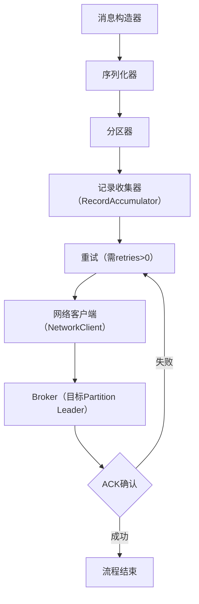

# Kafka 生产者核心原理及内容总结

## 一、生产者概述
Kafka生产者（Producer）是消息的发送端，负责将业务系统产生的消息发送到Kafka集群的指定Topic中。其核心设计目标是**高吞吐量、低延迟、可靠发送**，支持同步/异步发送模式，并通过多种机制保障消息的准确传递。

---

## 二、核心组件
生产者由以下关键组件协同工作，共同完成消息的构造、处理与发送：

### 1. 消息构造器（Message Builder）
- **功能**：用户通过API（如`KafkaProducer.send()`）创建消息对象，包含`Key`（可选，用于分区或消息关联）、`Value`（消息主体）、`Headers`（元数据）、`Partition`（目标分区，可选）等信息。
- **示例**：`ProducerRecord<String, String> record = new ProducerRecord<>("topic", "key", "value");`

### 2. 序列化器（Serializer）
- **功能**：将消息的`Key`和`Value`（Java对象）序列化为字节数组（`byte[]`），以便网络传输和磁盘存储。
- **类型**：内置`StringSerializer`、`IntegerSerializer`等，也可自定义（如`JSONSerializer`、`ProtobufSerializer`）。
- **关键参数**：`key.serializer`、`value.serializer`（必填）。

### 3. 分区器（Partitioner）
- **功能**：根据规则为消息分配目标Partition，决定消息的存储位置。
- **默认实现**：`DefaultPartitioner`（优先使用指定Partition→Key哈希→轮询）。
- **自定义扩展**：通过实现`Partitioner`接口（如按用户ID固定分区，保证同用户消息有序）。

### 4. 记录收集器（RecordAccumulator）
- **功能**：缓存未发送的消息，等待批量条件满足后统一发送，提升吞吐量。
- **核心参数**：`batch.size`（批量大小，默认16KB）、`linger.ms`（最大等待时间，默认0ms）。
- **内存管理**：使用`buffer.memory`（默认32MB）限制总缓存大小，避免内存溢出。

### 5. Sender线程
- **功能**：后台线程，负责从`RecordAccumulator`提取满足条件的批量消息，并通过网络发送到Broker。
- **核心逻辑**：
  - 检查Broker元数据（如Partition Leader位置）；
  - 为每个Broker创建待发送的请求批次；
  - 调用`NetworkClient`发送请求，并处理响应（如ACK确认）。

### 6. 网络客户端（NetworkClient）
- **功能**：管理与Broker的TCP连接，处理网络请求（如发送消息、获取元数据）和响应。
- **核心机制**：基于NIO实现非阻塞IO，通过`Selector`复用连接，减少资源消耗。

---

## 三、核心组件执行风险与应对

### 1. 消息构造器（Message Builder）
- **潜在漏洞**：  
  - 未显式指定`Key`或`Partition`时，可能因分区策略（如轮询）导致消息分布不均；  
  - 遗漏`Headers`等元数据，影响后续消费者对消息的上下文解析（如追踪ID丢失）。  
- **注意事项**：  
  - 若需要保证消息顺序性（如同一用户的操作），需显式指定`Key`或`Partition`；  
  - 关键元数据（如消息版本、业务类型）应通过`Headers`传递，避免依赖`Value`解析。  
- **避免方法**：  
  - 业务设计时明确消息的`Key`语义（如用户ID、订单ID）；  
  - 使用`ProducerRecord`构造消息时，检查必填字段是否完整。  
- **后果**：  
  - 消息分布不均可能导致部分Partition成为“热点”，降低集群吞吐量；  
  - 元数据缺失可能导致消费者无法正确处理消息（如无法区分不同版本的消息格式）。

### 2. 序列化器（Serializer）
- **潜在漏洞**：  
  - 使用低效序列化方式（如`ObjectSerializer`）导致消息体积过大，增加网络传输和存储开销；  
  - 序列化失败（如`Key`类型与`key.serializer`不匹配）触发不可重试错误（`SerializationException`），消息丢失。  
- **注意事项**：  
  - 优先选择紧凑、高效的序列化方式（如`Protobuf`、`Avro`），避免`ObjectSerializer`；  
  - 确保生产者与消费者的序列化/反序列化方式严格一致（包括版本）。  
- **避免方法**：  
  - 配置`key.serializer`和`value.serializer`时，验证其支持的类型（如`StringSerializer`仅支持`String`类型）；  
  - 在测试环境模拟序列化失败场景（如发送非法类型数据），验证错误处理逻辑。  
- **后果**：  
  - 低效序列化导致吞吐量下降（网络带宽被占用）；  
  - 序列化失败直接导致消息丢失（无重试），需人工干预修复。

### 3. 分区器（Partitioner）
- **潜在漏洞**：  
  - 自定义分区策略逻辑错误（如哈希函数实现偏差），导致消息集中在少数Partition；  
  - 未考虑Topic分区数动态扩容，旧消息的分区策略与新分区数不匹配（如哈希取模未更新）。  
- **注意事项**：  
  - 自定义分区器需测试消息分布的均匀性（如统计各Partition消息量）；  
  - 若Topic可能扩容，分区策略应支持动态感知分区数变化（如通过`Cluster`对象获取最新分区数）。  
- **避免方法**：  
  - 使用`DefaultPartitioner`（Kafka内置）作为默认分区策略，仅在必要时自定义；  
  - 自定义分区器时，通过`Partitioner.configure()`方法获取动态配置（如分区数）。  
- **后果**：  
  - 消息分布不均可能导致部分Broker负载过高，引发性能瓶颈或单点故障；  
  - 分区数扩容后，旧消息的分区策略可能导致新Partition未被充分利用。

### 4. 记录收集器（RecordAccumulator）
- **潜在漏洞**：  
  - `batch.size`设置过大或`linger.ms`过长，导致消息在内存中积压，触发`BufferExhaustedException`（内存溢出）；  
  - 消息生产速度远超发送速度，`buffer.memory`（总缓存内存）耗尽，新消息被阻塞或丢弃。  
- **注意事项**：  
  - 根据业务吞吐量调整`batch.size`（推荐16KB~128KB）和`linger.ms`（推荐50ms~200ms）；  
  - 监控`buffer.memory`使用情况（可通过`kafka.producer:type=producer-metrics`指标）。  
- **避免方法**：  
  - 生产环境中设置`buffer.memory`为足够大的值（如64MB~128MB），但需结合JVM堆内存限制；  
  - 若消息生产速度不稳定，可通过`Callback`监控`RecordAccumulator`的积压情况（如`record-queue-time`指标）。  
- **后果**：  
  - 内存溢出导致生产者抛出异常，需重启服务恢复；  
  - 消息积压可能导致端到端延迟增加（如实时监控场景无法及时处理消息）。

### 5. Sender线程
- **潜在漏洞**：  
  - Sender线程阻塞（如元数据获取超时），导致消息无法及时发送；  
  - 未正确处理Broker元数据变更（如Partition Leader切换），发送目标错误。  
- **注意事项**：  
  - 监控Sender线程的活跃度（如`request-latency-avg`指标）；  
  - 配置合理的`metadata.max.age.ms`（元数据刷新间隔，默认300000ms），避免元数据过时。  
- **避免方法**：  
  - 确保Broker集群稳定（如避免频繁Leader选举）；  
  - 生产环境中设置`metadata.max.age.ms`为较小值（如60000ms），及时感知集群变化。  
- **后果**：  
  - 线程阻塞导致消息发送延迟，消费者端出现`ConsumerLag`（消费延迟）；  
  - 发送目标错误可能导致消息写入错误的Partition，破坏顺序性或业务逻辑。

### 6. 网络客户端（NetworkClient）
- **潜在漏洞**：  
  - 与Broker的TCP连接超时（如`request.timeout.ms`设置过小），触发重试但未成功，导致消息丢失；  
  - 网络抖动导致ACK响应丢失，生产者重试发送，引发消息重复（未启用幂等性时）。  
- **注意事项**：  
  - 配置`request.timeout.ms`（默认30000ms）大于`linger.ms + batch.size/发送速率`，避免误判超时；  
  - 启用幂等性（`enable.idempotence=true`）或事务（`transactional.id`），避免重复消息。  
- **避免方法**：  
  - 结合网络延迟调整`request.timeout.ms`（如跨机房部署时设为60000ms）；  
  - 生产环境强制启用幂等性（需`acks=all`且`retries>0`）。  
- **后果**：  
  - 超时未重试导致消息丢失（`acks=1`时）；  
  - 未启用幂等性时，重试导致消息重复（需消费者端去重）。

---

## 四、消息发送完整流程
生产者发送消息的全流程可分解为以下7个步骤（结合核心组件协作）：

### 步骤1：消息构造
用户通过`ProducerRecord`构造消息对象，指定`Topic`、可选`Key`/`Value`/`Partition`等信息。

### 步骤2：序列化处理
消息的`Key`和`Value`通过配置的`Serializer`转换为字节数组（如`StringSerializer`将字符串转为`UTF-8`字节流）。

### 步骤3：分区分配
若未显式指定`Partition`，分区器根据规则计算目标Partition：
- 有`Key`：对`Key`的字节数组进行哈希（Murmur2算法），结果对分区数取模；
- 无`Key`：采用轮询（Round Robin）策略，确保消息均匀分布。

### 步骤4：缓存到RecordAccumulator
消息根据目标Partition被写入`RecordAccumulator`的对应缓存队列：
- 若当前批次（Batch）剩余空间足够，直接追加；
- 若不足或等待时间（`linger.ms`）超时，创建新批次。

### 步骤5：Sender线程触发发送
Sender线程定期检查`RecordAccumulator`，提取满足以下条件的批次：
- 批次大小≥`batch.size`；
- 或等待时间≥`linger.ms`；
- 或缓存内存不足（触发强制发送）。

### 步骤6：网络传输至Broker
Sender线程通过`NetworkClient`与Broker建立连接（复用长连接），将批量消息发送到目标Partition的Leader副本。

### 步骤7：处理ACK确认
Broker接收消息后，根据`acks`参数返回确认结果：
- `acks=0`：无确认，发送即视为成功；
- `acks=1`：Leader写入本地日志后确认；
- `acks=all`：Leader+所有ISR副本写入日志后确认。
若发送失败（如网络超时），触发重试机制（需`retries>0`）。

## 五、企业级生产者优化与调优

### 1. 高性能生产者设计

#### 1.1 智能生产者配置管理
```go
// 企业级Kafka生产者管理器
type EnterpriseKafkaProducer struct {
    producers    map[string]*kafka.Producer
    config       *ProducerConfig
    monitor      *ProducerMonitor
    circuitBreaker *CircuitBreaker
    retryManager *RetryManager
}

type ProducerConfig struct {
    // 性能配置
    BatchSize         int           `json:"batch_size"`          // 16384
    LingerMs          int           `json:"linger_ms"`           // 5
    BufferMemory      int64         `json:"buffer_memory"`       // 33554432
    CompressionType   string        `json:"compression_type"`    // lz4
    MaxInFlightReqs   int           `json:"max_in_flight_reqs"`  // 5
    
    // 可靠性配置
    Acks              string        `json:"acks"`                // all
    Retries           int           `json:"retries"`             // 2147483647
    MaxBlockMs        int           `json:"max_block_ms"`        // 60000
    RequestTimeoutMs  int           `json:"request_timeout_ms"`  // 30000
    DeliveryTimeoutMs int           `json:"delivery_timeout_ms"` // 120000
    
    // 幂等性和事务
    EnableIdempotence bool          `json:"enable_idempotence"`  // true
    TransactionalId   string        `json:"transactional_id"`
    TransactionTimeoutMs int        `json:"transaction_timeout_ms"` // 60000
}

// 根据业务场景生成最优配置
func (ekp *EnterpriseKafkaProducer) GenerateOptimalConfig(scenario BusinessScenario) *ProducerConfig {
    config := &ProducerConfig{}
    
    switch scenario {
    case HighThroughputScenario:
        config.BatchSize = 65536          // 64KB
        config.LingerMs = 20              // 增加延迟换取吞吐量
        config.CompressionType = "lz4"    // 高压缩比
        config.MaxInFlightReqs = 10       // 增加并发
        config.Acks = "1"                 // 平衡可靠性和性能
        
    case LowLatencyScenario:
        config.BatchSize = 1024           // 1KB
        config.LingerMs = 0               // 立即发送
        config.CompressionType = "none"   // 减少CPU开销
        config.MaxInFlightReqs = 1        // 保证顺序
        config.Acks = "1"                 // 快速确认
        
    case HighReliabilityScenario:
        config.BatchSize = 16384          // 16KB
        config.LingerMs = 5
        config.CompressionType = "gzip"   // 最高压缩比
        config.MaxInFlightReqs = 1        // 保证顺序
        config.Acks = "all"               // 最高可靠性
        config.EnableIdempotence = true   // 启用幂等性
        config.Retries = math.MaxInt32    // 无限重试
        
    case TransactionalScenario:
        config.BatchSize = 16384
        config.LingerMs = 5
        config.CompressionType = "lz4"
        config.MaxInFlightReqs = 1
        config.Acks = "all"
        config.EnableIdempotence = true
        config.TransactionalId = "tx-producer-" + uuid.New().String()
        config.TransactionTimeoutMs = 60000
    }
    
    return config
}

// 智能分区策略
type SmartPartitioner struct {
    strategy      PartitionStrategy
    loadBalancer  *LoadBalancer
    stickyMap     map[string]int32  // 粘性分区映射
    mutex         sync.RWMutex
}

type PartitionStrategy int

const (
    RoundRobinStrategy PartitionStrategy = iota
    StickyStrategy
    LoadBalancedStrategy
    CustomHashStrategy
)

func (sp *SmartPartitioner) SelectPartition(topic string, key []byte, value []byte, cluster kafka.Cluster) int32 {
    partitions := cluster.AvailablePartitionsForTopic(topic)
    if len(partitions) == 0 {
        return -1
    }
    
    switch sp.strategy {
    case StickyStrategy:
        return sp.getStickyPartition(topic, partitions)
        
    case LoadBalancedStrategy:
        return sp.getLoadBalancedPartition(topic, partitions)
        
    case CustomHashStrategy:
        if key != nil {
            return sp.hashPartition(key, partitions)
        }
        return sp.getStickyPartition(topic, partitions)
        
    default: // RoundRobinStrategy
        return partitions[rand.Intn(len(partitions))]
    }
}

func (sp *SmartPartitioner) getStickyPartition(topic string, partitions []int32) int32 {
    sp.mutex.Lock()
    defer sp.mutex.Unlock()
    
    if partition, exists := sp.stickyMap[topic]; exists {
        return partition
    }
    
    // 选择负载最低的分区
    partition := sp.loadBalancer.GetLeastLoadedPartition(partitions)
    sp.stickyMap[topic] = partition
    return partition
}
```

#### 1.2 高级批处理优化
```go
// 智能批处理管理器
type IntelligentBatchManager struct {
    batches       map[string]*MessageBatch
    config        *BatchConfig
    metrics       *BatchMetrics
    adaptiveTimer *AdaptiveTimer
    mutex         sync.RWMutex
}

type MessageBatch struct {
    Topic         string
    Partition     int32
    Messages      []*kafka.Message
    TotalSize     int64
    FirstMsgTime  time.Time
    LastMsgTime   time.Time
    CompressionType string
}

type BatchConfig struct {
    MaxBatchSize     int64         // 最大批次大小
    MaxMessages      int           // 最大消息数
    MaxLingerTime    time.Duration // 最大等待时间
    AdaptiveBatching bool          // 自适应批处理
    CompressionLevel int           // 压缩级别
}

// 自适应批处理策略
func (ibm *IntelligentBatchManager) AddMessage(msg *kafka.Message) error {
    ibm.mutex.Lock()
    defer ibm.mutex.Unlock()
    
    batchKey := fmt.Sprintf("%s-%d", msg.Topic, msg.Partition)
    batch, exists := ibm.batches[batchKey]
    
    if !exists {
        batch = &MessageBatch{
            Topic:       msg.Topic,
            Partition:   msg.Partition,
            Messages:    make([]*kafka.Message, 0),
            FirstMsgTime: time.Now(),
        }
        ibm.batches[batchKey] = batch
    }
    
    batch.Messages = append(batch.Messages, msg)
    batch.TotalSize += int64(len(msg.Key) + len(msg.Value))
    batch.LastMsgTime = time.Now()
    
    // 检查是否需要发送批次
    if ibm.shouldSendBatch(batch) {
        return ibm.sendBatch(batch)
    }
    
    return nil
}

func (ibm *IntelligentBatchManager) shouldSendBatch(batch *MessageBatch) bool {
    // 1. 批次大小达到阈值
    if batch.TotalSize >= ibm.config.MaxBatchSize {
        return true
    }
    
    // 2. 消息数量达到阈值
    if len(batch.Messages) >= ibm.config.MaxMessages {
        return true
    }
    
    // 3. 等待时间超过阈值
    if time.Since(batch.FirstMsgTime) >= ibm.config.MaxLingerTime {
        return true
    }
    
    // 4. 自适应策略：根据历史性能调整
    if ibm.config.AdaptiveBatching {
        return ibm.adaptiveTimer.ShouldSend(batch)
    }
    
    return false
}

// 自适应定时器
type AdaptiveTimer struct {
    avgLatency    time.Duration
    avgThroughput float64
    samples       []PerformanceSample
    mutex         sync.RWMutex
}

type PerformanceSample struct {
    BatchSize   int64
    Latency     time.Duration
    Throughput  float64
    Timestamp   time.Time
}

func (at *AdaptiveTimer) ShouldSend(batch *MessageBatch) bool {
    at.mutex.RLock()
    defer at.mutex.RUnlock()
    
    // 基于历史性能数据动态调整发送时机
    currentWaitTime := time.Since(batch.FirstMsgTime)
    
    // 如果当前延迟已经超过平均延迟的1.5倍，立即发送
    if currentWaitTime > at.avgLatency*3/2 {
        return true
    }
    
    // 如果批次大小接近历史最优大小，继续等待
    optimalSize := at.getOptimalBatchSize()
    if batch.TotalSize < optimalSize*8/10 {
        return false
    }
    
    return true
}
```

### 2. 高可用性与容错机制

#### 2.1 熔断器模式
```go
// Kafka生产者熔断器
type KafkaCircuitBreaker struct {
    state         CircuitState
    failureCount  int64
    successCount  int64
    lastFailTime  time.Time
    config        *CircuitBreakerConfig
    mutex         sync.RWMutex
}

type CircuitState int

const (
    CircuitClosed CircuitState = iota
    CircuitOpen
    CircuitHalfOpen
)

type CircuitBreakerConfig struct {
    FailureThreshold  int64         // 失败阈值
    SuccessThreshold  int64         // 成功阈值
    Timeout          time.Duration  // 超时时间
    MaxRequests      int64         // 半开状态最大请求数
}

func (cb *KafkaCircuitBreaker) Execute(operation func() error) error {
    cb.mutex.Lock()
    defer cb.mutex.Unlock()
    
    switch cb.state {
    case CircuitClosed:
        return cb.executeClosed(operation)
    case CircuitOpen:
        return cb.executeOpen(operation)
    case CircuitHalfOpen:
        return cb.executeHalfOpen(operation)
    default:
        return errors.New("unknown circuit state")
    }
}

func (cb *KafkaCircuitBreaker) executeClosed(operation func() error) error {
    err := operation()
    if err != nil {
        cb.failureCount++
        cb.lastFailTime = time.Now()
        
        if cb.failureCount >= cb.config.FailureThreshold {
            cb.state = CircuitOpen
            log.Printf("Circuit breaker opened due to %d failures", cb.failureCount)
        }
        return err
    }
    
    cb.successCount++
    cb.failureCount = 0  // 重置失败计数
    return nil
}

func (cb *KafkaCircuitBreaker) executeOpen(operation func() error) error {
    if time.Since(cb.lastFailTime) >= cb.config.Timeout {
        cb.state = CircuitHalfOpen
        cb.successCount = 0
        log.Printf("Circuit breaker entering half-open state")
        return cb.executeHalfOpen(operation)
    }
    
    return errors.New("circuit breaker is open")
}

func (cb *KafkaCircuitBreaker) executeHalfOpen(operation func() error) error {
    if cb.successCount >= cb.config.MaxRequests {
        return errors.New("circuit breaker half-open: max requests exceeded")
    }
    
    err := operation()
    if err != nil {
        cb.state = CircuitOpen
        cb.failureCount++
        cb.lastFailTime = time.Now()
        log.Printf("Circuit breaker reopened due to failure in half-open state")
        return err
    }
    
    cb.successCount++
    if cb.successCount >= cb.config.SuccessThreshold {
        cb.state = CircuitClosed
        cb.failureCount = 0
        log.Printf("Circuit breaker closed after %d successful requests", cb.successCount)
    }
    
    return nil
}
```

#### 2.2 智能重试机制
```go
// 智能重试管理器
type IntelligentRetryManager struct {
    config        *RetryConfig
    backoffPolicy BackoffPolicy
    deadLetterQueue *DeadLetterQueue
    metrics       *RetryMetrics
}

type RetryConfig struct {
    MaxRetries        int           // 最大重试次数
    InitialInterval   time.Duration // 初始重试间隔
    MaxInterval       time.Duration // 最大重试间隔
    Multiplier        float64       // 退避倍数
    RandomizationFactor float64     // 随机化因子
    RetryableErrors   []string      // 可重试的错误类型
}

type BackoffPolicy interface {
    NextInterval(attempt int) time.Duration
}

// 指数退避策略
type ExponentialBackoff struct {
    config *RetryConfig
    random *rand.Rand
}

func (eb *ExponentialBackoff) NextInterval(attempt int) time.Duration {
    if attempt <= 0 {
        return eb.config.InitialInterval
    }
    
    // 计算指数退避间隔
    interval := float64(eb.config.InitialInterval) * math.Pow(eb.config.Multiplier, float64(attempt-1))
    
    // 应用最大间隔限制
    if interval > float64(eb.config.MaxInterval) {
        interval = float64(eb.config.MaxInterval)
    }
    
    // 添加随机化避免雷群效应
    randomization := eb.config.RandomizationFactor * interval
    delta := randomization * (eb.random.Float64()*2 - 1)
    
    return time.Duration(interval + delta)
}

// 智能重试执行
func (irm *IntelligentRetryManager) ExecuteWithRetry(operation func() error, context *RetryContext) error {
    var lastErr error
    
    for attempt := 0; attempt <= irm.config.MaxRetries; attempt++ {
        if attempt > 0 {
            // 等待退避间隔
            interval := irm.backoffPolicy.NextInterval(attempt)
            time.Sleep(interval)
            
            log.Printf("Retrying operation, attempt %d/%d after %v", 
                attempt, irm.config.MaxRetries, interval)
        }
        
        err := operation()
        if err == nil {
            // 成功，记录指标
            irm.metrics.RecordSuccess(attempt)
            return nil
        }
        
        lastErr = err
        
        // 检查是否为可重试错误
        if !irm.isRetryableError(err) {
            log.Printf("Non-retryable error: %v", err)
            break
        }
        
        // 记录重试指标
        irm.metrics.RecordRetry(attempt, err)
    }
    
    // 所有重试都失败，发送到死信队列
    if irm.deadLetterQueue != nil {
        irm.deadLetterQueue.Send(context.Message, lastErr)
    }
    
    irm.metrics.RecordFailure(lastErr)
    return fmt.Errorf("operation failed after %d retries: %w", irm.config.MaxRetries, lastErr)
}

func (irm *IntelligentRetryManager) isRetryableError(err error) bool {
    errStr := err.Error()
    for _, retryableErr := range irm.config.RetryableErrors {
        if strings.Contains(errStr, retryableErr) {
            return true
        }
    }
    
    // 检查特定的Kafka错误
    if kafkaErr, ok := err.(kafka.Error); ok {
        switch kafkaErr.Code() {
        case kafka.ErrNotLeaderForPartition,
             kafka.ErrRequestTimedOut,
             kafka.ErrNetworkException,
             kafka.ErrNotEnoughReplicas:
            return true
        }
    }
    
    return false
}
```

### 3. 性能监控与优化

#### 3.1 生产者性能监控
```go
// 生产者性能监控器
type ProducerMonitor struct {
    metrics       *ProducerMetrics
    alertManager  *AlertManager
    collector     *MetricsCollector
    dashboard     *MonitoringDashboard
}

type ProducerMetrics struct {
    // 吞吐量指标
    MessagesPerSecond    float64 `json:"messages_per_second"`
    BytesPerSecond       float64 `json:"bytes_per_second"`
    RequestsPerSecond    float64 `json:"requests_per_second"`
    
    // 延迟指标
    AvgLatency          time.Duration `json:"avg_latency"`
    P95Latency          time.Duration `json:"p95_latency"`
    P99Latency          time.Duration `json:"p99_latency"`
    MaxLatency          time.Duration `json:"max_latency"`
    
    // 错误指标
    ErrorRate           float64 `json:"error_rate"`
    RetryRate           float64 `json:"retry_rate"`
    TimeoutRate         float64 `json:"timeout_rate"`
    
    // 资源使用指标
    BufferUtilization   float64 `json:"buffer_utilization"`
    ConnectionCount     int     `json:"connection_count"`
    ThreadPoolUsage     float64 `json:"thread_pool_usage"`
    
    // 批处理指标
    AvgBatchSize        float64 `json:"avg_batch_size"`
    BatchFillRatio      float64 `json:"batch_fill_ratio"`
    CompressionRatio    float64 `json:"compression_ratio"`
}

// 实时性能分析
func (pm *ProducerMonitor) AnalyzePerformance() *PerformanceAnalysis {
    metrics := pm.collector.CollectMetrics()
    analysis := &PerformanceAnalysis{
        Timestamp: time.Now(),
        Metrics:   metrics,
    }
    
    // 1. 吞吐量分析
    if metrics.MessagesPerSecond < 1000 {
        analysis.Issues = append(analysis.Issues, PerformanceIssue{
            Type:        "LOW_THROUGHPUT",
            Severity:    "WARNING",
            Description: "消息吞吐量低于预期",
            Suggestions: []string{
                "增加batch.size",
                "调整linger.ms",
                "检查网络连接",
                "优化序列化器",
            },
        })
    }
    
    // 2. 延迟分析
    if metrics.P95Latency > 100*time.Millisecond {
        analysis.Issues = append(analysis.Issues, PerformanceIssue{
            Type:        "HIGH_LATENCY",
            Severity:    "CRITICAL",
            Description: "P95延迟过高",
            Suggestions: []string{
                "减少batch.size",
                "降低linger.ms",
                "检查Broker性能",
                "优化网络配置",
            },
        })
    }
    
    // 3. 错误率分析
    if metrics.ErrorRate > 0.01 { // 1%
        analysis.Issues = append(analysis.Issues, PerformanceIssue{
            Type:        "HIGH_ERROR_RATE",
            Severity:    "CRITICAL",
            Description: "错误率过高",
            Suggestions: []string{
                "检查Broker健康状态",
                "调整重试配置",
                "验证网络连接",
                "检查认证配置",
            },
        })
    }
    
    // 4. 资源使用分析
    if metrics.BufferUtilization > 0.8 {
        analysis.Issues = append(analysis.Issues, PerformanceIssue{
            Type:        "HIGH_BUFFER_USAGE",
            Severity:    "WARNING",
            Description: "缓冲区使用率过高",
            Suggestions: []string{
                "增加buffer.memory",
                "优化发送频率",
                "检查Broker响应时间",
            },
        })
    }
    
    return analysis
}

// 自动优化建议
func (pm *ProducerMonitor) GenerateOptimizationSuggestions(analysis *PerformanceAnalysis) []OptimizationSuggestion {
    var suggestions []OptimizationSuggestion
    
    metrics := analysis.Metrics
    
    // 基于当前性能指标生成优化建议
    if metrics.MessagesPerSecond < 1000 && metrics.AvgLatency < 50*time.Millisecond {
        suggestions = append(suggestions, OptimizationSuggestion{
            Parameter: "batch.size",
            CurrentValue: "16384",
            SuggestedValue: "65536",
            Reason: "低吞吐量且延迟可接受，建议增加批次大小",
            ExpectedImprovement: "吞吐量提升50-100%",
        })
    }
    
    if metrics.P95Latency > 100*time.Millisecond && metrics.AvgBatchSize > 32768 {
        suggestions = append(suggestions, OptimizationSuggestion{
            Parameter: "linger.ms",
            CurrentValue: "20",
            SuggestedValue: "5",
            Reason: "延迟过高且批次较大，建议减少等待时间",
            ExpectedImprovement: "延迟降低30-50%",
        })
    }
    
    if metrics.CompressionRatio < 0.3 {
        suggestions = append(suggestions, OptimizationSuggestion{
            Parameter: "compression.type",
            CurrentValue: "none",
            SuggestedValue: "lz4",
            Reason: "数据压缩比低，建议启用压缩减少网络传输",
            ExpectedImprovement: "网络带宽节省50-70%",
        })
    }
    
    return suggestions
}
```

### 五、消息发送流程示意图


---

## 六、核心机制与原理

### 1. 分区策略（Partition Strategy）
- **默认策略**：`DefaultPartitioner`，优先使用指定Partition，其次按Key哈希，最后轮询；
- **自定义策略**：通过实现`Partitioner`接口自定义（如按业务ID固定分区，保证同ID消息有序）；
- **作用**：决定消息分布，影响负载均衡和消息顺序性（单Partition内有序）。

### 2. ACK确认机制（可靠性保障）
生产者通过`acks`参数控制Broker的消息确认方式，直接影响消息可靠性与性能：
- `acks=0`：无需确认，发送即成功（可能丢消息，吞吐量最高）；
- `acks=1`：Leader副本写入成功即确认（可能丢消息，当Leader宕机且Follower未同步时）；
- `acks=all`（或`-1`）：Leader+所有ISR副本写入成功才确认（强可靠，延迟高）。

### 3. 批量发送与压缩（性能优化）
- **批量条件**：`batch.size`（默认16KB）控制批量大小，`linger.ms`（默认0ms）控制最大等待时间；
- **压缩策略**：通过`compression.type`（可选`none`/`gzip`/`snappy`/`lz4`/`zstd`）对批量消息压缩，减少网络传输开销（推荐`lz4`平衡压缩比与速度）。

### 4. 幂等性与事务（精确一次语义）
- **幂等性（Idempotence）**：
  - 启用：`enable.idempotence=true`（默认`false`）；
  - 原理：Broker为每个生产者分配`PID`（Producer ID），并为每个（PID, Partition）维护序列号，重复消息（同序列号）会被去重；
  - 限制：仅保证单会话、单Partition内的幂等，无法跨Topic/Partition。
- **事务（Transaction）**：
  - 启用：设置`transactional.id`（全局唯一）；
  - 功能：支持跨Topic/Partition的原子写（如转账场景需同时更新账户和日志Topic）；
  - 流程：`initTransactions()`→`beginTransaction()`→发送消息→`commitTransaction()`/`abortTransaction()`。

### 5. 重试机制（错误处理）
- **触发条件**：发送失败（如网络超时、Leader选举）时，通过`retries`（默认2147483647）和`retry.backoff.ms`（默认100ms）配置重试；
- **注意**：重试可能导致消息顺序问题（若`max.in.flight.requests.per.connection>1`），需结合业务场景权衡。

---

## 七、关键参数说明
| 参数名                                | 类型       | 默认值               | 说明                                                                 |
|---------------------------------------|------------|----------------------|----------------------------------------------------------------------|
| `bootstrap.servers`                   | String     | 无（必填）           | Kafka集群地址（如`host1:9092,host2:9092`）                           |
| `key.serializer`                      | Class      | 无（必填）           | Key的序列化类（如`org.apache.kafka.common.serialization.StringSerializer`） |
| `value.serializer`                    | Class      | 无（必填）           | Value的序列化类                                                     |
| `acks`                                | String     | `1`                  | 消息确认模式（`0`/`1`/`all`）                                        |
| `batch.size`                          | int        | 16384（16KB）        | 批量发送的最大字节数，增大可提升吞吐量但增加内存占用                |
| `linger.ms`                           | long       | 0                    | 批量发送的最大等待时间（ms），增大可提升吞吐量但增加延迟              |
| `compression.type`                    | String     | `none`               | 消息压缩类型（`gzip`/`snappy`/`lz4`/`zstd`）                         |
| `retries`                             | int        | 2147483647（∞）      | 发送失败重试次数（生产环境建议设为`3~5`）                            |
| `retry.backoff.ms`                    | int        | 100                  | 重试间隔时间（ms）                                                  |
| `max.in.flight.requests.per.connection` | int       | 5                    | 客户端未确认的最大请求数，设为`1`可保证严格顺序（但降低吞吐量）      |
| `enable.idempotence`                  | boolean    | `false`              | 启用幂等性（需`acks=all`且`retries>0`）                              |
| `transactional.id`                    | String     | `null`               | 事务ID（启用事务时必填，全局唯一）                                  |

---

## 八、最佳实践
1. **参数调优**：
   - 高吞吐量场景：增大`batch.size`（如64KB~128KB）和`linger.ms`（如50ms~100ms），启用压缩；
   - 强顺序场景：设置`max.in.flight.requests.per.connection=1`并`enable.idempotence=true`；
   - 事务场景：`transactional.id`需唯一（如结合服务实例ID），避免事务超时（`transaction.timeout.ms`默认60s）。
2. **错误处理**：
   - 监听`Callback`回调（`send(msg, callback)`）处理发送结果；
   - 对不可重试错误（如序列化失败）需人工干预，避免无限重试。
3. **资源管理**：
   - 限制`buffer.memory`（默认33554432，32MB）防止内存溢出；
   - 生产者实例应复用（单例模式），避免频繁创建连接。
4. **监控指标**：
   - 关注`record-error-rate`（消息发送失败率）、`record-queue-time`（消息在`RecordAccumulator`中的等待时间）、`request-latency-avg`（请求延迟）。

---

## 九、不同场景下的最佳实践

### 场景1：高吞吐量消息发送（如日志收集、实时数据聚合）
- **核心目标**：最大化消息发送速率，降低单位消息的网络和CPU开销。
- **配置建议**：
  - 增大`batch.size`（64KB~128KB）：批量越大，单次网络请求携带的消息越多，减少TCP连接开销；
  - 调整`linger.ms`（50ms~200ms）：允许消息在`RecordAccumulator`中短暂等待，凑满更大的批次；
  - 启用压缩（`compression.type=lz4`或`zstd`）：减少网络传输数据量（日志类文本压缩率可达50%以上）；
  - 增大`buffer.memory`（64MB~128MB）：避免消息生产速度波动时内存耗尽。
- **注意事项**：  
  - 监控`record-queue-time`指标（消息在缓存中的等待时间），避免因`linger.ms`过长导致端到端延迟增加；  
  - 日志类消息可接受`acks=1`（牺牲部分可靠性换取吞吐量）。

### 场景2：强顺序性消息（如订单状态变更、用户行为轨迹）
- **核心目标**：保证同一Partition内消息严格按发送顺序被消费。
- **配置建议**：
  - 设置`max.in.flight.requests.per.connection=1`：限制客户端未确认的请求数，避免重试导致消息乱序；
  - 启用幂等性（`enable.idempotence=true`）：防止重试导致的重复消息破坏顺序；
  - 显式指定`Key`或`Partition`：通过`Key`哈希固定消息到同一Partition（如订单ID作为Key）。
- **注意事项**：  
  - `max.in.flight.requests.per.connection=1`会降低吞吐量（需权衡顺序性与性能）；  
  - 若业务需要全局顺序（跨Partition），需通过业务层协调（如将消息发往单一Partition）。

### 场景3：事务性消息（如金融转账、跨系统数据同步）
- **核心目标**：保证跨Topic/Partition消息的原子性（要么全部成功，要么全部失败）。
- **配置建议**：
  - 启用事务（设置唯一`transactional.id`，如`order-service-01`）；
  - 事务内消息发送后调用`commitTransaction()`，失败时调用`abortTransaction()`；
  - 调整`transaction.timeout.ms`（默认60s）：根据业务最长处理时间设置（如300s）。
- **注意事项**：  
  - 事务消息对消费者不可见（需消费者配置`isolation.level=read_committed`）；  
  - `transactional.id`需全局唯一（避免不同实例冲突导致事务失败）。

### 场景4：跨机房部署（如主备数据中心同步）
- **核心目标**：应对高网络延迟，保证消息可靠到达。
- **配置建议**：
  - 增大`request.timeout.ms`（60000ms~120000ms）：避免因网络延迟误判超时；
  - 设置`acks=all`（强可靠）：确保消息被所有ISR副本接收；
  - 增加`retries`（5~10次）和`retry.backoff.ms`（200ms~500ms）：延长重试间隔适应长延迟。
- **注意事项**：  
  - 监控`request-latency-avg`指标（请求延迟），及时发现网络异常；  
  - 若Broker跨机房部署，优先使用`lz4`压缩（压缩/解压速度快，减少延迟影响）。

### 场景5：低延迟消息发送（如实时交易通知、即时通讯）
- **核心目标**：消息从生产到Broker的延迟尽可能低（<100ms）。
- **配置建议**：
  - 减小`batch.size`（4KB~8KB）和`linger.ms`（0ms~10ms）：避免消息在缓存中等待；
  - 禁用压缩（`compression.type=none`）：压缩/解压会引入额外CPU开销和延迟；
  - 使用`acks=1`（平衡延迟与可靠性）：仅等待Leader确认。
- **注意事项**：  
  - 监控`buffer.memory`使用情况（低延迟场景消息可能快速填满缓存）；  
  - 若业务允许少量消息丢失（如通知类），可设置`acks=0`（发送即成功）。

---

## 十、注意事项
1. **消息顺序性**：仅当`max.in.flight.requests.per.connection=1`且`retries>0`时，单Partition内可保证严格顺序；
2. **内存溢出**：若`batch.size`过大或消息生产速度远超发送速度，可能导致`RecordAccumulator`内存耗尽（抛出`BufferExhaustedException`）；
3. **事务隔离**：未提交的事务消息对消费者不可见（需`isolation.level=read_committed`，默认`read_uncommitted`）；
4. **版本兼容**：生产者与Broker版本需兼容（如Kafka 0.11.0+支持幂等性和事务）；
5. **序列化选择**：避免使用低效的序列化方式（如`ObjectSerializer`），推荐`JSON`或`Protobuf`（更小体积、更好兼容性）。