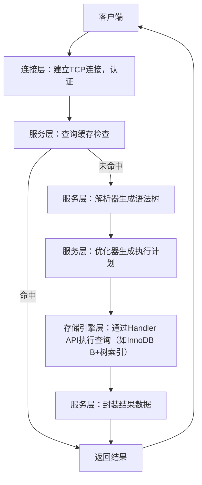

#### MySQL
##### 组件分析
- 连接层：
  - 具体功能：处理客户端TCP连接建立、用户身份认证（验证用户名密码）、线程管理（为每个连接分配或复用线程）。
  - 核心原理：通过网络模块（如MySQL Connector）实现与客户端的通信解耦，独立于后续的查询处理逻辑。
  - 技术实现：使用TCP/IP协议栈接收连接请求，通过认证插件（如mysql_native_password）验证用户权限。
  - 技术细节：支持连接池（thread_cache_size参数控制）减少线程创建开销，设置连接超时（wait_timeout参数）释放空闲连接（如默认8小时）。
- 服务层：
  - 具体功能：解析SQL语句（语法检查、生成语法树）、优化查询执行路径（选择索引/扫描方式）、缓存高频查询结果、提供内置函数支持（如数学/字符串函数）。
  - 核心原理：通过模块化设计（解析器→优化器→缓存）实现查询处理逻辑解耦，提升可维护性和性能。
  - 技术实现：解析器基于LR语法分析生成抽象语法树（AST），优化器使用成本模型（如基于统计信息计算IO/CPU开销）选择执行计划，缓存通过哈希表存储（键为SQL语句+数据库名+客户端版本等）。
  - 技术细节：查询缓存默认关闭（5.7版本后），因表更新会导致大量缓存失效；优化器支持BKA（块嵌套循环）、Batched Key Access等算法提升JOIN效率。
- 存储引擎层：
  - 具体功能：数据持久化存储（如磁盘文件）、索引管理（如B+树/哈希索引）、事务控制（如提交/回滚）、锁机制（行锁/表锁）。
  - 核心原理：通过Handler API与服务层交互（定义统一的open/close/read/write接口），实现引擎可替换性（如InnoDB→MyISAM无缝切换）。
  - 技术实现：InnoDB使用B+树索引（主键聚簇索引，二级索引存储主键值），支持ACID通过redo log（崩溃恢复）、undo log（事务回滚）、MVCC（多版本并发控制）实现；MyISAM使用B+树索引（非聚簇），仅支持表级锁和全文索引。
  - 技术细节：InnoDB行锁通过记录锁（锁定索引记录）、间隙锁（锁定索引间隙）防止幻读；MyISAM表锁在写操作时阻塞所有读写，适合读多写少场景。

##### 核心原理
各层解耦设计，连接层负责网络交互，服务层处理逻辑（如SQL解析优化），存储引擎层封装底层数据操作，通过统一接口（如Handler API）与服务层交互，实现灵活性（可替换引擎）和性能优化。

##### 概念
MySQL服务架构指支撑数据库运行的分层组件体系，通过模块化设计实现功能分离（如连接管理、查询处理、数据存储），是保障高可用、高性能、可扩展的基础架构。

##### 流程

### 一次查询操作完整流程
1. **连接层**：客户端通过TCP/IP发起连接请求→连接层通过网络模块接收请求→验证用户名密码（使用mysql_native_password等认证插件）→从连接池（由thread_cache_size控制）复用或新建线程→设置连接超时（wait_timeout参数，默认8小时）。
2. **服务层-缓存检查**：客户端发送SELECT SQL→服务层检查查询缓存（键为SQL语句+数据库名+客户端版本等哈希值）→若命中（5.7版本前启用场景），直接从缓存哈希表返回结果。
3. **服务层-解析与优化**（未命中缓存时）：
   - 解析器：基于LR语法分析对SQL进行词法/语法检查，生成抽象语法树（AST）；
   - 优化器：通过成本模型计算不同执行计划（全表扫描/B+树索引扫描等）的IO/CPU开销→选择最优路径（如使用Batched Key Access优化JOIN）。
4. **存储引擎层-执行查询**：通过Handler API调用目标引擎（如InnoDB）→引擎根据执行计划操作索引（主键聚簇索引定位数据页，二级索引回表查询）→利用MVCC（多版本并发控制）读取可见版本数据（避免锁等待）。
5. **服务层-结果封装**：引擎返回数据行→服务层应用内置函数（如字符串拼接）→封装为客户端协议格式→更新查询缓存（若启用）。
6. **连接层-结果返回**：通过TCP连接将结果回传客户端→释放线程回连接池。

### 一次更新操作完整流程（以InnoDB引擎为例）
1. **连接层**：同查询流程，完成连接建立、认证和线程分配。
2. **服务层-语句解析**：客户端发送UPDATE/INSERT/DELETE SQL→解析器生成AST并验证语法合法性（如字段存在性、外键约束预检查）→优化器确定更新涉及的索引（如WHERE条件索引）。
3. **存储引擎层-锁获取**：通过Handler API通知引擎→InnoDB根据索引定位更新行→加记录锁（锁定索引记录）和间隙锁（防止幻读）→若冲突则进入锁等待（innodb_lock_wait_timeout控制超时）。
4. **存储引擎层-日志写入**：
   - 生成undo log（记录旧数据，用于事务回滚）→写入undo log文件；
   - 生成redo log（记录物理修改，用于崩溃恢复）→写入redo log buffer（按innodb_flush_log_at_trx_commit策略刷盘，默认每次提交刷盘）。
5. **存储引擎层-数据修改**：根据undo/redo日志修改B+树索引（更新聚簇索引数据页或二级索引节点）→更新内存中的数据页（脏页）→后续由innodb_flush_method策略异步刷盘。
6. **服务层-事务提交**：客户端发送COMMIT→服务层通知引擎提交事务→InnoDB释放行锁→将redo log从buffer刷盘→更新事务提交时间戳（用于MVCC可见性判断）。
7. **连接层-结果返回**：返回"Query OK"结果→释放线程回连接池→后续由InnoDB后台线程（如purge线程）清理旧版本undo log。

##### 组件交互流程图

