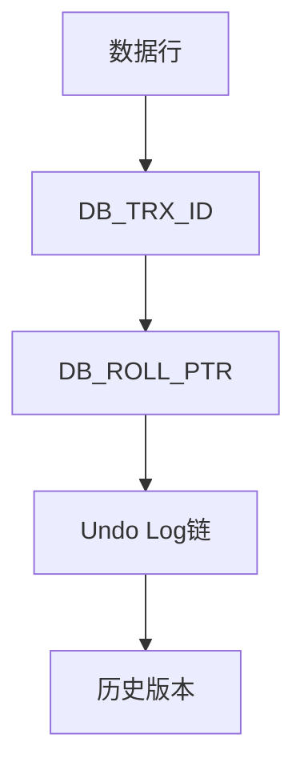
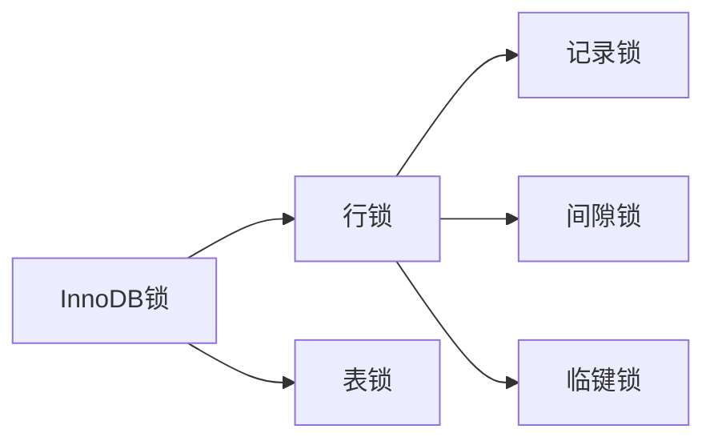

# MySQL深度技术解析（结构化版）

## 一、MVCC多版本并发控制

### 1. 背景
**问题起源**：
- 传统锁机制并发性能差
- 读写操作相互阻塞
- 需要实现非阻塞的一致性读

**技术价值**：
- 提高读并发性能
- 实现快照读功能
- 支持RR和RC隔离级别

### 2. 核心原理
**实现架构**：


**关键组件**：
- 隐藏字段：DB_TRX_ID(事务ID)、DB_ROLL_PTR(回滚指针)
- Undo Log版本链
- ReadView可见性判断

### 3. 技术细节
**Undo Log数据结构**：
```c
struct trx_undo_t {
    ulint    trx_id;     // 事务ID
    ulint    undo_no;    // undo序号
    byte*    ptr;        // 回滚数据指针
    ulint    len;        // 数据长度
    undo_node_t* node;   // undo链节点
};
```

**ReadView实现伪代码**：
```python
class ReadView:
    def __init__(self):
        self.m_low_limit_id = 0    # 高水位(大于此值的事务不可见)
        self.m_up_limit_id = 0     # 低水位(小于此值的事务可见)
        self.m_creator_trx_id = 0  # 创建该视图的事务ID
        self.m_ids = []            # 活跃事务ID列表
        
    def changes_visible(self, trx_id):
        if trx_id < self.m_up_limit_id:
            return True
        if trx_id >= self.m_low_limit_id:
            return False
        return trx_id not in self.m_ids
```

**性能优化点**：
1. 活跃事务列表(m_ids)使用哈希表存储，查找复杂度O(1)
2. 定期purge过期undo log，避免版本链过长
3. 批量创建ReadView减少锁竞争

**关键参数**：
| 参数名 | 默认值 | 说明 |
|--------|--------|------|
| innodb_max_undo_log_size | 10MB | 单个undo日志文件最大值 |
| innodb_purge_batch_size | 300 | 每次purge的undo记录数 |
| innodb_sync_array_size | 1 | 同步数组大小，影响并发性能 |

### 4. 使用场景

#### 场景一：电商商品详情页
**业务特点**：
- 读多写少(读写比约100:1)
- 需要展示实时库存
- 高并发访问(峰值QPS 10k+)

**技术方案**：
1. 使用RR隔离级别保证读取一致性
2. 配置innodb_read_only_threads=16提升读并发
3. 关键查询添加FOR SHARE锁避免脏读

**Go实现要点**：
```go
// 使用WithTx控制事务隔离级别
err := db.WithTx(sql.LevelRepeatableRead, func(tx *sql.Tx) error {
    // 查询商品信息
    row := tx.QueryRow("SELECT stock FROM products WHERE id=?", productID)
    // ...
})
```

#### 场景二：财务结算系统
**业务特点**：
- 需要跨多表一致性读取
- 日终批量处理
- 不允许脏读和不可重复读

**技术方案**：
1. 使用SELECT...FOR UPDATE加锁
2. 设置innodb_lock_wait_timeout=30避免长时间等待
3. 采用悲观锁策略

**潜在问题**：
- 死锁风险：通过SHOW ENGINE INNODB STATUS监控
- 性能影响：拆分大事务为小批次

#### 场景三：用户行为分析
**业务特点**：
- 历史数据只读
- 需要快照查询
- 大数据量扫描

**优化建议**：
1. 设置SET TRANSACTION READ ONLY
2. 使用专用只读副本
3. 添加合适索引

## 二、InnoDB锁机制

### 1. 背景
**问题挑战**：
- 并发事务数据竞争
- 写冲突导致数据不一致
- 需要平衡并发性能与一致性

### 2. 核心原理
**锁类型体系**：


**锁兼容矩阵**：
| 请求\持有 | X | S |
|----------|---|---|
| X        | N | N |
| S        | N | Y |

### 3. 技术细节
**死锁检测流程**：
1. 等待超时(innodb_lock_wait_timeout)
2. 构建等待图(wait-for graph)
3. 检测环路选择victim事务

**锁升级条件**：
- 单事务锁定超过阈值行
- 显示请求表锁
- 系统内存不足

### 4. 使用场景
- 精确并发控制场景
- 需要防止幻读的业务
- 关键数据修改操作

## 三、缓冲池管理

### 1. 背景
**性能瓶颈**：
- 磁盘I/O速度限制
- 频繁数据访问开销大
- 内存利用率不高

### 2. 核心原理
**LRU优化算法**：


**关键参数**：
- innodb_buffer_pool_size
- innodb_old_blocks_pct
- innodb_old_blocks_time

### 3. 技术细节
**页面读取流程**：
1. 检查缓冲池哈希表
2. 未命中则从磁盘读取
3. 插入LRU列表old区头部

**脏页刷盘策略**：
- 后台线程定期刷新
- LRU列表淘汰时刷新
- Checkpoint触发刷新

### 4. 使用场景
- 高频访问数据缓存
- 事务日志持久化
- 临时工作区管理
