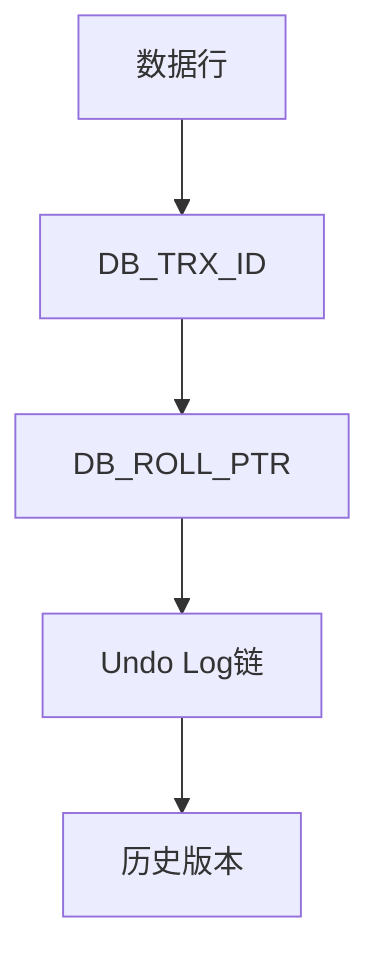
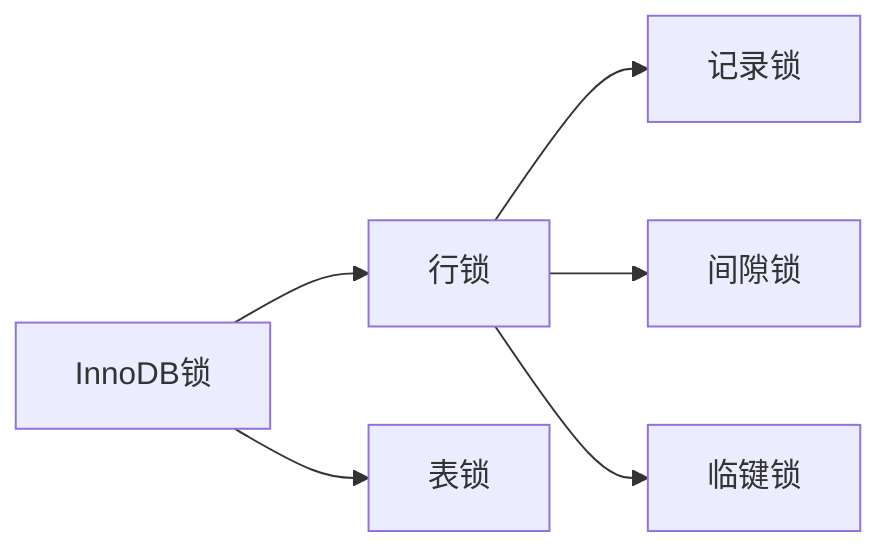

# MySQL深度技术解析（结构化版）

## 一、MVCC多版本并发控制

### 1. 背景
**问题起源**：
- 传统锁机制并发性能差
- 读写操作相互阻塞
- 需要实现非阻塞的一致性读

**技术价值**：
- 提高读并发性能
- 实现快照读功能
- 支持RR和RC隔离级别

### 2. 核心原理
**实现架构**：


**关键组件**：
- 隐藏字段：DB_TRX_ID(事务ID)、DB_ROLL_PTR(回滚指针)
- Undo Log版本链
- ReadView可见性判断

### 3. 技术细节
**Undo Log数据结构**：
```c
struct trx_undo_t {
    ulint    trx_id;     // 事务ID
    ulint    undo_no;    // undo序号
    byte*    ptr;        // 回滚数据指针
    ulint    len;        // 数据长度
    undo_node_t* node;   // undo链节点
};
```

**ReadView实现伪代码**：
```python
class ReadView:
    def __init__(self):
        self.m_low_limit_id = 0    # 高水位(大于此值的事务不可见)
        self.m_up_limit_id = 0     # 低水位(小于此值的事务可见)
        self.m_creator_trx_id = 0  # 创建该视图的事务ID
        self.m_ids = []            # 活跃事务ID列表
        
    def changes_visible(self, trx_id):
        if trx_id < self.m_up_limit_id:
            return True
        if trx_id >= self.m_low_limit_id:
            return False
        return trx_id not in self.m_ids
```

**性能优化点**：
1. 活跃事务列表(m_ids)使用哈希表存储，查找复杂度O(1)
2. 定期purge过期undo log，避免版本链过长
3. 批量创建ReadView减少锁竞争

**关键参数**：
| 参数名 | 默认值 | 说明 |
|--------|--------|------|
| innodb_max_undo_log_size | 10MB | 单个undo日志文件最大值 |
| innodb_purge_batch_size | 300 | 每次purge的undo记录数 |
| innodb_sync_array_size | 1 | 同步数组大小，影响并发性能 |

### 4. 使用场景

#### 场景一：电商商品详情页
**业务特点**：
- 读多写少(读写比约100:1)
- 需要展示实时库存
- 高并发访问(峰值QPS 10k+)

**技术方案**：
1. 使用RR隔离级别保证读取一致性
2. 配置innodb_read_only_threads=16提升读并发
3. 关键查询添加FOR SHARE锁避免脏读

**Go实现要点**：
```go
// 使用WithTx控制事务隔离级别
err := db.WithTx(sql.LevelRepeatableRead, func(tx *sql.Tx) error {
    // 查询商品信息
    row := tx.QueryRow("SELECT stock FROM products WHERE id=?", productID)
    // ...
})
```

#### 场景二：财务结算系统
**业务特点**：
- 需要跨多表一致性读取
- 日终批量处理
- 不允许脏读和不可重复读

## 二、InnoDB存储引擎深度解析

### 1. 内存架构优化

#### Buffer Pool智能管理
**LRU算法优化**：
```c
// InnoDB改进的LRU算法伪代码
struct buf_pool_t {
    buf_page_t* young_list;     // 热数据区(5/8)
    buf_page_t* old_list;       // 冷数据区(3/8)
    ulint old_threshold;        // 老化阈值(默认1000ms)
};

void buf_page_access(buf_page_t* page) {
    if (page->in_young_list) {
        // 已在热数据区，移到头部
        move_to_young_head(page);
    } else if (page->access_time > old_threshold) {
        // 冷数据区页面访问超过阈值，提升到热数据区
        move_to_young_list(page);
    }
}
```

**Go监控Buffer Pool效率**：
```go
type BufferPoolMonitor struct {
    db *sql.DB
}

func (bpm *BufferPoolMonitor) GetHitRatio() (float64, error) {
    var reads, readRequests float64
    err := bpm.db.QueryRow(`
        SELECT 
            variable_value 
        FROM performance_schema.global_status 
        WHERE variable_name = 'Innodb_buffer_pool_reads'
    `).Scan(&reads)
    
    bpm.db.QueryRow(`
        SELECT 
            variable_value 
        FROM performance_schema.global_status 
        WHERE variable_name = 'Innodb_buffer_pool_read_requests'
    `).Scan(&readRequests)
    
    hitRatio := (readRequests - reads) / readRequests * 100
    return hitRatio, err
}
```

#### Change Buffer优化机制
**适用场景判断**：
```sql
-- 检查Change Buffer使用情况
SELECT 
    object_schema,
    object_name,
    index_name,
    count_read,
    count_write,
    count_delete
FROM performance_schema.table_io_waits_summary_by_index_usage
WHERE object_schema = 'your_db'
ORDER BY count_write DESC;
```

### 2. 磁盘IO优化策略

#### 双写缓冲区(Doublewrite Buffer)
**原理与配置**：
```sql
-- 生产环境推荐配置
SET GLOBAL innodb_doublewrite = ON;
SET GLOBAL innodb_flush_method = 'O_DIRECT';
SET GLOBAL innodb_io_capacity = 2000;  -- 根据SSD性能调整
SET GLOBAL innodb_io_capacity_max = 4000;
```

**Go实现IO性能监控**：
```go
type IOPerformanceMonitor struct {
    db *sql.DB
}

func (ipm *IOPerformanceMonitor) GetIOMetrics() (*IOMetrics, error) {
    metrics := &IOMetrics{}
    
    // 监控数据页读写
    ipm.db.QueryRow(`
        SELECT 
            SUM(COUNT_READ) as total_reads,
            SUM(COUNT_WRITE) as total_writes,
            SUM(SUM_TIMER_READ)/1000000000 as read_latency_ms,
            SUM(SUM_TIMER_WRITE)/1000000000 as write_latency_ms
        FROM performance_schema.file_summary_by_instance
        WHERE file_name LIKE '%.ibd'
    `).Scan(&metrics.TotalReads, &metrics.TotalWrites, 
            &metrics.ReadLatency, &metrics.WriteLatency)
    
    return metrics, nil
}
```

### 3. 锁机制深度优化

#### 自适应哈希索引
**监控与调优**：
```go
func (m *MySQLMonitor) MonitorAdaptiveHashIndex() {
    var searches, hits float64
    m.db.QueryRow(`
        SELECT 
            variable_value 
        FROM performance_schema.global_status 
        WHERE variable_name = 'Innodb_adaptive_hash_searches'
    `).Scan(&searches)
    
    m.db.QueryRow(`
        SELECT 
            variable_value 
        FROM performance_schema.global_status 
        WHERE variable_name = 'Innodb_adaptive_hash_searches_btree'
    `).Scan(&hits)
    
    hitRatio := hits / searches * 100
    if hitRatio < 95 {
        // 考虑禁用自适应哈希索引
        log.Printf("Adaptive hash index hit ratio low: %.2f%%", hitRatio)
    }
}
```

#### 死锁检测与预防
**智能死锁处理**：
```go
type DeadlockHandler struct {
    db          *sql.DB
    retryCount  int
    backoffBase time.Duration
}

func (dh *DeadlockHandler) ExecuteWithRetry(fn func(*sql.Tx) error) error {
    for i := 0; i < dh.retryCount; i++ {
        tx, err := dh.db.Begin()
        if err != nil {
            return err
        }
        
        err = fn(tx)
        if err != nil {
            tx.Rollback()
            
            // 检查是否为死锁错误
            if isDeadlockError(err) {
                backoff := time.Duration(i+1) * dh.backoffBase
                time.Sleep(backoff)
                continue
            }
            return err
        }
        
        return tx.Commit()
    }
    return errors.New("max retry attempts reached")
}

func isDeadlockError(err error) bool {
    return strings.Contains(err.Error(), "Deadlock found")
}
```

## 三、查询优化器深度剖析

### 1. 成本模型精细化

#### 统计信息收集策略
**自动统计信息更新**：
```sql
-- 配置自动统计信息收集
SET GLOBAL innodb_stats_auto_recalc = ON;
SET GLOBAL innodb_stats_persistent = ON;
SET GLOBAL innodb_stats_persistent_sample_pages = 20;

-- 手动更新统计信息
ANALYZE TABLE orders;
```

**Go实现统计信息监控**：
```go
type StatisticsMonitor struct {
    db *sql.DB
}

func (sm *StatisticsMonitor) CheckStaleStatistics() error {
    rows, err := sm.db.Query(`
        SELECT 
            table_schema,
            table_name,
            update_time,
            table_rows
        FROM information_schema.tables
        WHERE table_schema NOT IN ('mysql', 'information_schema', 'performance_schema')
        AND update_time < DATE_SUB(NOW(), INTERVAL 7 DAY)
        AND table_rows > 10000
    `)
    
    if err != nil {
        return err
    }
    defer rows.Close()
    
    for rows.Next() {
        var schema, table string
        var updateTime time.Time
        var rowCount int64
        
        rows.Scan(&schema, &table, &updateTime, &rowCount)
        
        // 自动更新过期统计信息
        _, err := sm.db.Exec(fmt.Sprintf("ANALYZE TABLE %s.%s", schema, table))
        if err != nil {
            log.Printf("Failed to analyze table %s.%s: %v", schema, table, err)
        }
    }
    
    return nil
}
```

### 2. 执行计划缓存优化

#### Prepared Statement缓存
**Go实现智能缓存**：
```go
type PreparedStatementCache struct {
    cache    sync.Map
    maxSize  int
    hitCount int64
    missCount int64
}

func (psc *PreparedStatementCache) GetOrPrepare(db *sql.DB, query string) (*sql.Stmt, error) {
    if stmt, ok := psc.cache.Load(query); ok {
        atomic.AddInt64(&psc.hitCount, 1)
        return stmt.(*sql.Stmt), nil
    }
    
    atomic.AddInt64(&psc.missCount, 1)
    
    stmt, err := db.Prepare(query)
    if err != nil {
        return nil, err
    }
    
    // 检查缓存大小
    if psc.getCurrentSize() < psc.maxSize {
        psc.cache.Store(query, stmt)
    }
    
    return stmt, nil
}

func (psc *PreparedStatementCache) GetHitRatio() float64 {
    hits := atomic.LoadInt64(&psc.hitCount)
    misses := atomic.LoadInt64(&psc.missCount)
    total := hits + misses
    
    if total == 0 {
        return 0
    }
    
    return float64(hits) / float64(total) * 100
}
```

## 四、高并发场景优化实战

### 1. 连接池动态调优

#### 智能连接池管理
**基于负载的自适应调整**：
```go
type AdaptiveConnectionPool struct {
    db              *sql.DB
    currentMaxOpen  int
    currentMaxIdle  int
    lastAdjustTime  time.Time
    adjustInterval  time.Duration
    metrics         *PoolMetrics
}

func (acp *AdaptiveConnectionPool) AutoAdjust() {
    if time.Since(acp.lastAdjustTime) < acp.adjustInterval {
        return
    }
    
    stats := acp.db.Stats()
    
    // 基于等待时间调整
    avgWaitTime := stats.WaitDuration / time.Duration(stats.WaitCount)
    if avgWaitTime > 50*time.Millisecond && acp.currentMaxOpen < 200 {
        newMax := int(float64(acp.currentMaxOpen) * 1.2)
        acp.db.SetMaxOpenConns(newMax)
        acp.currentMaxOpen = newMax
        log.Printf("Increased max open connections to %d", newMax)
    }
    
    // 基于空闲连接调整
    idleRatio := float64(stats.Idle) / float64(stats.OpenConnections)
    if idleRatio > 0.7 && acp.currentMaxIdle > 5 {
        newIdle := int(float64(acp.currentMaxIdle) * 0.8)
        acp.db.SetMaxIdleConns(newIdle)
        acp.currentMaxIdle = newIdle
        log.Printf("Decreased max idle connections to %d", newIdle)
    }
    
    acp.lastAdjustTime = time.Now()
}
```

### 2. 批量操作优化

#### 智能批处理
**动态批次大小调整**：
```go
type BatchProcessor struct {
    db           *sql.DB
    batchSize    int
    maxBatchSize int
    minBatchSize int
    avgLatency   time.Duration
}

func (bp *BatchProcessor) ProcessBatch(items []interface{}) error {
    start := time.Now()
    
    // 动态调整批次大小
    currentBatchSize := bp.calculateOptimalBatchSize()
    
    for i := 0; i < len(items); i += currentBatchSize {
        end := i + currentBatchSize
        if end > len(items) {
            end = len(items)
        }
        
        batch := items[i:end]
        if err := bp.executeBatch(batch); err != nil {
            return err
        }
    }
    
    // 更新平均延迟
    bp.avgLatency = time.Since(start) / time.Duration(len(items))
    
    return nil
}

func (bp *BatchProcessor) calculateOptimalBatchSize() int {
    // 基于延迟调整批次大小
    if bp.avgLatency > 100*time.Millisecond {
        bp.batchSize = max(bp.minBatchSize, bp.batchSize/2)
    } else if bp.avgLatency < 10*time.Millisecond {
        bp.batchSize = min(bp.maxBatchSize, bp.batchSize*2)
    }
    
    return bp.batchSize
}
```

**技术方案**：
1. 使用SELECT...FOR UPDATE加锁
2. 设置innodb_lock_wait_timeout=30避免长时间等待
3. 采用悲观锁策略

**潜在问题**：
- 死锁风险：通过SHOW ENGINE INNODB STATUS监控
- 性能影响：拆分大事务为小批次

#### 场景三：用户行为分析
**业务特点**：
- 历史数据只读
- 需要快照查询
- 大数据量扫描

**优化建议**：
1. 设置SET TRANSACTION READ ONLY
2. 使用专用只读副本
3. 添加合适索引

## 二、InnoDB锁机制

### 1. 背景
**问题挑战**：
- 并发事务数据竞争
- 写冲突导致数据不一致
- 需要平衡并发性能与一致性

### 2. 核心原理
**锁类型体系**：


**锁兼容矩阵**：
| 请求\持有 | X | S |
|----------|---|---|
| X        | N | N |
| S        | N | Y |

### 3. 技术细节
**死锁检测流程**：
1. 等待超时(innodb_lock_wait_timeout)
2. 构建等待图(wait-for graph)
3. 检测环路选择victim事务

**锁升级条件**：
- 单事务锁定超过阈值行
- 显示请求表锁
- 系统内存不足

### 4. 使用场景
- 精确并发控制场景
- 需要防止幻读的业务
- 关键数据修改操作

## 三、缓冲池管理

### 1. 背景
**性能瓶颈**：
- 磁盘I/O速度限制
- 频繁数据访问开销大
- 内存利用率不高

### 2. 核心原理
**LRU优化算法**：


**关键参数**：
- innodb_buffer_pool_size
- innodb_old_blocks_pct
- innodb_old_blocks_time

### 3. 技术细节
**页面读取流程**：
1. 检查缓冲池哈希表
2. 未命中则从磁盘读取
3. 插入LRU列表old区头部

**脏页刷盘策略**：
- 后台线程定期刷新
- LRU列表淘汰时刷新
- Checkpoint触发刷新

### 4. 使用场景
- 高频访问数据缓存
- 事务日志持久化
- 临时工作区管理
