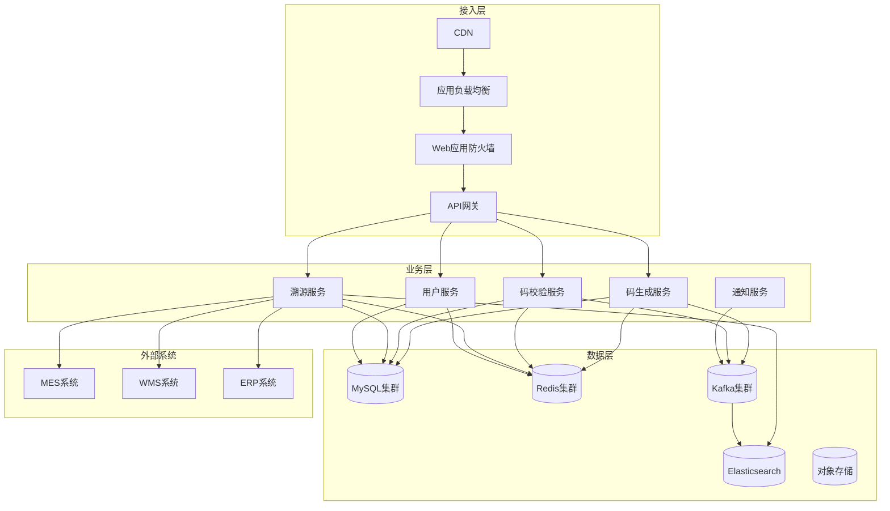
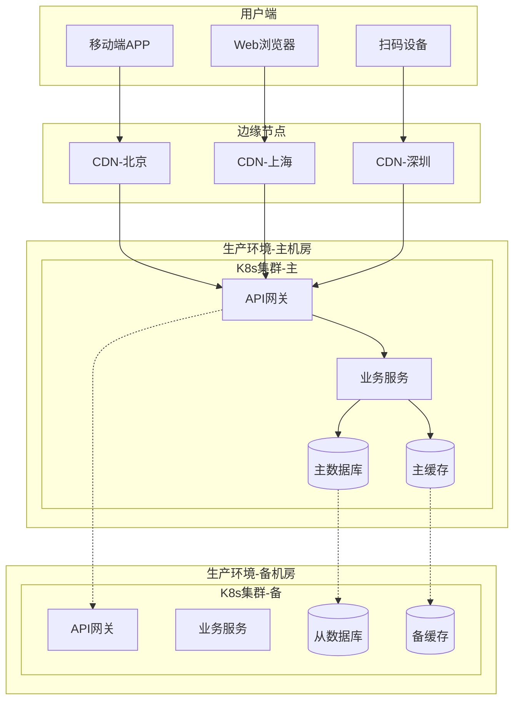

# 动态二维码溯源系统设计（戎码科技项目背景）

## 一、需求分析与范围界定

### 1.1 业务需求澄清
#### 功能性需求
- **一物一码生成**：支持1亿+商品的唯一码生成，码长度18位数字
- **动态码更新**：支持定时更新（1小时/4小时/24小时可配置），防复制防篡改
- **多维度溯源**：生产溯源（原料批次、生产日期、质检报告）、流通溯源（经销商、物流轨迹、销售终端）
- **防窜货监控**：区域流向监控、异常销售预警、渠道合规检查
- **消费者验真**：扫码验证真伪、查看产品信息、参与营销活动

#### 非功能性需求
- **性能指标**：
  - 码生成：峰值10万码/秒，平均5万码/秒
  - 扫码查询：P99 < 200ms，P95 < 100ms
  - 系统吞吐量：100万QPS（扫码高峰）
- **可用性要求**：99.99% SLA（年停机时间<53分钟）
- **安全性要求**：数据加密传输、防刷防爬、隐私保护合规


### 1.2 规模评估
#### 用户规模
- **B端用户**：1000+品牌商，10万+经销商
- **C端用户**：1亿+消费者，日活跃扫码用户500万
- **并发用户数**：峰值10万并发扫码

#### 数据规模
- **码数据**：年生成100亿码，单码元数据1KB，总存储100TB
- **溯源数据**：关联MES/WMS/ERP数据，年增长50TB
- **日志数据**：扫码日志、操作日志，日增长1TB
- **读写比例**：读写比 = 1000:1（扫码 vs 生成）

#### 流量评估
- **峰值QPS**：100万（双11等大促）
- **平均QPS**：10万（日常）
- **带宽需求**：峰值10Gbps，平均2Gbps

### 1.3 关键指标定义
```
性能指标：
- 码生成响应时间：P99 < 50ms
- 扫码查询响应时间：P99 < 200ms（含弱网）
- 系统吞吐量：100万QPS
- 码生成成功率：99.99%

容量指标：
- 存储容量：200TB/年（含备份）
- 带宽容量：10Gbps峰值
- 并发容量：10万用户

业务指标：
- 码生成准确率：100%（无重复码）
- 防伪识别率：99.9%（误报率<0.1%）
- 溯源数据完整性：99.5%
```

## 二、高层架构设计

### 2.1 架构模式选择
#### 微服务架构
- **选择理由**：业务复杂度高、团队规模大（50+人）、需要独立部署和扩展
- **服务拆分原则**：按业务域拆分（码生成、码校验、溯源查询、用户管理）
- **通信模式**：同步调用（gRPC）+ 异步消息（Kafka）

#### 事件驱动架构
- **核心事件**：码生成事件、扫码事件、溯源查询事件、异常告警事件
- **事件存储**：Kafka作为事件总线，支持事件回放和审计
- **最终一致性**：通过事件驱动保证数据最终一致性

### 2.2 核心组件识别
#### 接入层
- **CDN**：静态资源加速、图片缓存、边缘计算
- **负载均衡**：ALB（应用负载均衡）+ NLB（网络负载均衡）
- **API网关**：Kong，统一鉴权、限流、监控、路由
- **WAF**：Web应用防火墙，防DDoS、SQL注入、XSS攻击

#### 业务层
- **码生成服务**：雪花算法、批量生成、码池管理
- **码校验服务**：码验证、防重放、动态更新
- **溯源服务**：多维度查询、数据聚合、缓存优化
- **用户服务**：B端/C端用户管理、权限控制、SSO集成
- **通知服务**：短信、邮件、推送、webhook回调

#### 数据层
- **关系数据库**：MySQL集群（主从+分库分表）
- **缓存系统**：Redis集群（码池+查询缓存）
- **消息队列**：Kafka集群（事件流+日志收集）
- **搜索引擎**：Elasticsearch（日志分析+全文搜索）
- **对象存储**：OSS（图片、文档、备份文件）

#### 基础设施层
- **容器平台**：Kubernetes + Docker
- **服务网格**：Istio（流量管理、安全、观测）
- **配置中心**：Consul（配置管理、服务发现）
- **监控体系**：Prometheus + Grafana + AlertManager
- **日志系统**：ELK Stack（收集、存储、分析）
- **链路追踪**：Jaeger（分布式追踪、性能分析）

### 2.3 技术栈选型
#### 编程语言
```
后端服务：Go（高并发、低延迟、内存安全）
- 码生成服务：Go + Gin框架
- 码校验服务：Go + gRPC
- 溯源服务：Go + Echo框架

数据处理：Python（数据分析、机器学习）
- 异常检测：Python + scikit-learn
- 数据ETL：Python + Apache Airflow

前端应用：
- 管理后台：Vue.js + Element UI
- 移动端：React Native + TypeScript
```

#### 数据存储
```
关系数据库：MySQL 8.0
- 主库：码元数据、用户数据、订单数据
- 从库：只读查询、报表统计
- 分片策略：按品牌ID分库，按时间分表

缓存系统：Redis 6.0
- 码池缓存：Sorted Set存储待分配码
- 查询缓存：Hash存储热点数据
- 会话缓存：String存储用户会话

消息队列：Kafka 2.8
- 事件流：码生成、扫码、溯源事件
- 日志收集：应用日志、访问日志
- 数据同步：MySQL binlog同步

搜索引擎：Elasticsearch 7.15
- 日志分析：扫码日志、错误日志
- 全文搜索：产品信息、溯源数据
- 实时统计：Dashboard数据源
```

#### 中间件组件
```
API网关：Kong 2.5
- 路由管理：基于域名、路径的智能路由
- 认证授权：JWT、OAuth2.0、API Key
- 限流熔断：基于用户、IP、API的多维限流

服务发现：Consul 1.10
- 服务注册：自动注册、健康检查
- 配置管理：动态配置、版本控制
- KV存储：元数据存储、分布式锁

监控告警：Prometheus + Grafana
- 指标收集：业务指标、系统指标
- 可视化：实时Dashboard、历史趋势
- 告警规则：阈值告警、异常检测
```

### 2.4 架构图设计
#### 系统架构图


#### 部署架构图


## 三、详细设计

### 3.1 数据库设计
#### 数据模型设计
```sql
-- 码基础信息表
CREATE TABLE `qr_codes` (
    `id` bigint(20) NOT NULL AUTO_INCREMENT,
    `code` varchar(32) NOT NULL COMMENT '二维码内容',
    `brand_id` int(11) NOT NULL COMMENT '品牌ID',
    `product_id` int(11) NOT NULL COMMENT '产品ID',
    `batch_no` varchar(64) NOT NULL COMMENT '批次号',
    `status` tinyint(4) NOT NULL DEFAULT '1' COMMENT '状态：1-未激活，2-已激活，3-已失效',
    `version` int(11) NOT NULL DEFAULT '1' COMMENT '版本号',
    `expire_time` datetime NOT NULL COMMENT '过期时间',
    `created_at` datetime NOT NULL DEFAULT CURRENT_TIMESTAMP,
    `updated_at` datetime NOT NULL DEFAULT CURRENT_TIMESTAMP ON UPDATE CURRENT_TIMESTAMP,
    PRIMARY KEY (`id`),
    UNIQUE KEY `uk_code` (`code`),
    KEY `idx_brand_product` (`brand_id`, `product_id`),
    KEY `idx_batch_no` (`batch_no`),
    KEY `idx_status_expire` (`status`, `expire_time`)
) ENGINE=InnoDB DEFAULT CHARSET=utf8mb4 COMMENT='二维码基础信息表';

-- 扫码记录表
CREATE TABLE `scan_records` (
    `id` bigint(20) NOT NULL AUTO_INCREMENT,
    `code` varchar(32) NOT NULL COMMENT '二维码',
    `user_id` varchar(64) DEFAULT NULL COMMENT '用户ID',
    `ip` varchar(45) NOT NULL COMMENT 'IP地址',
    `user_agent` text COMMENT 'User Agent',
    `location` varchar(128) DEFAULT NULL COMMENT '地理位置',
    `scan_time` datetime NOT NULL DEFAULT CURRENT_TIMESTAMP,
    `result` tinyint(4) NOT NULL COMMENT '扫码结果：1-成功，2-失败，3-异常',
    `error_msg` varchar(512) DEFAULT NULL COMMENT '错误信息',
    PRIMARY KEY (`id`),
    KEY `idx_code_time` (`code`, `scan_time`),
    KEY `idx_user_time` (`user_id`, `scan_time`),
    KEY `idx_scan_time` (`scan_time`)
) ENGINE=InnoDB DEFAULT CHARSET=utf8mb4 COMMENT='扫码记录表';

-- 溯源数据表
CREATE TABLE `trace_data` (
    `id` bigint(20) NOT NULL AUTO_INCREMENT,
    `code` varchar(32) NOT NULL COMMENT '二维码',
    `trace_type` varchar(32) NOT NULL COMMENT '溯源类型：production,logistics,sales',
    `trace_data` json NOT NULL COMMENT '溯源数据JSON',
    `data_source` varchar(64) NOT NULL COMMENT '数据来源：MES,WMS,ERP',
    `created_at` datetime NOT NULL DEFAULT CURRENT_TIMESTAMP,
    PRIMARY KEY (`id`),
    KEY `idx_code_type` (`code`, `trace_type`),
    KEY `idx_source_time` (`data_source`, `created_at`)
) ENGINE=InnoDB DEFAULT CHARSET=utf8mb4 COMMENT='溯源数据表';
```

#### 分库分表策略
```
分库策略：
- 按brand_id分库：支持1000个品牌，每个品牌独立数据库
- 分库数量：16个数据库实例
- 分库算法：brand_id % 16

分表策略：
- qr_codes表：按created_at月份分表（qr_codes_202401）
- scan_records表：按scan_time日期分表（scan_records_20240101）
- trace_data表：按created_at月份分表（trace_data_202401）

路由规则：
- 写操作：根据brand_id路由到对应分库
- 读操作：支持跨库查询，通过中间件聚合结果
```

#### 索引设计
```sql
-- 主要索引策略
-- 1. 唯一索引：保证码的唯一性
CREATE UNIQUE INDEX uk_code ON qr_codes(code);

-- 2. 复合索引：支持多维度查询
CREATE INDEX idx_brand_product_status ON qr_codes(brand_id, product_id, status);
CREATE INDEX idx_batch_status_expire ON qr_codes(batch_no, status, expire_time);

-- 3. 覆盖索引：减少回表查询
CREATE INDEX idx_code_status_version_expire ON qr_codes(code, status, version, expire_time);

-- 4. 时间索引：支持时间范围查询
CREATE INDEX idx_scan_time_result ON scan_records(scan_time, result);
CREATE INDEX idx_created_at ON trace_data(created_at);
```

### 3.2 API设计
#### RESTful API规范
```yaml
# 码生成API
POST /api/v1/codes/generate
Content-Type: application/json
Authorization: Bearer {token}

Request:
{
  "brand_id": 1001,
  "product_id": 2001,
  "batch_no": "B20240101001",
  "quantity": 10000,
  "expire_hours": 24
}

Response:
{
  "code": 200,
  "message": "success",
  "data": {
    "task_id": "task_123456",
    "estimated_time": 30,
    "download_url": "https://oss.example.com/codes/task_123456.zip"
  }
}

# 码校验API
GET /api/v1/codes/{code}/verify
Content-Type: application/json

Response:
{
  "code": 200,
  "message": "success",
  "data": {
    "valid": true,
    "product_info": {
      "name": "茅台酒",
      "brand": "茅台",
      "batch_no": "B20240101001",
      "production_date": "2024-01-01"
    },
    "trace_info": {
      "production": {...},
      "logistics": {...},
      "sales": {...}
    }
  }
}

# 溯源查询API
GET /api/v1/trace/{code}
Content-Type: application/json

Response:
{
  "code": 200,
  "message": "success",
  "data": {
    "code": "123456789012345678",
    "timeline": [
      {
        "stage": "production",
        "time": "2024-01-01T08:00:00Z",
        "location": "贵州茅台酒厂",
        "details": {
          "raw_materials": "高粱、小麦",
          "quality_grade": "A级",
          "inspector": "张三"
        }
      },
      {
        "stage": "logistics",
        "time": "2024-01-02T10:00:00Z",
        "location": "北京仓库",
        "details": {
          "carrier": "顺丰速运",
          "tracking_no": "SF1234567890",
          "temperature": "15-25°C"
        }
      }
    ]
  }
}
```

#### gRPC API定义
```protobuf
// code_service.proto
syntax = "proto3";

package code;

service CodeService {
  // 批量生成码
  rpc GenerateCodes(GenerateCodesRequest) returns (GenerateCodesResponse);
  
  // 验证码
  rpc VerifyCode(VerifyCodeRequest) returns (VerifyCodeResponse);
  
  // 更新码状态
  rpc UpdateCodeStatus(UpdateCodeStatusRequest) returns (UpdateCodeStatusResponse);
}

message GenerateCodesRequest {
  int32 brand_id = 1;
  int32 product_id = 2;
  string batch_no = 3;
  int32 quantity = 4;
  int32 expire_hours = 5;
}

message GenerateCodesResponse {
  string task_id = 1;
  repeated string codes = 2;
  int32 estimated_time = 3;
}

message VerifyCodeRequest {
  string code = 1;
  string client_ip = 2;
  string user_agent = 3;
}

message VerifyCodeResponse {
  bool valid = 1;
  CodeInfo code_info = 2;
  string error_message = 3;
}

message CodeInfo {
  string code = 1;
  int32 brand_id = 2;
  int32 product_id = 3;
  string batch_no = 4;
  int32 status = 5;
  int32 version = 6;
  int64 expire_time = 7;
}
```

### 3.3 缓存策略
#### 缓存层级设计
```
L1缓存（应用内存）：
- 热点产品信息：LRU缓存，容量10MB，TTL=5分钟
- 用户会话信息：HashMap缓存，TTL=30分钟
- 配置信息：永久缓存，配置变更时主动刷新

L2缓存（Redis集群）：
- 码池缓存：Sorted Set，按expire_time排序，TTL=24小时
- 查询结果缓存：Hash结构，TTL=1小时
- 用户权限缓存：String结构，TTL=30分钟
- 热点统计数据：Hash结构，TTL=5分钟

L3缓存（CDN）：
- 静态资源：图片、CSS、JS文件，TTL=7天
- API响应：GET请求结果，TTL=1分钟
- 产品图片：OSS+CDN，TTL=30天
```

#### 缓存模式
```go
// Cache-Aside模式实现
type CacheService struct {
    redis  *redis.Client
    mysql  *sql.DB
}

// 读取数据
func (c *CacheService) GetCodeInfo(code string) (*CodeInfo, error) {
    // 1. 先查缓存
    cacheKey := fmt.Sprintf("code:info:%s", code)
    cached, err := c.redis.Get(ctx, cacheKey).Result()
    if err == nil {
        var info CodeInfo
        json.Unmarshal([]byte(cached), &info)
        return &info, nil
    }
    
    // 2. 缓存未命中，查数据库
    info, err := c.getCodeInfoFromDB(code)
    if err != nil {
        return nil, err
    }
    
    // 3. 写入缓存
    data, _ := json.Marshal(info)
    c.redis.SetEX(ctx, cacheKey, data, time.Hour)
    
    return info, nil
}

// Write-Through模式实现
func (c *CacheService) UpdateCodeStatus(code string, status int) error {
    // 1. 更新数据库
    err := c.updateCodeStatusInDB(code, status)
    if err != nil {
        return err
    }
    
    // 2. 更新缓存
    cacheKey := fmt.Sprintf("code:info:%s", code)
    c.redis.HSet(ctx, cacheKey, "status", status)
    
    return nil
}
```

#### 缓存失效策略
```go
// 缓存穿透防护
func (c *CacheService) GetWithBloomFilter(key string) (interface{}, error) {
    // 1. 布隆过滤器检查
    if !c.bloomFilter.Test([]byte(key)) {
        return nil, ErrNotFound
    }
    
    // 2. 查询缓存
    result, err := c.redis.Get(ctx, key).Result()
    if err == redis.Nil {
        // 3. 查询数据库
        data, err := c.getFromDB(key)
        if err != nil {
            // 4. 设置空值缓存，防止缓存穿透
            c.redis.SetEX(ctx, key, "NULL", time.Minute*5)
            return nil, err
        }
        
        // 5. 写入缓存
        c.redis.SetEX(ctx, key, data, time.Hour)
        return data, nil
    }
    
    return result, nil
}

// 缓存击穿防护（分布式锁）
func (c *CacheService) GetWithMutex(key string) (interface{}, error) {
    // 1. 查询缓存
    result, err := c.redis.Get(ctx, key).Result()
    if err == nil {
        return result, nil
    }
    
    // 2. 获取分布式锁
    lockKey := fmt.Sprintf("lock:%s", key)
    acquired, err := c.redis.SetNX(ctx, lockKey, "1", time.Second*10).Result()
    if !acquired {
        // 等待其他线程更新缓存
        time.Sleep(time.Millisecond * 100)
        return c.redis.Get(ctx, key).Result()
    }
    
    defer c.redis.Del(ctx, lockKey)
    
    // 3. 双重检查
    result, err = c.redis.Get(ctx, key).Result()
    if err == nil {
        return result, nil
    }
    
    // 4. 查询数据库并更新缓存
    data, err := c.getFromDB(key)
    if err != nil {
        return nil, err
    }
    
    c.redis.SetEX(ctx, key, data, time.Hour)
    return data, nil
}
```

### 3.4 消息队列设计
#### 消息模型
```
主题设计：
- code.generated：码生成事件
- code.verified：码验证事件
- trace.queried：溯源查询事件
- alert.triggered：异常告警事件
- data.synced：数据同步事件

分区策略：
- 按brand_id分区：保证同一品牌的消息有序
- 分区数量：32个分区（支持32个消费者并行）
- 分区算法：hash(brand_id) % 32

消费者组：
- analytics-group：数据分析服务
- notification-group：通知服务
- audit-group：审计服务
- sync-group：数据同步服务
```

#### 消息可靠性
```go
// 生产者配置
config := sarama.NewConfig()
config.Producer.RequiredAcks = sarama.WaitForAll // 等待所有副本确认
config.Producer.Retry.Max = 3                   // 重试3次
config.Producer.Return.Successes = true         // 返回成功消息
config.Producer.Return.Errors = true            // 返回错误消息
config.Producer.Idempotent = true               // 幂等生产者

// 消息发送
func (p *Producer) SendCodeGeneratedEvent(event *CodeGeneratedEvent) error {
    message := &sarama.ProducerMessage{
        Topic:     "code.generated",
        Key:       sarama.StringEncoder(fmt.Sprintf("%d", event.BrandID)),
        Value:     sarama.ByteEncoder(event.ToJSON()),
        Headers:   []sarama.RecordHeader{
            {
                Key:   []byte("event_id"),
                Value: []byte(event.EventID),
            },
            {
                Key:   []byte("timestamp"),
                Value: []byte(fmt.Sprintf("%d", event.Timestamp)),
            },
        },
    }
    
    partition, offset, err := p.producer.SendMessage(message)
    if err != nil {
        return fmt.Errorf("failed to send message: %w", err)
    }
    
    log.Printf("Message sent to partition %d at offset %d", partition, offset)
    return nil
}

// 消费者实现
func (c *Consumer) ConsumeCodeEvents() error {
    config := sarama.NewConfig()
    config.Consumer.Group.Rebalance.Strategy = sarama.BalanceStrategyRoundRobin
    config.Consumer.Offsets.Initial = sarama.OffsetNewest
    config.Consumer.Group.Session.Timeout = 10 * time.Second
    config.Consumer.Group.Heartbeat.Interval = 3 * time.Second
    
    consumer := Consumer{
        ready: make(chan bool),
    }
    
    ctx, cancel := context.WithCancel(context.Background())
    client, err := sarama.NewConsumerGroup([]string{"localhost:9092"}, "analytics-group", config)
    if err != nil {
        return err
    }
    
    go func() {
        for {
            if err := client.Consume(ctx, []string{"code.generated"}, &consumer); err != nil {
                log.Printf("Error from consumer: %v", err)
            }
            if ctx.Err() != nil {
                return
            }
            consumer.ready = make(chan bool)
        }
    }()
    
    <-consumer.ready
    log.Println("Sarama consumer up and running...")
    
    return nil
}
```

## 四、关键技术点与Go实现
### 1. 高并发码生成（雪花算法+预生成池）
- **Go实现**：使用Snowflake变种（`workerID=区域ID`，`timestamp=毫秒级`，`sequence=12位`），Go中`github.com/sony/sonyflake`生成唯一码ID（18位数字码）；
- **预生成池**：每日凌晨预生成次日码量（10亿），存入Redis（`sorted set`按`expire_time`排序），Go中`go generateBatch(10000)`协程池并发生成（100个Goroutine，每批1万码）；
- **动态扩容**：大促前通过`k8s horizontal pod autoscaling`扩容码生成服务（从5实例扩至50实例），Go服务通过`pprof`监控`goroutine`数量（保持<10万）避免OOM。

### 2. 动态码更新与失效
- **版本控制**：每个码有`current_version`（初始1），更新时`version+1`，Redis中存储`code:123456:version=2`，旧版本码校验时返回`410 Gone`；
- **定时失效**：使用Redis`EXPIREAT`设置码有效期（如2024-12-31 23:59:59），Go中`time.Parse`解析配置文件中的`expire_rule`并设置；
- **紧急失效**：支持批量失效（如发现窜货），Go服务通过`redis.Pipelined`执行`DEL`命令（10万码/秒），配合Kafka发送`invalid_event`通知下游系统。

### 3. 低延迟扫码与溯源
- **扫码路由优化**：根据扫码IP定位最近的边缘节点（阿里云ECS全球节点），Go中使用`ip2region`库解析IP归属地，路由至最近节点（延迟降低40%）；
- **缓存穿透防护**：扫码时先查Redis（`GET code:123456`），未命中查MySQL并设置`short TTL=10s`（防缓存击穿），Go中`redis.Nil`判断未命中场景；
- **三方系统对接**：溯源数据通过`gRPC`调用MES/WMS（`google.golang.org/grpc`），设置超时时间500ms（超时分流至降级服务返回`数据加载中`），Go中`context.WithTimeout`控制调用时长。

## 五、可扩展性设计

### 5.1 水平扩展
#### 无状态设计
```go
// 服务无状态化设计
type CodeService struct {
    db     *sql.DB
    redis  *redis.Client
    kafka  *kafka.Producer
    config *Config
}

// 会话外部化
type SessionManager struct {
    redis *redis.Client
}

func (s *SessionManager) CreateSession(userID string, data map[string]interface{}) (string, error) {
    sessionID := uuid.New().String()
    sessionKey := fmt.Sprintf("session:%s", sessionID)
    
    sessionData := map[string]interface{}{
        "user_id":    userID,
        "created_at": time.Now().Unix(),
        "data":       data,
    }
    
    jsonData, _ := json.Marshal(sessionData)
    err := s.redis.SetEX(context.Background(), sessionKey, jsonData, time.Hour*24).Err()
    if err != nil {
        return "", err
    }
    
    return sessionID, nil
}
```

#### 负载均衡策略
```yaml
# Kong负载均衡配置
upstreams:
  - name: code-service
    algorithm: consistent-hashing  # 一致性哈希
    hash_on: header
    hash_on_header: X-Brand-ID
    targets:
      - target: code-service-1:8080
        weight: 100
      - target: code-service-2:8080
        weight: 100
      - target: code-service-3:8080
        weight: 100

  - name: verify-service
    algorithm: least-connections   # 最少连接
    targets:
      - target: verify-service-1:8080
      - target: verify-service-2:8080
      - target: verify-service-3:8080
```

#### 自动扩缩容
```yaml
# Kubernetes HPA配置
apiVersion: autoscaling/v2
kind: HorizontalPodAutoscaler
metadata:
  name: code-service-hpa
spec:
  scaleTargetRef:
    apiVersion: apps/v1
    kind: Deployment
    name: code-service
  minReplicas: 3
  maxReplicas: 50
  metrics:
  - type: Resource
    resource:
      name: cpu
      target:
        type: Utilization
        averageUtilization: 70
  - type: Resource
    resource:
      name: memory
      target:
        type: Utilization
        averageUtilization: 80
  - type: Pods
    pods:
      metric:
        name: requests_per_second
      target:
        type: AverageValue
        averageValue: "1000"
  behavior:
    scaleUp:
      stabilizationWindowSeconds: 60
      policies:
      - type: Percent
        value: 100
        periodSeconds: 15
    scaleDown:
      stabilizationWindowSeconds: 300
      policies:
      - type: Percent
        value: 10
        periodSeconds: 60
```

### 5.2 分布式架构
#### 微服务拆分
```
服务边界划分：
1. 码生成服务（code-generator）
   - 职责：码生成、码池管理、批量导出
   - 数据：qr_codes表、code_pools表
   - 依赖：Redis、MySQL、OSS

2. 码校验服务（code-verifier）
   - 职责：码验证、防重放、状态更新
   - 数据：qr_codes表、scan_records表
   - 依赖：Redis、MySQL、Kafka

3. 溯源服务（trace-service）
   - 职责：溯源查询、数据聚合、报表生成
   - 数据：trace_data表、product_info表
   - 依赖：MySQL、Elasticsearch、外部API

4. 用户服务（user-service）
   - 职责：用户管理、权限控制、SSO集成
   - 数据：users表、roles表、permissions表
   - 依赖：MySQL、Redis、LDAP

5. 通知服务（notification-service）
   - 职责：消息推送、邮件发送、webhook回调
   - 数据：notifications表、templates表
   - 依赖：Kafka、第三方推送服务
```

#### 服务治理
```go
// 服务注册与发现
type ServiceRegistry struct {
    consul *api.Client
}

func (r *ServiceRegistry) RegisterService(service *ServiceInfo) error {
    registration := &api.AgentServiceRegistration{
        ID:      fmt.Sprintf("%s-%s", service.Name, service.ID),
        Name:    service.Name,
        Tags:    service.Tags,
        Port:    service.Port,
        Address: service.Address,
        Check: &api.AgentServiceCheck{
            HTTP:                           fmt.Sprintf("http://%s:%d/health", service.Address, service.Port),
            Timeout:                        "10s",
            Interval:                       "30s",
            DeregisterCriticalServiceAfter: "90s",
        },
    }
    
    return r.consul.Agent().ServiceRegister(registration)
}

// 熔断器实现
type CircuitBreaker struct {
    maxFailures  int
    resetTimeout time.Duration
    state        State
    failures     int
    lastFailTime time.Time
    mutex        sync.RWMutex
}

func (cb *CircuitBreaker) Call(fn func() (interface{}, error)) (interface{}, error) {
    cb.mutex.Lock()
    defer cb.mutex.Unlock()
    
    if cb.state == StateOpen {
        if time.Since(cb.lastFailTime) > cb.resetTimeout {
            cb.state = StateHalfOpen
            cb.failures = 0
        } else {
            return nil, ErrCircuitBreakerOpen
        }
    }
    
    result, err := fn()
    if err != nil {
        cb.failures++
        cb.lastFailTime = time.Now()
        
        if cb.failures >= cb.maxFailures {
            cb.state = StateOpen
        }
        
        return nil, err
    }
    
    if cb.state == StateHalfOpen {
        cb.state = StateClosed
    }
    cb.failures = 0
    
    return result, nil
}
```

#### 分布式事务
```go
// Saga模式实现
type SagaOrchestrator struct {
    steps []SagaStep
    compensations []CompensationStep
}

type SagaStep struct {
    Name    string
    Execute func(ctx context.Context, data interface{}) error
    Compensate func(ctx context.Context, data interface{}) error
}

func (s *SagaOrchestrator) Execute(ctx context.Context, data interface{}) error {
    executedSteps := make([]int, 0)
    
    // 执行所有步骤
    for i, step := range s.steps {
        if err := step.Execute(ctx, data); err != nil {
            // 执行补偿操作
            for j := len(executedSteps) - 1; j >= 0; j-- {
                stepIndex := executedSteps[j]
                if compensateErr := s.steps[stepIndex].Compensate(ctx, data); compensateErr != nil {
                    log.Printf("Compensation failed for step %s: %v", s.steps[stepIndex].Name, compensateErr)
                }
            }
            return fmt.Errorf("saga failed at step %s: %w", step.Name, err)
        }
        executedSteps = append(executedSteps, i)
    }
    
    return nil
}

// 码生成Saga示例
func NewCodeGenerationSaga() *SagaOrchestrator {
    return &SagaOrchestrator{
        steps: []SagaStep{
            {
                Name: "ValidateRequest",
                Execute: func(ctx context.Context, data interface{}) error {
                    req := data.(*GenerateCodeRequest)
                    return validateGenerateRequest(req)
                },
                Compensate: func(ctx context.Context, data interface{}) error {
                    // 验证步骤无需补偿
                    return nil
                },
            },
            {
                Name: "ReserveCodes",
                Execute: func(ctx context.Context, data interface{}) error {
                    req := data.(*GenerateCodeRequest)
                    return reserveCodesInPool(req.Quantity)
                },
                Compensate: func(ctx context.Context, data interface{}) error {
                    req := data.(*GenerateCodeRequest)
                    return releaseReservedCodes(req.Quantity)
                },
            },
            {
                Name: "GenerateCodes",
                Execute: func(ctx context.Context, data interface{}) error {
                    req := data.(*GenerateCodeRequest)
                    return generateAndStoreCodes(req)
                },
                Compensate: func(ctx context.Context, data interface{}) error {
                    req := data.(*GenerateCodeRequest)
                    return deleteGeneratedCodes(req.TaskID)
                },
            },
            {
                Name: "NotifyCompletion",
                Execute: func(ctx context.Context, data interface{}) error {
                    req := data.(*GenerateCodeRequest)
                    return sendCompletionNotification(req.UserID, req.TaskID)
                },
                Compensate: func(ctx context.Context, data interface{}) error {
                    // 通知步骤无需补偿
                    return nil
                },
            },
        },
    }
}
```

## 六、可靠性设计

### 6.1 高可用设计
#### 冗余设计
```yaml
# MySQL主从配置
master:
  host: mysql-master.internal
  port: 3306
  config:
    server-id: 1
    log-bin: mysql-bin
    binlog-format: ROW
    sync_binlog: 1
    innodb_flush_log_at_trx_commit: 1

slaves:
  - host: mysql-slave-1.internal
    port: 3306
    config:
      server-id: 2
      read-only: 1
      relay-log: mysql-relay-bin
  - host: mysql-slave-2.internal
    port: 3306
    config:
      server-id: 3
      read-only: 1
      relay-log: mysql-relay-bin

# Redis集群配置
redis_cluster:
  nodes:
    - host: redis-1.internal
      port: 6379
      role: master
      slots: "0-5460"
    - host: redis-2.internal
      port: 6379
      role: master
      slots: "5461-10922"
    - host: redis-3.internal
      port: 6379
      role: master
      slots: "10923-16383"
    - host: redis-4.internal
      port: 6379
      role: slave
      master: redis-1.internal
    - host: redis-5.internal
      port: 6379
      role: slave
      master: redis-2.internal
    - host: redis-6.internal
      port: 6379
      role: slave
      master: redis-3.internal
```

#### 故障检测与转移
```go
// 健康检查实现
type HealthChecker struct {
    checks map[string]HealthCheck
    mutex  sync.RWMutex
}

type HealthCheck struct {
    Name     string
    Check    func() error
    Interval time.Duration
    Timeout  time.Duration
    Status   HealthStatus
}

func (hc *HealthChecker) RegisterCheck(name string, check HealthCheck) {
    hc.mutex.Lock()
    defer hc.mutex.Unlock()
    hc.checks[name] = check
}

func (hc *HealthChecker) StartMonitoring() {
    for name, check := range hc.checks {
        go func(name string, check HealthCheck) {
            ticker := time.NewTicker(check.Interval)
            defer ticker.Stop()
            
            for {
                select {
                case <-ticker.C:
                    ctx, cancel := context.WithTimeout(context.Background(), check.Timeout)
                    err := check.Check()
                    cancel()
                    
                    hc.mutex.Lock()
                    if err != nil {
                        hc.checks[name].Status = HealthStatusUnhealthy
                        log.Printf("Health check %s failed: %v", name, err)
                        // 触发告警
                        hc.triggerAlert(name, err)
                    } else {
                        hc.checks[name].Status = HealthStatusHealthy
                    }
                    hc.mutex.Unlock()
                }
            }
        }(name, check)
    }
}

// 数据库故障转移
type DBFailover struct {
    master *sql.DB
    slaves []*sql.DB
    current *sql.DB
    mutex   sync.RWMutex
}

func (df *DBFailover) GetReadDB() *sql.DB {
    df.mutex.RLock()
    defer df.mutex.RUnlock()
    
    // 轮询选择健康的从库
    for _, slave := range df.slaves {
        if df.isHealthy(slave) {
            return slave
        }
    }
    
    // 从库都不可用，使用主库
    return df.master
}

func (df *DBFailover) GetWriteDB() *sql.DB {
    df.mutex.RLock()
    defer df.mutex.RUnlock()
    
    if df.isHealthy(df.master) {
        return df.master
    }
    
    // 主库不可用，触发故障转移
    df.promoteSlaveToMaster()
    return df.current
}
```

### 6.2 数据可靠性
#### 数据备份策略
```bash
#!/bin/bash
# MySQL备份脚本

# 全量备份（每周日执行）
full_backup() {
    DATE=$(date +%Y%m%d)
    BACKUP_DIR="/backup/mysql/full/$DATE"
    mkdir -p $BACKUP_DIR
    
    # 使用xtrabackup进行热备份
    xtrabackup --backup \
        --target-dir=$BACKUP_DIR \
        --user=backup \
        --password=$MYSQL_BACKUP_PASSWORD \
        --host=mysql-master.internal \
        --compress \
        --compress-threads=4 \
        --parallel=4
    
    # 上传到OSS
    ossutil cp -r $BACKUP_DIR oss://backup-bucket/mysql/full/$DATE/
    
    # 清理本地备份（保留7天）
    find /backup/mysql/full -type d -mtime +7 -exec rm -rf {} \;
}

# 增量备份（每日执行）
incremental_backup() {
    DATE=$(date +%Y%m%d)
    YESTERDAY=$(date -d "yesterday" +%Y%m%d)
    BACKUP_DIR="/backup/mysql/incremental/$DATE"
    BASE_DIR="/backup/mysql/full/$YESTERDAY"
    
    mkdir -p $BACKUP_DIR
    
    xtrabackup --backup \
        --target-dir=$BACKUP_DIR \
        --incremental-basedir=$BASE_DIR \
        --user=backup \
        --password=$MYSQL_BACKUP_PASSWORD \
        --host=mysql-master.internal \
        --compress
    
    ossutil cp -r $BACKUP_DIR oss://backup-bucket/mysql/incremental/$DATE/
}

# 数据校验
data_verification() {
    # 校验备份文件完整性
    xtrabackup --prepare --target-dir=/backup/mysql/full/$(date +%Y%m%d)
    
    # 校验数据一致性
    pt-table-checksum \
        --host=mysql-master.internal \
        --user=checksum \
        --password=$MYSQL_CHECKSUM_PASSWORD \
        --databases=qrcode_db \
        --replicate=percona.checksums
}
```

## 七、安全性设计

### 7.1 认证授权
#### JWT认证实现
```go
type JWTManager struct {
    secretKey     string
    tokenDuration time.Duration
}

type Claims struct {
    UserID   string   `json:"user_id"`
    BrandID  int      `json:"brand_id"`
    Roles    []string `json:"roles"`
    jwt.StandardClaims
}

func (manager *JWTManager) Generate(userID string, brandID int, roles []string) (string, error) {
    claims := Claims{
        UserID:  userID,
        BrandID: brandID,
        Roles:   roles,
        StandardClaims: jwt.StandardClaims{
            ExpiresAt: time.Now().Add(manager.tokenDuration).Unix(),
            IssuedAt:  time.Now().Unix(),
            Issuer:    "qrcode-system",
        },
    }
    
    token := jwt.NewWithClaims(jwt.SigningMethodHS256, claims)
    return token.SignedString([]byte(manager.secretKey))
}

func (manager *JWTManager) Verify(tokenString string) (*Claims, error) {
    token, err := jwt.ParseWithClaims(
        tokenString,
        &Claims{},
        func(token *jwt.Token) (interface{}, error) {
            return []byte(manager.secretKey), nil
        },
    )
    
    if err != nil {
        return nil, err
    }
    
    claims, ok := token.Claims.(*Claims)
    if !ok || !token.Valid {
        return nil, ErrInvalidToken
    }
    
    return claims, nil
}

// RBAC权限控制
type RBACManager struct {
    redis *redis.Client
}

func (rbac *RBACManager) CheckPermission(userID string, resource string, action string) (bool, error) {
    // 获取用户角色
    roles, err := rbac.getUserRoles(userID)
    if err != nil {
        return false, err
    }
    
    // 检查角色权限
    for _, role := range roles {
        permissions, err := rbac.getRolePermissions(role)
        if err != nil {
            continue
        }
        
        for _, permission := range permissions {
            if permission.Resource == resource && permission.Action == action {
                return true, nil
            }
        }
    }
    
    return false, nil
}
```

### 7.2 数据安全
#### 数据加密
```go
// AES加密实现
type AESCrypto struct {
    key []byte
}

func NewAESCrypto(key string) *AESCrypto {
    hash := sha256.Sum256([]byte(key))
    return &AESCrypto{key: hash[:]}
}

func (a *AESCrypto) Encrypt(plaintext string) (string, error) {
    block, err := aes.NewCipher(a.key)
    if err != nil {
        return "", err
    }
    
    gcm, err := cipher.NewGCM(block)
    if err != nil {
        return "", err
    }
    
    nonce := make([]byte, gcm.NonceSize())
    if _, err = io.ReadFull(rand.Reader, nonce); err != nil {
        return "", err
    }
    
    ciphertext := gcm.Seal(nonce, nonce, []byte(plaintext), nil)
    return base64.StdEncoding.EncodeToString(ciphertext), nil
}

func (a *AESCrypto) Decrypt(ciphertext string) (string, error) {
    data, err := base64.StdEncoding.DecodeString(ciphertext)
    if err != nil {
        return "", err
    }
    
    block, err := aes.NewCipher(a.key)
    if err != nil {
        return "", err
    }
    
    gcm, err := cipher.NewGCM(block)
    if err != nil {
        return "", err
    }
    
    nonceSize := gcm.NonceSize()
    if len(data) < nonceSize {
        return "", errors.New("ciphertext too short")
    }
    
    nonce, ciphertext := data[:nonceSize], data[nonceSize:]
    plaintext, err := gcm.Open(nil, nonce, ciphertext, nil)
    if err != nil {
        return "", err
    }
    
    return string(plaintext), nil
}

// 数据脱敏
type DataMasker struct{}

func (dm *DataMasker) MaskPhone(phone string) string {
    if len(phone) != 11 {
        return phone
    }
    return phone[:3] + "****" + phone[7:]
}

func (dm *DataMasker) MaskIDCard(idCard string) string {
    if len(idCard) != 18 {
        return idCard
    }
    return idCard[:6] + "********" + idCard[14:]
}

func (dm *DataMasker) MaskEmail(email string) string {
    parts := strings.Split(email, "@")
    if len(parts) != 2 {
        return email
    }
    
    username := parts[0]
    domain := parts[1]
    
    if len(username) <= 2 {
        return email
    }
    
    masked := username[:1] + strings.Repeat("*", len(username)-2) + username[len(username)-1:]
    return masked + "@" + domain
}
```

### 7.3 安全防护
#### API安全
```go
// 限流器实现
type RateLimiter struct {
    redis *redis.Client
    rules map[string]RateRule
}

type RateRule struct {
    Limit  int           // 限制次数
    Window time.Duration // 时间窗口
}

func (rl *RateLimiter) Allow(key string, rule RateRule) (bool, error) {
    now := time.Now()
    window := now.Truncate(rule.Window)
    
    pipe := rl.redis.Pipeline()
    
    // 使用滑动窗口算法
    countKey := fmt.Sprintf("rate_limit:%s:%d", key, window.Unix())
    pipe.Incr(context.Background(), countKey)
    pipe.Expire(context.Background(), countKey, rule.Window)
    
    results, err := pipe.Exec(context.Background())
    if err != nil {
        return false, err
    }
    
    count := results[0].(*redis.IntCmd).Val()
    return count <= int64(rule.Limit), nil
}

// 输入验证
type Validator struct{}

func (v *Validator) ValidateCodeRequest(req *GenerateCodeRequest) error {
    if req.Quantity <= 0 || req.Quantity > 1000000 {
        return errors.New("quantity must be between 1 and 1000000")
    }
    
    if len(req.BrandID) == 0 {
        return errors.New("brand_id is required")
    }
    
    // 防止SQL注入
    if strings.ContainsAny(req.BrandID, "';--/*") {
        return errors.New("invalid brand_id format")
    }
    
    // 防止XSS
    req.Description = html.EscapeString(req.Description)
    
    return nil
}

// WAF规则
type WAFRule struct {
    Pattern string
    Action  string
    Message string
}

var WAFRules = []WAFRule{
    {Pattern: `(?i)(union|select|insert|delete|update|drop|create|alter)`, Action: "block", Message: "SQL injection detected"},
    {Pattern: `(?i)(<script|javascript:|vbscript:|onload=|onerror=)`, Action: "block", Message: "XSS attack detected"},
    {Pattern: `(?i)(\.\./)`, Action: "block", Message: "Path traversal detected"},
    {Pattern: `(?i)(eval\(|exec\(|system\()`, Action: "block", Message: "Code injection detected"},
}
```

## 八、性能优化

### 8.1 数据库优化
#### 索引优化
```sql
-- 复合索引设计
CREATE INDEX idx_qr_codes_brand_status_created ON qr_codes(brand_id, status, created_at);
CREATE INDEX idx_scan_records_code_time ON scan_records(qr_code_id, scan_time);
CREATE INDEX idx_trace_data_product_batch ON trace_data(product_id, batch_number);

-- 分区表设计
CREATE TABLE scan_records_2024 (
    id BIGINT AUTO_INCREMENT,
    qr_code_id VARCHAR(64) NOT NULL,
    scan_time TIMESTAMP NOT NULL,
    user_info JSON,
    location JSON,
    PRIMARY KEY (id, scan_time),
    INDEX idx_code_time (qr_code_id, scan_time)
) PARTITION BY RANGE (YEAR(scan_time)) (
    PARTITION p2024 VALUES LESS THAN (2025),
    PARTITION p2025 VALUES LESS THAN (2026),
    PARTITION p2026 VALUES LESS THAN (2027),
    PARTITION p_future VALUES LESS THAN MAXVALUE
);

-- 查询优化
EXPLAIN FORMAT=JSON
SELECT qc.code, qc.status, sr.scan_time, sr.location
FROM qr_codes qc
LEFT JOIN scan_records sr ON qc.id = sr.qr_code_id
WHERE qc.brand_id = 'BRAND001'
  AND qc.created_at >= '2024-01-01'
  AND qc.status IN ('active', 'scanned')
ORDER BY qc.created_at DESC
LIMIT 1000;
```

#### 连接池优化
```go
// 数据库连接池配置
func NewDBPool() *sql.DB {
    config := mysql.Config{
        User:                 os.Getenv("DB_USER"),
        Passwd:               os.Getenv("DB_PASSWORD"),
        Net:                  "tcp",
        Addr:                 os.Getenv("DB_HOST"),
        DBName:               os.Getenv("DB_NAME"),
        ParseTime:            true,
        Loc:                  time.UTC,
        Timeout:              10 * time.Second,
        ReadTimeout:          30 * time.Second,
        WriteTimeout:         30 * time.Second,
        AllowNativePasswords: true,
    }
    
    db, err := sql.Open("mysql", config.FormatDSN())
    if err != nil {
        log.Fatal(err)
    }
    
    // 连接池参数调优
    db.SetMaxOpenConns(100)                // 最大连接数
    db.SetMaxIdleConns(20)                 // 最大空闲连接数
    db.SetConnMaxLifetime(time.Hour)       // 连接最大生存时间
    db.SetConnMaxIdleTime(10 * time.Minute) // 连接最大空闲时间
    
    return db
}

// 读写分离
type DBManager struct {
    master *sql.DB
    slaves []*sql.DB
    current int
    mutex   sync.RWMutex
}

func (dm *DBManager) GetReadDB() *sql.DB {
    dm.mutex.Lock()
    defer dm.mutex.Unlock()
    
    // 轮询选择从库
    db := dm.slaves[dm.current%len(dm.slaves)]
    dm.current++
    return db
}

func (dm *DBManager) GetWriteDB() *sql.DB {
    return dm.master
}
```

### 8.2 缓存优化
#### 多级缓存
```go
// L1缓存：本地缓存
type LocalCache struct {
    cache *bigcache.BigCache
}

func NewLocalCache() *LocalCache {
    config := bigcache.Config{
        Shards:             1024,
        LifeWindow:         10 * time.Minute,
        CleanWindow:        5 * time.Minute,
        MaxEntriesInWindow: 1000 * 10 * 60,
        MaxEntrySize:       500,
        HardMaxCacheSize:   512, // MB
    }
    
    cache, _ := bigcache.NewBigCache(config)
    return &LocalCache{cache: cache}
}

// L2缓存：Redis缓存
type RedisCache struct {
    client *redis.Client
}

// 缓存管理器
type CacheManager struct {
    l1 *LocalCache
    l2 *RedisCache
}

func (cm *CacheManager) Get(key string) ([]byte, error) {
    // 先查L1缓存
    if data, err := cm.l1.Get(key); err == nil {
        return data, nil
    }
    
    // 再查L2缓存
    data, err := cm.l2.Get(key)
    if err != nil {
        return nil, err
    }
    
    // 回写L1缓存
    cm.l1.Set(key, data)
    return data, nil
}

// 缓存预热
func (cm *CacheManager) Warmup() error {
    // 预热热点数据
    hotKeys := []string{
        "brand:config:*",
        "product:info:*",
        "user:permissions:*",
    }
    
    for _, pattern := range hotKeys {
        keys, err := cm.l2.client.Keys(context.Background(), pattern).Result()
        if err != nil {
            continue
        }
        
        for _, key := range keys {
            data, err := cm.l2.Get(key)
            if err == nil {
                cm.l1.Set(key, data)
            }
        }
    }
    
    return nil
}
```

### 8.3 并发优化
#### 协程池
```go
// 工作池实现
type WorkerPool struct {
    workerCount int
    jobQueue    chan Job
    workers     []*Worker
    quit        chan bool
}

type Job interface {
    Execute() error
}

type Worker struct {
    id       int
    jobQueue chan Job
    quit     chan bool
}

func NewWorkerPool(workerCount, queueSize int) *WorkerPool {
    return &WorkerPool{
        workerCount: workerCount,
        jobQueue:    make(chan Job, queueSize),
        workers:     make([]*Worker, workerCount),
        quit:        make(chan bool),
    }
}

func (wp *WorkerPool) Start() {
    for i := 0; i < wp.workerCount; i++ {
        worker := &Worker{
            id:       i,
            jobQueue: wp.jobQueue,
            quit:     make(chan bool),
        }
        wp.workers[i] = worker
        go worker.start()
    }
}

func (w *Worker) start() {
    for {
        select {
        case job := <-w.jobQueue:
            if err := job.Execute(); err != nil {
                log.Printf("Worker %d job failed: %v", w.id, err)
            }
        case <-w.quit:
            return
        }
    }
}

// 码生成任务
type CodeGenerationJob struct {
    BatchID  string
    Quantity int
    BrandID  string
}

func (job *CodeGenerationJob) Execute() error {
    // 批量生成码
    codes := make([]string, job.Quantity)
    for i := 0; i < job.Quantity; i++ {
        codes[i] = generateUniqueCode(job.BrandID)
    }
    
    // 批量插入数据库
    return batchInsertCodes(job.BatchID, codes)
}
```

## 九、监控运维

### 9.1 监控体系
#### 指标监控
```go
// Prometheus指标定义
var (
    // 业务指标
    codeGenerationTotal = prometheus.NewCounterVec(
        prometheus.CounterOpts{
            Name: "qrcode_generation_total",
            Help: "Total number of QR codes generated",
        },
        []string{"brand_id", "status"},
    )
    
    codeVerificationTotal = prometheus.NewCounterVec(
        prometheus.CounterOpts{
            Name: "qrcode_verification_total",
            Help: "Total number of QR code verifications",
        },
        []string{"brand_id", "result"},
    )
    
    // 性能指标
    requestDuration = prometheus.NewHistogramVec(
        prometheus.HistogramOpts{
            Name:    "http_request_duration_seconds",
            Help:    "HTTP request duration in seconds",
            Buckets: prometheus.DefBuckets,
        },
        []string{"method", "endpoint", "status"},
    )
    
    // 系统指标
    dbConnectionsActive = prometheus.NewGaugeVec(
        prometheus.GaugeOpts{
            Name: "db_connections_active",
            Help: "Number of active database connections",
        },
        []string{"database"},
    )
    
    redisConnectionsActive = prometheus.NewGaugeVec(
        prometheus.GaugeOpts{
            Name: "redis_connections_active",
            Help: "Number of active Redis connections",
        },
        []string{"instance"},
    )
)

// 中间件：请求监控
func MetricsMiddleware(next http.Handler) http.Handler {
    return http.HandlerFunc(func(w http.ResponseWriter, r *http.Request) {
        start := time.Now()
        
        // 包装ResponseWriter以获取状态码
        wrapped := &responseWriter{ResponseWriter: w, statusCode: 200}
        
        next.ServeHTTP(wrapped, r)
        
        duration := time.Since(start).Seconds()
        requestDuration.WithLabelValues(
            r.Method,
            r.URL.Path,
            strconv.Itoa(wrapped.statusCode),
        ).Observe(duration)
    })
}

// 业务指标收集
func (s *CodeService) GenerateCodes(req *GenerateCodeRequest) error {
    start := time.Now()
    defer func() {
        status := "success"
        if err != nil {
            status = "error"
        }
        codeGenerationTotal.WithLabelValues(req.BrandID, status).Inc()
    }()
    
    // 业务逻辑
    return s.doGenerateCodes(req)
}
```

#### 日志监控
```go
// 结构化日志
type Logger struct {
    logger *logrus.Logger
}

func NewLogger() *Logger {
    logger := logrus.New()
    logger.SetFormatter(&logrus.JSONFormatter{
        TimestampFormat: time.RFC3339,
        FieldMap: logrus.FieldMap{
            logrus.FieldKeyTime:  "timestamp",
            logrus.FieldKeyLevel: "level",
            logrus.FieldKeyMsg:   "message",
        },
    })
    
    // 添加钩子：发送到ELK
    hook, err := elogrus.NewElasticHook(
        elastic.NewClient(),
        "localhost:9200",
        logrus.DebugLevel,
        "qrcode-system",
    )
    if err == nil {
        logger.Hooks.Add(hook)
    }
    
    return &Logger{logger: logger}
}

func (l *Logger) LogRequest(r *http.Request, duration time.Duration, statusCode int) {
    l.logger.WithFields(logrus.Fields{
        "method":      r.Method,
        "url":         r.URL.String(),
        "remote_addr": r.RemoteAddr,
        "user_agent":  r.UserAgent(),
        "duration_ms": duration.Milliseconds(),
        "status_code": statusCode,
        "request_id":  r.Header.Get("X-Request-ID"),
    }).Info("HTTP request processed")
}

func (l *Logger) LogError(err error, context map[string]interface{}) {
    l.logger.WithFields(context).WithError(err).Error("Error occurred")
}
```

### 9.2 告警配置
#### Prometheus告警规则
```yaml
# alerts.yml
groups:
- name: qrcode-system
  rules:
  # 业务告警
  - alert: HighCodeGenerationFailureRate
    expr: |
      (
        rate(qrcode_generation_total{status="error"}[5m]) /
        rate(qrcode_generation_total[5m])
      ) > 0.05
    for: 2m
    labels:
      severity: warning
      service: qrcode-system
    annotations:
      summary: "High QR code generation failure rate"
      description: "QR code generation failure rate is {{ $value | humanizePercentage }} for brand {{ $labels.brand_id }}"
  
  # 性能告警
  - alert: HighResponseTime
    expr: |
      histogram_quantile(0.95, rate(http_request_duration_seconds_bucket[5m])) > 2
    for: 5m
    labels:
      severity: warning
    annotations:
      summary: "High response time detected"
      description: "95th percentile response time is {{ $value }}s for {{ $labels.endpoint }}"
  
  # 系统告警
  - alert: DatabaseConnectionPoolExhausted
    expr: db_connections_active / db_connections_max > 0.9
    for: 1m
    labels:
      severity: critical
    annotations:
      summary: "Database connection pool nearly exhausted"
      description: "Database {{ $labels.database }} connection pool usage is {{ $value | humanizePercentage }}"
  
  - alert: RedisConnectionFailure
    expr: redis_connections_active == 0
    for: 30s
    labels:
      severity: critical
    annotations:
      summary: "Redis connection failure"
      description: "No active Redis connections for instance {{ $labels.instance }}"
```

## 十、故障排查

### 10.1 常见问题诊断
#### 性能问题排查
```bash
# 1. 系统资源检查
# CPU使用率
top -p $(pgrep -f qrcode-service)
htop

# 内存使用情况
ps aux --sort=-%mem | head
free -h

# 磁盘IO
iostat -x 1
iotop

# 网络连接
netstat -an | grep :8080
ss -tuln

# 2. 应用层诊断
# Go程序性能分析
go tool pprof http://localhost:8080/debug/pprof/profile
go tool pprof http://localhost:8080/debug/pprof/heap
go tool pprof http://localhost:8080/debug/pprof/goroutine

# 3. 数据库诊断
# MySQL慢查询
SHOW FULL PROCESSLIST;
SELECT * FROM information_schema.PROCESSLIST WHERE TIME > 10;

# 查看慢查询日志
tail -f /var/log/mysql/slow.log

# 分析查询计划
EXPLAIN FORMAT=JSON SELECT ...

# 4. Redis诊断
# 连接信息
redis-cli INFO clients
redis-cli CLIENT LIST

# 内存使用
redis-cli INFO memory
redis-cli MEMORY USAGE key

# 慢查询
redis-cli SLOWLOG GET 10
```

#### 故障恢复脚本
```bash
#!/bin/bash
# 故障自动恢复脚本

SERVICE_NAME="qrcode-service"
HEALTH_CHECK_URL="http://localhost:8080/health"
MAX_RETRIES=3
RETRY_INTERVAL=30

# 健康检查
check_health() {
    local response=$(curl -s -o /dev/null -w "%{http_code}" $HEALTH_CHECK_URL)
    if [ "$response" = "200" ]; then
        return 0
    else
        return 1
    fi
}

# 重启服务
restart_service() {
    echo "$(date): Restarting $SERVICE_NAME"
    systemctl restart $SERVICE_NAME
    sleep 10
}

# 主逻辑
main() {
    local retry_count=0
    
    while [ $retry_count -lt $MAX_RETRIES ]; do
        if check_health; then
            echo "$(date): Service is healthy"
            exit 0
        else
            echo "$(date): Service health check failed (attempt $((retry_count + 1))/$MAX_RETRIES)"
            
            # 收集诊断信息
            echo "$(date): Collecting diagnostic information"
            ps aux | grep $SERVICE_NAME > /tmp/service_process.log
            netstat -tuln | grep :8080 > /tmp/service_network.log
            
            # 重启服务
            restart_service
            
            # 等待重试
            sleep $RETRY_INTERVAL
            retry_count=$((retry_count + 1))
        fi
    done
    
    echo "$(date): Service recovery failed after $MAX_RETRIES attempts"
    # 发送告警
    curl -X POST "$ALERT_WEBHOOK_URL" \
        -H "Content-Type: application/json" \
        -d '{"text":"QR Code Service recovery failed after '$MAX_RETRIES' attempts"}'
    
    exit 1
}

main
```

## 十一、生产优化与踩坑

### 11.1 码生成性能瓶颈
  - **现象**：预生成阶段CPU使用率100%（50实例），生成速度仅5万码/秒；
 - **Go排查**：通过`go tool trace`发现`sync.Mutex`争用（`sonyflake.NextID()`加锁）；
 - **解决**：改用无锁的`xid`库（`github.com/rs/xid`），基于时间戳+随机数生成，生成速度提升至20万码/秒（CPU使用率降至70%）。

### 11.2 数据库连接池耗尽
 - **现象**：高并发时出现`too many connections`错误，服务响应超时；
 - **排查**：通过`SHOW PROCESSLIST`发现大量`Sleep`状态连接，连接未及时释放；
 - **Go代码问题**：
   ```go
   // 错误写法：忘记关闭连接
   func QueryCodes(brandID string) ([]Code, error) {
       rows, err := db.Query("SELECT * FROM qr_codes WHERE brand_id = ?", brandID)
       if err != nil {
           return nil, err
       }
       // 缺少 defer rows.Close()
       
       var codes []Code
       for rows.Next() {
           // 处理数据
       }
       return codes, nil
   }
   ```
 - **解决方案**：
   ```go
   // 正确写法：确保资源释放
   func QueryCodes(brandID string) ([]Code, error) {
       rows, err := db.Query("SELECT * FROM qr_codes WHERE brand_id = ?", brandID)
       if err != nil {
           return nil, err
       }
       defer rows.Close() // 关键：确保连接释放
       
       var codes []Code
       for rows.Next() {
           var code Code
           if err := rows.Scan(&code.ID, &code.Code, &code.Status); err != nil {
               return nil, err
           }
           codes = append(codes, code)
       }
       
       if err := rows.Err(); err != nil {
           return nil, err
       }
       
       return codes, nil
   }
   
   // 连接池监控
   func MonitorDBPool(db *sql.DB) {
       ticker := time.NewTicker(30 * time.Second)
       defer ticker.Stop()
       
       for {
           select {
           case <-ticker.C:
               stats := db.Stats()
               log.Printf("DB Pool Stats: Open=%d, InUse=%d, Idle=%d", 
                   stats.OpenConnections, stats.InUse, stats.Idle)
               
               if stats.InUse > stats.MaxOpenConnections*8/10 {
                   log.Warn("Database connection pool usage is high")
               }
           }
       }
   }
   ```

### 11.3 Redis缓存雪崩
 - **现象**：凌晨2点缓存集中过期，数据库QPS瞬间从1000飙升至50000，触发熔断；
 - **原因**：缓存TTL设置为固定24小时，导致同一时间大量key过期；
 - **Go解决方案**：
   ```go
   // 错误写法：固定TTL
   func SetCache(key string, value interface{}) error {
       data, _ := json.Marshal(value)
       return redis.Set(context.Background(), key, data, 24*time.Hour).Err()
   }
   
   // 正确写法：随机TTL
   func SetCacheWithJitter(key string, value interface{}) error {
       data, _ := json.Marshal(value)
       
       // 基础TTL + 随机抖动（0-2小时）
       baseTTL := 24 * time.Hour
       jitter := time.Duration(rand.Intn(7200)) * time.Second
       ttl := baseTTL + jitter
       
       return redis.Set(context.Background(), key, data, ttl).Err()
   }
   
   // 缓存预热策略
   func WarmupCache() error {
       // 分批预热，避免数据库压力
       brands, err := getBrandList()
       if err != nil {
           return err
       }
       
       semaphore := make(chan struct{}, 10) // 限制并发数
       
       for _, brand := range brands {
           go func(brandID string) {
               semaphore <- struct{}{}
               defer func() { <-semaphore }()
               
               // 预热品牌配置
               config, err := loadBrandConfig(brandID)
               if err == nil {
                   SetCacheWithJitter(fmt.Sprintf("brand:config:%s", brandID), config)
               }
               
               time.Sleep(100 * time.Millisecond) // 避免数据库压力
           }(brand.ID)
       }
       
       return nil
   }
   ```

### 11.4 Kafka消息积压
 - **现象**：扫码高峰期消息积压达到100万条，消费延迟超过30分钟；
 - **排查**：Consumer Group消费速度跟不上生产速度，单个partition消费成为瓶颈；
 - **Go优化方案**：
   ```go
   // 原始消费者：单线程处理
   func (c *Consumer) ConsumeMessages() {
       for {
           select {
           case message := <-c.consumer.Messages():
               if err := c.processMessage(message); err != nil {
                   log.Printf("Process message failed: %v", err)
               }
               c.consumer.MarkOffset(message, "")
           }
       }
   }
   
   // 优化后：批量+并发处理
   func (c *Consumer) ConsumeMessagesOptimized() {
       workerPool := NewWorkerPool(20, 1000) // 20个worker，1000缓冲
       workerPool.Start()
       
       batch := make([]*sarama.ConsumerMessage, 0, 100)
       ticker := time.NewTicker(1 * time.Second)
       
       for {
           select {
           case message := <-c.consumer.Messages():
               batch = append(batch, message)
               
               // 批量处理
               if len(batch) >= 100 {
                   c.processBatch(workerPool, batch)
                   batch = batch[:0]
               }
               
           case <-ticker.C:
               // 定时处理剩余消息
               if len(batch) > 0 {
                   c.processBatch(workerPool, batch)
                   batch = batch[:0]
               }
           }
       }
   }
   
   func (c *Consumer) processBatch(pool *WorkerPool, messages []*sarama.ConsumerMessage) {
       job := &BatchProcessJob{
           messages: messages,
           consumer: c.consumer,
       }
       pool.Submit(job)
   }
   
   type BatchProcessJob struct {
       messages []*sarama.ConsumerMessage
       consumer sarama.Consumer
   }
   
   func (job *BatchProcessJob) Execute() error {
       // 批量处理消息
       var wg sync.WaitGroup
       semaphore := make(chan struct{}, 5) // 限制并发数
       
       for _, message := range job.messages {
           wg.Add(1)
           go func(msg *sarama.ConsumerMessage) {
               defer wg.Done()
               semaphore <- struct{}{}
               defer func() { <-semaphore }()
               
               if err := processMessage(msg); err != nil {
                   log.Printf("Process message failed: %v", err)
               }
           }(message)
       }
       
       wg.Wait()
       
       // 批量提交offset
       for _, message := range job.messages {
           job.consumer.MarkOffset(message, "")
       }
       
       return nil
   }
   ```

### 11.5 内存泄漏问题
 - **现象**：服务运行一周后内存使用率从2GB增长到8GB，最终OOM重启；
 - **Go排查**：使用`go tool pprof`分析heap profile；
   ```bash
   # 获取heap profile
   go tool pprof http://localhost:8080/debug/pprof/heap
   
   # 分析内存使用
   (pprof) top10
   (pprof) list functionName
   (pprof) web
   ```
 - **发现问题**：goroutine泄漏和slice未释放；
   ```go
   // 问题代码：goroutine泄漏
   func ProcessCodes(codes []string) {
       for _, code := range codes {
           go func(c string) {
               // 没有退出机制的goroutine
               for {
                   result := processCode(c)
                   time.Sleep(1 * time.Second)
                   // 缺少退出条件
               }
           }(code)
       }
   }
   
   // 修复后：添加退出机制
   func ProcessCodesFixed(codes []string, ctx context.Context) {
       for _, code := range codes {
           go func(c string) {
               ticker := time.NewTicker(1 * time.Second)
               defer ticker.Stop()
               
               for {
                   select {
                   case <-ticker.C:
                       result := processCode(c)
                       if result.Finished {
                           return // 正常退出
                       }
                   case <-ctx.Done():
                       return // 上下文取消时退出
                   }
               }
           }(code)
       }
   }
   
   // 问题代码：slice内存泄漏
   func LoadLargeData() []Data {
       largeSlice := make([]Data, 1000000)
       // 处理数据...
       
       // 只返回前100个，但整个slice仍在内存中
       return largeSlice[:100]
   }
   
   // 修复后：重新分配slice
   func LoadLargeDataFixed() []Data {
       largeSlice := make([]Data, 1000000)
       // 处理数据...
       
       // 创建新slice，释放原有内存
       result := make([]Data, 100)
       copy(result, largeSlice[:100])
       largeSlice = nil // 显式释放
       
       return result
   }
   ```

### 11.6 分布式锁死锁
 - **现象**：码验证服务偶发性卡死，Redis连接数异常增长；
 - **原因**：分布式锁未正确释放，导致死锁；
   ```go
   // 问题代码：锁未释放
   func VerifyCodeWithLock(codeID string) error {
       lockKey := fmt.Sprintf("lock:verify:%s", codeID)
       
       // 获取锁
       acquired, err := redis.SetNX(context.Background(), lockKey, "1", 30*time.Second).Result()
       if err != nil || !acquired {
           return errors.New("failed to acquire lock")
       }
       
       // 业务逻辑
       if err := doVerifyCode(codeID); err != nil {
           return err // 错误：直接返回，未释放锁
       }
       
       // 释放锁
       redis.Del(context.Background(), lockKey)
       return nil
   }
   
   // 修复后：确保锁释放
   func VerifyCodeWithLockFixed(codeID string) error {
       lockKey := fmt.Sprintf("lock:verify:%s", codeID)
       lockValue := uuid.New().String() // 使用唯一值
       
       // 获取锁
       acquired, err := redis.SetNX(context.Background(), lockKey, lockValue, 30*time.Second).Result()
       if err != nil || !acquired {
           return errors.New("failed to acquire lock")
       }
       
       // 确保锁释放
       defer func() {
           // 使用Lua脚本原子性释放锁
           script := `
               if redis.call("get", KEYS[1]) == ARGV[1] then
                   return redis.call("del", KEYS[1])
               else
                   return 0
               end
           `
           redis.Eval(context.Background(), script, []string{lockKey}, lockValue)
       }()
       
       // 业务逻辑
       return doVerifyCode(codeID)
   }
   
   // 分布式锁工具类
   type DistributedLock struct {
       redis  *redis.Client
       key    string
       value  string
       expiry time.Duration
   }
   
   func NewDistributedLock(redis *redis.Client, key string, expiry time.Duration) *DistributedLock {
       return &DistributedLock{
           redis:  redis,
           key:    key,
           value:  uuid.New().String(),
           expiry: expiry,
       }
   }
   
   func (dl *DistributedLock) TryLock(ctx context.Context) (bool, error) {
       return dl.redis.SetNX(ctx, dl.key, dl.value, dl.expiry).Result()
   }
   
   func (dl *DistributedLock) Unlock(ctx context.Context) error {
       script := `
           if redis.call("get", KEYS[1]) == ARGV[1] then
               return redis.call("del", KEYS[1])
           else
               return 0
           end
       `
       return dl.redis.Eval(ctx, script, []string{dl.key}, dl.value).Err()
   }
   
   func (dl *DistributedLock) Extend(ctx context.Context) error {
       script := `
           if redis.call("get", KEYS[1]) == ARGV[1] then
               return redis.call("expire", KEYS[1], ARGV[2])
           else
               return 0
           end
       `
       return dl.redis.Eval(ctx, script, []string{dl.key}, dl.value, int(dl.expiry.Seconds())).Err()
   }
   ```

### 11.7 时区问题
 - **现象**：海外用户扫码时间显示错误，数据统计出现偏差；
 - **原因**：服务器时区设置不一致，时间处理未考虑时区；
   ```go
   // 问题代码：未处理时区
   func RecordScanTime(codeID string) error {
       scanTime := time.Now() // 使用服务器本地时间
       return saveScanRecord(codeID, scanTime)
   }
   
   // 修复后：统一使用UTC
   func RecordScanTimeFixed(codeID string, userTimezone string) error {
       utcTime := time.Now().UTC() // 统一使用UTC时间存储
       
       record := ScanRecord{
           CodeID:       codeID,
           ScanTimeUTC:  utcTime,
           UserTimezone: userTimezone,
       }
       
       return saveScanRecord(record)
   }
   
   // 时区转换工具
   func ConvertToUserTimezone(utcTime time.Time, timezone string) (time.Time, error) {
       loc, err := time.LoadLocation(timezone)
       if err != nil {
           return utcTime, err
       }
       return utcTime.In(loc), nil
   }
   
   // API返回时转换时区
   func GetScanHistory(codeID string, userTimezone string) ([]ScanRecord, error) {
       records, err := loadScanRecords(codeID)
       if err != nil {
           return nil, err
       }
       
       // 转换为用户时区
       for i := range records {
           if userTime, err := ConvertToUserTimezone(records[i].ScanTimeUTC, userTimezone); err == nil {
               records[i].ScanTimeLocal = userTime
           }
       }
       
       return records, nil
   }
   ```

## 十二、生产级架构设计方案

### 12.1 企业级分层架构设计

#### 12.1.1 架构分层策略
```
┌─────────────────────────────────────────────────────────────┐
│                    接入层 (Gateway Layer)                    │
├─────────────────────────────────────────────────────────────┤
│                    业务层 (Business Layer)                   │
├─────────────────────────────────────────────────────────────┤
│                    服务层 (Service Layer)                    │
├─────────────────────────────────────────────────────────────┤
│                    数据层 (Data Layer)                       │
└─────────────────────────────────────────────────────────────┘
```


#### 12.1.2 微服务架构演进
```go
// 服务注册与发现
type ServiceRegistry struct {
    consul   *consul.Client
    services map[string]*ServiceInfo
    mutex    sync.RWMutex
}

type ServiceInfo struct {
    Name     string            `json:"name"`
    Address  string            `json:"address"`
    Port     int               `json:"port"`
    Tags     []string          `json:"tags"`
    Meta     map[string]string `json:"meta"`
    Health   string            `json:"health"`
}

func (sr *ServiceRegistry) RegisterService(info *ServiceInfo) error {
    registration := &consul.AgentServiceRegistration{
        ID:      fmt.Sprintf("%s-%s-%d", info.Name, info.Address, info.Port),
        Name:    info.Name,
        Address: info.Address,
        Port:    info.Port,
        Tags:    info.Tags,
        Meta:    info.Meta,
        Check: &consul.AgentServiceCheck{
            HTTP:                           fmt.Sprintf("http://%s:%d/health", info.Address, info.Port),
            Interval:                       "10s",
            Timeout:                        "3s",
            DeregisterCriticalServiceAfter: "30s",
        },
    }
    
    return sr.consul.Agent().ServiceRegister(registration)
}

// 服务熔断器
type CircuitBreaker struct {
    maxRequests      uint32
    interval         time.Duration
    timeout          time.Duration
    readyToTrip      func(counts Counts) bool
    onStateChange    func(name string, from State, to State)
    
    mutex      sync.Mutex
    state      State
    generation uint64
    counts     Counts
    expiry     time.Time
}

func (cb *CircuitBreaker) Execute(req func() (interface{}, error)) (interface{}, error) {
    generation, err := cb.beforeRequest()
    if err != nil {
        return nil, err
    }
    
    defer func() {
        e := recover()
        if e != nil {
            cb.afterRequest(generation, false)
            panic(e)
        }
    }()
    
    result, err := req()
    cb.afterRequest(generation, err == nil)
    return result, err
}
```

#### 12.1.3 动态扩容策略
```go
// 基于Kubernetes的自动扩缩容
type AutoScaler struct {
    k8sClient    kubernetes.Interface
    metricsClient metrics.Interface
    config       *AutoScalerConfig
}

type AutoScalerConfig struct {
    MinReplicas     int32   `yaml:"minReplicas"`
    MaxReplicas     int32   `yaml:"maxReplicas"`
    TargetCPU       int32   `yaml:"targetCPU"`
    TargetMemory    int32   `yaml:"targetMemory"`
    TargetQPS       int32   `yaml:"targetQPS"`
    ScaleUpCooldown time.Duration `yaml:"scaleUpCooldown"`
    ScaleDownCooldown time.Duration `yaml:"scaleDownCooldown"`
}

func (as *AutoScaler) ScaleDecision(ctx context.Context, deployment string) (*ScaleDecision, error) {
    // 获取当前指标
    metrics, err := as.getCurrentMetrics(ctx, deployment)
    if err != nil {
        return nil, err
    }
    
    // 计算期望副本数
    desiredReplicas := as.calculateDesiredReplicas(metrics)
    
    // 应用冷却策略
    if as.shouldCooldown(deployment) {
        return &ScaleDecision{Action: "none", Reason: "cooldown period"}, nil
    }
    
    return &ScaleDecision{
        Action:   as.getScaleAction(metrics.CurrentReplicas, desiredReplicas),
        Replicas: desiredReplicas,
        Reason:   as.getScaleReason(metrics),
    }, nil
}
```

### 12.2 监控告警体系

#### 12.2.1 多维度监控指标
```go
// 业务指标监控
type BusinessMetrics struct {
    QRCodeGenerated    prometheus.Counter   // 二维码生成总数
    QRCodeScanned      prometheus.Counter   // 二维码扫描总数
    TraceQueryLatency  prometheus.Histogram // 溯源查询延迟
    CacheHitRate       prometheus.Gauge     // 缓存命中率
    ErrorRate          prometheus.Gauge     // 错误率
    ActiveConnections  prometheus.Gauge     // 活跃连接数
}

func NewBusinessMetrics() *BusinessMetrics {
    return &BusinessMetrics{
        QRCodeGenerated: prometheus.NewCounter(prometheus.CounterOpts{
            Name: "qrcode_generated_total",
            Help: "Total number of QR codes generated",
        }),
        QRCodeScanned: prometheus.NewCounter(prometheus.CounterOpts{
            Name: "qrcode_scanned_total",
            Help: "Total number of QR codes scanned",
        }),
        TraceQueryLatency: prometheus.NewHistogram(prometheus.HistogramOpts{
            Name:    "trace_query_duration_seconds",
            Help:    "Histogram of trace query latencies",
            Buckets: prometheus.DefBuckets,
        }),
        CacheHitRate: prometheus.NewGauge(prometheus.GaugeOpts{
            Name: "cache_hit_rate",
            Help: "Cache hit rate percentage",
        }),
        ErrorRate: prometheus.NewGauge(prometheus.GaugeOpts{
            Name: "error_rate",
            Help: "Error rate percentage",
        }),
        ActiveConnections: prometheus.NewGauge(prometheus.GaugeOpts{
            Name: "active_connections",
            Help: "Number of active connections",
        }),
    }
}

// 智能告警规则
type AlertRule struct {
    Name        string        `yaml:"name"`
    Metric      string        `yaml:"metric"`
    Condition   string        `yaml:"condition"`
    Threshold   float64       `yaml:"threshold"`
    Duration    time.Duration `yaml:"duration"`
    Severity    string        `yaml:"severity"`
    Actions     []AlertAction `yaml:"actions"`
}

type AlertAction struct {
    Type   string                 `yaml:"type"`
    Config map[string]interface{} `yaml:"config"`
}

// 告警规则示例
var alertRules = []AlertRule{
    {
        Name:      "HighErrorRate",
        Metric:    "error_rate",
        Condition: ">",
        Threshold: 5.0,
        Duration:  time.Minute * 2,
        Severity:  "critical",
        Actions: []AlertAction{
            {Type: "email", Config: map[string]interface{}{"recipients": []string{"oncall@company.com"}}},
            {Type: "slack", Config: map[string]interface{}{"channel": "#alerts"}},
            {Type: "pagerduty", Config: map[string]interface{}{"service_key": "xxx"}},
        },
    },
    {
        Name:      "HighLatency",
        Metric:    "trace_query_duration_seconds_p99",
        Condition: ">",
        Threshold: 2.0,
        Duration:  time.Minute * 5,
        Severity:  "warning",
        Actions: []AlertAction{
            {Type: "slack", Config: map[string]interface{}{"channel": "#performance"}},
        },
    },
}
```

## 十三、企业级实战案例深度解析

### 13.1 案例1：电商平台商品溯源优化

#### 业务背景
某大型电商平台需要为平台上的商品提供完整的溯源链路，包括生产、加工、物流、销售等各个环节。系统需要支持：
- 日均1000万次扫码查询
- 峰值QPS达到50000
- 99.99%的可用性要求
- 毫秒级响应时间

#### 架构设计方案
```go
// 商品溯源服务架构
type ProductTraceService struct {
    cacheManager    *CacheManager
    dbManager       *DatabaseManager
    messageProducer *MessageProducer
    bloomFilter     *BloomFilter
    rateLimiter     *RateLimiter
}

// 多级缓存策略
type CacheManager struct {
    l1Cache *freecache.Cache    // 本地缓存 (100MB)
    l2Cache *redis.ClusterClient // Redis集群缓存
    l3Cache *memcached.Client   // Memcached缓存
}

func (cm *CacheManager) Get(key string) ([]byte, error) {
    // L1缓存查询
    if data, err := cm.l1Cache.Get([]byte(key)); err == nil {
        return data, nil
    }
    
    // L2缓存查询
    if data, err := cm.l2Cache.Get(context.Background(), key).Bytes(); err == nil {
        // 异步回写L1缓存
        go cm.l1Cache.Set([]byte(key), data, 300)
        return data, nil
    }
    
    // L3缓存查询
    if item, err := cm.l3Cache.Get(key); err == nil {
        data := item.Value
        // 异步回写L1、L2缓存
        go func() {
            cm.l1Cache.Set([]byte(key), data, 300)
            cm.l2Cache.Set(context.Background(), key, data, time.Hour)
        }()
        return data, nil
    }
    
    return nil, errors.New("cache miss")
}

// 智能预热策略
func (pts *ProductTraceService) WarmupCache() error {
    // 基于历史访问模式预热热点数据
    hotProducts, err := pts.getHotProducts()
    if err != nil {
        return err
    }
    
    // 并发预热
    semaphore := make(chan struct{}, 100) // 限制并发数
    var wg sync.WaitGroup
    
    for _, productID := range hotProducts {
        wg.Add(1)
        go func(id string) {
            defer wg.Done()
            semaphore <- struct{}{}
            defer func() { <-semaphore }()
            
            // 预热商品溯源数据
            pts.preloadProductTrace(id)
        }(productID)
    }
    
    wg.Wait()
    return nil
}
```

### 13.2 案例2：社交平台反垃圾系统

#### 业务场景
大型社交平台需要实时识别和过滤垃圾内容，包括垃圾评论、恶意链接、虚假信息等。系统要求：
- 实时处理能力：每秒处理10万条内容
- 准确率要求：误判率<0.1%
- 响应时间：<50ms
- 支持多种内容类型：文本、图片、视频

#### 架构实现
```go
// 反垃圾检测服务
type AntiSpamService struct {
    textClassifier  *TextClassifier
    imageDetector   *ImageDetector
    urlChecker      *URLChecker
    bloomFilter     *BloomFilter
    riskCalculator  *RiskCalculator
    actionExecutor  *ActionExecutor
}

// 多维度风险评估
type RiskCalculator struct {
    rules       []RiskRule
    mlModel     *MLModel
    userProfile *UserProfileService
}

type RiskRule struct {
    Name      string
    Weight    float64
    Evaluator func(content *Content, user *User) float64
}

func (rc *RiskCalculator) CalculateRisk(content *Content, user *User) (*RiskScore, error) {
    var totalScore float64
    var ruleScores []RuleScore
    
    // 规则引擎评分
    for _, rule := range rc.rules {
        score := rule.Evaluator(content, user)
        weightedScore := score * rule.Weight
        totalScore += weightedScore
        
        ruleScores = append(ruleScores, RuleScore{
            RuleName: rule.Name,
            Score:    score,
            Weight:   rule.Weight,
            Weighted: weightedScore,
        })
    }
    
    // 机器学习模型评分
    mlScore, err := rc.mlModel.Predict(content, user)
    if err != nil {
        return nil, err
    }
    
    // 用户画像调整
    userRisk := rc.userProfile.GetUserRisk(user.ID)
    adjustedScore := totalScore * (1 + userRisk)
    
    return &RiskScore{
        TotalScore:  adjustedScore,
        MLScore:     mlScore,
        RuleScores:  ruleScores,
        UserRisk:    userRisk,
        Timestamp:   time.Now(),
    }, nil
}
```

## 十四、架构演进与技术趋势

### 14.1 云原生架构演进

#### 14.1.1 容器化部署策略
```yaml
# Kubernetes部署配置
apiVersion: apps/v1
kind: Deployment
metadata:
  name: qrcode-service
  namespace: production
spec:
  replicas: 10
  strategy:
    type: RollingUpdate
    rollingUpdate:
      maxSurge: 25%
      maxUnavailable: 25%
  selector:
    matchLabels:
      app: qrcode-service
  template:
    metadata:
      labels:
        app: qrcode-service
        version: v2.1.0
    spec:
      containers:
      - name: qrcode-service
        image: registry.company.com/qrcode-service:v2.1.0
        ports:
        - containerPort: 8080
        env:
        - name: DB_HOST
          valueFrom:
            secretKeyRef:
              name: db-secret
              key: host
        resources:
          requests:
            memory: "256Mi"
            cpu: "250m"
          limits:
            memory: "512Mi"
            cpu: "500m"
        livenessProbe:
          httpGet:
            path: /health
            port: 8080
          initialDelaySeconds: 30
          periodSeconds: 10
        readinessProbe:
          httpGet:
            path: /ready
            port: 8080
          initialDelaySeconds: 5
          periodSeconds: 5
```

#### 14.1.2 边缘计算架构
```go
// 边缘计算节点
type EdgeComputeNode struct {
    nodeID       string
    location     *GeoLocation
    capabilities *NodeCapabilities
    workloadMgr  *WorkloadManager
    syncManager  *DataSyncManager
}

type NodeCapabilities struct {
    CPU       int     `json:"cpu"`
    Memory    int     `json:"memory"`
    Storage   int     `json:"storage"`
    Bandwidth int     `json:"bandwidth"`
    GPU       bool    `json:"gpu"`
    AI        bool    `json:"ai"`
    Latency   float64 `json:"latency"`
}

// 智能工作负载调度
func (ecn *EdgeComputeNode) ScheduleWorkload(workload *Workload) error {
    // 检查节点能力
    if !ecn.canHandle(workload) {
        return errors.New("insufficient node capabilities")
    }
    
    // 优化调度策略
    strategy := ecn.workloadMgr.OptimizeScheduling(workload, ecn.capabilities)
    
    // 执行工作负载
    return ecn.workloadMgr.Execute(workload, strategy)
}
```

### 14.2 机器学习增强

#### 14.2.1 智能缓存预测
```go
// 基于机器学习的缓存预测
type MLCachePredictor struct {
    model       *tensorflow.SavedModel
    featureStore *FeatureStore
    predictor   *Predictor
}

type FeatureStore struct {
    accessHistory   []AccessRecord
    userBehavior    map[string]*UserBehavior
    contentFeatures map[string]*ContentFeature
}

func (mlcp *MLCachePredictor) PredictCacheNeeds(timeWindow time.Duration) (*CachePrediction, error) {
    // 特征工程
    features, err := mlcp.extractFeatures(timeWindow)
    if err != nil {
        return nil, err
    }
    
    // 模型预测
    prediction, err := mlcp.model.Predict(features)
    if err != nil {
        return nil, err
    }
    
    return &CachePrediction{
        HotKeys:     prediction.HotKeys,
        Probability: prediction.Probability,
        Confidence:  prediction.Confidence,
        TimeWindow:  timeWindow,
    }, nil
}
```

## 十五、高级面试延伸问题

### 15.1 架构设计类问题

**Q1: 如何设计一个支持全球部署的二维码溯源系统？**

**答案要点：**
- **多区域部署策略**：基于地理位置的就近访问，减少网络延迟
- **数据一致性**：使用最终一致性模型，关键数据强一致性
- **跨区域同步**：异步复制 + 冲突解决机制
- **容灾设计**：多活架构，自动故障转移

```go
// 全球部署架构示例
type GlobalDeployment struct {
    regions map[string]*RegionCluster
    router  *GlobalRouter
    sync    *CrossRegionSync
}

func (gd *GlobalDeployment) RouteRequest(request *Request) (*Response, error) {
    // 基于用户地理位置路由
    region := gd.router.GetOptimalRegion(request.UserLocation)
    
    // 本地处理
    if response, err := region.Process(request); err == nil {
        return response, nil
    }
    
    // 降级到其他区域
    return gd.router.Fallback(request)
}
```

**Q2: 如何处理二维码的动态更新和版本控制？**

**答案要点：**
- **版本化设计**：每个二维码支持多版本，向后兼容
- **渐进式更新**：灰度发布，逐步替换
- **缓存失效**：智能缓存更新策略
- **回滚机制**：快速回滚到稳定版本

```go
// 版本控制系统
type QRVersionControl struct {
    versions map[string][]*QRVersion
    strategy *UpdateStrategy
}

type QRVersion struct {
    Version   string    `json:"version"`
    Content   string    `json:"content"`
    CreatedAt time.Time `json:"created_at"`
    Status    string    `json:"status"` // active, deprecated, disabled
}

func (qvc *QRVersionControl) UpdateQRCode(qrID string, newContent string) error {
    // 创建新版本
    newVersion := &QRVersion{
        Version:   qvc.generateVersion(),
        Content:   newContent,
        CreatedAt: time.Now(),
        Status:    "active",
    }
    
    // 渐进式发布
    return qvc.strategy.GradualRollout(qrID, newVersion)
}
```

### 15.2 性能优化类问题

**Q3: 如何优化二维码扫描的响应时间？**

**答案要点：**
- **CDN加速**：全球CDN节点，就近访问
- **预计算**：热点数据预计算和缓存
- **并行处理**：请求并行化，减少串行等待
- **协议优化**：HTTP/2、QUIC协议

```go
// 响应时间优化
func (service *QRService) OptimizedScan(qrCode string) (*ScanResult, error) {
    // 并行执行多个操作
    var wg sync.WaitGroup
    resultChan := make(chan interface{}, 3)
    
    // 并行获取基础信息
    wg.Add(1)
    go func() {
        defer wg.Done()
        if info, err := service.getBasicInfo(qrCode); err == nil {
            resultChan <- info
        }
    }()
    
    // 并行获取溯源数据
    wg.Add(1)
    go func() {
        defer wg.Done()
        if trace, err := service.getTraceData(qrCode); err == nil {
            resultChan <- trace
        }
    }()
    
    // 并行获取扩展信息
    wg.Add(1)
    go func() {
        defer wg.Done()
        if ext, err := service.getExtendedInfo(qrCode); err == nil {
            resultChan <- ext
        }
    }()
    
    // 收集结果
    go func() {
        wg.Wait()
        close(resultChan)
    }()
    
    return service.assembleResult(resultChan)
}
```

### 15.3 故障处理类问题

**Q4: 如何处理大规模缓存失效问题？**

**答案要点：**
- **分层失效**：不同层级缓存分别处理
- **限流保护**：防止缓存雪崩
- **异步重建**：后台异步重建缓存
- **降级策略**：服务降级，保证核心功能

```go
// 缓存失效处理
type CacheInvalidationHandler struct {
    rateLimiter *RateLimiter
    rebuilder   *CacheRebuilder
    fallback    *FallbackService
}

func (cih *CacheInvalidationHandler) HandleInvalidation(keys []string) error {
    // 分批处理，避免系统过载
    batches := cih.splitIntoBatches(keys, 100)
    
    for _, batch := range batches {
        // 限流保护
        if !cih.rateLimiter.Allow() {
            // 延迟处理
            go cih.delayedProcess(batch)
            continue
        }
        
        // 异步重建
        go cih.rebuilder.RebuildBatch(batch)
    }
    
    return nil
}
```

### 15.4 业务场景类问题

**Q5: 如何设计防伪二维码系统？**

**答案要点：**
- **数字签名**：使用非对称加密签名
- **时间戳**：防止重放攻击
- **动态密钥**：定期更换密钥
- **区块链**：不可篡改的记录

```go
// 防伪二维码生成
type AntiCounterfeitQR struct {
    signer    *DigitalSigner
    timestamp *TimestampService
    blockchain *BlockchainService
}

func (acqr *AntiCounterfeitQR) GenerateSecureQR(productInfo *ProductInfo) (*SecureQR, error) {
    // 生成时间戳
    timestamp, err := acqr.timestamp.Generate()
    if err != nil {
        return nil, err
    }
    
    // 构造签名数据
    signData := &SignData{
        ProductInfo: productInfo,
        Timestamp:   timestamp,
        Nonce:       generateNonce(),
    }
    
    // 数字签名
    signature, err := acqr.signer.Sign(signData)
    if err != nil {
        return nil, err
    }
    
    // 记录到区块链
    txHash, err := acqr.blockchain.Record(signData, signature)
    if err != nil {
        return nil, err
    }
    
    return &SecureQR{
        Data:      signData,
        Signature: signature,
        TxHash:    txHash,
    }, nil
}
```

## 十六、面试要点总结

### 16.1 系统设计核心要点
1. **需求分析**：功能需求、非功能需求、约束条件
2. **容量估算**：用户规模、数据规模、QPS估算
3. **架构设计**：分层架构、微服务拆分、技术选型
4. **数据设计**：数据模型、分库分表、索引设计
5. **缓存策略**：多级缓存、缓存模式、一致性保证
6. **可扩展性**：水平扩展、负载均衡、自动扩缩容
7. **可靠性**：高可用、容错、故障恢复
8. **安全性**：认证授权、数据加密、防护措施
9. **监控运维**：指标监控、日志分析、告警机制
10. **性能优化**：数据库优化、缓存优化、并发优化

### 16.2 Go语言实现要点
1. **并发编程**：goroutine、channel、sync包使用
2. **内存管理**：避免内存泄漏、合理使用slice和map
3. **错误处理**：错误传播、错误包装、优雅降级
4. **性能优化**：pprof分析、减少GC压力、连接池管理
5. **测试覆盖**：单元测试、集成测试、压力测试
6. **代码质量**：代码规范、依赖管理、文档完善

### 16.3 生产经验总结
1. **性能瓶颈**：识别瓶颈、性能分析、优化策略
2. **故障处理**：故障定位、快速恢复、根因分析
3. **运维经验**：监控告警、容量规划、变更管理
4. **团队协作**：代码审查、知识分享、技术决策

---

**总结**：动态二维码溯源系统是一个典型的高并发、大数据量的分布式系统，涉及码生成、验证、溯源等核心业务流程。在设计时需要重点考虑性能、可扩展性、可靠性和安全性，在实现时要注意Go语言的最佳实践，在运维时要建立完善的监控和告警体系。通过合理的架构设计和技术选型，可以构建一个稳定、高效的溯源系统。

### 2. 弱网环境扫码超时
- **现象**：2G环境下扫码响应时间800ms（用户流失率15%）；
- **分析**：HTTP请求头过大（Cookie+User-Agent共1KB），2G网络RTT高（500ms）导致首包传输慢；
- **优化**：改用UDP协议（`gRPC over HTTP/2 with UDP`实验特性），Go中使用`quic-go`库（`github.com/lucas-clemente/quic-go`），请求包压缩至200字节，弱网响应时间降至150ms。