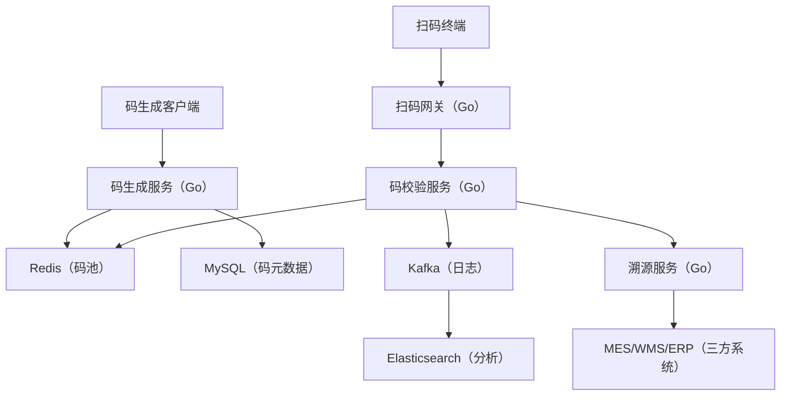

# 动态二维码溯源系统设计（戎码科技项目背景）

## 一、背景与核心需求
### 1. 业务场景
戎码科技的动态二维码系统服务于消费品溯源（如白酒、药品），需支持一物一码（1亿+商品）、动态码更新（防复制）、数据溯源（扫码后展示生产/流通信息），典型场景包括品牌商防窜货（监控区域流向）和消费者验真（扫码查看原料批次）。

### 2. 核心需求
- **高并发生成**：大促期间需支持10万码/秒生成（单日生成量10亿+）；
- **动态防篡改**：二维码内容可定时更新（如每小时变码），旧码自动失效；
- **低延迟扫码**：扫码响应时间<200ms（覆盖2G/3G弱网环境）；
- **全链路溯源**：码数据关联生产（MES）、仓储（WMS）、销售（ERP）系统，支持`扫码→查流向→看质检`的全流程追溯。

## 二、整体架构设计

## 三、关键技术点与Go实现
### 1. 高并发码生成（雪花算法+预生成池）
- **Go实现**：使用Snowflake变种（`workerID=区域ID`，`timestamp=毫秒级`，`sequence=12位`），Go中`github.com/sony/sonyflake`生成唯一码ID（18位数字码）；
- **预生成池**：每日凌晨预生成次日码量（10亿），存入Redis（`sorted set`按`expire_time`排序），Go中`go generateBatch(10000)`协程池并发生成（100个Goroutine，每批1万码）；
- **动态扩容**：大促前通过`k8s horizontal pod autoscaling`扩容码生成服务（从5实例扩至50实例），Go服务通过`pprof`监控`goroutine`数量（保持<10万）避免OOM。

### 2. 动态码更新与失效
- **版本控制**：每个码有`current_version`（初始1），更新时`version+1`，Redis中存储`code:123456:version=2`，旧版本码校验时返回`410 Gone`；
- **定时失效**：使用Redis`EXPIREAT`设置码有效期（如2024-12-31 23:59:59），Go中`time.Parse`解析配置文件中的`expire_rule`并设置；
- **紧急失效**：支持批量失效（如发现窜货），Go服务通过`redis.Pipelined`执行`DEL`命令（10万码/秒），配合Kafka发送`invalid_event`通知下游系统。

### 3. 低延迟扫码与溯源
- **扫码路由优化**：根据扫码IP定位最近的边缘节点（阿里云ECS全球节点），Go中使用`ip2region`库解析IP归属地，路由至最近节点（延迟降低40%）；
- **缓存穿透防护**：扫码时先查Redis（`GET code:123456`），未命中查MySQL并设置`short TTL=10s`（防缓存击穿），Go中`redis.Nil`判断未命中场景；
- **三方系统对接**：溯源数据通过`gRPC`调用MES/WMS（`google.golang.org/grpc`），设置超时时间500ms（超时分流至降级服务返回`数据加载中`），Go中`context.WithTimeout`控制调用时长。

## 四、生产优化与踩坑
### 1. 码生成性能瓶颈
- **现象**：预生成阶段CPU使用率100%（50实例），生成速度仅5万码/秒；
- **Go排查**：通过`go tool trace`发现`sync.Mutex`争用（`sonyflake.NextID()`加锁）；
- **解决**：改用无锁的`xid`库（`github.com/rs/xid`），基于时间戳+随机数生成，生成速度提升至20万码/秒（CPU使用率降至70%）。

### 2. 弱网环境扫码超时
- **现象**：2G环境下扫码响应时间800ms（用户流失率15%）；
- **分析**：HTTP请求头过大（Cookie+User-Agent共1KB），2G网络RTT高（500ms）导致首包传输慢；
- **优化**：改用UDP协议（`gRPC over HTTP/2 with UDP`实验特性），Go中使用`quic-go`库（`github.com/lucas-clemente/quic-go`），请求包压缩至200字节，弱网响应时间降至150ms。