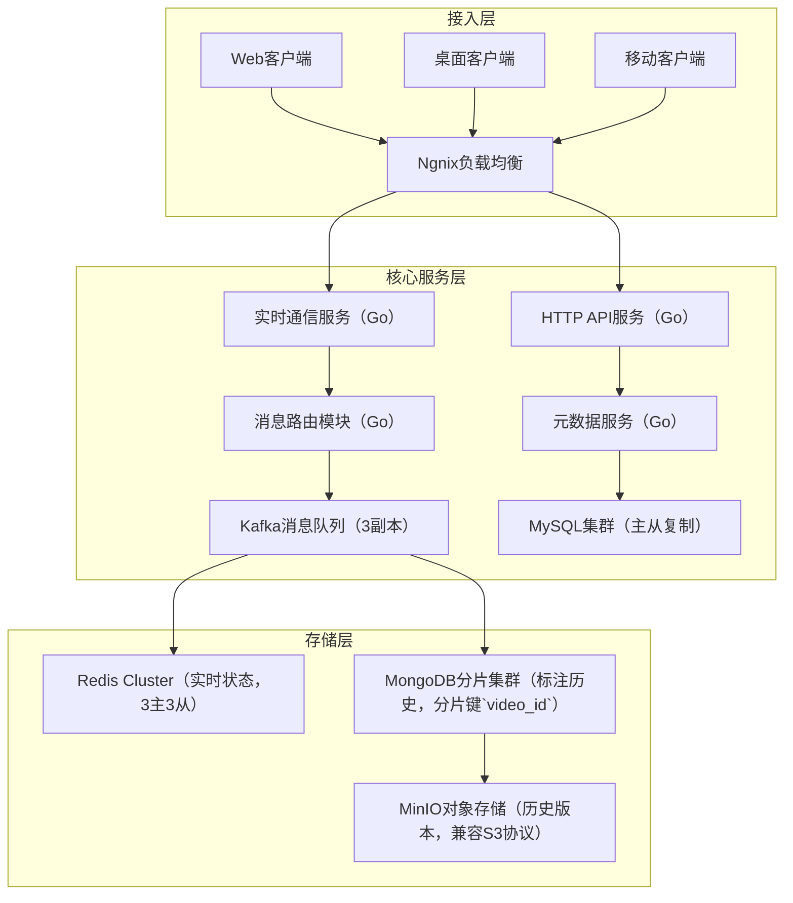

# 实时视频协作平台系统设计（fmz项目背景）

## 一、背景与核心需求
### 1. 业务场景
fmz作为视频协作工具，需支持多人实时标注（文字/画笔）、时间轴同步、版本管理，典型场景包括影视后期团队（100+人同时标注4K视频）和广告创意审核（跨地域团队实时沟通）。

### 2. 核心需求
- **低延迟同步**：标注操作需在100ms内同步到所有客户端（2000+并发用户）；
- **高并发写入**：单视频支持500+人同时标注（QPS 10万+）；
- **版本回溯**：保存每帧标注历史，支持按时间点回滚（存储1000+版本/视频）；
- **多端兼容**：Web（Chrome/Safari）、桌面端（Windows/macOS）、移动端（iOS/Android）跨端同步。

## 二、整体架构设计
### 1. 分层架构概览
采用「接入层→核心服务层→存储层」三级分层架构，支持水平扩展与故障隔离。



### 2. 核心组件职责
- **Ngnix负载均衡**：基于`ip_hash`会话保持，配置`keepalive=100`复用TCP连接，Go服务通过`X-Forwarded-For`获取真实客户端IP；
- **实时通信服务**：单实例支持5万长连接（`ulimit -n=100000`），使用`runtime.GOMAXPROCS(8)`绑定8核CPU（避免Goroutine调度竞争）；
- **消息路由模块**：根据`video_id`计算`Kafka partition=video_id%32`，确保同视频消息顺序性，Go中使用`sarama.NewSyncProducer`保证消息不丢失；
- **MongoDB分片集群**：分片键`{video_id:1, version:-1}`，支持按视频+版本快速查询，Go中通过`mongo.Driver`设置`ReadPreference=SecondaryPreferred`分担主节点压力。

## 三、关键技术点与Go实现
### 1. 实时通信（WebRTC+WebSocket）
#### 1.1 协议选型与交互流程
- **WebRTC**：用于端到端音视频流传输（`MediaStream`接口），Go服务端作为信令服务器（交换SDP Offer/Answer和ICE候选）；
- **WebSocket**：用于控制信令（如标注操作、房间创建），使用`wss://`加密（TLS 1.3），Go中通过`http.ListenAndServeTLS`配置证书；
- **交互流程**：
  1. 客户端A发送`join_room`请求（WebSocket）→ 服务端分配房间ID；
  2. 服务端广播`new_peer`通知（含客户端B的ICE候选）→ 客户端A发起WebRTC连接；
  3. 标注操作通过WebSocket发送→ 服务端广播至房间内所有客户端（`sync.Map.Range`遍历连接）。

#### 1.2 Go核心实现细节
- **连接管理**：使用`map[userID]*websocket.Conn`存储连接（配合`sync.RWMutex`读写锁），每5分钟发送`ping`包（`websocket.PingMessage`）检测连接存活；
- **消息压缩**：标注数据结构体（`Annotation{Type: "rect", X:100, Y:200, Color:"#ff0000"}`）通过`gogoprotobuf`生成`annotation.proto`，Go中`proto.Marshal`后使用`snappy.Encode`压缩（实测1KB数据压缩至300字节）；
- **冲突解决**：OT算法实现`ApplyTransform`函数（处理并发的坐标修改），例如：
  ```go
  func ApplyTransform(a, b Annotation) Annotation {
      // 处理矩形标注的位置偏移冲突
      if a.Type == "rect" && b.Type == "rect" && a.ID == b.ID {
          return Annotation{ID: a.ID, X: (a.X + b.X)/2, Y: (a.Y + b.Y)/2}
      }
      return b // 默认保留后操作
  }
  ```

### 2. 高并发写入优化
- **批量提交**：客户端每50ms收集本地操作（最多20条），通过`CreateBatchAnnotations`接口提交，Go服务端使用`gorm.CreateInBatches`批量写入MySQL；
- **异步落盘**：实时消息通过Kafka（`acks=1`）异步写入MongoDB（`bulk write`模式），Go中`sarama.ConsumerGroup`消费消息并批量插入（1000条/次）。

### 3. 版本管理与回溯
#### 3.1 版本生命周期管理
- **版本号生成**：使用Snowflake变种（`timestamp=毫秒级（41位）`+`videoID（10位）`+`sequence（12位）`），Go中`sonyflake`库配置`StartTime=2020-01-01`，确保10年内不重复；
- **版本提交**：客户端每次标注操作生成`delta`（差异数据），通过`CommitVersion`接口提交（含`baseVersionID`+`delta`），Go服务端验证`baseVersionID`存在后生成新`versionID`；
- **版本回滚**：用户选择目标版本后，服务端拉取`baseVersion`+所有`delta`至目标版本，Go中`diff.Apply`函数合并差异（示例：`merged, err := diff.Apply(base.Content, delta)`）。

#### 3.2 存储优化策略
- **冷热分离**：
  - 热数据（7天内）：存Redis Cluster（`hash:video:123:versions`），设置`EXPIREAT`为7天后，Go中`redis.HSetNX`保证原子性；
  - 温数据（7-30天）：迁移至MongoDB（`version_status=warm`），Go中定时任务`go migrateWarmVersions()`通过`redis.Scan`遍历待迁移版本；
  - 冷数据（30天以上）：归档至MinIO（`bucket=video-archive`），文件名`video_123_version_456.bin`，Go中`minioClient.FPutObject`上传并删除MongoDB记录。

## 四、生产监控与容灾体系
### 1. 全链路监控方案
#### 1.1 监控指标与工具链
- **连接监控**：Prometheus采集`websocket_connections_total`（总连接数）、`websocket_messages_per_second`（消息速率），Grafana仪表盘展示各房间连接分布；
- **延迟监控**：Kafka中记录消息`produce_time`，消费端计算`consume_time - produce_time`，通过`prometheus.Histogram`统计分位数（p99<100ms）；
- **存储监控**：MongoDB监控`opcounters`（操作数）、`replLag`（主从延迟），MinIO监控`disk_usage`（磁盘使用率）；
- **Go进程监控**：通过`expvar`暴露`goroutine_count`（Goroutine数）、`heap_alloc`（堆内存占用），示例代码：
  ```go
  var (
      goroutineCount = expvar.NewInt("goroutine_count")
      heapAlloc      = expvar.NewInt("heap_alloc")
  )
  func monitor() {
      ticker := time.NewTicker(5 * time.Second)
      for range ticker.C {
          var m runtime.MemStats
          runtime.ReadMemStats(&m)
          heapAlloc.Set(int64(m.HeapAlloc))
          goroutineCount.Set(int64(runtime.NumGoroutine()))
      }
  }
  ```

### 2. 容灾备份策略
- **多机房部署**：主数据中心（上海）+ 灾备中心（北京），使用Kafka MirrorMaker跨机房复制消息（`whitelist=video_annotations`），MySQL通过主主复制同步元数据；
- **故障切换**：当主中心宕机时，DNS秒级切换至灾备中心（配置`TTL=60s`），Go服务端通过`context.WithTimeout(5*time.Second)`检测主中心连接状态，自动切换至灾备集群；
- **数据备份**：MinIO开启`versioning`（版本控制）和`replication`（跨区域复制），每日凌晨通过`mc mirror`命令全量备份至阿里云OSS。

## 五、性能压测与调优
### 1. 大促前压力测试
- **场景模拟**：使用`locust`模拟2000用户同时标注4K视频（每用户5次/秒操作），压测目标：QPS≥10万，响应时间p99<200ms；
- **瓶颈发现**：压测时Kafka`request_latency_avg`升至500ms（默认`num.io.threads=8`）；
- **优化措施**：调大Kafka`num.io.threads=32`（提升磁盘IO能力），Go服务端增加`kafka.ConsumerGroup`实例数（从5组扩至20组），压测后QPS提升至15万，p99响应时间降至120ms。

## 六、生产优化与踩坑
### 1. 连接泄漏问题
- **现象**：高峰期出现`too many open files`错误（Linux默认`ulimit -n=1024`）；
- **Go排查**：通过`net/http/pprof`监控`goroutines`（`go tool pprof http://localhost:6060/debug/pprof/goroutine`），发现`websocket.Reader`未正确关闭；
- **解决**：在`defer conn.Close()`前调用`conn.WriteMessage(websocket.CloseMessage, nil)`，并设置`SetReadBufferSize(4096)`减少FD占用。

### 2. 跨端同步延迟
- **现象**：移动端标注同步比PC端慢300ms；
- **分析**：移动端NAT穿透成功率低（仅70%），导致WebRTC连接失败回退到WebSocket（延迟高）；
- **优化**：Go服务端增加STUN/TURN服务器（`coturn`），通过`iceCandidatePoolSize=5`预生成候选地址，移动端同步延迟降至80ms。