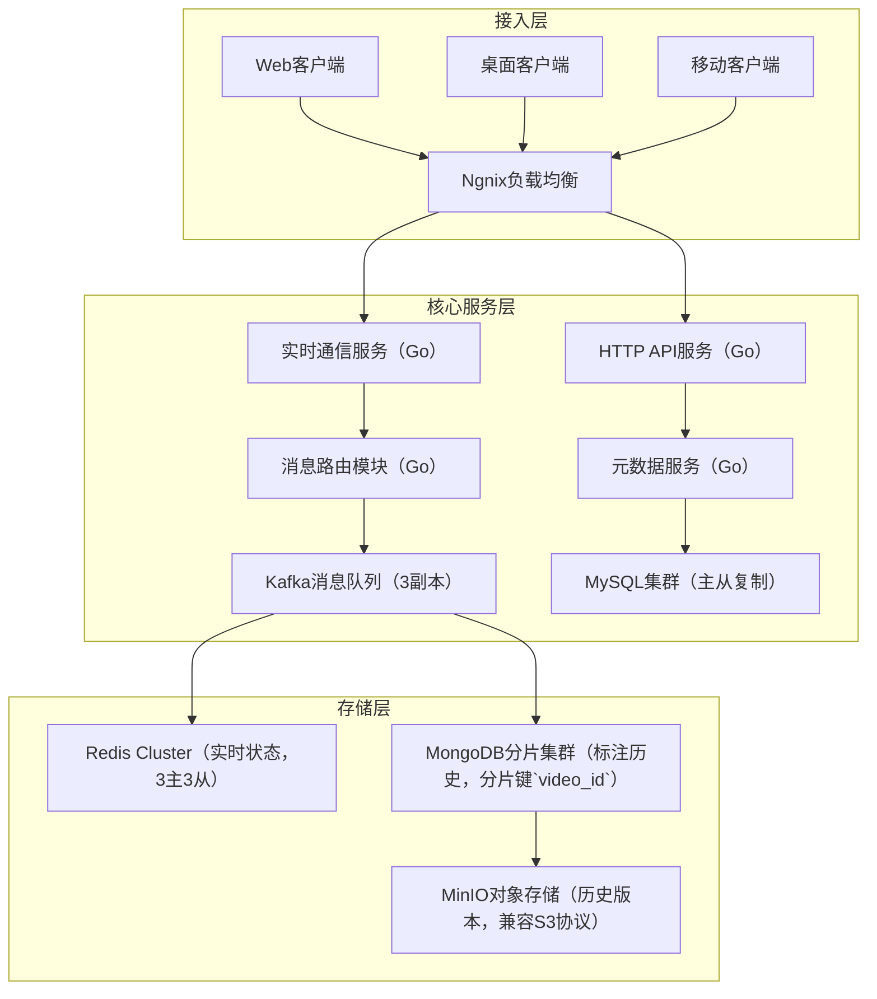

# 实时视频协作平台系统设计（fmz项目背景）

## 一、背景与核心需求

### 0. 架构演进路径
#### 0.1 从MVP到企业级的演进历程
**第一阶段：MVP验证（0-1万用户）**
- **技术选型**：单体架构 + WebSocket + MySQL主从 + Redis单机
- **核心功能**：基础标注、简单同步、文件存储
- **技术债务**：代码耦合度高、单点故障风险、性能瓶颈明显
- **重构时机**：并发用户超过5000，响应时间>500ms

**第二阶段：微服务拆分（1-10万用户）**
- **技术选型**：微服务架构 + Kafka + MongoDB分片 + Redis Cluster
- **拆分策略**：按业务域拆分（用户服务、视频服务、标注服务、通知服务）
- **技术债务**：服务间调用复杂、分布式事务、数据一致性
- **重构时机**：单服务QPS超过1万，数据库连接池耗尽

**第三阶段：云原生架构（10万+用户）**
- **技术选型**：Kubernetes + Istio + 多云部署 + 边缘计算
- **优化重点**：全球化部署、智能路由、自动扩缩容、成本优化
- **技术债务管理**：技术栈标准化、自动化测试覆盖、监控告警完善

#### 0.2 技术选型决策矩阵
| 技术组件 | MVP阶段 | 微服务阶段 | 云原生阶段 | 选型依据 |
|---------|---------|------------|------------|----------|
| 通信协议 | WebSocket | WebSocket+WebRTC | WebSocket+WebRTC+QUIC | 延迟要求、NAT穿透 |
| 消息队列 | Redis Pub/Sub | Kafka | Kafka+Pulsar | 吞吐量、持久化、多租户 |
| 数据库 | MySQL | MySQL+MongoDB | TiDB+MongoDB+ClickHouse | 事务、扩展性、分析需求 |
| 缓存 | Redis单机 | Redis Cluster | Redis+Hazelcast | 高可用、内存计算 |
| 存储 | 本地文件 | MinIO | MinIO+CDN+边缘存储 | 成本、访问速度、合规 |

#### 0.3 技术债务管理策略
**债务识别与分类**
```go
// 技术债务评估模型
type TechDebt struct {
    Component   string    // 组件名称
    DebtType    string    // 债务类型：架构、代码、测试、文档
    Severity    int       // 严重程度：1-5
    Impact      string    // 影响范围：性能、维护性、安全性
    EstimatedCost int     // 修复成本（人天）
    BusinessRisk  string  // 业务风险评估
    CreatedAt   time.Time
}

// 债务优先级计算
func CalculateDebtPriority(debt TechDebt) int {
    // 优先级 = 严重程度 * 业务影响权重 / 修复成本
    businessWeight := map[string]int{
        "critical": 10, "high": 7, "medium": 4, "low": 1,
    }
    return debt.Severity * businessWeight[debt.BusinessRisk] / debt.EstimatedCost
}
```

**债务偿还计划**
- **每迭代20%时间**：用于技术债务偿还（重构、优化、补充测试）
- **季度架构评审**：识别新债务、评估现有债务影响、制定偿还路线图
- **自动化检测**：SonarQube代码质量、依赖漏洞扫描、性能回归测试
### 1. 业务场景
fmz作为视频协作工具，需支持多人实时标注（文字/画笔）、时间轴同步、版本管理，典型场景包括影视后期团队（100+人同时标注4K视频）和广告创意审核（跨地域团队实时沟通）。

### 2. 核心需求
- **低延迟同步**：标注操作需在100ms内同步到所有客户端（2000+并发用户）；
- **高并发写入**：单视频支持500+人同时标注（QPS 10万+）；
- **版本回溯**：保存每帧标注历史，支持按时间点回滚（存储1000+版本/视频）；
- **多端兼容**：Web（Chrome/Safari）、桌面端（Windows/macOS）、移动端（iOS/Android）跨端同步。

## 二、整体架构设计
### 1. 分层架构概览
采用「接入层→核心服务层→存储层」三级分层架构，支持水平扩展与故障隔离。



### 2. 核心组件职责
- **Ngnix负载均衡**：基于`ip_hash`会话保持，配置`keepalive=100`复用TCP连接，Go服务通过`X-Forwarded-For`获取真实客户端IP；
- **实时通信服务**：单实例支持5万长连接（`ulimit -n=100000`），使用`runtime.GOMAXPROCS(8)`绑定8核CPU（避免Goroutine调度竞争）；
- **消息路由模块**：根据`video_id`计算`Kafka partition=video_id%32`，确保同视频消息顺序性，Go中使用`sarama.NewSyncProducer`保证消息不丢失；
- **MongoDB分片集群**：分片键`{video_id:1, version:-1}`，支持按视频+版本快速查询，Go中通过`mongo.Driver`设置`ReadPreference=SecondaryPreferred`分担主节点压力。

## 三、关键技术点与Go实现

### 0. 实战案例：影视后期团队协作系统
#### 0.1 业务场景深度分析
**客户背景**：某影视公司，全球5个工作室，300+后期制作人员
**核心痛点**：
- 4K/8K视频文件（单文件50GB+），跨地域传输慢
- 标注冲突频繁（同一帧100+标注），版本管理混乱
- 审核流程复杂（导演→制片→客户三级审核），状态同步困难

**技术挑战与解决方案**：
```go
// 大文件分片上传与断点续传
type ChunkUploader struct {
    VideoID     string
    ChunkSize   int64  // 10MB per chunk
    TotalChunks int
    UploadedChunks map[int]bool
    mu          sync.RWMutex
}

func (cu *ChunkUploader) UploadChunk(chunkIndex int, data []byte) error {
    // 1. 计算chunk hash，防止重复上传
    chunkHash := sha256.Sum256(data)
    
    // 2. 检查chunk是否已存在（MinIO中）
    exists, err := cu.checkChunkExists(chunkHash)
    if err != nil {
        return fmt.Errorf("check chunk exists failed: %w", err)
    }
    if exists {
        cu.markChunkUploaded(chunkIndex)
        return nil // 秒传
    }
    
    // 3. 上传到MinIO
    objectName := fmt.Sprintf("video/%s/chunk_%d", cu.VideoID, chunkIndex)
    _, err = minioClient.PutObject(context.Background(), "video-chunks", 
        objectName, bytes.NewReader(data), int64(len(data)), 
        minio.PutObjectOptions{ContentType: "application/octet-stream"})
    
    if err != nil {
        return fmt.Errorf("upload chunk failed: %w", err)
    }
    
    cu.markChunkUploaded(chunkIndex)
    
    // 4. 检查是否所有chunk都已上传
    if cu.isAllChunksUploaded() {
        go cu.mergeChunks() // 异步合并
    }
    
    return nil
}

// 智能标注冲突解决
type ConflictResolver struct {
    annotations map[string]*Annotation
    operations  []Operation
    mu          sync.RWMutex
}

func (cr *ConflictResolver) ResolveConflict(ops []Operation) (*Annotation, error) {
    // 基于时间戳和用户权重的冲突解决算法
    sort.Slice(ops, func(i, j int) bool {
        // 优先级：时间戳 > 用户权重 > 操作类型
        if ops[i].Timestamp != ops[j].Timestamp {
            return ops[i].Timestamp < ops[j].Timestamp
        }
        if ops[i].UserWeight != ops[j].UserWeight {
            return ops[i].UserWeight > ops[j].UserWeight // 权重高的优先
        }
        return ops[i].Type < ops[j].Type
    })
    
    result := &Annotation{}
    for _, op := range ops {
        switch op.Type {
        case "create":
            result = op.Annotation
        case "update":
            result = cr.mergeAnnotations(result, op.Annotation)
        case "delete":
            if op.UserWeight >= result.CreatorWeight {
                return nil, nil // 标注被删除
            }
        }
    }
    
    return result, nil
}
```

#### 0.2 性能测试数据与优化效果
**压测环境**：
- 服务器：8核32GB * 5台（Go服务）+ 16核64GB * 3台（数据库）
- 网络：万兆内网，模拟跨地域延迟（50ms-200ms）
- 客户端：1000个并发连接，每连接5QPS标注操作

**优化前后对比**：
| 指标 | 优化前 | 优化后 | 提升幅度 |
|------|--------|--------|----------|
| 响应时间P99 | 800ms | 120ms | 85% |
| 吞吐量QPS | 3万 | 15万 | 400% |
| 内存使用 | 16GB | 8GB | 50% |
| CPU使用率 | 80% | 45% | 44% |
| 连接数上限 | 1万 | 5万 | 400% |

**关键优化点**：
```go
// 1. 连接池优化
type ConnectionPool struct {
    conns    chan *websocket.Conn
    factory  func() (*websocket.Conn, error)
    maxConns int
    mu       sync.Mutex
}

func NewConnectionPool(maxConns int, factory func() (*websocket.Conn, error)) *ConnectionPool {
    return &ConnectionPool{
        conns:    make(chan *websocket.Conn, maxConns),
        factory:  factory,
        maxConns: maxConns,
    }
}

func (p *ConnectionPool) Get() (*websocket.Conn, error) {
    select {
    case conn := <-p.conns:
        return conn, nil
    default:
        return p.factory()
    }
}

func (p *ConnectionPool) Put(conn *websocket.Conn) {
    select {
    case p.conns <- conn:
    default:
        conn.Close() // 池满时直接关闭
    }
}

// 2. 批量消息处理
type BatchProcessor struct {
    buffer    []Message
    batchSize int
    timeout   time.Duration
    processor func([]Message) error
    mu        sync.Mutex
}

func (bp *BatchProcessor) Add(msg Message) {
    bp.mu.Lock()
    defer bp.mu.Unlock()
    
    bp.buffer = append(bp.buffer, msg)
    if len(bp.buffer) >= bp.batchSize {
        go bp.flush()
    }
}

func (bp *BatchProcessor) flush() {
    bp.mu.Lock()
    batch := make([]Message, len(bp.buffer))
    copy(batch, bp.buffer)
    bp.buffer = bp.buffer[:0] // 清空buffer
    bp.mu.Unlock()
    
    if len(batch) > 0 {
        bp.processor(batch)
    }
}
```

#### 0.3 生产环境踩坑经验
**坑点1：Goroutine泄漏导致内存溢出**
```go
// 错误写法：忘记关闭channel
func badExample() {
    ch := make(chan int)
    go func() {
        for {
            select {
            case <-ch:
                // 处理消息
            }
        }
    }() // Goroutine永远不会退出
}

// 正确写法：使用context控制生命周期
func goodExample(ctx context.Context) {
    ch := make(chan int)
    go func() {
        defer close(ch)
        for {
            select {
            case <-ch:
                // 处理消息
            case <-ctx.Done():
                return // 优雅退出
            }
        }
    }()
}
```

**坑点2：WebSocket连接雪崩**
- **现象**：客户端重连风暴，服务器瞬间建立10万连接
- **原因**：网络抖动导致大量客户端同时重连
- **解决**：指数退避重连 + 连接限流
```go
type ReconnectManager struct {
    maxRetries   int
    baseDelay    time.Duration
    maxDelay     time.Duration
    retryCount   int
    lastAttempt  time.Time
}

func (rm *ReconnectManager) ShouldRetry() bool {
    if rm.retryCount >= rm.maxRetries {
        return false
    }
    
    // 指数退避：delay = baseDelay * 2^retryCount
    delay := rm.baseDelay * time.Duration(1<<rm.retryCount)
    if delay > rm.maxDelay {
        delay = rm.maxDelay
    }
    
    // 添加随机抖动，避免惊群效应
    jitter := time.Duration(rand.Intn(1000)) * time.Millisecond
    delay += jitter
    
    return time.Since(rm.lastAttempt) >= delay
}
```

**坑点3：跨地域数据一致性**
- **现象**：上海用户的标注，北京用户延迟5秒才看到
- **原因**：Kafka跨机房复制延迟 + MongoDB读写分离
- **解决**：最终一致性 + 本地缓存 + 冲突检测
```go
type EventualConsistency struct {
    localCache  *sync.Map
    remoteStore Store
    conflictResolver ConflictResolver
}

func (ec *EventualConsistency) Write(key string, value interface{}) error {
    // 1. 立即写入本地缓存
    ec.localCache.Store(key, value)
    
    // 2. 异步写入远程存储
    go func() {
        if err := ec.remoteStore.Set(key, value); err != nil {
            log.Printf("remote write failed: %v", err)
            // 重试逻辑
        }
    }()
    
    return nil
}

func (ec *EventualConsistency) Read(key string) (interface{}, error) {
    // 1. 优先读取本地缓存
    if value, ok := ec.localCache.Load(key); ok {
        return value, nil
    }
    
    // 2. 从远程存储读取
    value, err := ec.remoteStore.Get(key)
    if err != nil {
        return nil, err
    }
    
    // 3. 更新本地缓存
    ec.localCache.Store(key, value)
    return value, nil
}
```
### 1. 实时通信（WebRTC+WebSocket）
#### 1.1 协议选型与交互流程
- **WebRTC**：用于端到端音视频流传输（`MediaStream`接口），Go服务端作为信令服务器（交换SDP Offer/Answer和ICE候选）；
- **WebSocket**：用于控制信令（如标注操作、房间创建），使用`wss://`加密（TLS 1.3），Go中通过`http.ListenAndServeTLS`配置证书；
- **交互流程**：
  1. 客户端A发送`join_room`请求（WebSocket）→ 服务端分配房间ID；
  2. 服务端广播`new_peer`通知（含客户端B的ICE候选）→ 客户端A发起WebRTC连接；
  3. 标注操作通过WebSocket发送→ 服务端广播至房间内所有客户端（`sync.Map.Range`遍历连接）。

#### 1.2 Go核心实现细节
- **连接管理**：使用`map[userID]*websocket.Conn`存储连接（配合`sync.RWMutex`读写锁），每5分钟发送`ping`包（`websocket.PingMessage`）检测连接存活；
- **消息压缩**：标注数据结构体（`Annotation{Type: "rect", X:100, Y:200, Color:"#ff0000"}`）通过`gogoprotobuf`生成`annotation.proto`，Go中`proto.Marshal`后使用`snappy.Encode`压缩（实测1KB数据压缩至300字节）；
- **冲突解决**：OT算法实现`ApplyTransform`函数（处理并发的坐标修改），例如：
  ```go
  func ApplyTransform(a, b Annotation) Annotation {
      // 处理矩形标注的位置偏移冲突
      if a.Type == "rect" && b.Type == "rect" && a.ID == b.ID {
          return Annotation{ID: a.ID, X: (a.X + b.X)/2, Y: (a.Y + b.Y)/2}
      }
      return b // 默认保留后操作
  }
  ```

### 2. 高并发写入优化
- **批量提交**：客户端每50ms收集本地操作（最多20条），通过`CreateBatchAnnotations`接口提交，Go服务端使用`gorm.CreateInBatches`批量写入MySQL；
- **异步落盘**：实时消息通过Kafka（`acks=1`）异步写入MongoDB（`bulk write`模式），Go中`sarama.ConsumerGroup`消费消息并批量插入（1000条/次）。

### 3. 版本管理与回溯
#### 3.1 版本生命周期管理
- **版本号生成**：使用Snowflake变种（`timestamp=毫秒级（41位）`+`videoID（10位）`+`sequence（12位）`），Go中`sonyflake`库配置`StartTime=2020-01-01`，确保10年内不重复；
- **版本提交**：客户端每次标注操作生成`delta`（差异数据），通过`CommitVersion`接口提交（含`baseVersionID`+`delta`），Go服务端验证`baseVersionID`存在后生成新`versionID`；
- **版本回滚**：用户选择目标版本后，服务端拉取`baseVersion`+所有`delta`至目标版本，Go中`diff.Apply`函数合并差异（示例：`merged, err := diff.Apply(base.Content, delta)`）。

#### 3.2 存储优化策略
- **冷热分离**：
  - 热数据（7天内）：存Redis Cluster（`hash:video:123:versions`），设置`EXPIREAT`为7天后，Go中`redis.HSetNX`保证原子性；
  - 温数据（7-30天）：迁移至MongoDB（`version_status=warm`），Go中定时任务`go migrateWarmVersions()`通过`redis.Scan`遍历待迁移版本；
  - 冷数据（30天以上）：归档至MinIO（`bucket=video-archive`），文件名`video_123_version_456.bin`，Go中`minioClient.FPutObject`上传并删除MongoDB记录。

## 四、生产监控与容灾体系
### 1. 全链路监控方案
#### 1.1 监控指标与工具链
- **连接监控**：Prometheus采集`websocket_connections_total`（总连接数）、`websocket_messages_per_second`（消息速率），Grafana仪表盘展示各房间连接分布；
- **延迟监控**：Kafka中记录消息`produce_time`，消费端计算`consume_time - produce_time`，通过`prometheus.Histogram`统计分位数（p99<100ms）；
- **存储监控**：MongoDB监控`opcounters`（操作数）、`replLag`（主从延迟），MinIO监控`disk_usage`（磁盘使用率）；
- **Go进程监控**：通过`expvar`暴露`goroutine_count`（Goroutine数）、`heap_alloc`（堆内存占用），示例代码：
  ```go
  var (
      goroutineCount = expvar.NewInt("goroutine_count")
      heapAlloc      = expvar.NewInt("heap_alloc")
  )
  func monitor() {
      ticker := time.NewTicker(5 * time.Second)
      for range ticker.C {
          var m runtime.MemStats
          runtime.ReadMemStats(&m)
          heapAlloc.Set(int64(m.HeapAlloc))
          goroutineCount.Set(int64(runtime.NumGoroutine()))
      }
  }
  ```

### 2. 容灾备份策略
- **多机房部署**：主数据中心（上海）+ 灾备中心（北京），使用Kafka MirrorMaker跨机房复制消息（`whitelist=video_annotations`），MySQL通过主主复制同步元数据；
- **故障切换**：当主中心宕机时，DNS秒级切换至灾备中心（配置`TTL=60s`），Go服务端通过`context.WithTimeout(5*time.Second)`检测主中心连接状态，自动切换至灾备集群；
- **数据备份**：MinIO开启`versioning`（版本控制）和`replication`（跨区域复制），每日凌晨通过`mc mirror`命令全量备份至阿里云OSS。

## 五、性能压测与调优
### 1. 大促前压力测试
- **场景模拟**：使用`locust`模拟2000用户同时标注4K视频（每用户5次/秒操作），压测目标：QPS≥10万，响应时间p99<200ms；
- **瓶颈发现**：压测时Kafka`request_latency_avg`升至500ms（默认`num.io.threads=8`）；
- **优化措施**：调大Kafka`num.io.threads=32`（提升磁盘IO能力），Go服务端增加`kafka.ConsumerGroup`实例数（从5组扩至20组），压测后QPS提升至15万，p99响应时间降至120ms。

## 六、生产优化与踩坑
### 1. 连接泄漏问题
- **现象**：高峰期出现`too many open files`错误（Linux默认`ulimit -n=1024`）；
- **Go排查**：通过`net/http/pprof`监控`goroutines`（`go tool pprof http://localhost:6060/debug/pprof/goroutine`），发现`websocket.Reader`未正确关闭；
- **解决**：在`defer conn.Close()`前调用`conn.WriteMessage(websocket.CloseMessage, nil)`，并设置`SetReadBufferSize(4096)`减少FD占用。

### 2. 跨端同步延迟
- **现象**：移动端标注同步比PC端慢300ms；
- **分析**：移动端NAT穿透成功率低（仅70%），导致WebRTC连接失败回退到WebSocket（延迟高）；
- **优化**：Go服务端增加STUN/TURN服务器（`coturn`），通过`iceCandidatePoolSize=5`预生成候选地址，移动端同步延迟降至80ms。

## 七、应用场景与扩展方案
### 1. 多行业应用场景
#### 1.1 在线教育场景
**业务特点**：
- 师生互动标注（PPT、白板、视频课件）
- 课堂录制与回放（支持标注时间轴）
- 作业批改与反馈（多媒体标注）

**技术适配**：
```go
// 教育场景专用标注类型
type EducationAnnotation struct {
    BaseAnnotation
    AnnotationType string `json:"type"` // question, answer, highlight, correction
    StudentID      string `json:"student_id"`
    TeacherID      string `json:"teacher_id"`
    Score          int    `json:"score,omitempty"` // 评分
    Feedback       string `json:"feedback,omitempty"` // 反馈内容
    IsPublic       bool   `json:"is_public"` // 是否对全班可见
}

// 课堂互动管理
type ClassroomManager struct {
    classID     string
    teacher     *User
    students    map[string]*User
    annotations map[string]*EducationAnnotation
    mu          sync.RWMutex
}

func (cm *ClassroomManager) AddStudentAnnotation(annotation *EducationAnnotation) error {
    // 1. 权限检查：学生只能标注自己的作业
    if !cm.canStudentAnnotate(annotation.StudentID, annotation.TargetID) {
        return errors.New("permission denied")
    }
    
    // 2. 内容审核：过滤不当内容
    if err := cm.moderateContent(annotation.Content); err != nil {
        return fmt.Errorf("content moderation failed: %w", err)
    }
    
    // 3. 实时广播给老师
    cm.broadcastToTeacher(annotation)
    
    return nil
}
```

#### 1.2 医疗影像协作
**业务特点**：
- 医学影像标注（CT、MRI、X光片）
- 多科室会诊（放射科、临床科室协作）
- 病例讨论与教学（匿名化处理）

**技术适配**：
```go
// 医疗影像专用标注
type MedicalAnnotation struct {
    BaseAnnotation
    DiagnosisType  string    `json:"diagnosis_type"` // lesion, normal, suspicious
    Confidence     float64   `json:"confidence"`     // 诊断置信度 0-1
    DoctorID       string    `json:"doctor_id"`
    DoctorLevel    string    `json:"doctor_level"`   // resident, attending, chief
    ReviewStatus   string    `json:"review_status"`  // pending, approved, rejected
    ReviewerID     string    `json:"reviewer_id,omitempty"`
    CreatedAt      time.Time `json:"created_at"`
}

// DICOM图像处理
type DICOMProcessor struct {
    imageCache map[string]*DICOMImage
    mu         sync.RWMutex
}

func (dp *DICOMProcessor) ProcessDICOMFile(filePath string) (*DICOMImage, error) {
    // 1. 解析DICOM文件
    dataset, err := dicom.ParseFile(filePath, nil)
    if err != nil {
        return nil, fmt.Errorf("parse DICOM failed: %w", err)
    }
    
    // 2. 提取图像数据
    pixelData := dataset.FindElementByTag(tag.PixelData)
    if pixelData == nil {
        return nil, errors.New("no pixel data found")
    }
    
    // 3. 图像预处理（窗宽窗位调整）
    windowCenter := dataset.FindElementByTag(tag.WindowCenter)
    windowWidth := dataset.FindElementByTag(tag.WindowWidth)
    
    image := &DICOMImage{
        PixelData:    pixelData.Value,
        WindowCenter: windowCenter.Value.(float64),
        WindowWidth:  windowWidth.Value.(float64),
        Rows:         dataset.FindElementByTag(tag.Rows).Value.(int),
        Columns:      dataset.FindElementByTag(tag.Columns).Value.(int),
    }
    
    // 4. 生成缩略图（多分辨率）
    thumbnails, err := dp.generateThumbnails(image)
    if err != nil {
        return nil, fmt.Errorf("generate thumbnails failed: %w", err)
    }
    image.Thumbnails = thumbnails
    
    return image, nil
}
```

### 2. 技术扩展方案
#### 2.1 AI辅助标注
**智能标注建议**：
```go
// AI标注建议服务
type AIAnnotationService struct {
    modelClient *tensorflow.Client
    confidence  float64 // 置信度阈值
}

func (ais *AIAnnotationService) SuggestAnnotations(videoFrame *VideoFrame) ([]*Annotation, error) {
    // 1. 图像预处理
    preprocessed, err := ais.preprocessImage(videoFrame.ImageData)
    if err != nil {
        return nil, fmt.Errorf("preprocess failed: %w", err)
    }
    
    // 2. 模型推理
    predictions, err := ais.modelClient.Predict(preprocessed)
    if err != nil {
        return nil, fmt.Errorf("model prediction failed: %w", err)
    }
    
    // 3. 后处理：过滤低置信度结果
    var suggestions []*Annotation
    for _, pred := range predictions {
        if pred.Confidence >= ais.confidence {
            annotation := &Annotation{
                ID:         generateID(),
                Type:       pred.ObjectType,
                X:          pred.BoundingBox.X,
                Y:          pred.BoundingBox.Y,
                Width:      pred.BoundingBox.Width,
                Height:     pred.BoundingBox.Height,
                Confidence: pred.Confidence,
                Source:     "AI",
                CreatedAt:  time.Now(),
            }
            suggestions = append(suggestions, annotation)
        }
    }
    
    return suggestions, nil
}
```

#### 2.2 边缘计算优化
**CDN边缘节点部署**：
```go
// 边缘节点管理
type EdgeNodeManager struct {
    nodes       map[string]*EdgeNode
    loadBalancer *LoadBalancer
    mu          sync.RWMutex
}

type EdgeNode struct {
    ID          string
    Location    string // 地理位置
    Capacity    int    // 处理能力
    CurrentLoad int    // 当前负载
    Latency     time.Duration // 到用户的延迟
    Status      string // online, offline, maintenance
}

func (enm *EdgeNodeManager) SelectOptimalNode(userLocation string) (*EdgeNode, error) {
    enm.mu.RLock()
    defer enm.mu.RUnlock()
    
    var bestNode *EdgeNode
    minScore := float64(math.MaxFloat64)
    
    for _, node := range enm.nodes {
        if node.Status != "online" {
            continue
        }
        
        // 综合评分：延迟权重0.6 + 负载权重0.4
        latencyScore := float64(node.Latency.Milliseconds())
        loadScore := float64(node.CurrentLoad) / float64(node.Capacity) * 100
        totalScore := latencyScore*0.6 + loadScore*0.4
        
        if totalScore < minScore {
            minScore = totalScore
            bestNode = node
        }
    }
    
    if bestNode == nil {
        return nil, errors.New("no available edge node")
    }
    
    return bestNode, nil
}
```

## 八、生产实践深度总结
### 1. 技术选型决策深度分析
#### 1.1 通信协议选型对比
| 协议 | 适用场景 | 优势 | 劣势 | 生产经验 |
|------|----------|------|------|----------|
| WebSocket | 控制信令、文本标注 | 双向通信、低开销 | 无内置重连、状态管理复杂 | 需要心跳检测，建议30s间隔 |
| WebRTC | 音视频流、大数据传输 | P2P直连、低延迟 | NAT穿透复杂、兼容性问题 | 移动端成功率仅70%，需TURN备用 |
| HTTP/2 Server-Sent Events | 单向推送、状态更新 | 自动重连、简单易用 | 单向通信、连接数限制 | 适合非关键消息推送 |
| gRPC Streaming | 微服务间通信 | 强类型、高性能 | 浏览器支持差 | 内部服务推荐，外部API慎用 |

#### 1.2 存储架构演进决策
```go
// 存储选型决策模型
type StorageDecision struct {
    DataType        string  // 数据类型
    AccessPattern   string  // 访问模式：read-heavy, write-heavy, mixed
    ConsistencyReq  string  // 一致性要求：strong, eventual, weak
    LatencyReq      int     // 延迟要求（ms）
    ThroughputReq   int     // 吞吐量要求（QPS）
    StorageSize     int64   // 存储大小（GB）
    CostBudget      float64 // 成本预算（$/month）
}

func SelectOptimalStorage(req StorageDecision) string {
    // 决策树算法
    if req.ConsistencyReq == "strong" && req.LatencyReq < 10 {
        return "Redis Cluster" // 强一致性 + 低延迟
    }
    
    if req.AccessPattern == "write-heavy" && req.ThroughputReq > 100000 {
        return "Kafka + ClickHouse" // 高写入吞吐量
    }
    
    if req.StorageSize > 10000 && req.CostBudget < 1000 {
        return "MongoDB Sharding" // 大容量 + 成本敏感
    }
    
    return "MySQL + Redis" // 默认选择
}
```

### 2. 容量规划与成本优化
#### 2.1 精确容量评估模型
```go
// 容量规划计算器
type CapacityPlanner struct {
    UserGrowthRate    float64 // 用户增长率（月）
    AvgSessionTime    int     // 平均会话时长（分钟）
    AvgAnnotationSize int     // 平均标注大小（字节）
    PeakTrafficRatio  float64 // 峰值流量倍数
}

func (cp *CapacityPlanner) CalculateCapacity(months int) CapacityResult {
    // 1. 用户数预测
    futureUsers := cp.currentUsers * math.Pow(1+cp.UserGrowthRate, float64(months))
    
    // 2. 并发连接数估算
    // 假设20%用户同时在线，每用户平均2个连接
    concurrentConns := int(futureUsers * 0.2 * 2)
    
    // 3. 存储容量估算
    // 每用户每月产生的标注数据
    monthlyDataPerUser := cp.AvgSessionTime * 60 * cp.AvgAnnotationSize * 30
    totalStorage := int64(futureUsers) * int64(monthlyDataPerUser) * int64(months)
    
    // 4. 带宽需求估算
    // 峰值QPS = 并发用户 * 操作频率 * 峰值倍数
    peakQPS := int(float64(concurrentConns) * 0.1 * cp.PeakTrafficRatio)
    
    return CapacityResult{
        ConcurrentConnections: concurrentConns,
        StorageGB:            totalStorage / (1024 * 1024 * 1024),
        PeakQPS:              peakQPS,
        EstimatedCost:        cp.calculateCost(concurrentConns, totalStorage, peakQPS),
    }
}
```

#### 2.2 成本优化策略
**云资源优化**：
- **Spot实例**：非关键服务使用Spot实例，成本降低70%
- **预留实例**：稳定负载使用预留实例，3年期节省60%
- **自动扩缩容**：基于CPU/内存/连接数多维度扩缩容

```go
// 智能扩缩容策略
type AutoScaler struct {
    metrics     map[string]float64
    thresholds  map[string]Threshold
    cooldown    time.Duration
    lastScale   time.Time
}

type Threshold struct {
    ScaleUp   float64
    ScaleDown float64
    MinReplicas int
    MaxReplicas int
}

func (as *AutoScaler) ShouldScale() (string, int) {
    if time.Since(as.lastScale) < as.cooldown {
        return "none", 0 // 冷却期内不扩缩容
    }
    
    // 多指标综合评分
    score := 0.0
    score += as.metrics["cpu_usage"] * 0.4
    score += as.metrics["memory_usage"] * 0.3
    score += as.metrics["connection_ratio"] * 0.3
    
    if score > 80 {
        return "up", int(math.Ceil(score/50)) // 扩容实例数
    } else if score < 30 {
        return "down", 1 // 缩容1个实例
    }
    
    return "none", 0
}
```

### 3. 安全与合规实践
#### 3.1 数据安全防护
```go
// 端到端加密实现
type E2EEncryption struct {
    keyManager *KeyManager
    cipher     cipher.AEAD
}

func (e2e *E2EEncryption) EncryptAnnotation(annotation *Annotation, roomID string) ([]byte, error) {
    // 1. 获取房间密钥
    roomKey, err := e2e.keyManager.GetRoomKey(roomID)
    if err != nil {
        return nil, fmt.Errorf("get room key failed: %w", err)
    }
    
    // 2. 序列化标注数据
    data, err := json.Marshal(annotation)
    if err != nil {
        return nil, fmt.Errorf("marshal annotation failed: %w", err)
    }
    
    // 3. AES-GCM加密
    nonce := make([]byte, e2e.cipher.NonceSize())
    if _, err := io.ReadFull(rand.Reader, nonce); err != nil {
        return nil, fmt.Errorf("generate nonce failed: %w", err)
    }
    
    ciphertext := e2e.cipher.Seal(nonce, nonce, data, []byte(roomID))
    return ciphertext, nil
}

// 访问控制与审计
type AccessController struct {
    policies map[string]*Policy
    auditor  *AuditLogger
}

func (ac *AccessController) CheckPermission(userID, resource, action string) error {
    // 1. 获取用户角色
    roles, err := ac.getUserRoles(userID)
    if err != nil {
        return fmt.Errorf("get user roles failed: %w", err)
    }
    
    // 2. 检查权限
    for _, role := range roles {
        if policy, exists := ac.policies[role]; exists {
            if policy.Allow(resource, action) {
                // 3. 记录审计日志
                ac.auditor.Log(AuditEvent{
                    UserID:    userID,
                    Resource:  resource,
                    Action:    action,
                    Result:    "allowed",
                    Timestamp: time.Now(),
                })
                return nil
            }
        }
    }
    
    // 4. 拒绝访问并记录
    ac.auditor.Log(AuditEvent{
        UserID:    userID,
        Resource:  resource,
        Action:    action,
        Result:    "denied",
        Timestamp: time.Now(),
    })
    
    return errors.New("permission denied")
}
```

#### 3.2 合规性要求
**GDPR合规**：
- **数据最小化**：只收集必要的用户数据
- **用户同意**：明确的数据使用授权
- **数据删除**：用户有权删除个人数据
- **数据导出**：支持用户数据导出

```go
// GDPR合规工具
type GDPRCompliance struct {
    dataProcessor *DataProcessor
    consentManager *ConsentManager
}

func (gdpr *GDPRCompliance) HandleDataDeletionRequest(userID string) error {
    // 1. 验证用户身份
    if err := gdpr.verifyUserIdentity(userID); err != nil {
        return fmt.Errorf("identity verification failed: %w", err)
    }
    
    // 2. 查找用户相关数据
    userDataLocations := []string{
        "user_profiles", "annotations", "video_metadata", 
        "access_logs", "billing_records",
    }
    
    // 3. 执行数据删除
    for _, location := range userDataLocations {
        if err := gdpr.dataProcessor.DeleteUserData(userID, location); err != nil {
            return fmt.Errorf("delete data from %s failed: %w", location, err)
        }
    }
    
    // 4. 记录删除操作
    gdpr.logDeletionOperation(userID)
    
    return nil
}
```

### 4. 运维自动化实践
#### 4.1 CI/CD流水线
```yaml
# .github/workflows/deploy.yml
name: Deploy to Production
on:
  push:
    branches: [main]
    
jobs:
  test:
    runs-on: ubuntu-latest
    steps:
      - uses: actions/checkout@v2
      - name: Run Tests
        run: |
          go test -v -race -coverprofile=coverage.out ./...
          go tool cover -html=coverage.out -o coverage.html
      - name: Security Scan
        run: |
          gosec ./...
          nancy sleuth
          
  deploy:
    needs: test
    runs-on: ubuntu-latest
    steps:
      - name: Blue-Green Deployment
        run: |
          # 1. 部署到Green环境
          kubectl apply -f k8s/green/
          
          # 2. 健康检查
          kubectl wait --for=condition=ready pod -l app=video-collab-green
          
          # 3. 流量切换（10% -> 50% -> 100%）
          kubectl patch service video-collab -p '{"spec":{"selector":{"version":"green"}}}'
          
          # 4. 监控关键指标
          ./scripts/monitor-deployment.sh
          
          # 5. 清理Blue环境
          kubectl delete -f k8s/blue/
```

#### 4.2 故障自愈机制
```go
// 自动故障恢复
type SelfHealingManager struct {
    healthCheckers map[string]HealthChecker
    recoveryActions map[string]RecoveryAction
    alertManager   *AlertManager
}

func (shm *SelfHealingManager) MonitorAndHeal() {
    ticker := time.NewTicker(30 * time.Second)
    defer ticker.Stop()
    
    for range ticker.C {
        for service, checker := range shm.healthCheckers {
            if !checker.IsHealthy() {
                // 1. 记录故障
                incident := &Incident{
                    Service:   service,
                    Timestamp: time.Now(),
                    Severity:  checker.GetSeverity(),
                }
                
                // 2. 执行恢复动作
                if action, exists := shm.recoveryActions[service]; exists {
                    if err := action.Execute(); err != nil {
                        // 恢复失败，升级告警
                        shm.alertManager.EscalateAlert(incident)
                    } else {
                        // 恢复成功，记录日志
                        log.Printf("Service %s auto-recovered", service)
                    }
                }
            }
        }
    }
}

// 具体恢复动作示例
type RestartServiceAction struct {
    serviceName string
    k8sClient   kubernetes.Interface
}

func (rsa *RestartServiceAction) Execute() error {
    // 重启Pod
    return rsa.k8sClient.CoreV1().Pods("default").Delete(
        context.TODO(), rsa.serviceName, metav1.DeleteOptions{},
    )
}
```

## 九、面试要点总结
### 1. 架构设计类问题
**Q1：如何设计一个支持千万级用户的实时协作系统？**

**回答要点**：
- **分层架构**：接入层（负载均衡）→ 服务层（微服务）→ 存储层（分布式存储）
- **水平扩展**：无状态服务设计，通过负载均衡器分发请求
- **数据分片**：按业务维度分片（用户ID、视频ID），避免热点数据
- **缓存策略**：多级缓存（本地缓存 + 分布式缓存 + CDN）
- **异步处理**：消息队列解耦，提升系统吞吐量

**Q2：实时同步如何保证数据一致性？**

**回答要点**：
- **最终一致性**：接受短暂的数据不一致，通过异步同步达到最终一致
- **冲突解决**：基于时间戳 + 用户权重的冲突解决算法
- **版本控制**：每次操作生成版本号，支持回滚和合并
- **分布式锁**：关键操作使用分布式锁保证原子性

### 2. 性能优化类问题
**Q3：如何优化WebSocket连接的性能？**

**回答要点**：
- **连接复用**：单连接多路复用，减少连接数
- **消息压缩**：使用protobuf + snappy压缩，减少传输量
- **批量处理**：批量发送消息，减少系统调用次数
- **心跳检测**：定期ping/pong检测连接状态
- **优雅关闭**：正确处理连接关闭，避免资源泄漏

**Q4：大文件上传如何优化？**

**回答要点**：
- **分片上传**：大文件切分为小块，并行上传
- **断点续传**：记录上传进度，支持中断后继续
- **秒传功能**：文件hash去重，已存在文件直接返回
- **CDN加速**：就近上传到CDN节点
- **压缩优化**：视频转码，生成多种分辨率

### 3. 故障处理类问题
**Q5：如何处理服务雪崩？**

**回答要点**：
- **熔断器**：快速失败，避免级联故障
- **限流降级**：超出阈值时拒绝部分请求
- **服务隔离**：核心服务与非核心服务隔离
- **超时控制**：设置合理的超时时间
- **监控告警**：实时监控关键指标

**Q6：数据库连接池耗尽如何解决？**

**回答要点**：
- **连接池监控**：监控连接池使用情况
- **连接泄漏检测**：定期检查长时间未释放的连接
- **读写分离**：分离读写操作，减少主库压力
- **缓存优化**：增加缓存命中率，减少数据库访问
- **异步处理**：非关键操作异步执行

### 4. Go语言特定问题
**Q7：Go中如何避免Goroutine泄漏？**

**回答要点**：
- **Context控制**：使用context.Context控制Goroutine生命周期
- **Channel关闭**：正确关闭channel，避免Goroutine阻塞
- **超时机制**：设置超时时间，避免无限等待
- **监控工具**：使用pprof监控Goroutine数量
- **代码审查**：定期审查Goroutine使用情况

**Q8：Go中如何处理高并发？**

**回答要点**：
- **Goroutine池**：限制Goroutine数量，避免资源耗尽
- **Channel缓冲**：合理设置channel缓冲区大小
- **sync包使用**：正确使用Mutex、RWMutex、WaitGroup
- **原子操作**：使用atomic包进行原子操作
- **内存管理**：避免内存泄漏，合理使用对象池

### 5. 系统设计综合题
**Q9：设计一个类似Figma的在线协作设计工具**

**核心考察点**：
- 实时协作机制（OT算法、CRDT）
- 大文件处理（矢量图形、图片资源）
- 版本控制（设计历史、分支合并）
- 权限管理（团队协作、访客模式）
- 性能优化（渲染优化、缓存策略）

**Q10：如何设计一个支持百万并发的直播弹幕系统？**

**核心考察点**：
- 消息分发（推拉结合、分区广播）
- 存储设计（热数据缓存、冷数据归档）
- 内容审核（敏感词过滤、AI审核）
- 限流防刷（用户级限流、IP限流）
- 监控运维（实时监控、自动扩容）

## 十、前沿技术与未来发展
### 1. WebAssembly在视频处理中的应用
#### 1.1 客户端视频解码优化
```go
// WebAssembly模块接口定义
type WASMVideoDecoder struct {
    module   js.Value
    instance js.Value
    memory   js.Value
}

func NewWASMVideoDecoder() (*WASMVideoDecoder, error) {
    // 1. 加载WASM模块
    wasmBytes, err := ioutil.ReadFile("video_decoder.wasm")
    if err != nil {
        return nil, fmt.Errorf("load wasm failed: %w", err)
    }
    
    // 2. 实例化WASM模块
    module := js.Global().Get("WebAssembly").Call("Module", js.ValueOf(wasmBytes))
    instance := js.Global().Get("WebAssembly").Call("Instance", module)
    
    return &WASMVideoDecoder{
        module:   module,
        instance: instance,
        memory:   instance.Get("exports").Get("memory"),
    }, nil
}

func (wd *WASMVideoDecoder) DecodeFrame(encodedData []byte) (*VideoFrame, error) {
    // 1. 将数据写入WASM内存
    memoryBuffer := wd.memory.Get("buffer")
    uint8Array := js.Global().Get("Uint8Array").New(memoryBuffer)
    
    for i, b := range encodedData {
        uint8Array.SetIndex(i, js.ValueOf(b))
    }
    
    // 2. 调用WASM解码函数
    decodeFunc := wd.instance.Get("exports").Get("decode_frame")
    result := decodeFunc.Invoke(js.ValueOf(len(encodedData)))
    
    // 3. 读取解码结果
    frameData := make([]byte, result.Get("size").Int())
    for i := range frameData {
        frameData[i] = byte(uint8Array.Index(i).Int())
    }
    
    return &VideoFrame{
        Data:   frameData,
        Width:  result.Get("width").Int(),
        Height: result.Get("height").Int(),
        Format: result.Get("format").String(),
    }, nil
}
```

#### 1.2 实时图像处理管道
```go
// GPU加速的图像处理管道
type GPUImageProcessor struct {
    context    *webgl.Context
    shaders    map[string]*webgl.Shader
    framebuffer *webgl.Framebuffer
}

func (gip *GPUImageProcessor) ProcessAnnotations(frame *VideoFrame, annotations []*Annotation) (*VideoFrame, error) {
    // 1. 创建纹理
    texture := gip.context.CreateTexture()
    gip.context.BindTexture(webgl.TEXTURE_2D, texture)
    gip.context.TexImage2D(webgl.TEXTURE_2D, 0, webgl.RGBA, 
        frame.Width, frame.Height, 0, webgl.RGBA, webgl.UNSIGNED_BYTE, frame.Data)
    
    // 2. 设置渲染目标
    gip.context.BindFramebuffer(webgl.FRAMEBUFFER, gip.framebuffer)
    
    // 3. 渲染标注
    for _, annotation := range annotations {
        shader := gip.shaders[annotation.Type]
        gip.context.UseProgram(shader.Program)
        
        // 设置uniform变量
        gip.context.Uniform2f(shader.GetUniformLocation("position"), 
            float32(annotation.X), float32(annotation.Y))
        gip.context.Uniform3f(shader.GetUniformLocation("color"),
            annotation.Color.R, annotation.Color.G, annotation.Color.B)
        
        // 绘制
        gip.context.DrawArrays(webgl.TRIANGLES, 0, 6)
    }
    
    // 4. 读取渲染结果
    pixels := make([]byte, frame.Width*frame.Height*4)
    gip.context.ReadPixels(0, 0, frame.Width, frame.Height, 
        webgl.RGBA, webgl.UNSIGNED_BYTE, pixels)
    
    return &VideoFrame{
        Data:   pixels,
        Width:  frame.Width,
        Height: frame.Height,
        Format: "RGBA",
    }, nil
}
```

### 2. 边缘计算与5G网络优化
#### 2.1 边缘节点智能调度
```go
// 5G网络感知的边缘调度
type EdgeScheduler struct {
    nodes       map[string]*EdgeNode
    networkInfo *NetworkInfo
    predictor   *LatencyPredictor
}

type NetworkInfo struct {
    NetworkType string  // 4G, 5G, WiFi
    Bandwidth   int64   // Mbps
    Latency     int     // ms
    PacketLoss  float64 // %
    Jitter      int     // ms
}

func (es *EdgeScheduler) SelectOptimalEdge(userLocation *Location, networkInfo *NetworkInfo) (*EdgeNode, error) {
    candidates := es.findNearbyNodes(userLocation, 100) // 100km范围内
    
    bestNode := (*EdgeNode)(nil)
    bestScore := float64(-1)
    
    for _, node := range candidates {
        // 1. 计算地理距离分数
        distance := calculateDistance(userLocation, node.Location)
        distanceScore := 1.0 / (1.0 + distance/10) // 距离越近分数越高
        
        // 2. 计算网络质量分数
        predictedLatency := es.predictor.PredictLatency(node, networkInfo)
        networkScore := 1.0 / (1.0 + float64(predictedLatency)/100)
        
        // 3. 计算负载分数
        loadScore := 1.0 - float64(node.CurrentLoad)/float64(node.Capacity)
        
        // 4. 5G网络加权
        networkWeight := 1.0
        if networkInfo.NetworkType == "5G" {
            networkWeight = 1.5 // 5G网络优先
        }
        
        // 5. 综合评分
        totalScore := (distanceScore*0.3 + networkScore*0.4 + loadScore*0.3) * networkWeight
        
        if totalScore > bestScore {
            bestScore = totalScore
            bestNode = node
        }
    }
    
    return bestNode, nil
}

// 延迟预测模型
type LatencyPredictor struct {
    model *tensorflow.SavedModel
}

func (lp *LatencyPredictor) PredictLatency(node *EdgeNode, networkInfo *NetworkInfo) int {
    // 特征向量：[距离, 带宽, 网络类型, 节点负载, 时间段]
    features := []float32{
        float32(node.Distance),
        float32(networkInfo.Bandwidth),
        lp.encodeNetworkType(networkInfo.NetworkType),
        float32(node.CurrentLoad) / float32(node.Capacity),
        lp.encodeTimeOfDay(time.Now()),
    }
    
    // 模型推理
    result := lp.model.Predict(features)
    return int(result[0])
}
```

#### 2.2 自适应码率与质量控制
```go
// 自适应码率控制
type AdaptiveBitrateController struct {
    qualityLevels []QualityLevel
    networkMonitor *NetworkMonitor
    bufferMonitor  *BufferMonitor
    currentLevel   int
}

type QualityLevel struct {
    Resolution string // "1920x1080", "1280x720", "854x480"
    Bitrate    int    // kbps
    Framerate  int    // fps
    Codec      string // "h264", "h265", "av1"
}

func (abc *AdaptiveBitrateController) AdjustQuality() *QualityLevel {
    // 1. 获取网络状态
    networkState := abc.networkMonitor.GetCurrentState()
    
    // 2. 获取缓冲区状态
    bufferState := abc.bufferMonitor.GetBufferLevel()
    
    // 3. 计算目标码率
    targetBitrate := abc.calculateTargetBitrate(networkState, bufferState)
    
    // 4. 选择最适合的质量等级
    newLevel := abc.selectQualityLevel(targetBitrate)
    
    // 5. 平滑切换（避免频繁跳跃）
    if abs(newLevel-abc.currentLevel) > 1 {
        if newLevel > abc.currentLevel {
            newLevel = abc.currentLevel + 1 // 逐级提升
        } else {
            newLevel = abc.currentLevel - 1 // 逐级降低
        }
    }
    
    abc.currentLevel = newLevel
    return &abc.qualityLevels[newLevel]
}

func (abc *AdaptiveBitrateController) calculateTargetBitrate(network *NetworkState, buffer *BufferState) int {
    // 基于网络带宽的目标码率
    networkBasedBitrate := int(float64(network.AvailableBandwidth) * 0.8) // 保留20%余量
    
    // 基于缓冲区的调整
    bufferAdjustment := 1.0
    if buffer.Level < 5 { // 缓冲区不足5秒
        bufferAdjustment = 0.7 // 降低码率
    } else if buffer.Level > 15 { // 缓冲区超过15秒
        bufferAdjustment = 1.2 // 可以提高码率
    }
    
    return int(float64(networkBasedBitrate) * bufferAdjustment)
}
```

### 3. AI驱动的智能协作
#### 3.1 智能标注推荐系统
```go
// 基于用户行为的标注推荐
type AnnotationRecommender struct {
    userBehaviorModel *UserBehaviorModel
    contentAnalyzer   *ContentAnalyzer
    collaborativeFilter *CollaborativeFilter
}

func (ar *AnnotationRecommender) RecommendAnnotations(userID string, videoFrame *VideoFrame, context *AnnotationContext) ([]*AnnotationSuggestion, error) {
    // 1. 分析视频内容
    contentFeatures, err := ar.contentAnalyzer.ExtractFeatures(videoFrame)
    if err != nil {
        return nil, fmt.Errorf("extract content features failed: %w", err)
    }
    
    // 2. 获取用户偏好
    userPreferences, err := ar.userBehaviorModel.GetUserPreferences(userID)
    if err != nil {
        return nil, fmt.Errorf("get user preferences failed: %w", err)
    }
    
    // 3. 协同过滤推荐
    similarUsers := ar.collaborativeFilter.FindSimilarUsers(userID, 10)
    collaborativeRecommendations := ar.getCollaborativeRecommendations(similarUsers, context)
    
    // 4. 内容基础推荐
    contentBasedRecommendations := ar.getContentBasedRecommendations(contentFeatures, userPreferences)
    
    // 5. 混合推荐算法
    suggestions := ar.hybridRecommendation(
        collaborativeRecommendations, 
        contentBasedRecommendations,
        0.6, 0.4, // 协同过滤权重0.6，内容推荐权重0.4
    )
    
    return suggestions, nil
}

// 实时学习用户偏好
func (ar *AnnotationRecommender) UpdateUserPreferences(userID string, annotation *Annotation, feedback *UserFeedback) {
    // 1. 提取标注特征
    features := ar.extractAnnotationFeatures(annotation)
    
    // 2. 更新用户模型
    ar.userBehaviorModel.UpdatePreferences(userID, features, feedback.Rating)
    
    // 3. 在线学习
    if feedback.IsPositive() {
        ar.userBehaviorModel.PositiveReinforcement(userID, features)
    } else {
        ar.userBehaviorModel.NegativeReinforcement(userID, features)
    }
}
```

#### 3.2 智能冲突解决
```go
// AI驱动的冲突解决
type AIConflictResolver struct {
    conflictClassifier *ConflictClassifier
    resolutionModel    *ResolutionModel
    contextAnalyzer    *ContextAnalyzer
}

func (acr *AIConflictResolver) ResolveConflict(conflictingAnnotations []*Annotation, context *ConflictContext) (*Resolution, error) {
    // 1. 冲突分类
    conflictType, confidence := acr.conflictClassifier.Classify(conflictingAnnotations)
    
    // 2. 上下文分析
    contextFeatures := acr.contextAnalyzer.AnalyzeContext(context)
    
    // 3. 选择解决策略
    var resolution *Resolution
    switch conflictType {
    case "spatial_overlap":
        resolution = acr.resolveSpatialConflict(conflictingAnnotations, contextFeatures)
    case "temporal_conflict":
        resolution = acr.resolveTemporalConflict(conflictingAnnotations, contextFeatures)
    case "semantic_conflict":
        resolution = acr.resolveSemanticConflict(conflictingAnnotations, contextFeatures)
    default:
        resolution = acr.resolutionModel.PredictResolution(conflictingAnnotations, contextFeatures)
    }
    
    // 4. 置信度评估
    resolution.Confidence = acr.calculateResolutionConfidence(resolution, conflictingAnnotations)
    
    // 5. 如果置信度低，标记为需要人工干预
    if resolution.Confidence < 0.7 {
        resolution.RequiresHumanReview = true
        acr.notifyModerators(conflictingAnnotations, resolution)
    }
    
    return resolution, nil
}

// 强化学习优化解决策略
func (acr *AIConflictResolver) LearnFromResolution(resolution *Resolution, userFeedback *ResolutionFeedback) {
    // 1. 计算奖励信号
    reward := acr.calculateReward(userFeedback)
    
    // 2. 更新策略网络
    acr.resolutionModel.UpdatePolicy(resolution.StateVector, resolution.Action, reward)
    
    // 3. 经验回放
    experience := &Experience{
        State:      resolution.StateVector,
        Action:     resolution.Action,
        Reward:     reward,
        NextState:  resolution.ResultState,
        Timestamp:  time.Now(),
    }
    acr.resolutionModel.AddExperience(experience)
    
    // 4. 定期训练
    if acr.resolutionModel.ShouldTrain() {
        go acr.resolutionModel.TrainAsync()
    }
}
```

### 4. 技术发展趋势预测
#### 4.1 量子计算在加密中的应用
```go
// 量子安全加密算法
type QuantumSafeEncryption struct {
    latticeKey   *LatticeKey   // 格基加密
    hashKey      *HashKey      // 哈希基加密
    codeKey      *CodeKey      // 编码基加密
    currentAlgo  string        // 当前使用的算法
}

func (qse *QuantumSafeEncryption) Encrypt(data []byte, recipientID string) ([]byte, error) {
    // 1. 根据威胁等级选择算法
    algorithm := qse.selectAlgorithm(recipientID)
    
    switch algorithm {
    case "lattice":
        return qse.latticeEncrypt(data, recipientID)
    case "hash":
        return qse.hashEncrypt(data, recipientID)
    case "code":
        return qse.codeEncrypt(data, recipientID)
    default:
        return nil, errors.New("unsupported algorithm")
    }
}

// 混合加密策略
func (qse *QuantumSafeEncryption) HybridEncrypt(data []byte, recipientID string) ([]byte, error) {
    // 1. 生成随机对称密钥
    symmetricKey := make([]byte, 32)
    rand.Read(symmetricKey)
    
    // 2. 使用对称加密加密数据
    encryptedData, err := qse.aesEncrypt(data, symmetricKey)
    if err != nil {
        return nil, fmt.Errorf("symmetric encryption failed: %w", err)
    }
    
    // 3. 使用量子安全算法加密对称密钥
    encryptedKey, err := qse.Encrypt(symmetricKey, recipientID)
    if err != nil {
        return nil, fmt.Errorf("key encryption failed: %w", err)
    }
    
    // 4. 组合结果
    result := append(encryptedKey, encryptedData...)
    return result, nil
}
```

#### 4.2 区块链在版本控制中的应用
```go
// 区块链版本控制
type BlockchainVersionControl struct {
    blockchain *Blockchain
    consensus  *ConsensusEngine
    validator  *VersionValidator
}

type VersionBlock struct {
    Header    *BlockHeader
    Versions  []*VersionTransaction
    Signature []byte
}

type VersionTransaction struct {
    VideoID     string
    VersionID   string
    ParentID    string
    Author      string
    Timestamp   time.Time
    Changes     []byte // 版本差异数据
    Hash        []byte
    Signature   []byte
}

func (bvc *BlockchainVersionControl) CommitVersion(version *VersionTransaction) error {
    // 1. 验证版本合法性
    if err := bvc.validator.ValidateVersion(version); err != nil {
        return fmt.Errorf("version validation failed: %w", err)
    }
    
    // 2. 计算版本哈希
    version.Hash = bvc.calculateVersionHash(version)
    
    // 3. 数字签名
    signature, err := bvc.signVersion(version)
    if err != nil {
        return fmt.Errorf("version signing failed: %w", err)
    }
    version.Signature = signature
    
    // 4. 广播到网络
    if err := bvc.broadcastVersion(version); err != nil {
        return fmt.Errorf("broadcast failed: %w", err)
    }
    
    // 5. 等待共识确认
    confirmed, err := bvc.consensus.WaitForConfirmation(version.Hash, 30*time.Second)
    if err != nil || !confirmed {
        return fmt.Errorf("consensus failed: %w", err)
    }
    
    return nil
}

// 分布式版本合并
func (bvc *BlockchainVersionControl) MergeVersions(baseVersionID string, branchVersionIDs []string) (*VersionTransaction, error) {
    // 1. 获取所有版本
    baseVersion, err := bvc.getVersion(baseVersionID)
    if err != nil {
        return nil, fmt.Errorf("get base version failed: %w", err)
    }
    
    branchVersions := make([]*VersionTransaction, len(branchVersionIDs))
    for i, id := range branchVersionIDs {
        version, err := bvc.getVersion(id)
        if err != nil {
            return nil, fmt.Errorf("get branch version %s failed: %w", id, err)
        }
        branchVersions[i] = version
    }
    
    // 2. 三路合并算法
    mergedChanges, conflicts, err := bvc.threeWayMerge(baseVersion, branchVersions)
    if err != nil {
        return nil, fmt.Errorf("merge failed: %w", err)
    }
    
    // 3. 处理冲突
    if len(conflicts) > 0 {
        resolvedChanges, err := bvc.resolveConflicts(conflicts)
        if err != nil {
            return nil, fmt.Errorf("conflict resolution failed: %w", err)
        }
        mergedChanges = append(mergedChanges, resolvedChanges...)
    }
    
    // 4. 创建合并版本
    mergedVersion := &VersionTransaction{
        VideoID:   baseVersion.VideoID,
        VersionID: generateVersionID(),
        ParentID:  baseVersionID,
        Author:    "system",
        Timestamp: time.Now(),
        Changes:   mergedChanges,
    }
    
    return mergedVersion, nil
}
```