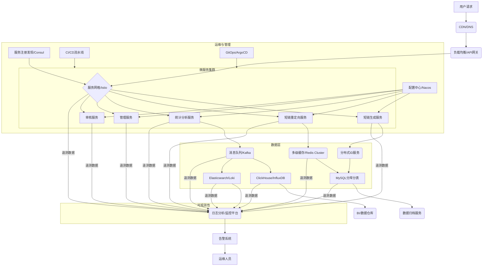

# 短链系统设计：从高级开发到资深架构师的演进之路

## 概述

本文档旨在从高级开发工程师和资深架构师的视角，深入剖析短链系统的设计与实现。在传统短链系统设计的基础上，我们将重点关注生产级架构的考量、企业级实战案例的深度解析、以及系统如何随着业务发展进行架构演进。通过本文，读者不仅能掌握短链系统的核心技术，更能理解如何构建一个高可用、高性能、可扩展且具备商业价值的短链服务。

## 1. 背景与需求分析

### 1.1 什么是短链系统？

短链系统（Short URL System）是一种将长URL（Uniform Resource Locator）转换为短小、易于分享和记忆的短URL的服务。当用户访问短URL时，系统会将其重定向到原始的长URL。它不仅仅是一个简单的URL转换工具，更是数据追踪、营销推广、用户体验优化的重要基础设施。

### 1.2 业务需求与高级考量

- **核心功能**：
  - **短链生成**：将任意长URL转换为唯一的短URL，支持自定义短链、批量生成、指定有效期。
  - **短链重定向**：用户访问短URL时，能够快速、准确地重定向到原始长URL，支持多种重定向策略（如301/302）。
  - **统计分析**：实时记录并分析短链的访问数据（如访问量、独立访客、地域分布、设备信息、Referer等），提供多维度报表。
  - **短链管理**：用户可以查看、编辑、删除、禁用、启用自己生成的短链，支持权限管理和团队协作。
  - **防刷与安全**：识别并拦截恶意访问、爬虫、DDoS攻击，防止短链被滥用。
  - **合规性与内容审核**：对生成的长URL内容进行审核，确保符合法律法规和平台政策，防止生成指向非法、违规内容的短链。

- **非功能性需求**：
  - **高可用性**：系统应具备多活、异地容灾能力，保证服务在极端故障下仍能持续运行，RTO/RPO满足业务SLA。
   - **高性能**：短链生成和重定向响应时间应在毫秒级，尤其重定向服务需达到极致性能。
   - **高并发**：支持每秒数万甚至数十万的短链重定向请求，并具备弹性伸缩能力以应对流量洪峰。
   - **可扩展性**：系统架构应采用微服务、云原生设计理念，易于水平扩展，支持新功能快速迭代。
   - **数据一致性**：短链映射关系和统计数据应保持强一致或最终一致，确保数据准确性。
   - **可维护性**：
     - **代码质量**：遵循编码规范，代码结构清晰，注释完善，易于理解和修改。
     - **文档完善**：提供详细的系统设计文档、API文档、部署手册等，便于团队成员协作和新成员快速上手。
     - **自动化运维**：通过自动化脚本、工具和平台，简化部署、监控、故障排查等运维工作。
   - **安全性**：
     - **数据安全**：敏感数据加密存储和传输，防止数据泄露和篡改。
     - **访问控制**：严格的身份认证和权限管理，防止未授权访问。
     - **攻击防护**：具备防刷、防DDoS、防SQL注入、防XSS等攻击的能力。
     - **安全审计**：完善的日志记录和审计机制，便于安全事件追溯。
   - **可观测性**：完善的日志、监控、追踪和告警体系，便于快速定位和解决问题。

### 1.3 规模评估与关键指标

- **短链生成量**：初期每天100万条新短链，峰值500万条/天，一年约3.6亿条，未来可达数十亿条。
- **短链访问量**：初期平均每条短链每天被访问10次，则每天访问量为1000万次，峰值可能达到数亿次，未来可达百亿次/天。
- **数据存储**：
  - 短链映射关系：每条短链约1KB，3.6亿条约360GB，未来TB级。
  - 访问日志：每条日志约0.1KB，每天1000万条约1GB，一年约365GB，未来PB级。
- **关键指标**：
  - 短链生成成功率：>99.999%
  - 短链重定向成功率：>99.999%
  - 短链生成响应时间：P99 < 50ms
  - 短链重定向响应时间：P99 < 5ms
  - 系统QPS：生成服务1000-5000 QPS，重定向服务100000-500000 QPS，峰值更高。
  - 数据统计实时性：分钟级更新。

### 1.4 业务价值与战略意义

- **提升用户体验与传播效率**：短小易记，方便在各种渠道（短信、社交媒体、印刷品）分享，提高点击率。
- **精细化营销与数据驱动决策**：通过详细的访问统计数据，帮助企业分析营销活动效果，优化投放策略，实现数据驱动的业务增长。
- **品牌建设与防伪溯源**：自定义短链域名，提升品牌专业度；结合溯源系统，实现商品全生命周期追踪。
- **节省资源与成本**：在有限字符场景下（如短信）节省字符，降低通信成本。
- **安全与合规保障**：通过内容审核和防刷机制，保障平台内容健康，降低法律风险和品牌受损风险。

## 二、高层架构设计

### 2.1 架构模式选择

#### 微服务架构
- **选择理由**：短链系统功能边界清晰，可以按照业务功能拆分为独立服务
- **服务划分**：
  - 短链生成服务：负责生成短链
  - 重定向服务：负责短链访问重定向
  - 统计分析服务：负责收集和分析访问数据
  - 管理服务：负责短链管理和配置

#### 事件驱动架构
- **选择理由**：短链访问统计适合采用事件驱动模式，解耦访问和统计逻辑
- **实现方式**：
  - 访问事件发布到消息队列
  - 统计服务异步消费事件进行处理
  - 减少对主流程的影响

#### 无状态设计
- **选择理由**：便于水平扩展，提高系统可用性
- **实现方式**：
  - 服务无状态化，状态存储在外部存储系统
  - 支持多实例部署和负载均衡

### 2.2 核心组件识别

#### 接入层
- **负载均衡**：Nginx/LVS，分发流量到多个服务实例
- **API网关**：Kong/APISIX，提供认证、限流、路由等功能
- **CDN**：用于静态资源加速和全球访问加速

#### 业务层
- **短链生成服务**：生成短链，处理URL提交请求
- **重定向服务**：处理短链访问，执行重定向
- **统计分析服务**：收集和分析访问数据
- **管理服务**：提供短链管理和配置功能

#### 数据层
- **关系型数据库**：MySQL，存储短链映射关系
- **缓存**：Redis，缓存热点短链映射
- **消息队列**：Kafka，处理访问事件
- **时序数据库**：InfluxDB，存储访问统计数据

#### 基础设施层
- **监控系统**：Prometheus + Grafana，监控系统运行状态
- **日志系统**：ELK Stack，收集和分析日志
- **配置中心**：Nacos/Apollo，管理配置
- **服务注册与发现**：Consul/Etcd，服务注册和发现

### 2.3 技术栈选型（高级架构视角）

```
编程语言：
- **Go**：高性能、轻量级协程，适合短链重定向服务（微服务架构）
- **Java**：Spring Cloud生态，适合管理和统计服务（企业级开发）
- **Rust**：关键路径性能优化（如高并发哈希计算）

数据存储：
- **MySQL**：主存储，采用分库分表+读写分离架构
- **Redis**：多级缓存（本地缓存+分布式缓存），支持Redis Cluster
- **InfluxDB**：时序数据存储，支持高精度访问统计
- **TiDB**：可选方案，解决分库分表痛点（HTAP能力）

消息队列：
- **Kafka**：高吞吐，支持Exactly-Once语义
- **Pulsar**：云原生消息系统，支持多租户和分层存储

基础设施：
- **云原生技术栈**：
  - 容器化：Docker + Containerd
  - 编排：Kubernetes（支持多集群联邦）
  - 服务网格：Istio（流量管理、熔断、金丝雀发布）
  - 无服务器：Knative（事件驱动场景）
- **可观测性**
  - **监控（Monitoring）**：
    - **指标采集**：使用Prometheus采集系统、服务和业务指标。
      - **系统指标**：CPU、内存、磁盘I/O、网络I/O等。
      - **服务指标**：QPS、延迟、错误率、并发连接数、GC情况等。
      - **业务指标**：短链生成量、重定向次数、不同渠道的访问量、热门短链等。
    - **数据存储**：Prometheus短期存储，Thanos/VictoriaMetrics长期存储。
    - **可视化**：Grafana仪表盘展示各项指标，提供多维度视图。
    - **告警**：AlertManager配置告警规则，集成钉钉、邮件、短信等告警渠道。
  - **日志（Logging）**：
    - **日志采集**：使用Loki/Filebeat/Fluentd采集应用日志和系统日志。
    - **日志存储**：Loki/Elasticsearch存储日志数据。
    - **日志分析**：Grafana Loki/Kibana进行日志查询、分析和可视化，快速定位问题。
    - **日志级别**：合理设置日志级别（DEBUG, INFO, WARN, ERROR, FATAL），生产环境以INFO为主，关键路径打印必要信息，错误日志包含详细堆栈。
    - **日志规范**：统一日志格式（如JSON），包含请求ID、trace ID、span ID等，便于关联查询。
  - **追踪（Tracing）**：
    - **分布式追踪**：使用Jaeger/Zipkin实现分布式请求追踪，串联微服务调用链。
    - **上下文传播**：通过HTTP Header或gRPC Metadata传递trace ID和span ID。
    - **性能分析**：分析请求在各个服务中的耗时，找出性能瓶颈。
    - **故障定位**：快速定位异常请求发生在哪个服务、哪个环节。
  - **链路追踪**：
    - **OpenTelemetry**：采用OpenTelemetry作为统一的遥测数据（Metrics, Logs, Traces）采集和导出标准，实现厂商无关性。
    - **服务网格集成**：如果使用Istio等服务网格，可以利用其内置的遥测能力，无需修改应用代码即可实现服务间通信的追踪。

- **DevOps工具链**：
  - **持续集成/持续部署（CI/CD）**：
    - **CI工具**：Jenkins、GitLab CI/CD、GitHub Actions、Tekton等，实现代码提交自动触发测试、构建、静态代码分析、安全扫描。
    - **CD工具**：ArgoCD（GitOps）、Spinnaker、Jenkins X等，实现自动化部署到不同环境（开发、测试、预发布、生产）。
    - **制品管理**：使用Harbor、Nexus等管理Docker镜像、Helm Chart等制品。
  - **GitOps**：
    - 以Git作为单一事实来源（Single Source of Truth），管理基础设施和应用配置。
    - 使用ArgoCD或Flux CD实现声明式部署和自动同步，确保集群状态与Git仓库一致。
    - 优势：版本控制、可审计性、快速回滚、团队协作。
  - **配置管理**：
    - **Kubernetes原生**：使用ConfigMap和Secret管理应用配置和敏感数据。
    - **模板工具**：Helm、Kustomize用于管理和打包Kubernetes应用，实现配置的参数化和环境差异化。
    - **配置中心**：Nacos、Apollo等，提供动态配置管理、服务发现和服务管理能力。
  - **容器镜像管理**：
    - **镜像仓库**：Harbor、Docker Hub、云厂商容器镜像服务等，存储和分发Docker镜像。
    - **镜像安全**：集成镜像扫描工具（如Clair、Trivy），在CI/CD流程中进行漏洞扫描。
    - **镜像优化**：多阶段构建、减小镜像大小，提高部署效率。
  - **环境管理**：
    - **多环境部署**：通过CI/CD流水线实现开发、测试、预发布、生产等多套环境的自动化部署和管理。
    - **环境隔离**：确保不同环境之间的资源和数据隔离，避免相互影响。
    - **灰度发布/蓝绿部署**：利用服务网格（Istio）或Ingress控制器实现流量的精细化控制，支持灰度发布、蓝绿部署，降低发布风险。

```

### 2.4 架构图绘制

#### 2.4.1 微服务与云原生系统架构图



#### 2.4.2 Kubernetes多集群与混合云部署架构图

```mermaid
graph TD
    subgraph 用户访问层
        A[用户] --> B(全球DNS); 
        B --> C(多区域CDN); 
        C --> D(云厂商负载均衡/WAF); 
    end

    subgraph 核心业务区 (Kubernetes集群)
        D --> E(API网关/Ingress Controller); 
        E --> F[服务网格/Istio]; 

        subgraph 微服务部署
            F --> G[短链生成服务 Pods];
            F --> H[短链重定向服务 Pods];
            F --> I[统计分析服务 Pods];
            F --> J[管理/审核服务 Pods];
        end

        G --> K(分布式ID服务 Pods); 
        H --> L(Redis Cluster Pods); 
        I --> M(Kafka Cluster Pods); 

        subgraph 数据存储
            K --> N[MySQL Shards Pods];
            L --> N;
            M --> O[ClickHouse/InfluxDB Pods];
            M --> P[Elasticsearch/Loki Pods];
        end
    end

    subgraph 跨区域/混合云部署
        D -- 流量分发 --> Q(灾备Kubernetes集群); 
        Q --> F;
        N -- 数据同步 --> R[异地灾备MySQL];
        L -- 数据同步 --> S[异地灾备Redis];
        M -- 数据同步 --> T[异地灾备Kafka];
    end

    subgraph 运维与监控
        U[Prometheus/Thanos] --> F;
        U --> G;
        U --> H;
        U --> I;
        U --> J;
        U --> K;
        U --> L;
        U --> M;
        U --> N;
        U --> O;
        U --> P;
        V[Grafana] --> U;
        W[Jaeger] --> F;
        W --> G;
        W --> H;
        W --> I;
        W --> J;
        X[AlertManager] --> U;
        X --> Y[通知渠道];
        Z[CI/CD Pipeline] --> G;
        Z --> H;
        Z --> I;
        Z --> J;
        AA[GitOps Controller] --> 核心业务区;
    end

    Y --> BB[运维人员];
```

## 三、详细设计

### 3.1 短链生成方案

#### 方案比较与选择

| 方案 | 优点 | 缺点 | 适用场景 |
|------|------|------|----------|
| **哈希算法(MurmurHash+Base62)** | 计算速度快，无需存储额外ID | 存在碰撞风险 | 中小规模系统 |
| **自增ID+Base62编码** | 唯一性保证，无碰撞 | 依赖数据库，性能瓶颈 | 一般规模系统 |
| **分布式ID生成(Snowflake)** | 分布式友好，高性能 | 依赖时钟，可能时钟回拨 | 大规模分布式系统 |
| **Redis计数器** | 高性能，实现简单 | 需要额外维护Redis | 高性能要求系统 |
| **UUID** | 生成简单，分布式友好 | ID长度过长，不适合短链 | 不适合短链系统 |

#### 推荐方案：混合策略

1. **主方案：自增ID段+Base62编码**
   - 使用数据库预分配ID段（每次获取1000个ID）
   - 应用内存中维护ID段，避免频繁访问数据库
   - 将ID转为Base62编码（6位字符，可表示56.8亿个短链）
   - Go实现示例：
   ```go
   // Base62字符集
   const base62Chars = "0123456789ABCDEFGHIJKLMNOPQRSTUVWXYZabcdefghijklmnopqrstuvwxyz"
   
   // 将ID转换为Base62编码的短链
   func encodeToBase62(id int64) string {
       if id == 0 {
           return string(base62Chars[0])
       }
       
       var result []byte
       base := int64(len(base62Chars))
       
       for id > 0 {
           result = append([]byte{base62Chars[id%base]}, result...)
           id = id / base
       }
       
           // 确保长度为6位，不足前面补0
       for len(result) < 6 {
           result = append([]byte{base62Chars[0]}, result...)
       }
       
       return string(result)
   }
   ```

2. **备选方案：哈希算法（处理自定义短链）**
   - 使用MurmurHash3算法计算URL的哈希值
   - 取哈希值的一部分转为Base62编码
   - 使用布隆过滤器快速检测可能的碰撞
   - 碰撞处理：添加计数器或时间戳重新哈希
   - Go实现示例：
   ```go
   import (
       "github.com/spaolacci/murmur3"
       "strconv"
       "time"
   )
   
   // 使用MurmurHash生成短链
   func generateShortLink(url string) string {
       // 添加时间戳减少碰撞
       data := url + strconv.FormatInt(time.Now().UnixNano(), 10)
       
       // 计算哈希值
       h := murmur3.New64()
       h.Write([]byte(data))
       id := h.Sum64()
       
       return encodeToBase62(int64(id % 56800235584)) // 确保在6位Base62范围内
   }
   ```

### 3.2 重定向策略

#### 301 vs 302 重定向
- **301永久重定向**：
  - 符合HTTP语义（短链到长链的映射通常不变）
  - 浏览器会缓存重定向结果，减少服务器负载
  - 缺点：无法统计点击数据，搜索引擎会直接展示原始URL

- **302临时重定向**：
  - 每次访问都会请求短链服务器
  - 可以统计点击数据，收集用户信息
  - 可以实现A/B测试、访问控制等高级功能

#### 最佳实践：使用302重定向
- 虽然从HTTP语义上看301更合适，但从业务需求看302更实用
- 可以收集统计数据，是短链服务的核心价值之一
- 可以实现更多高级功能：访问控制、地域重定向、A/B测试等

#### 重定向服务实现细节

1.  **高性能重定向**：
    *   **缓存优先**：重定向服务应优先从多级缓存（本地缓存 -> Redis）中获取长URL，减少数据库访问。
    *   **异步统计**：将访问统计数据的记录操作异步化，通过消息队列（Kafka）发送统计事件，避免阻塞重定向主流程。
    *   **Go语言并发**：利用Go语言的Goroutine和Channel实现高并发处理，每个重定向请求在一个轻量级Goroutine中处理。
    *   **HTTP Keep-Alive**：利用HTTP长连接减少TCP连接建立和关闭的开销。

2.  **统计数据记录**：
    *   **实时采集**：在重定向服务中采集访问IP、User-Agent、Referer、访问时间等信息。
    *   **消息队列**：将采集到的原始访问数据封装成消息，发送到Kafka等消息队列。
    *   **异步处理**：统计分析服务从消息队列中消费数据，进行清洗、解析（如IP解析为地域信息）、聚合，并写入时序数据库（InfluxDB）和关系型数据库（MySQL）的统计汇总表。

3.  **错误处理与回退**：
    *   **短链不存在**：如果短链在缓存和数据库中均未找到，返回404 Not Found。
    *   **内部错误**：如果发生内部错误（如数据库连接失败），返回500 Internal Server Error，并记录详细日志。
    *   **熔断与降级**：当依赖服务（如数据库、Redis）出现故障时，通过熔断机制快速失败，并提供降级方案（如返回默认页面或错误提示）。

- **安全性考量**
  - **URL合法性校验**：
    - 对用户输入的原始URL进行严格的格式校验，确保其符合URL规范。
    - 过滤掉内部IP、保留IP、特殊协议（如`file://`、`javascript://`）等不安全的URL，防止SSRF、XSS等攻击。
    - 使用黑名单或白名单机制，禁止或允许特定域名。
  - **防刷限流**：
    - **IP限流**：限制单个IP在单位时间内的短链生成和重定向请求次数。
    - **用户限流**：对登录用户，根据用户等级或权限设置不同的限流策略。
    - **设备指纹**：结合IP、User-Agent、Cookie等信息生成设备指纹，更精准地识别和限制恶意请求。
    - **验证码/滑动验证**：在高频请求或异常行为发生时，引入验证码机制。
    - **熔断与降级**：当系统负载过高时，对非核心功能进行熔断或降级，保证核心服务的可用性。
  - **内容审核**：
    - **敏感词过滤**：对原始URL及其标题、描述进行敏感词过滤，防止生成指向非法、色情、暴力等内容的短链。
    - **人工审核**：对于高风险或被举报的短链，引入人工审核机制。
    - **第三方内容安全服务**：集成专业的内容安全API进行自动化审核。
  - **DDoS防护**：
    - 部署CDN和WAF（Web Application Firewall）来抵御DDoS攻击和常见的Web攻击。
    - 利用云服务商的DDoS防护服务。
  - **API安全**：
    - **身份认证与授权**：对于短链生成、管理等API，强制要求用户身份认证（如OAuth2、JWT），并进行细粒度的权限控制。
    - **HTTPS**：所有API接口强制使用HTTPS，加密传输数据，防止数据窃听和篡改。
    - **API限流**：对API调用设置频率限制，防止滥用。
  - **数据加密**：
    - 数据库中存储的敏感信息（如用户ID、原始URL的部分信息）进行加密存储。
    - 传输中的数据（如用户密码、API密钥）必须加密。
  - **安全审计与日志**：
    - 记录所有关键操作的日志，包括短链生成、修改、删除、重定向访问等，便于安全审计和问题追溯。
    - 定期对日志进行分析，发现异常行为和潜在威胁。
  - **应急响应**：
    - 建立完善的安全事件应急响应机制，包括事件发现、分析、止损、恢复和复盘。


### 3.3 数据库设计

#### 数据模型设计

**短链映射表**
```sql
CREATE TABLE `t_short_url` (
  `id` bigint(20) unsigned NOT NULL AUTO_INCREMENT COMMENT '主键',
  `short_url` varchar(8) NOT NULL DEFAULT '' COMMENT '短链接',
  `long_url` varchar(2048) NOT NULL DEFAULT '' COMMENT '原始链接',
  `user_id` bigint(20) unsigned DEFAULT NULL COMMENT '创建用户ID',
  `created_at` timestamp NOT NULL DEFAULT CURRENT_TIMESTAMP COMMENT '创建时间',
  `expired_at` timestamp NULL DEFAULT NULL COMMENT '过期时间',
  `status` tinyint(4) NOT NULL DEFAULT '1' COMMENT '状态 1:有效 2:无效',
  `source` varchar(64) DEFAULT NULL COMMENT '来源渠道',
  `description` varchar(256) DEFAULT NULL COMMENT '链接描述',
  PRIMARY KEY (`id`),
  UNIQUE KEY `idx_short_url` (`short_url`),
  KEY `idx_user_id` (`user_id`),
  KEY `idx_created_at` (`created_at`),
  KEY `idx_expired_at` (`expired_at`)
) ENGINE=InnoDB DEFAULT CHARSET=utf8mb4 COMMENT='短链接映射表';
```

**访问统计表**
```sql
CREATE TABLE `t_access_stats` (
  `id` bigint(20) unsigned NOT NULL AUTO_INCREMENT COMMENT '主键',
  `short_url_id` bigint(20) unsigned NOT NULL COMMENT '短链ID',
  `short_url` varchar(8) NOT NULL COMMENT '短链接',
  `access_time` timestamp NOT NULL DEFAULT CURRENT_TIMESTAMP COMMENT '访问时间',
  `ip` varchar(64) DEFAULT NULL COMMENT '访问IP',
  `user_agent` varchar(512) DEFAULT NULL COMMENT '用户代理',
  `referer` varchar(1024) DEFAULT NULL COMMENT '来源页面',
  `device_type` varchar(32) DEFAULT NULL COMMENT '设备类型',
  `browser` varchar(64) DEFAULT NULL COMMENT '浏览器',
  `os` varchar(64) DEFAULT NULL COMMENT '操作系统',
  `country` varchar(64) DEFAULT NULL COMMENT '国家',
  `region` varchar(64) DEFAULT NULL COMMENT '地区',
  `city` varchar(64) DEFAULT NULL COMMENT '城市',
  PRIMARY KEY (`id`),
  KEY `idx_short_url_id` (`short_url_id`),
  KEY `idx_short_url` (`short_url`),
  KEY `idx_access_time` (`access_time`)
) ENGINE=InnoDB DEFAULT CHARSET=utf8mb4 COMMENT='访问统计表';
```

**统计汇总表**
```sql
CREATE TABLE `t_stats_summary` (
  `id` bigint(20) unsigned NOT NULL AUTO_INCREMENT COMMENT '主键',
  `short_url_id` bigint(20) unsigned NOT NULL COMMENT '短链ID',
  `short_url` varchar(8) NOT NULL COMMENT '短链接',
  `date` date NOT NULL COMMENT '统计日期',
  `pv` int(11) NOT NULL DEFAULT '0' COMMENT '页面浏览量',
  `uv` int(11) NOT NULL DEFAULT '0' COMMENT '独立访客数',
  `ip_count` int(11) NOT NULL DEFAULT '0' COMMENT 'IP数',
  PRIMARY KEY (`id`),
  UNIQUE KEY `idx_url_date` (`short_url`, `date`),
  KEY `idx_date` (`date`)
) ENGINE=InnoDB DEFAULT CHARSET=utf8mb4 COMMENT='统计汇总表';
```

#### 分库分表策略

**水平分表策略**

1. **按短链前缀分表**
   - 将短链按首字符分为多张表（如62张表对应Base62字符集）
   - 优点：分布均匀，查询路由简单
   - 缺点：扩展性有限，最多62张表

2. **按短链哈希取模分表**
   - 对短链进行哈希计算，然后对表数量取模
   - 优点：分布均匀，可以支持更多分表数量
   - 缺点：增加表数量需要数据迁移

3. **按ID范围分表**
   - 按照ID范围进行分表，如每1000万条数据一张表
   - 优点：新数据写入集中，历史数据查询性能稳定
   - 缺点：热点数据可能集中在最新表

**推荐方案：混合策略**

- 短链映射表：按短链哈希取模分表（16或32张表）
- 访问统计表：按时间范围分表（每月或每周一张表）
- 统计汇总表：按时间范围分表（每年一张表）

**分表实现示例（Go）**
```go
type ShardingStrategy interface {
    GetTableName(shortURL string) string
}

// 按短链哈希取模分表
type HashModSharding struct {
    TablePrefix string
    TableCount  int
}

func (s *HashModSharding) GetTableName(shortURL string) string {
    h := fnv.New32a()
    h.Write([]byte(shortURL))
    hashValue := h.Sum32()
    tableIndex := hashValue % uint32(s.TableCount)
    return fmt.Sprintf("%s_%d", s.TablePrefix, tableIndex)
}

// 按时间范围分表
type TimeRangeSharding struct {
    TablePrefix string
    TimeFormat  string // 如"200601"表示按年月分表
}

func (s *TimeRangeSharding) GetTableName(accessTime time.Time) string {
    timeStr := accessTime.Format(s.TimeFormat)
    return fmt.Sprintf("%s_%s", s.TablePrefix, timeStr)
}
```

#### 数据归档策略

1. **冷热数据分离**
   - 热数据：最近3个月活跃的短链保留在主表
   - 冷数据：超过3个月不活跃的短链迁移到历史表
   - 实现方式：定期任务扫描并迁移数据

2. **TTL自动过期**
   - 为短链设置TTL（生存时间）
   - 过期后自动标记为无效，不再提供服务
   - 定期清理过期数据到归档表

- **分区表策略**
  - 使用MySQL分区表按时间范围分区
  - 定期删除旧分区，添加新分区
  - 简化数据归档和清理流程

#### 数据归档实现细节

1.  **归档流程**：
    *   **识别冷数据**：通过定时任务（如每天凌晨运行）扫描`t_short_url`和`t_access_stats`表，识别出符合归档条件的数据（例如，超过一定时间未被访问，或已过期的短链）。
    *   **数据迁移**：将识别出的冷数据批量从在线表（`t_short_url`、`t_access_stats`）迁移到归档表（`t_short_url_archive`、`t_access_stats_archive`）。迁移过程应采用事务，确保数据一致性。
    *   **删除原数据**：数据成功迁移到归档表后，从在线表中删除对应的记录。
    *   **索引优化**：归档表可以根据查询需求建立不同的索引，以支持历史数据分析。

2.  **归档工具与技术**：
    *   **ETL工具**：可以使用专业的ETL工具（如Apache Nifi、DataX）进行数据抽取、转换、加载。
    *   **数据库原生工具**：利用MySQL的`SELECT ... INTO OUTFILE`和`LOAD DATA INFILE`进行数据导出和导入，或者使用`pt-archiver`等工具。
    *   **自定义脚本**：编写Go/Python脚本，通过数据库连接池和批量操作（`INSERT INTO ... SELECT`）实现高效迁移。

3.  **数据一致性与可用性**：
    *   **事务保证**：数据迁移操作应在数据库事务中进行，确保原子性。
    *   **双写/影子表**：在迁移初期，可以考虑双写策略，同时写入在线表和归档表，待系统稳定后再切换。
    *   **灰度发布**：对于归档策略的调整，应进行灰度发布，逐步验证其对业务的影响。
    *   **监控与告警**：对归档任务的执行状态、数据量、耗时等进行监控，并设置告警，及时发现和处理异常。

4.  **归档任务示例（Go）**
```go
import (
	"database/sql"
	"time"

	"_ "github.com/go-sql-driver/mysql" // 导入MySQL驱动
)

// ArchiveExpiredShortURLs 归档过期或长时间未访问的短链
func ArchiveExpiredShortURLs(db *sql.DB) error {
	// 开启事务
	tx, err := db.Begin()
	if err != nil {
		return err
	}
	defer tx.Rollback() // 确保事务在函数结束时回滚，除非明确提交

	// 1. 迁移短链映射数据
	// 将过期或3个月未访问的短链迁移到归档表
	_, err = tx.Exec(`
		INSERT INTO t_short_url_archive (
			id, short_url, long_url, user_id, created_at, expired_at, status, source, description, archived_at
		) SELECT 
			id, short_url, long_url, user_id, created_at, expired_at, status, source, description, ?
		FROM t_short_url
		WHERE (expired_at IS NOT NULL AND expired_at < NOW()) 
		OR (created_at < DATE_SUB(NOW(), INTERVAL 3 MONTH) AND 
			id NOT IN (SELECT short_url_id FROM t_access_stats WHERE access_time > DATE_SUB(NOW(), INTERVAL 3 MONTH)))
	`, time.Now())
	
	if err != nil {
		return err
	}

	// 2. 删除已迁移的短链映射数据
	_, err = tx.Exec(`
		DELETE FROM t_short_url
		WHERE (expired_at IS NOT NULL AND expired_at < NOW()) 
		OR (created_at < DATE_SUB(NOW(), INTERVAL 3 MONTH) AND 
			id NOT IN (SELECT short_url_id FROM t_access_stats WHERE access_time > DATE_SUB(NOW(), INTERVAL 3 MONTH)))
	`)
	if err != nil {
		return err
	}

	// 3. 迁移访问统计数据 (例如，迁移3个月前的统计数据)
	_, err = tx.Exec(`
		INSERT INTO t_access_stats_archive (
			id, short_url_id, short_url, access_time, ip, user_agent, referer, device_type, browser, os, country, region, city, archived_at
		) SELECT 
			id, short_url_id, short_url, access_time, ip, user_agent, referer, device_type, browser, os, country, region, city, ?
		FROM t_access_stats
		WHERE access_time < DATE_SUB(NOW(), INTERVAL 3 MONTH)
	`, time.Now())
	if err != nil {
		return err
	}

	// 4. 删除已迁移的访问统计数据
	_, err = tx.Exec(`
		DELETE FROM t_access_stats
		WHERE access_time < DATE_SUB(NOW(), INTERVAL 3 MONTH)
	`)
	if err != nil {
		return err
	}

	// 提交事务
	return tx.Commit()
}

/*
// 示例：如何在main函数中调用归档任务
func main() {
	// 假设你已经初始化了数据库连接
	db, err := sql.Open("mysql", "user:password@tcp(127.0.0.1:3306)/your_database?parseTime=true")
	if err != nil {
		log.Fatalf("Failed to connect to database: %v", err)
	}
	defer db.Close()

	// 定时执行归档任务，例如每天凌晨1点
	// go func() {
	// 	for {
	// 		now := time.Now()
	// 		nextRun := time.Date(now.Year(), now.Month(), now.Day()+1, 1, 0, 0, 0, now.Location())
	// 		duration := nextRun.Sub(now)
	// 		time.Sleep(duration)

	// 		log.Println("Starting data archiving...")
	// 		err := ArchiveExpiredShortURLs(db)
	// 		if err != nil {
	// 			log.Printf("Data archiving failed: %v", err)
	// 		} else {
	// 			log.Println("Data archiving completed successfully.")
	// 		}
	// 	}
	// }()

	// 保持主goroutine运行，例如通过一个select{}阻塞
	// select {}
}
*/
```

### 3.4 缓存策略

#### 多级缓存设计

1. **本地缓存（进程内缓存）**
   - 使用内存缓存库如BigCache或Freecache
   - 缓存最热门的短链（如Top 1000）
   - 优点：访问速度最快，无网络开销
   - 缺点：容量有限，多实例间不共享

2. **分布式缓存（Redis）**
   - 缓存所有活跃短链映射关系
   - 采用LRU/LFU淘汰策略
   - 优点：容量大，多实例共享
   - 缺点：有网络开销

3. **CDN缓存**
   - 对于超高频访问的短链，配置CDN缓存
   - 通过设置Cache-Control头控制缓存时间
   - 优点：全球加速，减轻源站压力
   - 缺点：统计数据不实时，更新延迟

#### 缓存策略实现

**Cache-Aside模式（Go实现）**
```go
type URLCache struct {
    localCache  *freecache.Cache
    redisClient *redis.Client
    db          *sql.DB
}

func NewURLCache() *URLCache {
    return &URLCache{
        localCache:  freecache.NewCache(100 * 1024 * 1024), // 100MB
        redisClient: redis.NewClient(&redis.Options{
            Addr: "localhost:6379",
        }),
        db: nil, // 初始化数据库连接
    }
}

// 获取长URL
func (c *URLCache) GetLongURL(shortURL string) (string, error) {
    // 1. 查询本地缓存
    if val, err := c.localCache.Get([]byte(shortURL)); err == nil {
        return string(val), nil
    }
    
    // 2. 查询Redis缓存
    val, err := c.redisClient.Get(context.Background(), "url:"+shortURL).Result()
    if err == nil {
        // 命中Redis缓存，回填本地缓存
        c.localCache.Set([]byte(shortURL), []byte(val), 3600) // 1小时过期
        return val, nil
    }
    
    if err != redis.Nil {
        // Redis错误，不是键不存在
        return "", err
    }
    
    // 3. 查询数据库
    var longURL string
    err = c.db.QueryRow("SELECT long_url FROM t_short_url WHERE short_url = ?", shortURL).Scan(&longURL)
    if err != nil {
        if err == sql.ErrNoRows {
            return "", errors.New("short URL not found")
        }
        return "", err
    }
    
    // 4. 回填Redis和本地缓存
    c.redisClient.Set(context.Background(), "url:"+shortURL, longURL, time.Hour*24) // 24小时过期
    c.localCache.Set([]byte(shortURL), []byte(longURL), 3600) // 1小时过期
    
    return longURL, nil
}

// 示例：初始化URLCache并使用
/*
func main() {
    // 假设db和redisClient已经初始化
    db, err := sql.Open("mysql", "user:password@tcp(127.0.0.1:3306)/dbname")
    if err != nil {
        log.Fatalf("Failed to connect to database: %v", err)
    }
    defer db.Close()

    redisClient := redis.NewClient(&redis.Options{
        Addr: "localhost:6379",
        Password: "", // no password set
        DB: 0,  // use default DB
    })

    cache := NewURLCache()
    cache.db = db
    cache.redisClient = redisClient

    shortURL := "abcde1"
    longURL, err := cache.GetLongURL(shortURL)
    if err != nil {
        log.Printf("Error getting long URL for %s: %v", shortURL, err)
    } else {
        fmt.Printf("Long URL for %s is: %s\n", shortURL, longURL)
    }
}
*/
    if err != nil {
        if err == sql.ErrNoRows {
            // 数据不存在，缓存空结果防止缓存穿透
            c.redisClient.Set(context.Background(), "url:"+shortURL, "", time.Minute*10)
            return "", fmt.Errorf("short URL not found")
        }
        return "", err
    }
    
    // 回填Redis缓存，设置随机过期时间防止缓存雪崩
    expiration := time.Hour*24 + time.Duration(rand.Intn(3600))*time.Second
    c.redisClient.Set(context.Background(), "url:"+shortURL, longURL, expiration)
    
    // 回填本地缓存
    c.localCache.Set([]byte(shortURL), []byte(longURL), 3600) // 1小时过期
    
    return longURL, nil
}
```

#### 缓存一致性保障

1. **更新策略**
   - 先更新数据库，再删除缓存
   - 使用消息队列确保缓存最终一致性

2. **防止缓存穿透**
   - 对不存在的短链进行空值缓存
   - 使用布隆过滤器快速判断短链是否存在

3. **防止缓存雪崩**
   - 设置随机过期时间
   - 热点数据永不过期，通过后台任务更新

4. **防止缓存击穿**
   - 使用互斥锁或分布式锁
   - 单线程更新缓存，其他线程等待或返回旧值

**布隆过滤器实现（Go）**
```go
import (
    "github.com/bits-and-blooms/bloom/v3"
)

type ShortURLFilter struct {
    filter    *bloom.BloomFilter
    db        *sql.DB
    mutex     sync.RWMutex
    lastRebuild time.Time
}

func NewShortURLFilter(db *sql.DB) *ShortURLFilter {
    filter := &ShortURLFilter{
        filter: bloom.NewWithEstimates(10000000, 0.01), // 1千万个元素，1%误判率
        db:     db,
    }
    filter.Rebuild()
    return filter
}

// 重建布隆过滤器
func (f *ShortURLFilter) Rebuild() error {
    f.mutex.Lock()
    defer f.mutex.Unlock()
    
    // 创建新的布隆过滤器
    newFilter := bloom.NewWithEstimates(10000000, 0.01)
    
    // 分批查询所有短链
    offset := 0
    batchSize := 10000
    for {
        rows, err := f.db.Query(
            "SELECT short_url FROM t_short_url WHERE status = 1 LIMIT ? OFFSET ?", 
            batchSize, offset,
        )
        if err != nil {
            return err
        }
        
        count := 0
        for rows.Next() {
            var shortURL string
            if err := rows.Scan(&shortURL); err != nil {
                rows.Close()
                return err
            }
            newFilter.Add([]byte(shortURL))
            count++
        }
        rows.Close()
        
        if count < batchSize {
            break
        }
        offset += batchSize
    }
    
    // 替换旧的布隆过滤器
    f.filter = newFilter
    f.lastRebuild = time.Now()
    return nil
}

// 检查短链是否可能存在
func (f *ShortURLFilter) MayExist(shortURL string) bool {
    f.mutex.RLock()
    defer f.mutex.RUnlock()
    return f.filter.Test([]byte(shortURL))
}

// 添加新短链到过滤器
func (f *ShortURLFilter) Add(shortURL string) {
    f.mutex.Lock()
    defer f.mutex.Unlock()
    f.filter.Add([]byte(shortURL))
}
```

### 3.5 存储方案

#### 存储层设计

1. **关系型数据库（MySQL）**
   - 存储短链映射关系和基本元数据
   - 支持事务和复杂查询
   - 主从架构提高可用性

2. **时序数据库（InfluxDB/TimescaleDB）**
   - 存储访问统计数据
   - 高效处理时间序列数据
   - 支持聚合和降采样

3. **对象存储（MinIO/S3）**
   - 存储访问日志和原始数据
   - 成本低，容量大
   - 支持生命周期管理

#### 数据一致性保障

1. **主从复制**
   - MySQL主从复制确保数据备份
   - 半同步复制提高数据可靠性
   - 读写分离提高性能

2. **数据备份**
   - 定时全量备份
   - 实时增量备份（binlog）
   - 跨区域备份防止区域性故障

3. **数据校验**
   - 定期校验主从数据一致性
   - 使用校验和验证数据完整性
   - 自动修复不一致数据

**MySQL主从配置示例**
```
# 主库配置 (my.cnf)
server-id = 1
log_bin = mysql-bin
binlog_format = ROW
binlog_row_image = FULL
sync_binlog = 1
innodb_flush_log_at_trx_commit = 1

# 从库配置 (my.cnf)
server-id = 2
relay_log = mysql-relay-bin
read_only = ON
slave_compressed_protocol = 1
```

**数据备份脚本（Shell）**
```bash
#!/bin/bash

# 配置
DB_USER="root"
DB_PASS="password"
DB_NAME="shorturl_db"
BACKUP_DIR="/backup/mysql"
DATE=$(date +"%Y%m%d%H%M")

# 创建备份目录
mkdir -p ${BACKUP_DIR}

# 全量备份
mysqldump -u${DB_USER} -p${DB_PASS} --single-transaction --routines --triggers --events ${DB_NAME} > ${BACKUP_DIR}/${DB_NAME}_${DATE}.sql

# 压缩备份文件
gzip ${BACKUP_DIR}/${DB_NAME}_${DATE}.sql

# 删除7天前的备份
find ${BACKUP_DIR} -name "${DB_NAME}_*.sql.gz" -mtime +7 -delete

# 备份binlog
mysql -u${DB_USER} -p${DB_PASS} -e "FLUSH BINARY LOGS;"
mysql -u${DB_USER} -p${DB_PASS} -e "PURGE BINARY LOGS BEFORE DATE_SUB(NOW(), INTERVAL 3 DAY);"

echo "Backup completed: ${BACKUP_DIR}/${DB_NAME}_${DATE}.sql.gz"
```