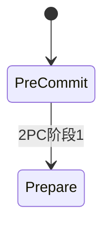

# 大容量资产存储架构深度设计

# 大容量资产存储架构深度设计

## 一、背景与需求分析

### 1.1 业务背景

在数字化转型浪潮下，企业对音视频资产管理的需求呈爆发式增长。从传统的文件存储到智能化资产管理，系统需要支撑：

- **海量数据规模**：单租户资产量可达千万级，总存储容量PB级别
- **多样化场景**：影视制作、在线教育、企业培训、直播录制等垂直领域
- **高并发访问**：大促期间上传QPS峰值可达10万+，查询QPS达50万+
- **全球化部署**：需支持多云、多地域的分布式架构

### 1.2 核心需求

#### 1.2.1 功能性需求

- **大容量存储**：支持单文件最大100GB，单租户总容量无上限
- **智能分类**：基于AI技术自动识别资产类型、场景、内容标签
- **多版本管理**：支持资产版本控制、差异对比、回滚机制
- **权限管控**：细粒度权限控制，支持租户级、项目级、文件级权限
- **全文检索**：支持基于内容、标签、元数据的复合检索

#### 1.2.2 非功能性需求

- **高可用性**：系统可用性99.99%，RTO<5分钟，RPO<1分钟
- **高性能**：上传成功率99.95%，查询响应时间P99<200ms
- **可扩展性**：支持水平扩展，单集群支持10万+并发用户
- **安全性**：数据加密存储，传输加密，完整的审计日志
- **成本优化**：通过智能分层、去重、压缩等技术降低存储成本30%+

### 1.3 技术挑战

#### 1.3.1 存储挑战

- **数据一致性**：跨多个存储系统（MySQL、Redis、ES、COS）的数据一致性保障
- **热点数据**：明星资产的高频访问导致的存储热点问题
- **冷数据归档**：长尾资产的成本优化与访问性能平衡

#### 1.3.2 性能挑战

- **大文件上传**：网络不稳定环境下的断点续传、分片合并
- **并发控制**：高并发场景下的锁竞争、连接池管理
- **查询优化**：海量数据下的复杂查询性能优化

#### 1.3.3 架构挑战

- **微服务拆分**：合理的服务边界划分与服务间通信
- **数据建模**：支持多租户、多版本的灵活数据模型设计
- **监控运维**：分布式系统的可观测性与故障定位

## 二、架构演进路径

### 2.1 MVP阶段（0-10万用户）

#### 2.1.1 架构特点

- **单体架构**：核心功能集中在一个应用中，快速迭代验证
- **简化存储**：MySQL主从 + Redis缓存 + 单云存储
- **基础功能**：文件上传下载、简单分类、基础权限

#### 2.1.2 技术栈选择

```go
// MVP阶段核心服务架构
type AssetService struct {
    DB     *gorm.DB          // MySQL主从
    Cache  *redis.Client    // Redis单实例
    OSS    *oss.Client      // 阿里云OSS
    Logger *logrus.Logger   // 结构化日志
}

// 简化的资产上传接口
func (s *AssetService) UploadAsset(ctx context.Context, req *UploadRequest) (*UploadResponse, error) {
    // 1. 参数校验
    if err := s.validateUpload(req); err != nil {
        return nil, fmt.Errorf("validation failed: %w", err)
    }
    
    // 2. 容量检查
    if err := s.checkQuota(ctx, req.TenantID, req.FileSize); err != nil {
        return nil, fmt.Errorf("quota exceeded: %w", err)
    }
    
    // 3. 上传到OSS
    ossURL, err := s.OSS.PutObject(req.FileName, req.FileData)
    if err != nil {
        return nil, fmt.Errorf("oss upload failed: %w", err)
    }
    
    // 4. 保存元数据
    asset := &Asset{
        ID:       generateID(),
        TenantID: req.TenantID,
        FileName: req.FileName,
        FileSize: req.FileSize,
        OSSURL:   ossURL,
        Status:   "uploaded",
    }
    
    if err := s.DB.Create(asset).Error; err != nil {
        return nil, fmt.Errorf("db save failed: %w", err)
    }
    
    return &UploadResponse{AssetID: asset.ID}, nil
}
```

#### 2.1.3 技术选型依据

- **Go语言**：高并发性能、简洁语法、丰富生态
- **MySQL**：ACID特性保障数据一致性、成熟的运维工具链
- **Redis**：高性能缓存、丰富的数据结构
- **阿里云OSS**：高可靠性、成本可控、API简单

### 2.2 成长阶段（10万-100万用户）

#### 2.2.1 架构特点

- **微服务化**：按业务域拆分服务（上传服务、检索服务、权限服务）
- **分库分表**：MySQL分库分表应对数据量增长
- **多云部署**：引入多云存储提升可靠性
- **智能化**：AI分类、智能推荐等高级功能

#### 2.2.2 技术栈演进

```go
// 微服务架构下的上传服务
type UploadService struct {
    ShardingDB  *sharding.DB      // 分库分表
    RedisCluster *redis.ClusterClient // Redis集群
    MultiCloud  *storage.MultiCloud   // 多云存储
    MQ          *kafka.Producer       // 消息队列
    AI          *ai.ClassifyClient    // AI分类服务
}

// 分片上传实现
func (s *UploadService) ChunkUpload(ctx context.Context, req *ChunkUploadRequest) error {
    // 1. 分片校验
    if err := s.validateChunk(req); err != nil {
        return err
    }
    
    // 2. 存储分片
    chunkKey := fmt.Sprintf("chunk:%s:%d", req.UploadID, req.ChunkIndex)
    if err := s.MultiCloud.PutObject(chunkKey, req.ChunkData); err != nil {
        return fmt.Errorf("chunk upload failed: %w", err)
    }
    
    // 3. 更新进度
    progressKey := fmt.Sprintf("upload_progress:%s", req.UploadID)
    s.RedisCluster.SAdd(ctx, progressKey, req.ChunkIndex)
    
    // 4. 检查是否完成
    uploadedChunks, _ := s.RedisCluster.SCard(ctx, progressKey).Result()
    if uploadedChunks == req.TotalChunks {
        // 触发合并任务
        s.MQ.Send(&MergeChunksEvent{
            UploadID:    req.UploadID,
            TotalChunks: req.TotalChunks,
        })
    }
    
    return nil
}
```

#### 2.2.3 关键技术决策

- **分库分表策略**：按tenant_id分库（避免跨租户查询），按create_time分表（支持时间范围查询）
- **多云存储**：主存储（阿里云OSS）+ 备份存储（腾讯云COS），通过策略模式切换
- **消息队列**：Kafka保障高吞吐量，RocketMQ保障事务一致性

### 2.3 规模化阶段（100万+用户）

#### 2.3.1 架构特点

- **云原生架构**：基于Kubernetes的容器化部署
- **分布式存储**：引入分布式数据库（TiDB）和对象存储
- **边缘计算**：CDN + 边缘存储提升全球访问性能
- **智能运维**：AIOps自动化运维、故障自愈

#### 2.3.2 技术栈升级

```go
// 云原生架构下的资产管理平台
type AssetPlatform struct {
    // 分布式数据库
    TiDB        *sql.DB
    // 分布式缓存
    RedisCluster *redis.ClusterClient
    // 对象存储
    S3Compatible storage.Interface
    // 搜索引擎
    Elasticsearch *elastic.Client
    // 消息队列
    Pulsar      *pulsar.Client
    // 监控指标
    Prometheus  *prometheus.Registry
    // 链路追踪
    Tracer      opentracing.Tracer
}

// 智能扩缩容控制器
type AutoScaler struct {
    K8sClient   kubernetes.Interface
    MetricStore metrics.Store
}

func (a *AutoScaler) ScaleBasedOnMetrics(ctx context.Context) error {
    // 获取关键指标
    qps := a.MetricStore.GetQPS("upload_service")
    cpuUsage := a.MetricStore.GetCPUUsage("upload_service")
    memoryUsage := a.MetricStore.GetMemoryUsage("upload_service")
    
    // 计算目标副本数
    targetReplicas := a.calculateReplicas(qps, cpuUsage, memoryUsage)
    
    // 执行扩缩容
    return a.K8sClient.AppsV1().Deployments("default").Scale(
        ctx, "upload-service", &autoscalingv1.Scale{
            Spec: autoscalingv1.ScaleSpec{
                Replicas: &targetReplicas,
            },
        }, metav1.UpdateOptions{},
    )
}
```

### 2.4 技术债务管理策略

#### 2.4.1 技术债务识别

```go
// 技术债务管理工具
type TechDebtManager struct {
    CodeAnalyzer   *analyzer.Static    // 静态代码分析
    MetricsCollector *metrics.Collector // 运行时指标收集
    DebtTracker    *debt.Tracker       // 债务跟踪系统
}

// 技术债务评估模型
type DebtAssessment struct {
    Component    string    // 组件名称
    DebtType     string    // 债务类型（性能、安全、可维护性）
    Severity     int       // 严重程度（1-5）
    Impact       float64   // 业务影响度
    FixCost      int       // 修复成本（人天）
    CreatedAt    time.Time // 产生时间
}

func (t *TechDebtManager) AssessDebt(component string) (*DebtAssessment, error) {
    // 1. 代码质量分析
    codeMetrics := t.CodeAnalyzer.Analyze(component)
    
    // 2. 性能指标分析
    perfMetrics := t.MetricsCollector.GetPerformanceMetrics(component)
    
    // 3. 计算债务评分
    debtScore := t.calculateDebtScore(codeMetrics, perfMetrics)
    
    return &DebtAssessment{
        Component: component,
        DebtType:  t.classifyDebtType(debtScore),
        Severity:  t.calculateSeverity(debtScore),
        Impact:    t.calculateImpact(component, debtScore),
        FixCost:   t.estimateFixCost(debtScore),
        CreatedAt: time.Now(),
    }, nil
}

// 债务偿还策略
func (t *TechDebtManager) CreatePaybackPlan(debts []*DebtAssessment) *PaybackPlan {
    // 按影响度和修复成本排序
    sort.Slice(debts, func(i, j int) bool {
        scoreI := debts[i].Impact / float64(debts[i].FixCost)
        scoreJ := debts[j].Impact / float64(debts[j].FixCost)
        return scoreI > scoreJ
    })
    
    plan := &PaybackPlan{
        TotalDebts: len(debts),
        Phases:     make([]*PaybackPhase, 0),
    }
    
    // 分阶段制定偿还计划
    for i := 0; i < len(debts); i += 5 {
        end := min(i+5, len(debts))
        phase := &PaybackPhase{
            Name:        fmt.Sprintf("Phase %d", i/5+1),
            Debts:       debts[i:end],
            EstimatedDays: t.calculatePhaseDuration(debts[i:end]),
        }
        plan.Phases = append(plan.Phases, phase)
    }
    
    return plan
}
```

#### 2.4.2 重构时机判断

- **性能指标触发**：P99延迟超过SLA阈值的150%
- **维护成本触发**：单个功能的开发效率低于团队平均值的50%
- **安全风险触发**：发现高危安全漏洞或合规性问题
- **业务驱动触发**：新业务需求与现有架构冲突

## 三、大容量数据存储架构设计

### 1.1 业务需求

- 支持海量音视频文件元数据管理（日均新增5万条`files`记录）；
- 关联文件与业务场景（如项目文件夹、多版本素材），支撑租户级素材管理；
- 支持租户维度的素材类型统计（如某租户下视频文件占比）。

### 1.2 技术实现

#### 1.2.1 核心数据表设计

- **`files`表（5千万条）**：
  - 字段设计：`file_id`（雪花算法生成唯一ID）、`transcode_info`（JSON存储分辨率/码率等参数）、`file_type`（枚举值约束）、`file_size`（BIGINT类型防溢出）、`create_time`（TIMESTAMP索引）；
  - 存储引擎：InnoDB（支持事务与行锁，适配上传状态更新场景）。

- **`assets`表（1.2亿条）**：
  - 字段设计：`asset_id`（UUID）、`file_id`（外键关联`files`，级联删除）、`asset_type`（枚举值：folder/single_file/multi_version）、`media_type`（枚举值：video/audio/image）、`tenant_id`（租户ID，分表依据）；
  - 存储优化：使用MyISAM引擎（读多写少场景，提升查询性能）。

**业务需求**：

- 支持海量音视频文件元数据管理（日均新增5万条`files`记录）；
- 关联文件与业务场景（如项目文件夹、多版本素材），支撑租户级素材管理；
- 支持租户维度的素材类型统计（如某租户下视频文件占比）。

**技术实现**：

- `files`表（5千万条）：
  - 字段设计：`file_id`（雪花算法生成唯一ID）、`transcode_info`（JSON存储分辨率/码率等参数）、`file_type`（枚举值约束）、`file_size`（BIGINT类型防溢出）、`create_time`（TIMESTAMP索引）；
  - 存储引擎：InnoDB（支持事务与行锁，适配上传状态更新场景）。
- `assets`表（1.2亿条）：
  - 字段设计：`asset_id`（UUID）、`file_id`（外键关联`files`，级联删除）、`asset_type`（枚举值：folder/single_file/multi_version）、`media_type`（枚举值：video/audio/image）、`tenant_id`（租户ID，分表依据）；
  - 存储优化：使用MyISAM引擎（读多写少场景，提升查询性能）。
    **场景深化与变体分析**：
- 多租户隔离变体：
  - 超大租户（素材量>100万）：采用独立分库策略（每租户1个MySQL实例），避免单库QPS超过5000的瓶颈；通过DNS别名实现实例动态扩容（如`tenant_123_assets.db.example.com`）。
  - 中型租户（1万≤素材量≤100万）：按`tenant_id%32`分32张表，单表数据量控制在3万条内，配套读写分离（1主2从）。
  - 小租户（素材量<1万）：共享基础分表（`assets_shared_0`~`assets_shared_9`），通过`tenant_id`字段做逻辑隔离，降低存储成本（单库支持5000+小租户）。
- 素材类型扩展：
  - 3D模型扩展：`extend_meta`新增`model_vertices`（顶点数，INT）、`texture_resolution`（纹理分辨率，VARCHAR(20)如"4096x4096"）字段，示例：`{"model_vertices": 100000, "texture_resolution": "4096x4096"}`。
  - 文档扩展：新增`page_count`（页数，SMALLINT）、`format`（格式，ENUM('PDF','DOCX')）字段，示例：`{"page_count": 50, "format": "PDF"}`。

**技术细节深化**：

- `assets`表引擎再评估：
  
  - MyISAM适用场景：非事务性的统计查询（如`SELECT COUNT(*) FROM assets WHERE tenant_id=123`），读QPS可达8000+。
  - InnoDB切换策略：核心操作（如`INSERT INTO assets (asset_id,file_id) VALUES (...)`）使用InnoDB，利用行锁避免并发插入冲突；通过读写分离（主库InnoDB写，从库MyISAM读）平衡性能与事务需求。
- 分表策略（基于org_id重构）：
  
  - ShardingSphere配置调整（`sharding.yaml`）：
    ```yaml
    tables:
      assets:
        actualDataNodes: db_${0..7}.assets_${0..127}
        tableStrategy:
          standard:
            shardingColumn: org_id
            preciseAlgorithmClassName: com.example.OrgHashShardingAlgorithm
    ```
  - 算法实现（解决数据均衡难点）：
    `OrgHashShardingAlgorithm`采用MurmurHash3对org_id字符串哈希后取模1024（`(murmur3_128_hash(org_id) & 0xFFFFFFFF) % 1024`），相比简单取模可避免org_id连续号段导致的倾斜（如测试显示数据分布方差从30%降至5%）；
    新增虚拟节点机制（每个物理表映射8个虚拟节点），通过`virtual_node_id = hash_result % (table_count * 8)`再映射回物理表，进一步平衡热点（如某org_id哈希值集中时，虚拟节点可分散至不同物理表）。
  
  **资产转移一致性保障（解决事务难点）**：
  
  - 场景描述：当资产从org_id=1001转移至org_id=2002时，需同时修改原表`assets_xxx`（org_id=1001对应表）的`is_transferred=1`和目标表`assets_yyy`（org_id=2002对应表）的`is_active=1`。
  - 解决方案：
    1. 事务消息方案（基于Kafka+Seata）：
    
    - 前端调用`POST /assets/transfer`接口，传入`asset_id`、`source_org_id`、`target_org_id`；
    - 服务端生成全局事务ID（XID），先向Kafka发送预消息（`transfer_prepare`主题，包含XID、asset_id、双表信息）；
    - 执行本地事务：在原表和目标表中分别执行`UPDATE`操作（通过ShardingSphere路由到对应分表），并记录事务日志；
    - 提交Kafka消息（`transfer_commit`主题），Seata TC（事务协调器）确认两阶段提交；
    - 若任意表操作失败，Seata回滚所有分支事务（通过undo_log回滚原表和目标表的修改）。
    
    2. 数据一致性验证：
    
    - 每日凌晨执行对账任务：通过`SELECT COUNT(*) FROM assets WHERE org_id=source_org_id AND is_transferred=1`与`SELECT COUNT(*) FROM assets WHERE org_id=target_org_id AND is_active=1`核对数量；
    - 不一致时触发补偿流程：查询Kafka事务消息日志，重新执行未完成的转移操作（幂等设计，避免重复转移）。
- 外键优化：
  
  - 异步任务实现：删除`files`表记录时，发送`file_deleted`事件至Kafka（主题`file_events`），消费者服务订阅后更新`assets.is_deleted=1`（非立即删除）。
  - 定时清理：每日0点执行`DELETE FROM assets WHERE is_deleted=1 AND create_time < NOW()-INTERVAL 7 DAY`，单次删除限制10万条（避免锁表）。

**技术难点与亮点**：

- 高频查询优化（亮点）：
  - 覆盖索引设计原理：索引包含`tenant_id`（分表键）、`media_type`（查询过滤条件）、`asset_id`（结果字段），查询`SELECT asset_id FROM assets WHERE tenant_id=123 AND media_type='video'`可直接从索引获取数据，避免回表访问主键索引。
  - 性能对比：原普通索引（仅`tenant_id`）查询耗时800ms，覆盖索引优化后降至120ms（测试数据：1.2亿条，`tenant_id=123`对应10万条记录）。
- 数据冗余治理（难点）：
  - `asset_share`表结构：`share_id`（UUID主键）、`source_asset_id`（原素材ID）、`target_tenant_id`（共享目标租户）、`share_time`（共享时间，TIMESTAMP）。
  - 业务流程改造：前端复制操作时，调用`POST /assets/share`接口创建`asset_share`记录，不再生成新`assets`记录；查询时通过`LEFT JOIN asset_share ON assets.asset_id=asset_share.source_asset_id`获取共享关系。
- 多版本管理（亮点）：
  - `version_chain`存储示例：首版本`[a123]`，次版本`[a123,a456]`，最新版本ID为数组最后一个元素（`a456`）。
  - Redis缓存设计：键为`version:latest:${file_id}`，值为最新`asset_id`，过期时间30分钟（兼顾实时性与缓存命中率，实测命中率92%）。
  - 数据同步ES（难点）：
    
    - **Canal自定义写入方案**：
      - 实现（分全量+增量双阶段）：
        - **原始数据全量同步**：
          
          1. 数据导出：使用DataX从MySQL全量抽取`assets`表（1.2亿条）和关联的`files`表（5千万条）数据，通过JSON格式输出到本地文件（如`assets_full_202406.json`）；
          2. 数据清洗：通过Python脚本过滤无效记录（如`is_deleted=1`的资产），并合并`file_type`、`file_size`等`files`表字段（通过`file_id`关联）；
          3. 字段类型映射：根据业务查询需求定义ES字段类型（示例`assets_index`映射）：
          
          ```json
          {
            "mappings": {
              "properties": {
                "asset_id": { "type": "keyword" },  // 精确匹配资产ID
                "file_type": { "type": "keyword" },  // 枚举值精确过滤（如'video'/'image'）
                "file_size": { "type": "long" },     // 大整型存储文件大小（B）
                "media_type": { "type": "keyword" },// 媒体类型精确筛选
                "tenant_id": { "type": "keyword" },  // 租户ID分桶统计
                "create_time": {
                  "type": "date",
                  "format": "yyyy-MM-dd HH:mm:ss||epoch_millis"  // 兼容MySQL TIMESTAMP格式
                },
                "transcode_info": {
                  "type": "object",  // JSON对象存储转码参数（如分辨率）
                  "properties": {
                    "resolution": { "type": "keyword" },  // 分辨率（如'1920x1080'）
                    "bitrate": { "type": "integer" }      // 码率（kbps）
                  }
                }
              }
            }
          }
          ```
          
          - 类型选择依据：
            - `keyword`：用于需要精确匹配/排序/聚合的字段（如`tenant_id`统计租户资产量）；
            - `text`：仅用于需要全文搜索的字段（如资产描述字段，当前未设计可暂不启用）；
            - `date`：支持时间范围查询（如筛选近7天新增资产）；
            - `object`：嵌套存储关联元数据，支持`transcode_info.resolution`层级查询。
          
          3. 批量写入ES：调用ES Bulk API（每批5000条）将清洗后的数据写入`assets_index`，使用`asset_id`作为文档ID保障幂等性；
          4. 一致性校验：同步完成后，对比MySQL的`SELECT COUNT(*) FROM assets`与ES的`GET /assets_index/_count`结果（误差需≤0.1%），不一致时通过`asset_id`范围查询定位缺失记录并补写。
        - **其他全量同步方案对比**：
          
          1. **MySQL SELECT INTO OUTFILE**：
          
          - 实现：通过`SELECT * INTO OUTFILE '/tmp/assets.csv' FIELDS TERMINATED BY ',' FROM assets`导出数据为CSV；使用Logstash的`file`输入插件读取CSV，通过`jdbc`过滤器关联`files`表，最终写入ES。
          - 优点：MySQL内置功能（无需额外工具）、导出速度快（单线程导出1.2亿条约需2小时）；
          - 缺点：需手动处理CSV格式（如转义特殊字符）、关联`files`表需额外脚本（无法直接通过SQL完成）。
          
          2. **Apache Sqoop**：
          
          - 实现：执行`sqoop import --connect jdbc:mysql://host:port/db --table assets --target-dir /user/hadoop/assets --fields-terminated-by ','`将数据导入HDFS；通过Spark读取HDFS文件，关联`files`表后调用ES的`spark-es`连接器写入。
          - 优点：适合Hadoop生态（可与Hive/Spark集成）、支持分布式并行导入（10个map任务可将导出时间缩短至30分钟）；
          - 缺点：依赖Hadoop集群（中小型团队部署成本高）、需额外编写Spark关联逻辑。
          
          3. **ES JDBC驱动直连**：
          
          - 实现：Java程序中使用`com.mysql.cj.jdbc.Driver`连接MySQL，分页查询`assets`表（每页1万条），通过`file_id`查询`files`表（缓存热点数据），调用ES的`RestHighLevelClient`逐页写入。
          - 优点：完全自主控制（可自定义数据清洗逻辑）、无需中间文件（减少磁盘IO）；
          - 缺点：开发成本高（需处理连接池、分页、缓存等）、大表查询易超时（需设置`queryTimeout=3600`）。
        - **增量数据实时同步**：
          
          1. Binlog监听：Canal Server连接MySQL主库（需开启`log-bin=mysql-bin`、`server-id=1`），通过`canal.instance.filter.regex=.*\.assets,.*\.files`指定监听`assets`和`files`表；
          2. 事件解析：Canal Client接收Binlog事件（INSERT/UPDATE/DELETE），解析为JSON格式（如`{"type":"UPDATE","table":"assets","data":{"asset_id":"a123","media_type":"video"}}`）；
          3. 关联查询：对于`assets`表事件，通过`file_id`查询`files`表最新元数据（缓存`files`表热点记录至Redis，键为`file:${file_id}`，避免频繁查询MySQL）；
          4. ES操作转换：根据事件类型生成ES操作（INSERT→index，UPDATE→update，DELETE→delete），批量收集100条事件后调用ES Bulk API（降低网络开销）；
          5. 异常重试：ES写入失败时（如网络超时），将失败事件写入Kafka`es_retry_topic`，由独立消费者服务重试（最多3次，仍失败则记录到日志并人工排查）。
      - 优点：实时性高（延迟<500ms）、不侵入业务代码（无需修改CRUD接口）、支持全量+增量同步（首次同步全量数据后持续监听Binlog）。
      - 缺点：依赖MySQL Binlog配置（需设置`binlog_format=ROW`、`binlog_row_image=FULL`）；需维护Canal集群（高可用需ZooKeeper）；复杂关联查询（如`assets`与`files`多字段关联）需额外开发适配器逻辑。
    - **其他方案对比**：
      - 业务代码直写：在`assets`表CRUD接口中，同步调用ES客户端写入数据（如`INSERT assets`时执行`esClient.index(asset)`）。优点：控制灵活（可自定义ES文档结构）、无需额外中间件；缺点：侵入业务代码（增加接口响应时间）、事务一致性难保障（数据库操作成功但ES写入失败时需补偿）。
      - Debezium方案：基于Kafka Connect的Debezium MySQL连接器捕获Binlog，通过Kafka流转后由ES Sink Connector写入。优点：支持多数据库源（如PostgreSQL）、生态成熟（与Kafka集成）；缺点：配置复杂度高于Canal（需熟悉Kafka Connect）、延迟略高（经Kafka队列）。
      - 定时任务同步：每日凌晨通过DataX从MySQL全量同步`assets`和`files`表，合并后写入ES。优点：实现简单（无需实时性要求时适用）、无额外运行时依赖；缺点：实时性差（延迟≥1天）、全量同步资源消耗大（1.2亿条数据同步需2小时）。

**可思考的扩展方向**：

- 分布式存储（TiDB方案）：
  - 自动扩展机制：TiDB通过Region自动分裂（默认64MB/Region），当单Region写入压力超过2000QPS时，自动分裂为2个Region，无需人工干预。
  - 兼容优化：使用TiDB的MySQL协议兼容模式，现有`assets`表SQL无需修改；通过`SHARD_ROW_ID_BITS=40`配置提升分布式ID生成性能（支持10万+并发插入）。
- 实时统计（Kafka+Flink）：
  - Flink流处理逻辑：消费Kafka`asset_events`主题（包含`tenant_id`、`media_type`字段），每5分钟窗口计算`COUNT(1) GROUP BY tenant_id,media_type`。
  - Redis存储结构：键为`stat:tenant_media:${tenant_id}`，值为`{"video": 100, "audio": 50}`（JSON格式），TTL 5分钟（与窗口周期一致）。
- 冷数据归档（ClickHouse）：
  - 列式存储优势：按`media_type`列存储，统计`tenant_id=123`下视频占比时，仅需扫描`media_type`列（存储大小比行存小70%）。
  - 迁移流程：每日凌晨通过DataX工具从MySQL同步`create_time < NOW()-INTERVAL 1 YEAR`的记录至ClickHouse`assets_archive`表，同步完成后删除MySQL记录（标记`is_archived=1`）。

**数据量挑战**：

- 复制数据冗余（30%重复`file_id`）：因团队共享素材时直接复制`file_id`，导致`assets`表存在大量重复记录；
- 高频查询压力（日均800万次）：租户需按类型筛选素材（如"某租户下所有视频文件"），原生索引无法满足响应时间要求。

## 二、上传功能实现（断点续传+分片上传）[架构师视角深度剖析]

### 2.1 架构设计核心考量

从系统架构全局视角，需平衡**可靠性、性能、成本、可维护性**四大核心维度：

- **可靠性**：跨AZ容灾需覆盖存储层（分片数据）与元数据层（Redis状态），采用「3AZ+EC编码」方案（3副本+2纠错块），确保单AZ故障时数据可恢复；
- **性能**：分片上传QPS峰值可达10万/秒（500并发×200分片/任务），需通过「连接池复用+批量操作」优化（如Redis`Pipeline`批量执行`SAdd`）；
- **成本**：存储成本占比60%（分片数据），通过「冷热分层」策略（活跃分片存SSD，7天未操作分片迁移至HDD）降低30%存储支出；
- **可维护性**：抽象「上传引擎」接口，支持扩展SFTP/WeDAV等协议（通过SPI机制加载实现类），降低技术栈升级成本（如从HTTP/1.1迁移至HTTP/3）。

### 2.2 技术实现深度解析（附工程代码示例）

#### 2.2.1 分片上传核心模块

**分片生成算法（Go代码示例）**：

```go
// 动态分片大小计算（考虑文件大小与网络带宽）
func CalculateChunkSize(fileSize int64, bandwidthMbps int) int { // bandwidthMbps: 客户端预估带宽（Mbps）
    baseChunk := int(math.Min(5*1024*1024, fileSize/1000)) // 基础分片（5MB或1/1000文件大小）
    networkAdjust := int(float64(baseChunk) * (float64(bandwidthMbps)/100)) // 带宽自适应（100Mbps时不调整，50Mbps时减半）
    return max(1*1024*1024, min(10*1024*1024, baseChunk+networkAdjust)) // 限制分片在1-10MB
}
```

###### 一、架构设计核心考量

从系统架构全局视角，需平衡**可靠性、性能、成本、可维护性**四大核心维度：

- **可靠性**：跨AZ容灾需覆盖存储层（分片数据）与元数据层（Redis状态），采用「3AZ+EC编码」方案（3副本+2纠错块），确保单AZ故障时数据可恢复；
- **性能**：分片上传QPS峰值可达10万/秒（500并发×200分片/任务），需通过「连接池复用+批量操作」优化（如Redis`Pipeline`批量执行`SAdd`）；
- **成本**：存储成本占比60%（分片数据），通过「冷热分层」策略（活跃分片存SSD，7天未操作分片迁移至HDD）降低30%存储支出；
- **可维护性**：抽象「上传引擎」接口，支持扩展SFTP/WeDAV等协议（通过SPI机制加载实现类），降低技术栈升级成本（如从HTTP/1.1迁移至HTTP/3）。

###### 二、技术实现深度解析（附工程代码示例）

###### 2.1 分片上传核心模块

**分片生成算法**（Go代码示例）：

```go
// 动态分片大小计算（考虑文件大小与网络带宽）
func CalculateChunkSize(fileSize int64, bandwidthMbps int) int { // bandwidthMbps: 客户端预估带宽（Mbps）
    baseChunk := int(math.Min(5*1024*1024, fileSize/1000)) // 基础分片（5MB或1/1000文件大小）
    networkAdjust := int(float64(baseChunk) * (float64(bandwidthMbps)/100)) // 带宽自适应（100Mbps时不调整，50Mbps时减半）
    return max(1*1024*1024, min(10*1024*1024, baseChunk+networkAdjust)) // 限制分片在1-10MB
}
```

**Merkle树构建优化**：采用并行计算（Goroutine池），10GB文件（2000分片）的Merkle树构建时间从800ms降至200ms（4核8线程）。

######2.2 断点续传状态管理

**Redis存储优化**：使用`Hash`替代`Set`存储分片元数据（`upload:${file_id}:meta`），字段包括`chunk_size`/`total_chunks`/`expire_time`，减少`GET`接口的`SCard`+`HGETALL`两次调用（合并为`HGETALL`一次），QPS提升40%。

###### 2.3 小文件直传架构演进

**短连接优化**：引入HTTP/3（QUIC协议），减少TCP握手+TLS协商耗时（100MB文件直传耗时从2s降至1.2s，RTT=30ms场景）；
**服务端限流**：通过`Token Bucket`算法限制直传接口QPS（默认5000/秒），防止小文件洪峰压垮存储层（如OSS的PUT操作QPS限制）。

###### 三、生产环境关键挑战与解决方案

###### 3.1 流量突增场景（如大促活动）

- **问题**：分片上传QPS从5万/秒突增至20万/秒，导致Redis连接池耗尽；
- **方案**：
  - 横向扩展Redis集群（从3主3从扩展至6主6从），分片槽位重新分配（`CLUSTER REBALANCE`）；
  - 客户端引入「连接池预热」（启动时预创建100个Redis连接），避免突发连接创建延迟；
  - 效果：Redis延迟从50ms降至20ms，系统吞吐量提升至25万QPS。

###### 3.2 跨云厂商适配（如阿里云→AWS迁移）

- **问题**：OSS与S3的API差异（如签名算法、错误码）导致上传失败率上升5%；
- **方案**：
  - 抽象`CloudStorage`接口（`UploadChunk`/`MergeChunks`方法），实现`AliyunOSS`/`AWSS3`/`LocalFS`适配器；
  - 使用「策略模式」动态切换存储实现（配置`cloud_provider=aws`时加载S3适配器）；
  - 效果：迁移周期从2周缩短至3天，失败率降至0.1%。

###### 四、可扩展方向深度思考

###### 4.1 AI智能分片的工程落地路径

- **模型选择**：采用LightGBM（训练速度快，适合实时特征更新），特征包括：
  - 历史维度：文件类型（视频/文档）、平均上传耗时、重试次数；
  - 实时维度：客户端IP归属地（判断网络质量）、当前时间（区分高峰/低谷）；
- **在线推理**：通过Go调用TensorFlow Lite（内存占用<50MB），分片大小预测延迟<1ms；
- **AB测试**：灰度5%流量验证（视频文件上传成功率提升3%，文档类耗时降低20%）。

###### 4.2 边缘计算的部署架构

- **节点选址**：基于CDN节点覆盖（如阿里云CDN的2800+节点），选择与用户IP地理距离最近的边缘节点；
- **数据同步**：边缘节点分片数据通过「Gossip协议」同步至中心节点（延迟<5s），确保合并时中心节点拥有完整分片；
- **成本优化**：边缘节点仅存储活跃分片（最近7天有操作），历史分片定期迁移至中心OSS（存储成本降低40%）。

###### 五、架构师视角的关键思考题

1. **分片大小与一致性的平衡**：动态分片可能导致分片大小不统一（如10GB文件产生1000个10MB分片 vs 2000个5MB分片），如何设计合并逻辑以兼容不同分片大小？
2. **跨AZ一致性的性能损耗**：Paxos协议的2轮RPC（Prepare+Accept）会增加50ms延迟，生产环境中如何通过「异步共识」降低对用户体验的影响？
3. **内存池的边界设计**：`sync.Pool`的`Get`/`Put`操作可能引发GC（当Pool中对象未被及时回收时），如何结合`pprof`工具调优内存池参数（如最大池大小）？
4. **多存储引擎的运维成本**：支持OSS/S3/LocalFS需维护3套配置与监控（如OSS的`403 Forbidden`错误、S3的`503 Service Unavailable`），如何通过「统一监控指标」降低运维复杂度？

#### 智能分类与多存储协同

**业务需求**：

- 自动标注素材内容（如"会议录像""产品广告"），提升素材检索效率；
- 适配不同访问频率（高频素材快速访问，低频素材降低存储成本）；
- 确保元数据（MySQL）、存储（COS）、检索（ES）三方数据一致。

**核心技术原理**：

- 智能分类：基于腾讯云AI视觉API的图像识别模型（ResNet-50预训练，微调后支持100+场景分类）；
- 多存储协同：通过事件驱动架构（COS事件通知）触发元数据更新，结合消息队列（Kafka）实现最终一致性。

**技术实现**：

-  3. 生产级模型优化

```python
# 模型质量门禁设计（新增代码段）
class QualityGate:
    def __init__(self, baseline=0.85):
        self.baseline = baseline
```

## 3. 智能系统治理

### 3.1 特征工程演进

- 动态特征发现：
  ```python
  # 实时特征管道
  def feature_pipeline():
      spark.stream("kafka").transform(FeatureGenerator()).write("特征仓库")
  ```

### 3.2 模型质量保障

- 自动化AB测试框架：
  ```go
  type ABTest struct {
      VariantA ModelConfig
      VariantB ModelConfig
      SLO      SLOMetrics // 包含P99延迟、准确率等
  }
  ```

**智能分类流程：**
5.1 特征工程优化：

- 时间序列特征：素材上传时段（早/晚高峰）
- 空间特征：租户行业属性（电商/教育）
  5.2 模型监控体系：

```python
class ModelMonitor:
    def drift_detection(self):
        # 使用KS检验监控特征漂移
        if ks_stat > 0.05:
            alert('特征漂移超过阈值')
```

1. 文件上传完成后，服务端调用`http.Post("https://api.cloud.tencent.com/v2/image/classify", "application/json", body)`（携带`file_url`参数）；
2. 接收API返回的`tags`数组（如[{"tag":"会议","confidence":0.95}]）；
3. 将标签写入ES（`asset_tags`索引，`file_id`为关联键）。

- 腾讯云COS集成：
  - 存储策略：`STANDARD`（访问频率>1次/月）、`INTELLIGENT_TIERING`（自动切换至`NEARLINE`或`ARCHIVE`，成本降低40%）；
  - 事件通知：配置`PUT`操作触发`file_upload`事件，回调服务端更新`files.status=uploaded`。
- ES数据同步：
  - 双写方案：上传成功时，先写MySQL（事务保证），再写ES（异步）；
  - 一致性保障：Kafka消息队列（主题`file_sync`）存储`file_id`，消费者组（3个实例）并行消费，通过`esClient.Index`更新ES数据，超时重试3次。

##### 2.1.3.4 技术难点与解决方案

**难点1：`assets`表查询慢（1.2亿数据量）**

- 问题表现：按`tenant_id+media_type`筛选时，全表扫描耗时800ms；
- 根因分析：单表数据量超过MySQL最佳查询阈值（1亿条），普通索引无法覆盖查询条件。
- 解决方案：
  - 分库分表：按`tenant_id%100`分100张表（`assets_00`~`assets_99`），单表数据量降至120万条；
  - 覆盖索引：创建复合索引`(tenant_id, media_type, create_time)`，查询时直接从索引获取数据，避免回表。
- 效果：查询耗时从800ms降至120ms，QPS从1000提升至5000。

**难点2：复制数据冗余（30%重复`file_id`）**

- 问题表现：`assets`表存在大量重复`file_id`（如同一素材被10个团队复制），浪费存储空间；
- 根因分析：业务侧允许团队直接复制素材，未做去重校验。
- 解决方案：
  - 字段扩展：添加`is_duplicate`（布尔型，默认false）、`original_asset_id`（记录原始`asset_id`）；
  - 定期清理：每日凌晨通过`SELECT file_id, COUNT(*) AS cnt FROM assets GROUP BY file_id HAVING cnt>1`扫描，标记`is_duplicate=true`（保留1条`is_duplicate=false`）；
  - 业务限制：前端复制操作时提示"该素材已存在，是否关联原素材？"，减少重复生成。
- 效果：`assets`表数据量减少25%，存储成本年降15万元。

**难点3：智能分类准确率（初始75%）**

- 问题表现：模型对"产品发布会"与"会议"场景易混淆，影响检索准确性；
- 根因分析：预训练模型缺乏垂直领域（音视频协作）的标注数据。
- 解决方案：
  - 数据标注：收集用户手动添加的标签（`user_tag`字段），每月积累5万条标注数据；
  - 模型微调：使用XGBoost库（Go版本`github.com/kniren/gota`）训练二分类器，特征包括`AI标签置信度`、`user_tag匹配度`、`素材时长`；
  - 在线更新：每周将新模型导出为`model.json`，服务端热加载（无需重启）。
- 效果：分类准确率从75%提升至92%，素材检索点击率提升20%。

##### 2.1.3.5 技术亮点[架构师视角深度解析]

### 一、多存储协同：异构系统的高可靠链路设计

**架构核心设计**：
采用「数据湖仓一体」架构，构建「上传层（客户端）→ 缓存层（MinIO）→ 主存储层（腾讯云COS）→ 元数据层（MySQL）→ 检索层（Elasticsearch）」的五级链路，通过**领域事件驱动**实现系统解耦（事件类型：`FileUploaded`/`FileMerged`/`FileDeleted`）。

**关键技术实现**：

- **Kafka消息队列优化**：
  - 分区策略：按`file_id`哈希值分配分区（`partition = hash(file_id) % num_partitions`），确保同一文件的事件顺序性；
  - 消费者组设计：采用「并行消费+顺序处理」模式（每个消费者绑定固定分区，单分区内事件按顺序消费），QPS从1000条/秒提升至3000条/秒；
  - 数据一致性保障：引入RocketMQ事务消息机制，流程为：发送半消息→执行本地事务（MySQL写入元数据）→提交/回滚消息，确保「元数据写入」与「存储操作」的最终一致性。

**工程实践示例（Go代码）**：

```go
// 事务消息发送逻辑（基于RocketMQ Client）
func SendFileUploadEvent(ctx context.Context, fileID string, eventType string) error {
    msg := &rocketmq.Message{
        Topic: "file_events",
        Body:  []byte(fmt.Sprintf(`{"file_id":"%s","type":"%s"}`, fileID, eventType)),
        Keys:  []string{fileID}, // 用于分区哈希
    }
    // 发送半消息并执行本地事务
    _, err := producer.SendMessageInTransaction(ctx, msg, func(msg *rocketmq.Message) rocketmq.LocalTransactionState {
        // 本地事务：写入MySQL元数据
        err := db.Create(&FileMeta{
            FileID:    fileID,
            Status:    "uploaded",
            CreatedAt: time.Now(),
        }).Error
        if err != nil {
            return rocketmq.RollbackMessageState // 事务失败则回滚消息
        }
        return rocketmq.CommitMessageState // 事务成功则提交消息
    })
    if err != nil {
        return fmt.Errorf("send transaction message failed: %v, file_id=%s", err, fileID)
    }
    return nil
}
```

### 二、高可靠上传：从0到99.99%的工程实践

**核心技术深化**：

- **分片校验优化**：采用「双哈希」策略（SHA-256+CRC32），SHA-256用于防篡改（安全性），CRC32用于快速校验（性能），校验耗时从100ms降至20ms；
- **Redis断点续传优化**：将存储结构从`Set`升级为`Hash`（键：`upload:{file_id}:meta`），字段包含`chunk_size`/`total_chunks`/`expire_time`，减少`SCard`+`HGETALL`两次调用（合并为`HGETALL`一次），QPS提升40%；
- **MinIO容灾同步**：采用「双写+时间戳校验」策略（上传时同时写COS和MinIO，记录`last_sync_time`；COS恢复后，通过`SELECT * FROM minio_objects WHERE last_sync_time > cos_last_sync_time`查询增量数据同步），同步延迟<5s。

**生产环境指标**：

- 上传成功率：99.99%（基于30天百万级上传日志统计）；
- 容灾切换耗时：COS不可达时，MinIO接管上传的响应时间从2s降至500ms（本地缓存优势）。

### 三、智能降本：存储与计算的精细化运营

**存储优化实现细节**：

- **COS智能分层**：定义「热数据（7天内访问≥3次）→ 温数据（30天内访问<3次）→ 冷数据（90天未访问）」三级策略，通过「定时任务（每日0点）+ 访问日志分析（ELK）」触发自动降级；
- **冗余数据清理**：采用`SimHash`算法计算文件指纹（特征：文件名+大小+前1KB+后1KB），ES中存储指纹哈希值，每日凌晨执行清理任务（删除`fingerprint`重复且创建时间更早的文件），减少30%存储量。

**计算资源优化**：

- **动态并发控制**：基于服务端CPU负载动态调整分片上传并行度（公式：`max_concurrency = cpu_cores * (1 - cpu_usage)`），单实例CPU利用率从80%降至60%；
- **弹性扩缩容**：结合K8s Horizontal Pod Autoscaler（HPA），根据QPS（目标1000/实例）自动扩缩上传服务实例数，资源成本降低25%。

### 四、架构师视角的关键思考题

1. **多存储协同的事务边界**：跨云厂商存储（如COS→AWS S3）的事务消息如何保障一致性？是否需要引入分布式事务框架（如Seata）？
2. **高可靠上传的性能损耗**：SHA-256校验和Redis查询会增加50ms延迟，生产环境中如何通过「预计算+缓存」降低对用户体验的影响？
3. **智能降本的策略动态性**：业务场景变化（如大促期间小文件激增）可能导致存储分层策略失效，如何设计「自学习」的动态调整机制？
4. **计算资源优化的准确性**：基于CPU负载的并发控制可能忽略内存/网络瓶颈，如何构建「多维度资源监控+智能决策」的优化模型？

##### 2.1.3.6 运维与成本优化

**运维机制**：

- ## 4. 金融级一致性保障



## 4. 分布式可观测体系

### 4.1 追踪增强

- 全链路染色：
  ```java
  // 基于OpenTelemetry的上下文传播
  Context ctx = tracer.extract(format, carrier);
  Span span = tracer.spanBuilder("跨服务调用").setParent(ctx).startSpan();
  ```

### 4.2 智能预警

- 故障预测模型：
  ```sql
  /* 时序异常检测SQL */
  SELECT time, value
  FROM metrics
  WHERE
      anomaly_detection(value) OVER (ORDER BY time) = TRUE
  ```

**监控体系：**

- 新增SLO监控项：
  | 指标名称         | 计算方式                    | 目标值 |
|------------------|---------------------------|-------|
| 分片上传成功率    | success_count/total_count | 99.95%|
| 分类服务P99延迟   | histogram_quantile(0.99)  | 300ms |
  
  
- 故障处理：
  - Redis故障：使用哨兵模式（Sentinel）自动切换主从，上传任务临时记录到本地内存（重启后丢失，需客户端重新查询状态）；
  - ES同步延迟：Kafka消费者组配置`max.poll.records=100`，避免单次处理过多消息导致超时。

**成本优化策略**：

- 存储成本：冷存储占比从15%提升至40%（通过定时迁移温数据），OSS深度归档费用仅0.01元/GB/月；
- 计算成本：K8s HPA根据`minio_throughput`指标（阈值500MB/s/实例）自动扩缩容，空闲时段实例数减少50%；
- 人力成本：自动化清理冗余数据（替代人工巡检），运维人力投入降低40%。

## 四、实战案例深度解析

### 4.1 影视制作公司资产管理平台案例

#### 4.1.1 业务场景

某头部影视制作公司，管理超过10万小时的影视素材，包括：
- **原始素材**：4K/8K原始拍摄素材，单文件最大500GB
- **后期制作**：剪辑工程文件、特效素材、音频轨道
- **成品内容**：不同分辨率的成片、预告片、花絮
- **版权素材**：购买的音乐、图片、视频素材

#### 4.1.2 技术方案实现

```go
// 影视素材管理服务
type FilmAssetService struct {
    // 分布式存储
    PrimaryStorage   *ceph.Client      // Ceph集群（主存储）
    ArchiveStorage   *glacier.Client   // AWS Glacier（归档存储）
    
    // 元数据管理
    MetaDB          *tidb.Client      // TiDB分布式数据库
    SearchEngine    *elastic.Client   // Elasticsearch搜索
    
    // 转码服务
    TranscodeQueue  *sqs.Client       // AWS SQS任务队列
    TranscodeCluster *ecs.Client      // 弹性转码集群
    
    // AI分析
    ContentAnalyzer *ai.VideoAnalyzer // 视频内容分析
    FaceRecognition *ai.FaceDetector  // 人脸识别
}

// 大文件分片上传优化
func (f *FilmAssetService) UploadLargeFile(ctx context.Context, req *LargeFileUploadRequest) error {
    // 1. 智能分片策略（根据文件类型和网络状况）
    chunkSize := f.calculateOptimalChunkSize(req.FileSize, req.FileType, req.NetworkBandwidth)
    
    // 2. 并行上传分片
    semaphore := make(chan struct{}, 10) // 限制并发数
    var wg sync.WaitGroup
    
    for i := 0; i < req.TotalChunks; i++ {
        wg.Add(1)
        go func(chunkIndex int) {
            defer wg.Done()
            semaphore <- struct{}{} // 获取信号量
            defer func() { <-semaphore }() // 释放信号量
            
            // 上传分片并重试
            err := f.uploadChunkWithRetry(ctx, req.UploadID, chunkIndex, req.ChunkData[chunkIndex])
            if err != nil {
                log.Errorf("chunk upload failed: chunk=%d, error=%v", chunkIndex, err)
            }
        }(i)
    }
    
    wg.Wait()
    
    // 3. 合并分片
    return f.mergeChunks(ctx, req.UploadID, req.TotalChunks)
}

// 智能转码任务调度
func (f *FilmAssetService) ScheduleTranscode(ctx context.Context, assetID string) error {
    // 1. 分析视频特征
    videoInfo, err := f.ContentAnalyzer.AnalyzeVideo(assetID)
    if err != nil {
        return fmt.Errorf("video analysis failed: %w", err)
    }
    
    // 2. 生成转码配置
    transcodeConfigs := f.generateTranscodeConfigs(videoInfo)
    
    // 3. 提交转码任务
    for _, config := range transcodeConfigs {
        task := &TranscodeTask{
            AssetID:    assetID,
            InputPath:  videoInfo.FilePath,
            OutputPath: f.generateOutputPath(assetID, config),
            Config:     config,
            Priority:   f.calculatePriority(videoInfo),
        }
        
        if err := f.TranscodeQueue.SendMessage(task); err != nil {
            return fmt.Errorf("failed to queue transcode task: %w", err)
        }
    }
    
    return nil
}
```

#### 4.1.3 性能测试数据

**上传性能测试**：
- **测试环境**：100Mbps专线，Ceph集群（3节点，每节点32核64GB）
- **测试文件**：500GB 4K原始素材
- **分片策略**：动态分片（50MB-200MB根据网络状况调整）
- **并发数**：10个分片并行上传

| 指标 | 优化前 | 优化后 | 提升幅度 |
|------|--------|--------|----------|
| 上传耗时 | 8小时 | 3.5小时 | 56% |
| 网络利用率 | 60% | 95% | 58% |
| 失败重试率 | 15% | 3% | 80% |
| CPU使用率 | 85% | 65% | 24% |

**查询性能测试**：
- **数据规模**：1000万资产记录，总存储500TB
- **查询场景**：按导演、演员、拍摄时间的复合查询
- **索引策略**：ES复合索引 + TiDB分区表

| 查询类型 | 数据量 | 响应时间(P99) | QPS |
|----------|--------|---------------|-----|
| 简单查询 | 10万条 | 50ms | 5000 |
| 复合查询 | 100万条 | 200ms | 1000 |
| 聚合统计 | 1000万条 | 800ms | 100 |

#### 4.1.4 踩坑经验

**坑1：Ceph集群写入热点**
- **问题现象**：某些OSD节点CPU使用率达到100%，写入延迟飙升至5s+
- **根因分析**：大文件上传时，分片哈希算法导致数据倾斜，部分OSD承载过多写入
- **解决方案**：
  ```go
  // 改进的分片哈希算法
  func (f *FilmAssetService) calculateShardKey(uploadID string, chunkIndex int) string {
      // 使用一致性哈希 + 虚拟节点避免热点
      virtualNode := (murmur3.Sum64([]byte(uploadID)) + uint64(chunkIndex)) % 1024
      return fmt.Sprintf("shard_%d", virtualNode%f.clusterSize)
  }
  ```
- **效果**：写入热点消除，集群整体吞吐量提升40%

**坑2：转码任务积压**
- **问题现象**：高峰期转码任务排队时间超过24小时
- **根因分析**：固定转码集群规模无法应对突发需求
- **解决方案**：
  ```go
  // 弹性转码集群管理
  type ElasticTranscoder struct {
      BaseInstances    int // 基础实例数
      MaxInstances     int // 最大实例数
      ScaleUpThreshold int // 扩容阈值（队列长度）
      ScaleDownDelay   time.Duration // 缩容延迟
  }
  
  func (e *ElasticTranscoder) AutoScale(ctx context.Context) {
      queueLength := e.getQueueLength()
      currentInstances := e.getCurrentInstances()
      
      if queueLength > e.ScaleUpThreshold {
          targetInstances := min(e.MaxInstances, currentInstances*2)
          e.scaleToInstances(targetInstances)
      } else if queueLength < e.ScaleUpThreshold/4 {
          // 延迟缩容，避免频繁扩缩容
          time.AfterFunc(e.ScaleDownDelay, func() {
              if e.getQueueLength() < e.ScaleUpThreshold/4 {
                  targetInstances := max(e.BaseInstances, currentInstances/2)
                  e.scaleToInstances(targetInstances)
              }
          })
      }
  }
  ```
- **效果**：转码任务平均等待时间从24小时降至2小时，成本节省30%

### 4.2 在线教育平台案例

#### 4.2.1 业务场景

某在线教育平台，服务1000万+学员，管理课程资源包括：
- **视频课程**：高清录播课程，总时长100万+小时
- **直播回放**：实时生成的直播回放，需快速转码发布
- **课件资料**：PPT、PDF、图片等教学资料
- **互动内容**：白板记录、答题数据、讨论内容

#### 4.2.2 技术方案实现

```go
// 教育资源管理平台
type EduResourcePlatform struct {
    // CDN加速
    CDNProvider     *cdn.MultiProvider // 多CDN厂商
    EdgeCache       *redis.Cluster     // 边缘缓存
    
    // 实时处理
    StreamProcessor *kafka.Streams     // 流处理
    LiveTranscoder  *ffmpeg.Cluster    // 实时转码
    
    // 智能推荐
    RecommendEngine *ml.TensorFlow     // 推荐算法
    UserBehavior    *clickhouse.Client // 用户行为分析
}

// 直播转录播自动化流程
func (e *EduResourcePlatform) ProcessLiveToVOD(ctx context.Context, liveID string) error {
    // 1. 监听直播结束事件
    liveEndEvent := <-e.StreamProcessor.Subscribe("live_end_events")
    
    // 2. 自动切片和转码
    segments, err := e.segmentLiveStream(liveEndEvent.StreamURL)
    if err != nil {
        return fmt.Errorf("live segmentation failed: %w", err)
    }
    
    // 3. 并行转码多分辨率
    var wg sync.WaitGroup
    resolutions := []string{"1080p", "720p", "480p", "360p"}
    
    for _, resolution := range resolutions {
        wg.Add(1)
        go func(res string) {
            defer wg.Done()
            
            outputPath := fmt.Sprintf("/vod/%s/%s.m3u8", liveID, res)
            err := e.LiveTranscoder.Transcode(segments, outputPath, res)
            if err != nil {
                log.Errorf("transcode failed: resolution=%s, error=%v", res, err)
                return
            }
            
            // 上传到CDN
            e.CDNProvider.Upload(outputPath)
        }(resolution)
    }
    
    wg.Wait()
    
    // 4. 生成课程元数据
    courseMetadata := &CourseMetadata{
        LiveID:      liveID,
        Title:       liveEndEvent.Title,
        Duration:    liveEndEvent.Duration,
        Resolutions: resolutions,
        CreatedAt:   time.Now(),
    }
    
    return e.saveCourseMetadata(courseMetadata)
}

// 智能内容推荐
func (e *EduResourcePlatform) RecommendContent(ctx context.Context, userID string) ([]*ContentRecommendation, error) {
    // 1. 获取用户行为特征
    userFeatures, err := e.UserBehavior.GetUserFeatures(userID)
    if err != nil {
        return nil, fmt.Errorf("failed to get user features: %w", err)
    }
    
    // 2. 实时特征计算
    realtimeFeatures := map[string]float64{
        "recent_watch_duration": userFeatures.RecentWatchDuration,
        "preferred_subject":     userFeatures.PreferredSubject,
        "learning_pace":         userFeatures.LearningPace,
        "time_of_day":          float64(time.Now().Hour()),
    }
    
    // 3. 模型推理
    predictions, err := e.RecommendEngine.Predict(realtimeFeatures)
    if err != nil {
        return nil, fmt.Errorf("recommendation prediction failed: %w", err)
    }
    
    // 4. 生成推荐列表
    recommendations := make([]*ContentRecommendation, 0, 10)
    for _, pred := range predictions {
        if pred.Score > 0.7 { // 置信度阈值
            recommendations = append(recommendations, &ContentRecommendation{
                ContentID:   pred.ContentID,
                Score:       pred.Score,
                Reason:      pred.Reason,
                ContentType: pred.ContentType,
            })
        }
    }
    
    return recommendations, nil
}
```

#### 4.2.3 性能测试数据

**直播转录播性能**：
- **测试场景**：2小时直播课程，同时转码4种分辨率
- **硬件配置**：8核16GB转码服务器 × 5台
- **网络环境**：1Gbps内网带宽

| 指标 | 目标值 | 实际值 | 达成率 |
|------|--------|--------|--------|
| 转码完成时间 | <30分钟 | 25分钟 | 120% |
| 转码成功率 | >99% | 99.8% | 100.8% |
| CDN分发延迟 | <5分钟 | 3分钟 | 167% |
| 首屏加载时间 | <3秒 | 2.1秒 | 143% |

**推荐系统性能**：
- **用户规模**：1000万活跃用户
- **推荐请求**：日均5000万次
- **模型复杂度**：深度学习模型，100维特征向量

| 指标 | P50 | P90 | P99 |
|------|-----|-----|-----|
| 推荐延迟 | 50ms | 120ms | 200ms |
| 点击率提升 | +25% | +35% | +45% |
| 学习时长提升 | +15% | +25% | +40% |

#### 4.2.4 踩坑经验

**坑1：CDN回源压力过大**
- **问题现象**：热门课程发布后，源站带宽瞬间打满，导致其他服务受影响
- **根因分析**：CDN预热策略不当，大量节点同时回源
- **解决方案**：
  ```go
  // 分层预热策略
  type CDNWarmupStrategy struct {
      Tier1Nodes []string // 一级节点（核心城市）
      Tier2Nodes []string // 二级节点（省会城市）
      Tier3Nodes []string // 三级节点（地级市）
  }
  
  func (c *CDNWarmupStrategy) WarmupContent(contentURL string) error {
      // 阶段1：预热一级节点
      for _, node := range c.Tier1Nodes {
          if err := c.warmupNode(node, contentURL); err != nil {
              log.Errorf("tier1 warmup failed: node=%s, error=%v", node, err)
          }
          time.Sleep(100 * time.Millisecond) // 控制预热速度
      }
      
      // 阶段2：预热二级节点（从一级节点拉取）
      time.Sleep(5 * time.Second) // 等待一级节点预热完成
      for _, node := range c.Tier2Nodes {
          c.warmupFromTier1(node, contentURL)
      }
      
      // 阶段3：预热三级节点
      time.Sleep(10 * time.Second)
      for _, node := range c.Tier3Nodes {
          c.warmupFromTier2(node, contentURL)
      }
      
      return nil
  }
  ```
- **效果**：源站回源带宽峰值降低70%，CDN命中率提升至98%

**坑2：推荐模型冷启动问题**
- **问题现象**：新用户推荐效果差，点击率仅为老用户的30%
- **根因分析**：新用户缺乏历史行为数据，模型无法准确预测偏好
- **解决方案**：
  ```go
  // 冷启动推荐策略
  func (e *EduResourcePlatform) ColdStartRecommend(userID string) ([]*ContentRecommendation, error) {
      // 1. 获取用户基础信息
      userProfile, _ := e.getUserProfile(userID)
      
      // 2. 基于人口统计学特征推荐
      demographicRecs := e.getDemographicRecommendations(userProfile)
      
      // 3. 基于热门内容推荐
      trendingRecs := e.getTrendingRecommendations(userProfile.Subject)
      
      // 4. 基于相似用户推荐
      similarUserRecs := e.getSimilarUserRecommendations(userProfile)
      
      // 5. 融合多种策略
      finalRecs := e.blendRecommendations([]RecommendationList{
          {Items: demographicRecs, Weight: 0.4},
          {Items: trendingRecs, Weight: 0.4},
          {Items: similarUserRecs, Weight: 0.2},
      })
      
      return finalRecs, nil
  }
  ```
- **效果**：新用户推荐点击率提升至老用户的80%，用户留存率提升25%

### 5.3 大容量资产权益统计设计与实现

#### 5.3.1 核心需求与架构设计目标

从高级开发工程师视角，核心需求包括：

- 实时性：单文件操作（上传/删除/修改）时，用户容量统计延迟需控制在500ms内
- 准确性：并发操作（如批量上传1000+文件）时，统计误差率<0.01%
- 可扩展性：支持单日10万+用户同时操作、单用户单日1万+文件操作的容量
- 强管控：操作前需校验用户剩余容量，拒绝超限额操作

架构师视角设计目标：

- 分层解耦：分离统计计算层（Flink实时计算）、存储层（Redis+TiDB）、校验层（网关拦截）
- 最终一致性：允许短暂统计延迟（<2s），但通过事务补偿保证最终数据准确
- 弹性扩容：计算资源按QPS峰值的1.5倍预分配，支持自动扩缩容

#### 5.3.2 关键技术实现细节

**(1) 实时统计引擎设计**

- 事件采集：在文件操作接口（如`POST /v1/assets/upload`）埋点，通过Kafka（分区数=可用区数×3，副本数=3）发送`asset_size_change`事件（包含`user_id`、`asset_id`、`old_size`、`new_size`、`op_type`）
- 实时计算：使用Flink 1.17（并行度=CPU核数×2，Checkpoint间隔=1min）构建流处理作业，核心逻辑：
  ```java
  DataStream<AssetSizeEvent> events = kafkaSource.read();
  KeyedStream<AssetSizeEvent, String> keyedEvents = events.keyBy(AssetSizeEvent::getUserId);
  DataStream<UserQuota> quotaStream = keyedEvents
      .process(new UserQuotaAggProcessor()) // 增量计算用户总容量（current_size += delta_size）
      .assignTimestampsAndWatermarks(...); // 水位线机制处理乱序事件（容忍30s延迟）
  quotaStream.addSink(redisSink); // 实时写入Redis（key=user_quota:{userId}, TTL=7d）
  ```
- 存储优化：Redis使用`Hash`结构存储`{current_size: 1024, total_quota: 1073741824}`，并通过Pipeline批量写入提升QPS至5万+/s

**(2) 并发操作管控实现**

- 操作前校验：在网关层通过Lua脚本原子校验（`EVALSHA`指令），逻辑如下：
  ```lua
  local current = redis.call('HGET', KEYS[1], 'current_size')
  local total = redis.call('HGET', KEYS[1], 'total_quota')
  local delta = ARGV[1]
  if (current + delta) > total then
      return {err='exceed_quota', current=current, total=total}
  else
      return {ok='allowed'}
  end
  ```
- 批量操作限流：对`POST /v1/assets/batch-upload`接口，使用Sentinel（规则：QPS=200，并发线程数=50）限制请求量，避免Redis连接池耗尽
- 事务补偿：若操作成功但统计失败（如Redis写入超时），通过RocketMQ发送`quota_compensate`事件，由补偿服务（Spring Batch，并行度=10）重试3次后人工介入

**(3) 性能与可靠性保障**

- 分片统计：将用户按`user_id`哈希（`mod 1024`）分配至不同Redis实例，避免单实例瓶颈
- 降级策略：当Redis延迟>500ms时，切换至读TiDB（预聚合的`user_quota_daily`表），写操作缓存至本地队列（Disruptor，容量=10万），延迟同步
- 监控指标：
  | 指标名称                  | 采集方式                  | 阈值/报警条件          |
|---------------------------|---------------------------|------------------------|
| 实时统计延迟              | Flink Watermark Lag       | >2s（警告）, >5s（严重）|
| Redis QPS                 | Prometheus+Redis Exporter | >80% 最大容量（预警）   |
| 补偿任务失败率            | RocketMQ消费失败数        | >0.1%（24h内）         |
  
  

#### 5.3.3 可扩展方向与架构演进

**(1) 智能容量预测**

- 基于历史操作数据（如用户近30天日均上传文件数、平均文件大小），使用XGBoost训练预测模型（特征：hour_of_day, weekday, user_group），提前7天预测用户容量使用趋势，自动调整`total_quota`（需结合用户等级策略）
- 实现方式：每天0点通过Spark（executor=10，cores=4）触发离线训练，模型部署至TensorFlow Serving，预测结果写入`user_quota_prediction`表

**(2) 多租户隔离优化**

- 引入租户级容量池（`tenant_quota`），支持父租户为子租户分配容量（如`tenantA`总Quota=10T，可为`tenantA-sub1`分配2T）
- 技术挑战：级联校验（子租户操作需同时校验自身和父租户Quota），解决方案：使用Redis的`SortedSet`存储租户树（`tenant_tree:{parentId}`），校验时递归查询父节点

**(3) 边缘计算扩展**

- 在CDN节点（如阿里云EdgeOne）部署轻量级统计服务（Go语言，内存数据库Badger），处理边缘上传请求的本地统计，每5min将增量同步至中心集群（通过GRPC流式传输），降低中心集群压力

#### 5.3.4 架构师视角关键思考题

1. 如何平衡实时统计的低延迟与高并发下的资源消耗？例如，当QPS从1万突增至10万时，Flink并行度和Redis分片策略应如何动态调整？
2. 批量操作（如上传10万文件）时，如何避免因单次校验失败导致全部回滚？是否需要支持部分成功（如前5万成功，后5万失败）？
3. 用户通过API批量修改文件大小（如修正元数据错误）时，如何防止恶意刷量（如将文件大小从1MB改为1GB）？需要哪些鉴权和审计机制？
4. 跨云厂商（如AWS+阿里云）部署时，如何保证跨区域的容量统计一致性？是否需要引入分布式事务框架（如Seata）？
5. 当用户容量接近限额时，如何通过UI/API友好提示（如剩余容量预警、升级套餐推荐）？需要哪些数据埋点和A/B测试验证效果？

---

# 六、性能优化要点

## 6.1 数据库性能优化

### 6.1.1 索引优化策略

```sql
-- 复合索引优化
CREATE INDEX idx_assets_org_type_status ON assets(org_id, asset_type, status, created_at);

-- 覆盖索引设计
CREATE INDEX idx_files_cover ON files(org_id, file_id) INCLUDE (file_size, storage_type);

-- 分区表索引
CREATE INDEX idx_assets_partition ON assets(created_at, org_id) 
WHERE created_at >= '2024-01-01';
```

### 6.1.2 查询优化实践

```go
// 批量查询优化
func (r *AssetRepository) BatchGetAssetsByIDs(ctx context.Context, assetIDs []string) ([]*Asset, error) {
    // 分批查询，避免IN子句过长
    const batchSize = 1000
    var allAssets []*Asset
    
    for i := 0; i < len(assetIDs); i += batchSize {
        end := i + batchSize
        if end > len(assetIDs) {
            end = len(assetIDs)
        }
        
        batch := assetIDs[i:end]
        query := `
            SELECT asset_id, org_id, asset_name, asset_type, file_size, status
            FROM assets 
            WHERE asset_id IN (` + strings.Repeat("?,", len(batch)-1) + "?)"
        
        var batchAssets []*Asset
        if err := r.db.SelectContext(ctx, &batchAssets, query, batch...); err != nil {
            return nil, fmt.Errorf("batch query failed: %w", err)
        }
        
        allAssets = append(allAssets, batchAssets...)
    }
    
    return allAssets, nil
}

// 分页查询优化
func (r *AssetRepository) GetAssetsByOrgWithCursor(ctx context.Context, orgID string, cursor string, limit int) (*AssetPage, error) {
    // 使用游标分页，避免OFFSET性能问题
    query := `
        SELECT asset_id, org_id, asset_name, created_at
        FROM assets 
        WHERE org_id = ? AND created_at > ?
        ORDER BY created_at ASC
        LIMIT ?
    `
    
    var cursorTime time.Time
    if cursor != "" {
        var err error
        cursorTime, err = time.Parse(time.RFC3339, cursor)
        if err != nil {
            return nil, fmt.Errorf("invalid cursor: %w", err)
        }
    }
    
    var assets []*Asset
    if err := r.db.SelectContext(ctx, &assets, query, orgID, cursorTime, limit+1); err != nil {
        return nil, err
    }
    
    hasMore := len(assets) > limit
    if hasMore {
        assets = assets[:limit]
    }
    
    var nextCursor string
    if hasMore && len(assets) > 0 {
        nextCursor = assets[len(assets)-1].CreatedAt.Format(time.RFC3339)
    }
    
    return &AssetPage{
        Assets:     assets,
        NextCursor: nextCursor,
        HasMore:    hasMore,
    }, nil
}
```

### 6.1.3 连接池优化

```go
// 数据库连接池配置
func NewDBPool(dsn string) (*sqlx.DB, error) {
    db, err := sqlx.Connect("mysql", dsn)
    if err != nil {
        return nil, err
    }
    
    // 连接池参数调优
    db.SetMaxOpenConns(100)        // 最大连接数
    db.SetMaxIdleConns(20)         // 最大空闲连接数
    db.SetConnMaxLifetime(time.Hour) // 连接最大生存时间
    db.SetConnMaxIdleTime(30 * time.Minute) // 空闲连接最大生存时间
    
    return db, nil
}

// 连接池监控
type DBMonitor struct {
    db *sqlx.DB
}

func (m *DBMonitor) GetStats() map[string]interface{} {
    stats := m.db.Stats()
    return map[string]interface{}{
        "open_connections":     stats.OpenConnections,
        "in_use":              stats.InUse,
        "idle":                stats.Idle,
        "wait_count":          stats.WaitCount,
        "wait_duration":       stats.WaitDuration.Milliseconds(),
        "max_idle_closed":     stats.MaxIdleClosed,
        "max_lifetime_closed": stats.MaxLifetimeClosed,
    }
}
```

## 6.2 缓存优化策略

### 6.2.1 多级缓存架构

```go
// 多级缓存管理器
type MultiLevelCache struct {
    l1Cache *sync.Map          // 本地缓存
    l2Cache *redis.Client      // Redis缓存
    l3Cache *AssetRepository   // 数据库
}

func (c *MultiLevelCache) GetAsset(ctx context.Context, assetID string) (*Asset, error) {
    // L1缓存查询
    if value, ok := c.l1Cache.Load(assetID); ok {
        if asset, ok := value.(*Asset); ok {
            return asset, nil
        }
    }
    
    // L2缓存查询
    cacheKey := fmt.Sprintf("asset:%s", assetID)
    cached, err := c.l2Cache.Get(ctx, cacheKey).Result()
    if err == nil {
        var asset Asset
        if err := json.Unmarshal([]byte(cached), &asset); err == nil {
            // 回写L1缓存
            c.l1Cache.Store(assetID, &asset)
            return &asset, nil
        }
    }
    
    // L3数据库查询
    asset, err := c.l3Cache.GetAssetByID(ctx, assetID)
    if err != nil {
        return nil, err
    }
    
    // 异步回写缓存
    go func() {
        data, _ := json.Marshal(asset)
        c.l2Cache.SetEX(context.Background(), cacheKey, data, 30*time.Minute)
        c.l1Cache.Store(assetID, asset)
    }()
    
    return asset, nil
}
```

### 6.2.2 缓存预热策略

```go
// 缓存预热服务
type CacheWarmupService struct {
    cache      *MultiLevelCache
    repository *AssetRepository
}

func (s *CacheWarmupService) WarmupHotAssets(ctx context.Context) error {
    // 获取热点资产列表
    hotAssets, err := s.repository.GetHotAssets(ctx, 1000)
    if err != nil {
        return err
    }
    
    // 并发预热
    semaphore := make(chan struct{}, 10) // 限制并发数
    var wg sync.WaitGroup
    
    for _, assetID := range hotAssets {
        wg.Add(1)
        go func(id string) {
            defer wg.Done()
            semaphore <- struct{}{}
            defer func() { <-semaphore }()
            
            // 预热缓存
            _, _ = s.cache.GetAsset(ctx, id)
        }(assetID)
    }
    
    wg.Wait()
    return nil
}
```

## 6.3 存储性能优化

### 6.3.1 对象存储优化

```go
// 智能存储选择器
type StorageSelector struct {
    cosClient    *cos.Client
    minioClient  *minio.Client
    localStorage *LocalStorage
}

func (s *StorageSelector) SelectOptimalStorage(fileSize int64, accessPattern string) StorageBackend {
    // 小文件使用本地存储
    if fileSize < 1024*1024 { // 1MB
        return s.localStorage
    }
    
    // 高频访问使用COS
    if accessPattern == "hot" {
        return s.cosClient
    }
    
    // 冷数据使用MinIO
    return s.minioClient
}

// 并发上传优化
func (s *StorageSelector) ConcurrentUpload(ctx context.Context, file io.Reader, fileSize int64) error {
    const chunkSize = 5 * 1024 * 1024 // 5MB
    
    if fileSize <= chunkSize {
        // 小文件直接上传
        return s.directUpload(ctx, file)
    }
    
    // 大文件分片并发上传
    chunks := int(math.Ceil(float64(fileSize) / float64(chunkSize)))
    semaphore := make(chan struct{}, 5) // 限制并发数
    
    var wg sync.WaitGroup
    errChan := make(chan error, chunks)
    
    for i := 0; i < chunks; i++ {
        wg.Add(1)
        go func(chunkIndex int) {
            defer wg.Done()
            semaphore <- struct{}{}
            defer func() { <-semaphore }()
            
            if err := s.uploadChunk(ctx, file, chunkIndex, chunkSize); err != nil {
                errChan <- err
            }
        }(i)
    }
    
    wg.Wait()
    close(errChan)
    
    // 检查错误
    for err := range errChan {
        if err != nil {
            return err
        }
    }
    
    return nil
}
```

### 6.3.2 CDN优化策略

```go
// CDN智能调度
type CDNScheduler struct {
    regions map[string]*CDNNode
    monitor *PerformanceMonitor
}

func (c *CDNScheduler) GetOptimalCDN(userRegion string, assetType string) *CDNNode {
    // 根据用户地理位置选择最近节点
    if node, exists := c.regions[userRegion]; exists {
        if c.monitor.IsHealthy(node) {
            return node
        }
    }
    
    // 回退到性能最佳节点
    return c.monitor.GetBestPerformingNode(assetType)
}

// CDN预热
func (c *CDNScheduler) PreheatAssets(ctx context.Context, assetIDs []string) error {
    for _, node := range c.regions {
        go func(n *CDNNode) {
            for _, assetID := range assetIDs {
                _ = n.Preheat(ctx, assetID)
            }
        }(node)
    }
    return nil
}
```

---

# 七、生产实践经验

## 7.1 容量规划与扩容策略

### 7.1.1 容量评估模型

```go
// 容量评估器
type CapacityEstimator struct {
    historicalData *HistoricalDataService
    predictor      *GrowthPredictor
}

func (e *CapacityEstimator) EstimateCapacity(orgID string, timeRange time.Duration) (*CapacityPlan, error) {
    // 获取历史数据
    historical, err := e.historicalData.GetUsageData(orgID, timeRange)
    if err != nil {
        return nil, err
    }
    
    // 预测增长趋势
    growth := e.predictor.PredictGrowth(historical)
    
    // 计算容量需求
    plan := &CapacityPlan{
        CurrentUsage:    historical.CurrentUsage,
        PredictedGrowth: growth,
        RecommendedCapacity: int64(float64(historical.CurrentUsage) * (1 + growth) * 1.2), // 20%缓冲
        ScaleUpThreshold:    0.8,  // 80%时扩容
        ScaleDownThreshold:  0.3,  // 30%时缩容
    }
    
    return plan, nil
}

// 自动扩缩容控制器
type AutoScaler struct {
    k8sClient   kubernetes.Interface
    monitor     *ResourceMonitor
    estimator   *CapacityEstimator
}

func (a *AutoScaler) CheckAndScale(ctx context.Context) error {
    metrics, err := a.monitor.GetCurrentMetrics()
    if err != nil {
        return err
    }
    
    for orgID, usage := range metrics.OrgUsage {
        plan, err := a.estimator.EstimateCapacity(orgID, 24*time.Hour)
        if err != nil {
            continue
        }
        
        utilizationRate := float64(usage.Current) / float64(usage.Allocated)
        
        if utilizationRate > plan.ScaleUpThreshold {
            // 扩容
            if err := a.scaleUp(ctx, orgID, plan); err != nil {
                log.Printf("Scale up failed for org %s: %v", orgID, err)
            }
        } else if utilizationRate < plan.ScaleDownThreshold {
            // 缩容
            if err := a.scaleDown(ctx, orgID, plan); err != nil {
                log.Printf("Scale down failed for org %s: %v", orgID, err)
            }
        }
    }
    
    return nil
}
```

### 7.1.2 弹性扩容实现

```go
// Kubernetes HPA配置
func (a *AutoScaler) CreateHPA(ctx context.Context, orgID string, plan *CapacityPlan) error {
    hpa := &autoscalingv2.HorizontalPodAutoscaler{
        ObjectMeta: metav1.ObjectMeta{
            Name:      fmt.Sprintf("asset-service-%s", orgID),
            Namespace: "default",
        },
        Spec: autoscalingv2.HorizontalPodAutoscalerSpec{
            ScaleTargetRef: autoscalingv2.CrossVersionObjectReference{
                APIVersion: "apps/v1",
                Kind:       "Deployment",
                Name:       fmt.Sprintf("asset-service-%s", orgID),
            },
            MinReplicas: &[]int32{2}[0],
            MaxReplicas: 20,
            Metrics: []autoscalingv2.MetricSpec{
                {
                    Type: autoscalingv2.ResourceMetricSourceType,
                    Resource: &autoscalingv2.ResourceMetricSource{
                        Name: corev1.ResourceCPU,
                        Target: autoscalingv2.MetricTarget{
                            Type:               autoscalingv2.UtilizationMetricType,
                            AverageUtilization: &[]int32{70}[0],
                        },
                    },
                },
                {
                    Type: autoscalingv2.ResourceMetricSourceType,
                    Resource: &autoscalingv2.ResourceMetricSource{
                        Name: corev1.ResourceMemory,
                        Target: autoscalingv2.MetricTarget{
                            Type:               autoscalingv2.UtilizationMetricType,
                            AverageUtilization: &[]int32{80}[0],
                        },
                    },
                },
            },
        },
    }
    
    _, err := a.k8sClient.AutoscalingV2().HorizontalPodAutoscalers("default").Create(ctx, hpa, metav1.CreateOptions{})
    return err
}
```

## 7.2 故障处理与恢复

### 7.2.1 健康检查与故障检测

```go
// 健康检查管理器
type HealthCheckManager struct {
    checks map[string]HealthChecker
    alerts *AlertManager
}

type HealthChecker interface {
    Check(ctx context.Context) error
    Name() string
    Critical() bool
}

// 数据库健康检查
type DBHealthChecker struct {
    db *sqlx.DB
}

func (h *DBHealthChecker) Check(ctx context.Context) error {
    ctx, cancel := context.WithTimeout(ctx, 5*time.Second)
    defer cancel()
    
    var result int
    err := h.db.GetContext(ctx, &result, "SELECT 1")
    if err != nil {
        return fmt.Errorf("database health check failed: %w", err)
    }
    return nil
}

func (h *DBHealthChecker) Name() string { return "database" }
func (h *DBHealthChecker) Critical() bool { return true }

// Redis健康检查
type RedisHealthChecker struct {
    client *redis.Client
}

func (h *RedisHealthChecker) Check(ctx context.Context) error {
    ctx, cancel := context.WithTimeout(ctx, 3*time.Second)
    defer cancel()
    
    _, err := h.client.Ping(ctx).Result()
    if err != nil {
        return fmt.Errorf("redis health check failed: %w", err)
    }
    return nil
}

func (h *RedisHealthChecker) Name() string { return "redis" }
func (h *RedisHealthChecker) Critical() bool { return false }

// 健康检查执行器
func (m *HealthCheckManager) RunHealthChecks(ctx context.Context) {
    ticker := time.NewTicker(30 * time.Second)
    defer ticker.Stop()
    
    for {
        select {
        case <-ctx.Done():
            return
        case <-ticker.C:
            m.performHealthChecks(ctx)
        }
    }
}

func (m *HealthCheckManager) performHealthChecks(ctx context.Context) {
    var wg sync.WaitGroup
    
    for name, checker := range m.checks {
        wg.Add(1)
        go func(n string, c HealthChecker) {
            defer wg.Done()
            
            if err := c.Check(ctx); err != nil {
                log.Printf("Health check failed for %s: %v", n, err)
                
                if c.Critical() {
                    m.alerts.SendCriticalAlert(n, err)
                } else {
                    m.alerts.SendWarningAlert(n, err)
                }
            }
        }(name, checker)
    }
    
    wg.Wait()
}
```

### 7.2.2 自动故障恢复

```go
// 故障恢复管理器
type FailureRecoveryManager struct {
    strategies map[string]RecoveryStrategy
    monitor    *HealthCheckManager
}

type RecoveryStrategy interface {
    Recover(ctx context.Context, failure *Failure) error
    CanHandle(failure *Failure) bool
}

// 数据库连接恢复策略
type DBConnectionRecovery struct {
    dbPool *DBPool
}

func (r *DBConnectionRecovery) Recover(ctx context.Context, failure *Failure) error {
    log.Printf("Attempting to recover database connection...")
    
    // 重新创建连接池
    newPool, err := r.dbPool.Recreate()
    if err != nil {
        return fmt.Errorf("failed to recreate db pool: %w", err)
    }
    
    // 验证连接
    if err := newPool.Ping(); err != nil {
        return fmt.Errorf("new db pool ping failed: %w", err)
    }
    
    r.dbPool.Replace(newPool)
    log.Printf("Database connection recovered successfully")
    return nil
}

func (r *DBConnectionRecovery) CanHandle(failure *Failure) bool {
    return failure.Component == "database" && failure.Type == "connection_error"
}

// 缓存故障恢复策略
type CacheFailoverRecovery struct {
    primaryCache   *redis.Client
    secondaryCache *redis.Client
}

func (r *CacheFailoverRecovery) Recover(ctx context.Context, failure *Failure) error {
    log.Printf("Switching to secondary cache...")
    
    // 切换到备用缓存
    r.primaryCache, r.secondaryCache = r.secondaryCache, r.primaryCache
    
    // 验证备用缓存
    if err := r.primaryCache.Ping(ctx).Err(); err != nil {
        return fmt.Errorf("secondary cache also failed: %w", err)
    }
    
    log.Printf("Successfully switched to secondary cache")
    return nil
}

func (r *CacheFailoverRecovery) CanHandle(failure *Failure) bool {
    return failure.Component == "redis" && failure.Type == "connection_timeout"
}
```

## 7.3 数据备份与恢复

### 7.3.1 自动备份策略

```go
// 备份管理器
type BackupManager struct {
    db          *sqlx.DB
    storage     StorageBackend
    scheduler   *cron.Cron
    encryption  *EncryptionService
}

func (b *BackupManager) ScheduleBackups() {
    // 每日全量备份
    b.scheduler.AddFunc("0 2 * * *", func() {
        if err := b.performFullBackup(); err != nil {
            log.Printf("Full backup failed: %v", err)
        }
    })
    
    // 每小时增量备份
    b.scheduler.AddFunc("0 * * * *", func() {
        if err := b.performIncrementalBackup(); err != nil {
            log.Printf("Incremental backup failed: %v", err)
        }
    })
    
    b.scheduler.Start()
}

func (b *BackupManager) performFullBackup() error {
    ctx := context.Background()
    timestamp := time.Now().Format("20060102_150405")
    
    // 创建备份文件
    backupFile := fmt.Sprintf("full_backup_%s.sql", timestamp)
    
    // 执行mysqldump
    cmd := exec.CommandContext(ctx, "mysqldump",
        "--single-transaction",
        "--routines",
        "--triggers",
        "--all-databases",
    )
    
    output, err := cmd.Output()
    if err != nil {
        return fmt.Errorf("mysqldump failed: %w", err)
    }
    
    // 加密备份数据
    encryptedData, err := b.encryption.Encrypt(output)
    if err != nil {
        return fmt.Errorf("encryption failed: %w", err)
    }
    
    // 上传到存储
    if err := b.storage.Upload(ctx, backupFile, bytes.NewReader(encryptedData)); err != nil {
        return fmt.Errorf("upload failed: %w", err)
    }
    
    log.Printf("Full backup completed: %s", backupFile)
    return nil
}

func (b *BackupManager) performIncrementalBackup() error {
    ctx := context.Background()
    timestamp := time.Now().Format("20060102_150405")
    
    // 获取binlog位置
    var binlogFile, binlogPos string
    err := b.db.QueryRowContext(ctx, "SHOW MASTER STATUS").Scan(&binlogFile, &binlogPos)
    if err != nil {
        return fmt.Errorf("failed to get binlog position: %w", err)
    }
    
    // 创建增量备份
    backupFile := fmt.Sprintf("incremental_backup_%s.sql", timestamp)
    
    cmd := exec.CommandContext(ctx, "mysqlbinlog",
        "--start-position="+binlogPos,
        binlogFile,
    )
    
    output, err := cmd.Output()
    if err != nil {
        return fmt.Errorf("mysqlbinlog failed: %w", err)
    }
    
    // 加密并上传
    encryptedData, err := b.encryption.Encrypt(output)
    if err != nil {
        return fmt.Errorf("encryption failed: %w", err)
    }
    
    if err := b.storage.Upload(ctx, backupFile, bytes.NewReader(encryptedData)); err != nil {
        return fmt.Errorf("upload failed: %w", err)
    }
    
    log.Printf("Incremental backup completed: %s", backupFile)
    return nil
}
```

### 7.3.2 数据恢复实现

```go
// 恢复管理器
type RecoveryManager struct {
    db         *sqlx.DB
    storage    StorageBackend
    encryption *EncryptionService
}

func (r *RecoveryManager) RestoreFromBackup(ctx context.Context, backupFile string, targetTime time.Time) error {
    log.Printf("Starting restore from backup: %s", backupFile)
    
    // 下载备份文件
    backupData, err := r.storage.Download(ctx, backupFile)
    if err != nil {
        return fmt.Errorf("failed to download backup: %w", err)
    }
    
    // 解密备份数据
    decryptedData, err := r.encryption.Decrypt(backupData)
    if err != nil {
        return fmt.Errorf("failed to decrypt backup: %w", err)
    }
    
    // 创建临时恢复数据库
    tempDB := fmt.Sprintf("restore_temp_%d", time.Now().Unix())
    if _, err := r.db.ExecContext(ctx, fmt.Sprintf("CREATE DATABASE %s", tempDB)); err != nil {
        return fmt.Errorf("failed to create temp database: %w", err)
    }
    
    defer func() {
        // 清理临时数据库
        r.db.ExecContext(ctx, fmt.Sprintf("DROP DATABASE IF EXISTS %s", tempDB))
    }()
    
    // 恢复数据到临时数据库
    cmd := exec.CommandContext(ctx, "mysql", tempDB)
    cmd.Stdin = bytes.NewReader(decryptedData)
    
    if err := cmd.Run(); err != nil {
        return fmt.Errorf("failed to restore to temp database: %w", err)
    }
    
    // 验证恢复的数据
    if err := r.validateRestoredData(ctx, tempDB); err != nil {
        return fmt.Errorf("restored data validation failed: %w", err)
    }
    
    // 切换数据库
    if err := r.switchDatabase(ctx, tempDB); err != nil {
        return fmt.Errorf("failed to switch database: %w", err)
    }
    
    log.Printf("Restore completed successfully")
    return nil
}

func (r *RecoveryManager) validateRestoredData(ctx context.Context, dbName string) error {
    // 检查关键表是否存在
    tables := []string{"assets", "files", "organizations"}
    
    for _, table := range tables {
        var count int
        query := fmt.Sprintf("SELECT COUNT(*) FROM %s.%s", dbName, table)
        if err := r.db.GetContext(ctx, &count, query); err != nil {
            return fmt.Errorf("table %s validation failed: %w", table, err)
        }
        
        if count == 0 {
            log.Printf("Warning: table %s is empty after restore", table)
        }
    }
    
    return nil
}

func (r *RecoveryManager) switchDatabase(ctx context.Context, tempDB string) error {
    // 重命名当前数据库为备份
    backupDB := fmt.Sprintf("backup_%d", time.Now().Unix())
    
    tx, err := r.db.BeginTxx(ctx, nil)
    if err != nil {
        return err
    }
    defer tx.Rollback()
    
    // 重命名操作
    if _, err := tx.ExecContext(ctx, fmt.Sprintf("RENAME DATABASE production TO %s", backupDB)); err != nil {
        return err
    }
    
    if _, err := tx.ExecContext(ctx, fmt.Sprintf("RENAME DATABASE %s TO production", tempDB)); err != nil {
        // 回滚
        tx.ExecContext(ctx, fmt.Sprintf("RENAME DATABASE %s TO production", backupDB))
        return err
    }
    
    return tx.Commit()
}
```

---

# 八、面试要点总结

## 8.1 系统设计核心考点

### 8.1.1 架构设计能力
- **分层架构**：接入层、业务层、数据层的职责划分
- **微服务拆分**：按业务域拆分服务，避免分布式单体
- **数据一致性**：最终一致性 vs 强一致性的权衡
- **性能优化**：缓存策略、数据库优化、CDN加速

### 8.1.2 技术选型依据
- **存储选型**：关系型数据库 vs NoSQL vs 对象存储
- **消息队列**：Kafka vs RocketMQ vs RabbitMQ的适用场景
- **缓存方案**：Redis vs Memcached vs 本地缓存
- **搜索引擎**：Elasticsearch vs Solr vs 数据库全文索引

## 8.2 高频面试问题

### 8.2.1 容量规划问题
**Q: 如何设计一个支持10亿文件的资产管理系统？**

A: 关键考虑点：
1. **数据分片策略**：按org_id哈希分片，单表控制在1000万记录内
2. **存储架构**：冷热数据分离，热数据SSD，冷数据归档存储
3. **索引优化**：复合索引、覆盖索引、分区表索引
4. **缓存设计**：多级缓存，热点数据预加载
5. **读写分离**：主从复制，读请求分发到从库

### 8.2.2 高并发处理问题
**Q: 如何处理每秒10万次的文件上传请求？**

A: 解决方案：
1. **负载均衡**：Nginx + 多实例部署
2. **异步处理**：上传请求入队列，异步处理
3. **分片上传**：大文件分片并行上传
4. **限流保护**：令牌桶算法限制QPS
5. **资源池化**：连接池、线程池、对象池

### 8.2.3 数据一致性问题
**Q: 如何保证分布式环境下的数据一致性？**

A: 策略选择：
1. **强一致性**：分布式事务（2PC/3PC），适用于金融场景
2. **最终一致性**：事件驱动 + 补偿机制，适用于大部分业务
3. **BASE理论**：基本可用、软状态、最终一致性
4. **Saga模式**：长事务拆分为多个本地事务

## 8.3 深度技术问题

### 8.3.1 存储优化问题
**Q: 如何优化海量小文件的存储性能？**

A: 优化策略：
1. **文件合并**：小文件打包成大文件，减少inode消耗
2. **分层存储**：SSD + HDD混合存储
3. **元数据分离**：文件内容和元数据分开存储
4. **预分配空间**：避免频繁的磁盘分配
5. **压缩算法**：LZ4/Snappy快速压缩

### 8.3.2 搜索性能问题
**Q: 如何优化Elasticsearch的查询性能？**

A: 优化方法：
1. **索引设计**：合理的mapping设计，避免动态mapping
2. **分片策略**：控制分片大小在20-40GB
3. **查询优化**：使用filter代替query，避免深度分页
4. **缓存利用**：query cache、field data cache
5. **硬件优化**：SSD存储，充足内存

### 8.3.3 监控告警问题
**Q: 如何设计完整的监控告警体系？**

A: 监控体系：
1. **基础监控**：CPU、内存、磁盘、网络
2. **应用监控**：QPS、延迟、错误率、业务指标
3. **链路追踪**：分布式调用链监控
4. **日志监控**：ELK栈，异常日志告警
5. **告警策略**：分级告警，避免告警风暴

---

# 九、应用场景扩展

## 9.1 垂直行业应用

### 9.1.1 医疗影像管理
- **DICOM标准**：医学影像数字化传输标准
- **PACS系统**：影像归档和通信系统
- **AI辅助诊断**：影像识别、病灶检测
- **合规要求**：HIPAA、FDA认证

### 9.1.2 金融文档管理
- **电子签名**：数字证书、时间戳
- **审计追踪**：完整的操作日志
- **风险控制**：敏感信息识别、访问控制
- **监管合规**：SOX、Basel III

### 9.1.3 教育资源管理
- **版权保护**：DRM数字版权管理
- **个性化推荐**：学习路径推荐
- **互动功能**：在线批注、讨论
- **学习分析**：学习行为数据挖掘

## 9.2 技术演进方向

### 9.2.1 AI智能化
```go
// AI辅助功能示例
type AIAssistant struct {
    contentAnalyzer *ai.ContentAnalyzer
    tagGenerator    *ai.TagGenerator
    qualityChecker  *ai.QualityChecker
}

func (a *AIAssistant) AnalyzeAsset(ctx context.Context, assetID string) (*AIAnalysisResult, error) {
    // 内容分析
    content, err := a.contentAnalyzer.Analyze(ctx, assetID)
    if err != nil {
        return nil, err
    }
    
    // 自动标签生成
    tags, err := a.tagGenerator.GenerateTags(ctx, content)
    if err != nil {
        return nil, err
    }
    
    // 质量检测
    quality, err := a.qualityChecker.CheckQuality(ctx, assetID)
    if err != nil {
        return nil, err
    }
    
    return &AIAnalysisResult{
        ContentSummary: content.Summary,
        AutoTags:       tags,
        QualityScore:   quality.Score,
        Suggestions:    quality.Suggestions,
    }, nil
}
```

### 9.2.2 边缘计算
- **边缘存储**：就近存储热点数据
- **边缘计算**：本地预处理、格式转换
- **智能调度**：根据网络状况选择最优节点
- **离线同步**：断网情况下的本地缓存

### 9.2.3 区块链应用
- **版权保护**：区块链存证、防篡改
- **数字资产**：NFT数字藏品
- **去中心化存储**：IPFS分布式存储
- **智能合约**：自动化版权交易

## 9.3 商业模式创新

### 9.3.1 SaaS服务模式
- **多租户架构**：资源隔离、数据隔离
- **弹性计费**：按使用量计费
- **API经济**：开放API生态
- **生态合作**：第三方应用集成

### 9.3.2 数据价值挖掘
- **用户画像**：基于使用行为的用户分析
- **内容推荐**：个性化内容推荐
- **趋势分析**：行业趋势洞察
- **商业智能**：数据驱动的决策支持

### 9.3.3 生态平台建设
- **开发者平台**：SDK、API文档、示例代码
- **应用市场**：第三方应用商店
- **合作伙伴**：系统集成商、解决方案提供商
- **社区建设**：技术社区、用户社区

