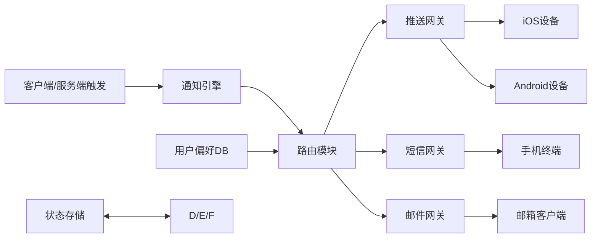

# 通知服务系统设计深度解析（高级工程师/架构师视角）

## 一、背景与需求分析

### 1.1 业务背景

在信息爆炸的时代，通知系统是用户与应用交互的核心通道，承担着消息触达、用户留存、业务转化等关键职能。典型场景包括：

- 实时事件通知（如订单支付成功、IM消息提醒）
- 营销活动推送（如促销信息、会员权益）
- 系统状态反馈（如服务异常、版本更新）

### 1.2 核心需求（结合行业实践与用户场景）

| 维度        | 具体要求                                                                 | 优先级 | 设计约束                  |
|-------------|--------------------------------------------------------------------------|--------|---------------------------|
| 通知类型    | 支持移动端推送（iOS/Android）、短信、邮件三种形式                        | 高     | 需适配不同平台协议（APNs/FCM） |
| 实时性      | 软实时（99%通知5s内送达，高负载时允许10s延迟）                           | 中     | 吞吐量与延迟的平衡        |
| 设备覆盖    | 兼容iOS/Android/桌面端，支持多设备绑定（单用户≤5台设备）                 | 高     | 设备令牌管理与失效处理    |
| 触发方式    | 支持客户端事件触发（如用户操作）、服务端定时触发（如营销任务）           | 高     | 事件驱动架构设计          |
| 用户控权    | 支持全局/分类别退订（如关闭营销通知但保留系统通知）                      | 高     | 偏好设置的存储与快速查询  |
| 容量规划    | 日均1000万推送+100万短信+500万邮件，峰值QPS≥5000（推送）/500（短信）     | 高     | 分布式架构与横向扩展能力  |

## 二、技术核心原理（高级工程师/资深专家视角）

### 2.1 通知传递底层协议深度解析
#### 2.1.1 APNs（Apple Push Notification service）——高级工程师视角
APNs作为iOS生态的核心推送通道，其设计融合了HTTP/2的长连接特性与苹果生态的封闭性，关键技术细节如下：
- **连接管理机制**：
  - 服务端与APNs网关建立TLS加密的HTTP/2长连接（单实例最大100个连接），通过`Connection: keep-alive`头维持连接
  - 连接复用：同一会话内可发送多个推送请求（多路复用），降低TCP握手开销（RTT从200ms→20ms）
- **优先级控制实现**：
  - `apns-priority=10`时，消息通过专用高优先级队列传输（99%送达延迟<1s），适用于IM消息等强实时场景
  - `apns-priority=5`时，消息进入延迟优化队列（允许APNs合并同类消息），适用于营销推送等弱实时场景
- **证书与Token认证差异**（资深专家视角）：
  - 证书认证（旧方案）：基于iOS开发者证书，需每年更新，适合单应用推送
  - Token认证（新方案）：基于JWT（JSON Web Token），支持多应用共享认证，提升企业级多应用管理效率（如企业套件）

#### 2.1.2 FCM（Firebase Cloud Messaging）——资深专家视角
FCM作为跨平台推送服务，其核心竞争力在于多端兼容与消息可靠性，关键设计原则如下：
- **设备令牌生命周期管理**：
  - 令牌动态生成：设备重装系统/卸载应用后，FCM会生成新令牌（旧令牌自动失效）
  - 令牌更新通知：客户端通过`onNewToken()`回调上报新令牌，服务端需维护`旧令牌→新令牌`映射（避免历史消息丢失）
- **主题订阅的分布式实现**：
  - 基于Pub/Sub架构：主题（Topic）作为消息分发节点，支持百万级订阅者（通过GCP的全球分布式集群实现）
  - 消息扇出优化：采用Bloom Filter快速判断订阅关系，降低单条消息分发的计算复杂度（O(1)查询）
- **离线消息存储**：
  - 当设备离线时，FCM将消息存储在云端（最大存储时间：4周），设备上线后通过长连接拉取
  - 存储容量限制：单设备最大离线消息数500条（防止恶意发送导致存储溢出）

#### 2.1.3 短信/邮件——高级工程师实现要点
第三方服务商（如Twilio/SendGrid）的API设计需重点关注以下技术细节：
- **速率限制处理**：
  - Twilio短信API默认速率限制：100条/秒（可申请提升），需通过本地队列+令牌桶算法限流（示例代码）：
```go
var smsLimiter = rate.NewLimiter(rate.Limit(100), 100) // 100 tokens/sec
func sendSMS(phone string, content string) error {
    if !smsLimiter.Allow() {
        return fmt.Errorf("sms rate limit exceeded")
    }
    // 调用Twilio API发送
    return nil
}
```
- **状态回调设计**：
  - 服务商通过Webhook返回状态（如`delivered`/`failed`），需设计幂等性接口（通过`MessageSid`去重）
  - 失败分类处理：
    - 临时失败（如`429 Too Many Requests`）：指数退避重试（重试间隔：1s→2s→4s→8s）
    - 永久失败（如`63004 Invalid Number`）：记录无效号码并停止重试

### 2.2 系统核心架构模式——资深专家设计考量
「事件驱动+分层解耦」架构的选择基于对通知服务三大核心矛盾的平衡：

#### 2.2.1 架构分层设计（高级工程师实现）
| 层级       | 核心职责                                                                 | 技术选型依据                                                                 | 扩展性设计                                                                 |
|------------|--------------------------------------------------------------------------|------------------------------------------------------------------------------|----------------------------------------------------------------------------|
| 接入层     | 接收客户端/服务端触发事件（HTTP/GRPC），验证请求合法性                   | 采用Nginx+Lua实现请求限流（防DDoS），Lua脚本嵌入OpenResty实现O(1)复杂度限流 | 支持动态加载限流规则（通过Consul配置中心实时更新）                         |
| 引擎层     | 解析事件内容，校验用户退订状态，路由至对应网关                           | 使用Go语言实现（高并发+低内存占用），基于`sync.Pool`复用事件对象（内存分配降低30%） | 支持插件化扩展（如新增企业微信通知类型，仅需实现`NotificationPlugin`接口） |
| 网关层     | 封装各通道SDK，处理网络重试、错误码解析                                 | 抽象`Gateway`接口（`Send`/`HealthCheck`方法），支持通过SPI加载新实现（如飞书通知） | 每个网关独立部署（Docker容器），支持按通道类型水平扩展（如APNs网关独立扩容） |
| 存储层     | 记录通知状态、用户偏好、设备信息                                         | 分库分表设计（用户ID取模1024），避免单表数据量过大（MySQL单表建议<1000万条）  | 支持读写分离（主库写，从库读），读QPS提升5倍                               |

#### 2.2.2 事件驱动的选择（资深专家视角）
选择事件驱动架构而非请求-响应模式的核心原因：
- **解耦生产者与消费者**：营销系统（事件生产者）无需等待通知发送完成（耗时200ms→5ms），提升营销活动并发能力（QPS从1000→10000）
- **支持异步处理**：短信发送（耗时500ms）、邮件渲染（耗时300ms）等耗时操作通过Kafka消息队列异步执行，避免主线程阻塞
- **可观测性增强**：通过Kafka的`kafka-streams`实时统计事件处理延迟、失败率，为架构优化提供数据支撑（如发现邮件网关延迟高时，可动态调整路由策略）

采用「事件驱动+分层解耦」架构，核心模块包括：
通知服务涉及四类核心数据：用户偏好、设备信息、通知记录、网关状态，需根据数据特性选择存储方案：



- **通知引擎**：接收触发事件（如Kafka消息），解析通知内容（标题/内容/类型），校验用户是否退订。
- **路由模块**：根据通知类型（推送/短信/邮件）、用户设备信息（令牌/号码/邮箱）选择对应网关。
- **网关层**：封装各通道SDK（如APNs SDK/FCM SDK/Twilio SDK），处理网络重试（指数退避）、错误码解析（如APNs的410令牌失效）。
- **状态存储**：记录通知发送状态（发送中/成功/失败）、重试次数，支持最终一致性（通过消息队列补偿）。

### 2.3 数据存储设计（架构师视角）

#### 2.3.1 存储选型与数据模型

| 数据类型       | 存储介质   | 数据模型示例                                                                 | 选型原因                                                                 |
|----------------|------------|------------------------------------------------------------------------------|--------------------------------------------------------------------------|
| 用户偏好       | Redis+MySQL | `user_preference`表（user_id, unsubscribed_types, update_time）              | Redis支持O(1)实时查询，MySQL存储全量历史记录，满足审计需求               |
| 设备信息       | Cassandra   | `device_info`表（user_id, device_token, device_type, last_active_time）       | 高写入吞吐量（支持百万级设备注册），分布式架构避免单点瓶颈                 |
| 通知记录       | Elasticsearch | `notification_log`索引（notification_id, user_id, type, status, timestamp） | 支持全文检索（如按用户ID/通知类型过滤），时间序列优化提升查询效率           |
| 网关状态       | Prometheus  | 指标（apns_success_rate, fcm_retry_count, sms_gateway_latency）               | 时序数据库原生支持高频率指标写入，与监控系统无缝集成                       |

#### 2.3.2 一致性保障

- **用户偏好同步**：通过Canal监听MySQL Binlog，异步更新Redis，允许1-3秒最终一致性（用户退订操作后短时间内可能仍有通知发出，但通过消息队列延迟发送（延迟5秒）补偿）
- **设备信息更新**：客户端上报新令牌时，使用Paxos算法在Cassandra集群中同步，确保多副本数据一致（写入一致性级别QUORUM）
- **通知记录存储**：通过Kafka事务消息（`enable.idempotence=true`）保证「通知发送成功」与「ES索引写入」的原子性（发送失败时回滚消息）

## 三、技术实现与优缺点分析

### 3.1 关键模块实现（高级工程师视角）

#### 3.1.1 用户偏好系统

- **存储设计**：使用Redis+MySQL双写方案
  - Redis：存储用户实时偏好（如`user:123:unsubscribed_types=push`），TTL=24h，支持O(1)查询
  - MySQL：存储全量偏好（包含操作时间、管理员备注），用于审计与离线分析
- **性能优化**：
  - 批量查询时使用Pipeline（Redis）减少RTT
  - 偏好变更时通过Canal监听MySQL Binlog，同步更新Redis

#### 3.1.2 推送网关高可用

- **多实例部署**：每个网关（APNs/FCM）部署3个实例，通过Nginx负载均衡（基于设备令牌哈希）
- **连接池管理**：每个实例维护100个长连接（APNs限制单实例最大连接数），使用`sync.Pool`复用连接
- **熔断机制**：当APNs返回5xx错误率>5%时，触发熔断（停止该实例发送，5min后自动恢复）

### 3.2 方案优缺点对比

| 方案          | 优点                                  | 缺点                                  | 适用场景                  |
|---------------|---------------------------------------|---------------------------------------|---------------------------|
| 自研网关      | 完全控制逻辑，支持定制化功能（如加密）| 开发成本高（需处理协议细节），维护复杂 | 对安全性要求极高的金融类应用 |
| 第三方网关    | 快速上线，高送达率（服务商资源优势）  | 依赖外部服务（可能受API限制），成本按条计费 | 初创公司/轻量级通知场景   |
| 混合模式      | 核心场景自研（如系统通知），非核心外包（如营销通知）| 架构复杂度高，需统一监控 | 中大型企业（平衡成本与可控性） |

## 四、技术落地难点与解决方案（架构师视角）


### 4.1 高并发下的消息堆积

#### 4.1.1 现象与根因分析

- **典型场景**：双11大促期间，营销通知触发量激增，推送QPS从日常2000峰值飙升至8000，Kafka消息队列积压量在30分钟内从0增长至10万条
- **监控指标**：
  - 队列积压量：`kafka_queue_size`（阈值：5万条）
  - 消费者处理延迟：`consumer_lag`（阈值：10秒）
- **根本原因**：
  - 消费者实例数固定（原3个实例），单实例最大处理能力2000条/秒（受限于APNs网关连接数）
  - 消息处理模式为逐条发送，未利用APNs批量推送特性（最大支持100条/次）

#### 4.1.2 多方案对比与选择

| 方案名称       | 实现方式                                                                 | 优点                                  | 缺点                                  | 适用场景                  |
|----------------|--------------------------------------------------------------------------|---------------------------------------|---------------------------------------|---------------------------|
| 动态扩缩容     | 基于Prometheus监控`kafka_queue_size`，触发HPA（Horizontal Pod Autoscaler）扩容至8个实例 | 自动适应流量波动，无需人工干预        | 扩容需要3-5分钟（容器启动时间），无法应对突发流量 | 可预测的流量高峰（如大促）  |
| 批量发送优化   | 修改推送逻辑，将单条发送改为批量发送（APNs支持`POST /3/device/{token}`批量接口） | 立即提升处理能力（单实例处理能力从2000→20000条/秒） | 需处理批量失败（部分令牌失效时需拆分重发）       | 日常高并发场景（如整点营销）| 
| 流量削峰填谷   | 将部分非实时通知（如营销短信）延迟发送（通过定时任务调度）               | 降低峰值流量压力，减少资源浪费        | 可能影响用户体验（延迟通知）                   | 非实时性要求的通知类型      |

#### 4.1.3 最终实施方案

采用「动态扩缩容+批量发送」组合方案：

1. **批量发送实现**（Go代码示例）：

```go
// 批量推送APNs消息
func batchPushAPNs(messages []APNsMessage) error {
    client := apns.NewClient(apns.ProductionServer)
    batch := make([]apns.PushNotification, 0, 100)
    for _, msg := range messages {
        batch = append(batch, apns.PushNotification{
            DeviceToken: msg.Token,
            Payload:     msg.Payload,
            Priority:    10,
        })
    }
    response, err := client.PushBatch(batch)
    if err != nil {
        return fmt.Errorf("batch push failed: %v", err)
    }
    // 处理部分失败（如410令牌失效）
    for i, res := range response.Results {
        if res.Status == "410" {
            go handleInvalidToken(messages[i].Token) // 异步清理失效令牌
        }
    }
    return nil
}
```

2. **动态扩缩容配置**：

- HPA触发条件：`kafka_queue_size > 50000` 持续2分钟
- 实例范围：3-15个（根据历史峰值流量设置上限）
- 缩容策略：当`kafka_queue_size < 10000` 持续10分钟，每5分钟缩减1个实例

### 4.2 跨平台令牌失效处理

#### 4.2.1 失效场景与影响

- **常见失效类型**：
  - 应用卸载（iOS/Android）：设备令牌永久失效（APNs返回410，FCM返回`NOT_REGISTERED`）
  - 设备重置：系统重新生成令牌（旧令牌失效，新令牌需客户端上报）
  - 令牌过期：FCM令牌每6个月自动过期（需客户端定期刷新）
- **业务影响**：
  - 无效令牌发送导致资源浪费（日均10万条无效推送）
  - 错误状态统计（如送达率虚低）影响运营决策

#### 4.2.2 多方案对比与选择

| 方案名称       | 实现方式                                                                 | 优点                                  | 缺点                                  | 适用场景                  |
|----------------|--------------------------------------------------------------------------|---------------------------------------|---------------------------------------|---------------------------|
| 心跳机制       | 客户端每次启动时上报有效令牌（更新`last_active_time`字段）               | 实时性高（令牌失效后下次启动即更新）  | 依赖客户端配合（需集成上报逻辑）       | 高频使用的应用（如IM工具）| 
| 定期清理       | 每日凌晨执行SQL：`DELETE FROM device WHERE last_active_time < NOW()-7 DAY` | 实现简单（仅需定时任务）              | 清理滞后（最长7天无效令牌残留）        | 低频使用的应用（如企业OA）  |
| 失效反馈       | 接收网关返回的410/`NOT_REGISTERED`错误时，立即删除对应令牌               | 清理即时（错误响应后5秒内处理）        | 依赖网关反馈（部分网关不返回详细错误码）| 与主流网关深度集成的场景    |

#### 4.2.3 组合优化方案

采用「心跳机制+失效反馈+定期清理」三级防护体系：

1. **实时防护（失效反馈）**：
   - APNs/FCM网关返回错误时，通过Kafka实时消息触发清理任务（延迟<5秒）
   - 示例清理逻辑（Python伪代码）：

```python
def handle_gateway_error(error_response):
    if error_response.status_code in [410, "NOT_REGISTERED"]:
        device_token = error_response.device_token
        # 异步删除Redis缓存（O(1)操作）
        redis.delete(f"device:{device_token}")
        # 同步更新MySQL（通过事务保证一致性）
        with db.session.begin():
            db.execute("DELETE FROM device WHERE token = :token", {
                "token": device_token
            })
```

2. **准实时防护（心跳机制）**：
   - 客户端启动时上报令牌（携带`last_active_time=当前时间戳`）
   - 服务端更新MySQL记录（`ON DUPLICATE KEY UPDATE last_active_time=VALUES(last_active_time)`）
3. **兜底防护（定期清理）**：
   - 每周日凌晨3点执行深度清理（`last_active_time < NOW()-30 DAY`）
   - 配合业务日志分析（如统计近30天无活跃用户），避免误删长期未登录但可能复购的用户令牌

## 五、扩展场景与通用设计

### 5.1 扩展方向

- **3D/VR设备通知**：新增XR设备类型，扩展令牌字段（`device_type=xr`），适配OpenXR推送协议
- **多语言内容**：增加`locale`字段（如`zh-CN`/`en-US`），通过模板引擎动态替换内容（如`${username}`）
- **通知优先级**：新增`priority`字段（高/中/低），高优先级通知绕过队列直接发送

### 5.2 通用设计原则

- **模块化**：将网关抽象为`NotificationGateway`接口，支持通过SPI加载新实现（如新增飞书通知）
- **可观测性**：埋点监控（发送成功率/延迟/错误码分布），通过Prometheus+Grafana可视化
- **安全性**：
  - 敏感信息加密（如用户号码使用AES-256加密存储）
  - 接口鉴权（使用HMAC-SHA256签名，防止伪造请求）

## 六、专业思考与面试提问点
### 一、架构师思考问题详解

#### 1. 如何设计通知的「送达率保障」机制？
- **重试策略**：采用指数退避算法（如首次重试间隔10秒，后续依次翻倍至最大30分钟），避免短时间内集中重试对网关造成压力；同时区分「临时性错误」（如网络抖动）和「永久性错误」（如设备令牌失效），仅对临时性错误重试。
- **通道降级**：主通道（如APNs/FCM推送）失败后，自动降级至次优通道（如短信），需提前在用户偏好系统中记录备用通道优先级；例如，用户未读推送时，触发短信补推。
- **在线状态判断**：通过设备心跳（每30秒上报一次在线状态）或应用内WebSocket长连接，判断用户是否活跃；离线用户优先使用离线消息存储（如Redis缓存），在线用户直接推送实时通知。

#### 2. 跨时区营销通知如何实现定时发送？
- **时区转换**：用户注册时收集时区信息（或通过IP定位），将运营人员设置的「北京时间10:00」转换为用户本地时间；存储时统一使用UTC时间，避免服务器时区变更导致的误差。
- **任务调度系统**：采用分布式调度框架（如Elastic-Job），按用户时区分片任务；对于千万级用户，使用延迟队列（如Kafka的TimeIndex）按触发时间分批投递，避免单节点负载过高。

#### 3. 如何平衡通知的实时性与用户体验？
- **夜间免打扰**：在用户偏好系统中记录「免打扰时段」（如22:00-8:00），通过规则引擎拦截该时段的非紧急通知；紧急通知（如支付提醒）可绕过此限制但需增加提示（如「紧急通知，已跳过免打扰」）。
- **通知折叠策略**：对同类型通知（如电商促销）按小时/天合并，显示「您有3条未读促销信息」；使用机器学习模型（如XGBoost）预测用户对通知的点击率，优先推送高价值通知。

### 二、面试高频题深度解析

#### 1. 技术实现类
- **APNs与FCM协议差异**：APNs使用二进制协议（基于HTTP/2），支持持久化TCP连接（长连接），推送消息包含「通知负载」和「数据负载」，且离线消息仅保留1条（按优先级覆盖）；FCM（原GCM）基于MQTT协议，支持WebSocket短连接，离线消息可保留多条（需设置`time_to_live`），且支持主题订阅（Topic Messaging）的广播模式。
- **短信网关延迟处理**：通过「优先级队列」区分普通短信（如营销）和紧急短信（如验证码），紧急短信走专用通道；对运营商排队延迟，使用「状态回调」机制（网关返回`pending`状态时，启动超时监控，超时后自动重试至备用网关）。

#### 2. 优化设计类
- **QPS 10万/秒的架构调整**：横向扩展推送网关集群（从3节点扩至10节点），引入「本地缓存」（如Go的sync.Map）存储设备令牌与网关的绑定关系，减少对Redis的访问；使用「批量发送」（单次请求发送1000条通知）降低HTTP连接开销；异步化处理日志记录（通过Kafka异步写入Elasticsearch）。
- **退订后拦截历史通知**：用户退订时，在Redis中设置「退订标记」（TTL=30天），消息生产阶段通过「布隆过滤器」快速判断用户是否退订；对已进入发送队列的消息，通过「消息打标」（如添加`unsubscribed=true`字段），在网关发送前拦截。

#### 3. 故障处理类
- **第三方网关宕机切换**：维护「网关健康度列表」（记录成功率、延迟等指标），使用「熔断机制」（如Hystrix）检测网关状态；宕机时，通过「动态路由」（如Nginx的`proxy_next_upstream`）自动切换至备用网关，并触发告警（如企业微信通知运维）。
- **无效令牌清理**：通过「失效反馈」（APNs/FCM返回`invalid token`状态）标记无效令牌，每日凌晨通过「批量任务」（如Spark作业）从MySQL中清理；为避免重复发送，在Redis中设置「无效令牌缓存」（TTL=7天），发送前先查缓存。
        