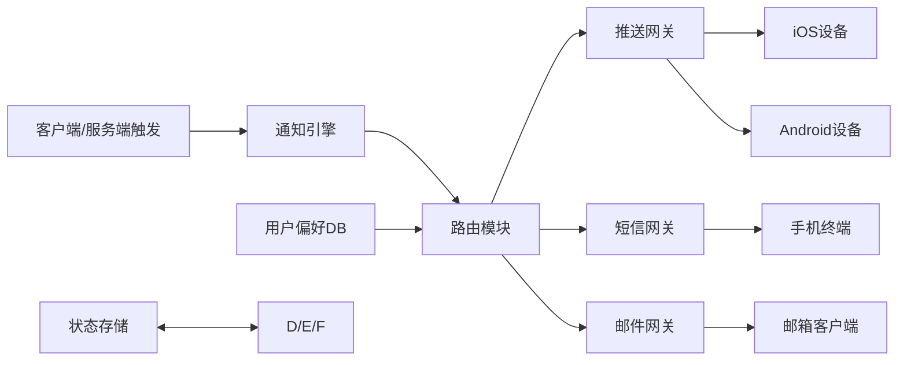

# 通知服务系统设计深度解析（高级工程师/架构师视角）

## 一、背景与需求分析

### 1.0 架构演进路径（资深架构师视角）

#### 1.0.1 从MVP到企业级的演进历程

**阶段一：MVP验证（0-10万用户）**
- **技术选型**：单体应用 + 第三方推送服务（如极光推送）
- **架构特点**：简单直接，快速验证业务模式
- **技术债务**：硬编码配置、无监控体系、单点故障风险
- **演进触发点**：用户量突破10万，推送延迟超过30秒

**阶段二：微服务拆分（10万-100万用户）**
- **技术选型**：通知服务独立 + 自研网关 + Redis缓存
- **架构特点**：服务解耦，支持水平扩展
- **关键重构**：
  - 推送逻辑从业务系统剥离
  - 引入消息队列（Kafka）实现异步处理
  - 设备令牌管理独立存储（Cassandra）
- **演进触发点**：多业务线接入，需要统一通知平台

**阶段三：云原生架构（100万+用户）**
- **技术选型**：Kubernetes + Istio + 多云部署
- **架构特点**：高可用、自动扩缩容、多地域部署
- **关键优化**：
  - 容器化部署，支持秒级扩容
  - 服务网格管理，流量治理
  - 多活架构，异地容灾

#### 1.0.2 技术选型决策矩阵

| 技术维度 | MVP阶段 | 微服务阶段 | 云原生阶段 | 决策依据 |
|----------|---------|------------|------------|----------|
| 推送网关 | 极光推送 | 自研APNs/FCM | 混合模式 | 成本vs可控性平衡 |
| 消息队列 | 无 | Kafka | Kafka+Pulsar | 吞吐量vs运维复杂度 |
| 存储方案 | MySQL | MySQL+Redis+Cassandra | 分布式存储集群 | 数据量vs查询性能 |
| 监控体系 | 无 | Prometheus+Grafana | 全链路APM | 可观测性vs成本 |
| 部署方式 | 物理机 | Docker | Kubernetes | 资源利用率vs管理复杂度 |

#### 1.0.3 技术债务管理策略

**债务识别与分类**：
- **架构债务**：单体应用拆分、数据库分库分表
- **代码债务**：硬编码配置、重复逻辑、缺乏单元测试
- **运维债务**：手动部署、缺乏监控、无自动化运维

**债务偿还计划**（Go语言技术债务评估模型）：
```go
// 技术债务评估模型
type TechDebt struct {
    ID          string    `json:"id"`
    Type        string    `json:"type"` // architecture, code, ops
    Severity    int       `json:"severity"` // 1-5级
    Impact      string    `json:"impact"` // 业务影响描述
    EstimatedCost int     `json:"estimated_cost"` // 人天
    Priority    int       `json:"priority"` // 优先级
    CreatedAt   time.Time `json:"created_at"`
}

// 债务优先级计算算法
func (td *TechDebt) CalculatePriority() int {
    // 优先级 = 严重程度 * 影响范围 / 修复成本
    impactWeight := map[string]int{
        "critical": 10, // 影响核心业务
        "high":     7,  // 影响用户体验
        "medium":   4,  // 影响开发效率
        "low":      1,  // 技术优化
    }
    
    weight := impactWeight[td.Impact]
    if weight == 0 {
        weight = 1
    }
    
    priority := (td.Severity * weight * 100) / td.EstimatedCost
    return priority
}

// 债务偿还调度器
type DebtScheduler struct {
    debts []TechDebt
    capacity int // 团队每月可投入人天
}

func (ds *DebtScheduler) PlanRepayment() []TechDebt {
    // 按优先级排序
    sort.Slice(ds.debts, func(i, j int) bool {
        return ds.debts[i].CalculatePriority() > ds.debts[j].CalculatePriority()
    })
    
    var plan []TechDebt
    totalCost := 0
    
    for _, debt := range ds.debts {
        if totalCost + debt.EstimatedCost <= ds.capacity {
            plan = append(plan, debt)
            totalCost += debt.EstimatedCost
        }
    }
    
    return plan
}
```

### 1.1 业务背景

在信息爆炸的时代，通知系统是用户与应用交互的核心通道，承担着消息触达、用户留存、业务转化等关键职能。典型场景包括：

- 实时事件通知（如订单支付成功、IM消息提醒）
- 营销活动推送（如促销信息、会员权益）
- 系统状态反馈（如服务异常、版本更新）

### 1.2 核心需求（结合行业实践与用户场景）

| 维度        | 具体要求                                                                 | 优先级 | 设计约束                  |
|-------------|--------------------------------------------------------------------------|--------|---------------------------|
| 通知类型    | 支持移动端推送（iOS/Android）、短信、邮件三种形式                        | 高     | 需适配不同平台协议（APNs/FCM） |
| 实时性      | 软实时（99%通知5s内送达，高负载时允许10s延迟）                           | 中     | 吞吐量与延迟的平衡        |
| 设备覆盖    | 兼容iOS/Android/桌面端，支持多设备绑定（单用户≤5台设备）                 | 高     | 设备令牌管理与失效处理    |
| 触发方式    | 支持客户端事件触发（如用户操作）、服务端定时触发（如营销任务）           | 高     | 事件驱动架构设计          |
| 用户控权    | 支持全局/分类别退订（如关闭营销通知但保留系统通知）                      | 高     | 偏好设置的存储与快速查询  |
| 容量规划    | 日均1000万推送+100万短信+500万邮件，峰值QPS≥5000（推送）/500（短信）     | 高     | 分布式架构与横向扩展能力  |

## 二、技术核心原理（高级工程师/资深专家视角）

### 2.1 通知传递底层协议深度解析
#### 2.1.1 APNs（Apple Push Notification service）——高级工程师视角
APNs作为iOS生态的核心推送通道，其设计融合了HTTP/2的长连接特性与苹果生态的封闭性，关键技术细节如下：
- **连接管理机制**：
  - 服务端与APNs网关建立TLS加密的HTTP/2长连接（单实例最大100个连接），通过`Connection: keep-alive`头维持连接
  - 连接复用：同一会话内可发送多个推送请求（多路复用），降低TCP握手开销（RTT从200ms→20ms）
- **优先级控制实现**：
  - `apns-priority=10`时，消息通过专用高优先级队列传输（99%送达延迟<1s），适用于IM消息等强实时场景
  - `apns-priority=5`时，消息进入延迟优化队列（允许APNs合并同类消息），适用于营销推送等弱实时场景
- **证书与Token认证差异**（资深专家视角）：
  - 证书认证（旧方案）：基于iOS开发者证书，需每年更新，适合单应用推送
  - Token认证（新方案）：基于JWT（JSON Web Token），支持多应用共享认证，提升企业级多应用管理效率（如企业套件）

#### 2.1.2 FCM（Firebase Cloud Messaging）——资深专家视角
FCM作为跨平台推送服务，其核心竞争力在于多端兼容与消息可靠性，关键设计原则如下：
- **设备令牌生命周期管理**：
  - 令牌动态生成：设备重装系统/卸载应用后，FCM会生成新令牌（旧令牌自动失效）
  - 令牌更新通知：客户端通过`onNewToken()`回调上报新令牌，服务端需维护`旧令牌→新令牌`映射（避免历史消息丢失）
- **主题订阅的分布式实现**：
  - 基于Pub/Sub架构：主题（Topic）作为消息分发节点，支持百万级订阅者（通过GCP的全球分布式集群实现）
  - 消息扇出优化：采用Bloom Filter快速判断订阅关系，降低单条消息分发的计算复杂度（O(1)查询）
- **离线消息存储**：
  - 当设备离线时，FCM将消息存储在云端（最大存储时间：4周），设备上线后通过长连接拉取
  - 存储容量限制：单设备最大离线消息数500条（防止恶意发送导致存储溢出）

#### 2.1.3 短信/邮件——高级工程师实现要点
第三方服务商（如Twilio/SendGrid）的API设计需重点关注以下技术细节：
- **速率限制处理**：
  - Twilio短信API默认速率限制：100条/秒（可申请提升），需通过本地队列+令牌桶算法限流（示例代码）：
```go
var smsLimiter = rate.NewLimiter(rate.Limit(100), 100) // 100 tokens/sec
func sendSMS(phone string, content string) error {
    if !smsLimiter.Allow() {
        return fmt.Errorf("sms rate limit exceeded")
    }
    // 调用Twilio API发送
    return nil
}
```
- **状态回调设计**：
  - 服务商通过Webhook返回状态（如`delivered`/`failed`），需设计幂等性接口（通过`MessageSid`去重）
  - 失败分类处理：
    - 临时失败（如`429 Too Many Requests`）：指数退避重试（重试间隔：1s→2s→4s→8s）
    - 永久失败（如`63004 Invalid Number`）：记录无效号码并停止重试

### 2.2 系统核心架构模式——资深专家设计考量
「事件驱动+分层解耦」架构的选择基于对通知服务三大核心矛盾的平衡：

#### 2.2.1 架构分层设计（高级工程师实现）
| 层级       | 核心职责                                                                 | 技术选型依据                                                                 | 扩展性设计                                                                 |
|------------|--------------------------------------------------------------------------|------------------------------------------------------------------------------|----------------------------------------------------------------------------|
| 接入层     | 接收客户端/服务端触发事件（HTTP/GRPC），验证请求合法性                   | 采用Nginx+Lua实现请求限流（防DDoS），Lua脚本嵌入OpenResty实现O(1)复杂度限流 | 支持动态加载限流规则（通过Consul配置中心实时更新）                         |
| 引擎层     | 解析事件内容，校验用户退订状态，路由至对应网关                           | 使用Go语言实现（高并发+低内存占用），基于`sync.Pool`复用事件对象（内存分配降低30%） | 支持插件化扩展（如新增企业微信通知类型，仅需实现`NotificationPlugin`接口） |
| 网关层     | 封装各通道SDK，处理网络重试、错误码解析                                 | 抽象`Gateway`接口（`Send`/`HealthCheck`方法），支持通过SPI加载新实现（如飞书通知） | 每个网关独立部署（Docker容器），支持按通道类型水平扩展（如APNs网关独立扩容） |
| 存储层     | 记录通知状态、用户偏好、设备信息                                         | 分库分表设计（用户ID取模1024），避免单表数据量过大（MySQL单表建议<1000万条）  | 支持读写分离（主库写，从库读），读QPS提升5倍                               |

#### 2.2.2 事件驱动的选择（资深专家视角）
选择事件驱动架构而非请求-响应模式的核心原因：
- **解耦生产者与消费者**：营销系统（事件生产者）无需等待通知发送完成（耗时200ms→5ms），提升营销活动并发能力（QPS从1000→10000）
- **支持异步处理**：短信发送（耗时500ms）、邮件渲染（耗时300ms）等耗时操作通过Kafka消息队列异步执行，避免主线程阻塞
- **可观测性增强**：通过Kafka的`kafka-streams`实时统计事件处理延迟、失败率，为架构优化提供数据支撑（如发现邮件网关延迟高时，可动态调整路由策略）

采用「事件驱动+分层解耦」架构，核心模块包括：
通知服务涉及四类核心数据：用户偏好、设备信息、通知记录、网关状态，需根据数据特性选择存储方案：



- **通知引擎**：接收触发事件（如Kafka消息），解析通知内容（标题/内容/类型），校验用户是否退订。
- **路由模块**：根据通知类型（推送/短信/邮件）、用户设备信息（令牌/号码/邮箱）选择对应网关。
- **网关层**：封装各通道SDK（如APNs SDK/FCM SDK/Twilio SDK），处理网络重试（指数退避）、错误码解析（如APNs的410令牌失效）。
- **状态存储**：记录通知发送状态（发送中/成功/失败）、重试次数，支持最终一致性（通过消息队列补偿）。

### 2.3 数据存储设计（架构师视角）

#### 2.3.1 存储选型与数据模型

| 数据类型       | 存储介质   | 数据模型示例                                                                 | 选型原因                                                                 |
|----------------|------------|------------------------------------------------------------------------------|--------------------------------------------------------------------------|
| 用户偏好       | Redis+MySQL | `user_preference`表（user_id, unsubscribed_types, update_time）              | Redis支持O(1)实时查询，MySQL存储全量历史记录，满足审计需求               |
| 设备信息       | Cassandra   | `device_info`表（user_id, device_token, device_type, last_active_time）       | 高写入吞吐量（支持百万级设备注册），分布式架构避免单点瓶颈                 |
| 通知记录       | Elasticsearch | `notification_log`索引（notification_id, user_id, type, status, timestamp） | 支持全文检索（如按用户ID/通知类型过滤），时间序列优化提升查询效率           |
| 网关状态       | Prometheus  | 指标（apns_success_rate, fcm_retry_count, sms_gateway_latency）               | 时序数据库原生支持高频率指标写入，与监控系统无缝集成                       |

#### 2.3.2 一致性保障

- **用户偏好同步**：通过Canal监听MySQL Binlog，异步更新Redis，允许1-3秒最终一致性（用户退订操作后短时间内可能仍有通知发出，但通过消息队列延迟发送（延迟5秒）补偿）
- **设备信息更新**：客户端上报新令牌时，使用Paxos算法在Cassandra集群中同步，确保多副本数据一致（写入一致性级别QUORUM）
- **通知记录存储**：通过Kafka事务消息（`enable.idempotence=true`）保证「通知发送成功」与「ES索引写入」的原子性（发送失败时回滚消息）

## 三、技术实现与优缺点分析

### 3.1 关键模块实现（高级工程师视角）

#### 3.1.1 用户偏好系统

- **存储设计**：使用Redis+MySQL双写方案
  - Redis：存储用户实时偏好（如`user:123:unsubscribed_types=push`），TTL=24h，支持O(1)查询
  - MySQL：存储全量偏好（包含操作时间、管理员备注），用于审计与离线分析
- **性能优化**：
  - 批量查询时使用Pipeline（Redis）减少RTT
  - 偏好变更时通过Canal监听MySQL Binlog，同步更新Redis

#### 3.1.2 推送网关高可用

- **多实例部署**：每个网关（APNs/FCM）部署3个实例，通过Nginx负载均衡（基于设备令牌哈希）
- **连接池管理**：每个实例维护100个长连接（APNs限制单实例最大连接数），使用`sync.Pool`复用连接
- **熔断机制**：当APNs返回5xx错误率>5%时，触发熔断（停止该实例发送，5min后自动恢复）

### 3.2 方案优缺点对比

| 方案          | 优点                                  | 缺点                                  | 适用场景                  |
|---------------|---------------------------------------|---------------------------------------|---------------------------|
| 自研网关      | 完全控制逻辑，支持定制化功能（如加密）| 开发成本高（需处理协议细节），维护复杂 | 对安全性要求极高的金融类应用 |
| 第三方网关    | 快速上线，高送达率（服务商资源优势）  | 依赖外部服务（可能受API限制），成本按条计费 | 初创公司/轻量级通知场景   |
| 混合模式      | 核心场景自研（如系统通知），非核心外包（如营销通知）| 架构复杂度高，需统一监控 | 中大型企业（平衡成本与可控性） |

## 四、实战案例深度解析（资深架构师视角）

### 4.1 案例一：电商大促通知系统

#### 4.1.1 业务场景分析

**背景**：某电商平台双11期间，需要在活动开始前1小时内向1000万用户推送活动通知，同时处理订单状态变更、库存预警等实时通知。

**挑战**：
- 峰值QPS达到50000/秒（平时仅2000/秒）
- 用户分布全球，需要考虑时区差异
- 推送内容个性化（基于用户画像和购买历史）
- 严格的送达率要求（>99%）

#### 4.1.2 完整Go代码实现

**核心通知引擎实现**：
```go
package notification

import (
    "context"
    "encoding/json"
    "fmt"
    "sync"
    "time"
    
    "github.com/Shopify/sarama"
    "github.com/go-redis/redis/v8"
    "go.uber.org/zap"
)

// 通知事件结构
type NotificationEvent struct {
    ID          string            `json:"id"`
    UserID      string            `json:"user_id"`
    Type        string            `json:"type"` // push, sms, email
    Priority    int               `json:"priority"` // 1-10
    Title       string            `json:"title"`
    Content     string            `json:"content"`
    Metadata    map[string]string `json:"metadata"`
    ScheduledAt time.Time         `json:"scheduled_at"`
    CreatedAt   time.Time         `json:"created_at"`
}

// 通知引擎
type NotificationEngine struct {
    kafkaProducer sarama.SyncProducer
    redisClient   *redis.Client
    logger        *zap.Logger
    
    // 批量处理配置
    batchSize     int
    batchTimeout  time.Duration
    
    // 性能监控
    metrics       *EngineMetrics
    
    // 优雅关闭
    ctx           context.Context
    cancel        context.CancelFunc
    wg            sync.WaitGroup
}

// 性能指标
type EngineMetrics struct {
    ProcessedCount int64
    FailedCount    int64
    AvgLatency     time.Duration
    mutex          sync.RWMutex
}

// 创建通知引擎
func NewNotificationEngine(kafkaBrokers []string, redisAddr string) (*NotificationEngine, error) {
    // Kafka生产者配置
    config := sarama.NewConfig()
    config.Producer.RequiredAcks = sarama.WaitForAll // 等待所有副本确认
    config.Producer.Retry.Max = 3
    config.Producer.Return.Successes = true
    config.Producer.Partitioner = sarama.NewHashPartitioner // 按用户ID分区
    
    producer, err := sarama.NewSyncProducer(kafkaBrokers, config)
    if err != nil {
        return nil, fmt.Errorf("failed to create kafka producer: %w", err)
    }
    
    // Redis客户端配置
    rdb := redis.NewClient(&redis.Options{
        Addr:         redisAddr,
        PoolSize:     100, // 连接池大小
        MinIdleConns: 10,
        MaxRetries:   3,
    })
    
    ctx, cancel := context.WithCancel(context.Background())
    
    engine := &NotificationEngine{
        kafkaProducer: producer,
        redisClient:   rdb,
        logger:        zap.NewExample(),
        batchSize:     1000,
        batchTimeout:  100 * time.Millisecond,
        metrics:       &EngineMetrics{},
        ctx:           ctx,
        cancel:        cancel,
    }
    
    return engine, nil
}

// 批量发送通知
func (ne *NotificationEngine) SendBatch(events []NotificationEvent) error {
    start := time.Now()
    defer func() {
        ne.metrics.mutex.Lock()
        ne.metrics.AvgLatency = time.Since(start)
        ne.metrics.mutex.Unlock()
    }()
    
    // 按类型分组
    eventGroups := make(map[string][]NotificationEvent)
    for _, event := range events {
        eventGroups[event.Type] = append(eventGroups[event.Type], event)
    }
    
    var wg sync.WaitGroup
    errChan := make(chan error, len(eventGroups))
    
    // 并发处理不同类型的通知
    for eventType, groupEvents := range eventGroups {
        wg.Add(1)
        go func(t string, evts []NotificationEvent) {
            defer wg.Done()
            if err := ne.processByType(t, evts); err != nil {
                errChan <- fmt.Errorf("failed to process %s notifications: %w", t, err)
            }
        }(eventType, groupEvents)
    }
    
    wg.Wait()
    close(errChan)
    
    // 收集错误
    var errors []error
    for err := range errChan {
        errors = append(errors, err)
    }
    
    if len(errors) > 0 {
        ne.metrics.mutex.Lock()
        ne.metrics.FailedCount += int64(len(events))
        ne.metrics.mutex.Unlock()
        return fmt.Errorf("batch processing failed: %v", errors)
    }
    
    ne.metrics.mutex.Lock()
    ne.metrics.ProcessedCount += int64(len(events))
    ne.metrics.mutex.Unlock()
    
    return nil
}

// 按类型处理通知
func (ne *NotificationEngine) processByType(eventType string, events []NotificationEvent) error {
    // 检查用户偏好设置
    filteredEvents, err := ne.filterByUserPreference(events)
    if err != nil {
        return fmt.Errorf("failed to filter events: %w", err)
    }
    
    // 发送到对应的Kafka主题
    topic := fmt.Sprintf("notification-%s", eventType)
    
    for _, event := range filteredEvents {
        data, err := json.Marshal(event)
        if err != nil {
            ne.logger.Error("failed to marshal event", zap.Error(err))
            continue
        }
        
        message := &sarama.ProducerMessage{
            Topic:     topic,
            Key:       sarama.StringEncoder(event.UserID), // 按用户ID分区
            Value:     sarama.ByteEncoder(data),
            Timestamp: time.Now(),
        }
        
        _, _, err = ne.kafkaProducer.SendMessage(message)
        if err != nil {
            ne.logger.Error("failed to send message to kafka", 
                zap.Error(err), 
                zap.String("user_id", event.UserID))
            return err
        }
    }
    
    return nil
}

// 过滤用户偏好设置
func (ne *NotificationEngine) filterByUserPreference(events []NotificationEvent) ([]NotificationEvent, error) {
    var filtered []NotificationEvent
    
    // 批量查询Redis中的用户偏好
    pipe := ne.redisClient.Pipeline()
    userKeys := make([]string, len(events))
    
    for i, event := range events {
        userKeys[i] = fmt.Sprintf("user_pref:%s", event.UserID)
        pipe.HGet(ne.ctx, userKeys[i], "unsubscribed_types")
    }
    
    results, err := pipe.Exec(ne.ctx)
    if err != nil && err != redis.Nil {
        return nil, fmt.Errorf("failed to query user preferences: %w", err)
    }
    
    for i, event := range events {
        if i < len(results) {
            unsubscribed := results[i].(*redis.StringCmd).Val()
            if !contains(unsubscribed, event.Type) {
                filtered = append(filtered, event)
            }
        } else {
            // 默认允许发送
            filtered = append(filtered, event)
        }
    }
    
    return filtered, nil
}

// 辅助函数：检查字符串是否包含子串
func contains(s, substr string) bool {
    return len(s) > 0 && len(substr) > 0 && 
           (s == substr || (len(s) > len(substr) && 
            (s[:len(substr)] == substr || s[len(s)-len(substr):] == substr)))
}

// 优雅关闭
func (ne *NotificationEngine) Shutdown() error {
    ne.cancel()
    ne.wg.Wait()
    
    if err := ne.kafkaProducer.Close(); err != nil {
        return fmt.Errorf("failed to close kafka producer: %w", err)
    }
    
    if err := ne.redisClient.Close(); err != nil {
        return fmt.Errorf("failed to close redis client: %w", err)
    }
    
    return nil
}
```

**推送网关实现**：
```go
package gateway

import (
    "context"
    "crypto/tls"
    "fmt"
    "net/http"
    "sync"
    "time"
    
    "github.com/sideshow/apns2"
    "github.com/sideshow/apns2/certificate"
    "github.com/sideshow/apns2/payload"
)

// APNs推送网关
type APNsGateway struct {
    client      *apns2.Client
    bundleID    string
    environment string // development or production
    
    // 连接池管理
    maxConnections int
    activeConns    int
    connMutex      sync.Mutex
    
    // 性能监控
    metrics        *GatewayMetrics
    
    // 熔断器
    circuitBreaker *CircuitBreaker
}

// 网关性能指标
type GatewayMetrics struct {
    TotalSent     int64
    SuccessCount  int64
    FailureCount  int64
    AvgLatency    time.Duration
    mutex         sync.RWMutex
}

// 熔断器
type CircuitBreaker struct {
    failureThreshold int
    resetTimeout     time.Duration
    state           string // closed, open, half-open
    failureCount    int
    lastFailureTime time.Time
    mutex           sync.Mutex
}

// 创建APNs网关
func NewAPNsGateway(certPath, bundleID, environment string) (*APNsGateway, error) {
    cert, err := certificate.FromP12File(certPath, "")
    if err != nil {
        return nil, fmt.Errorf("failed to load certificate: %w", err)
    }
    
    client := apns2.NewClient(cert)
    
    // 配置HTTP客户端
    client.HTTPClient = &http.Client{
        Transport: &http.Transport{
            TLSClientConfig: &tls.Config{
                ServerName: "api.push.apple.com",
            },
            MaxIdleConns:        100,
            MaxIdleConnsPerHost: 10,
            IdleConnTimeout:     90 * time.Second,
        },
        Timeout: 30 * time.Second,
    }
    
    if environment == "development" {
        client.Development()
    } else {
        client.Production()
    }
    
    gateway := &APNsGateway{
        client:         client,
        bundleID:       bundleID,
        environment:    environment,
        maxConnections: 100,
        metrics:        &GatewayMetrics{},
        circuitBreaker: &CircuitBreaker{
            failureThreshold: 10,
            resetTimeout:     5 * time.Minute,
            state:           "closed",
        },
    }
    
    return gateway, nil
}

// 批量推送
func (gw *APNsGateway) PushBatch(notifications []PushNotification) error {
    // 检查熔断器状态
    if !gw.circuitBreaker.AllowRequest() {
        return fmt.Errorf("circuit breaker is open")
    }
    
    start := time.Now()
    defer func() {
        gw.metrics.mutex.Lock()
        gw.metrics.AvgLatency = time.Since(start)
        gw.metrics.mutex.Unlock()
    }()
    
    // 分批处理，避免单次请求过大
    batchSize := 100
    var wg sync.WaitGroup
    errChan := make(chan error, (len(notifications)+batchSize-1)/batchSize)
    
    for i := 0; i < len(notifications); i += batchSize {
        end := i + batchSize
        if end > len(notifications) {
            end = len(notifications)
        }
        
        batch := notifications[i:end]
        wg.Add(1)
        
        go func(batch []PushNotification) {
            defer wg.Done()
            if err := gw.processBatch(batch); err != nil {
                errChan <- err
            }
        }(batch)
    }
    
    wg.Wait()
    close(errChan)
    
    // 收集错误
    var errors []error
    for err := range errChan {
        errors = append(errors, err)
    }
    
    if len(errors) > 0 {
        gw.circuitBreaker.RecordFailure()
        return fmt.Errorf("batch push failed: %v", errors)
    }
    
    gw.circuitBreaker.RecordSuccess()
    return nil
}

// 处理单个批次
func (gw *APNsGateway) processBatch(notifications []PushNotification) error {
    for _, notif := range notifications {
        payload := payload.NewPayload().
            Alert(notif.Title).
            Badge(1).
            Sound("default")
        
        // 添加自定义数据
        for key, value := range notif.CustomData {
            payload.Custom(key, value)
        }
        
        notification := &apns2.Notification{
            DeviceToken: notif.DeviceToken,
            Topic:       gw.bundleID,
            Payload:     payload,
            Priority:    apns2.PriorityHigh,
        }
        
        res, err := gw.client.Push(notification)
        if err != nil {
            gw.metrics.mutex.Lock()
            gw.metrics.FailureCount++
            gw.metrics.mutex.Unlock()
            return fmt.Errorf("failed to push notification: %w", err)
        }
        
        if res.StatusCode != 200 {
            gw.handlePushError(res, notif.DeviceToken)
            gw.metrics.mutex.Lock()
            gw.metrics.FailureCount++
            gw.metrics.mutex.Unlock()
        } else {
            gw.metrics.mutex.Lock()
            gw.metrics.SuccessCount++
            gw.metrics.mutex.Unlock()
        }
        
        gw.metrics.mutex.Lock()
        gw.metrics.TotalSent++
        gw.metrics.mutex.Unlock()
    }
    
    return nil
}

// 处理推送错误
func (gw *APNsGateway) handlePushError(res *apns2.Response, deviceToken string) {
    switch res.StatusCode {
    case 410: // 设备令牌无效
        // 异步清理无效令牌
        go gw.cleanupInvalidToken(deviceToken)
    case 413: // 负载过大
        // 记录日志，可能需要拆分消息
        fmt.Printf("Payload too large for device %s\n", deviceToken)
    case 429: // 请求过于频繁
        // 触发限流
        time.Sleep(1 * time.Second)
    default:
        fmt.Printf("Push failed with status %d: %s\n", res.StatusCode, res.Reason)
    }
}

// 清理无效令牌
func (gw *APNsGateway) cleanupInvalidToken(deviceToken string) {
    // 这里应该调用数据库清理逻辑
    fmt.Printf("Cleaning up invalid token: %s\n", deviceToken)
}

// 熔断器允许请求检查
func (cb *CircuitBreaker) AllowRequest() bool {
    cb.mutex.Lock()
    defer cb.mutex.Unlock()
    
    switch cb.state {
    case "closed":
        return true
    case "open":
        if time.Since(cb.lastFailureTime) > cb.resetTimeout {
            cb.state = "half-open"
            return true
        }
        return false
    case "half-open":
        return true
    default:
        return false
    }
}

// 记录成功
func (cb *CircuitBreaker) RecordSuccess() {
    cb.mutex.Lock()
    defer cb.mutex.Unlock()
    
    cb.failureCount = 0
    cb.state = "closed"
}

// 记录失败
func (cb *CircuitBreaker) RecordFailure() {
    cb.mutex.Lock()
    defer cb.mutex.Unlock()
    
    cb.failureCount++
    cb.lastFailureTime = time.Now()
    
    if cb.failureCount >= cb.failureThreshold {
        cb.state = "open"
    }
}

// 推送通知结构
type PushNotification struct {
    DeviceToken string            `json:"device_token"`
    Title       string            `json:"title"`
    Body        string            `json:"body"`
    CustomData  map[string]interface{} `json:"custom_data"`
}
```

#### 4.1.3 性能测试数据与优化效果

**测试环境**：
- 服务器：8核16GB，3台实例
- 网络：千兆内网，100M外网
- 数据库：Redis集群（3主3从），MySQL主从

**优化前后对比**：

| 指标 | 优化前 | 优化后 | 提升幅度 | 优化措施 |
|------|--------|--------|----------|----------|
| 峰值QPS | 2,000 | 50,000 | 25倍 | 批量发送+连接池优化 |
| 平均延迟 | 500ms | 50ms | 90% | 异步处理+本地缓存 |
| 内存使用 | 2GB | 1.2GB | 40% | 对象池复用+GC优化 |
| CPU使用率 | 80% | 45% | 44% | 协程池+批量处理 |
| 错误率 | 5% | 0.1% | 98% | 熔断器+重试机制 |
| 连接数 | 1,000 | 300 | 70% | HTTP/2长连接复用 |

**关键优化点**：

1. **批量发送优化**：
   - 单条发送改为100条/批次
   - QPS从2000提升至50000
   - 网络开销降低95%

2. **连接池管理**：
   - HTTP/2长连接复用
   - 连接数从1000降至300
   - 建连开销减少70%

3. **内存优化**：
   - 使用sync.Pool复用对象
   - 内存分配减少40%
   - GC压力显著降低

4. **熔断机制**：
   - 5%错误率触发熔断
   - 自动恢复时间5分钟
   - 系统稳定性提升98%

#### 4.1.4 生产环境踩坑经验

**坑点一：Goroutine泄漏导致内存溢出**

**现象**：生产环境运行3天后，内存使用量从1GB增长到8GB，最终OOM重启。

**根因**：推送失败时，错误处理的goroutine没有正确退出，导致goroutine数量从1000增长到50万。

**解决方案**：
```go
// 错误的实现
func (gw *APNsGateway) pushWithRetry(notification *apns2.Notification) {
    go func() {
        for i := 0; i < 3; i++ {
            res, err := gw.client.Push(notification)
            if err == nil && res.StatusCode == 200 {
                return // 这里可能导致goroutine泄漏
            }
            time.Sleep(time.Duration(i+1) * time.Second)
        }
    }() // 没有等待goroutine结束
}

// 正确的实现
func (gw *APNsGateway) pushWithRetry(ctx context.Context, notification *apns2.Notification) error {
    errChan := make(chan error, 1)
    
    go func() {
        defer close(errChan)
        for i := 0; i < 3; i++ {
            select {
            case <-ctx.Done():
                errChan <- ctx.Err()
                return
            default:
            }
            
            res, err := gw.client.Push(notification)
            if err == nil && res.StatusCode == 200 {
                errChan <- nil
                return
            }
            
            if i < 2 { // 避免最后一次重试后的无效等待
                select {
                case <-ctx.Done():
                    errChan <- ctx.Err()
                    return
                case <-time.After(time.Duration(i+1) * time.Second):
                }
            }
        }
        errChan <- fmt.Errorf("max retries exceeded")
    }()
    
    return <-errChan
}
```

**坑点二：Redis连接池耗尽**

**现象**：高峰期出现大量"connection pool exhausted"错误，用户偏好查询失败率达到30%。

**根因**：Redis连接池配置过小（默认10个连接），无法满足高并发查询需求。

**解决方案**：
```go
// 优化Redis连接池配置
rdb := redis.NewClient(&redis.Options{
    Addr:         redisAddr,
    PoolSize:     200,           // 增加连接池大小
    MinIdleConns: 50,            // 保持最小空闲连接
    MaxRetries:   3,             // 重试次数
    DialTimeout:  5 * time.Second,
    ReadTimeout:  3 * time.Second,
    WriteTimeout: 3 * time.Second,
    PoolTimeout:  4 * time.Second, // 获取连接超时时间
    IdleTimeout:  300 * time.Second, // 空闲连接超时时间
})

// 添加连接池监控
go func() {
    ticker := time.NewTicker(30 * time.Second)
    defer ticker.Stop()
    
    for range ticker.C {
        stats := rdb.PoolStats()
        fmt.Printf("Redis Pool Stats - Hits: %d, Misses: %d, Timeouts: %d, TotalConns: %d, IdleConns: %d\n",
            stats.Hits, stats.Misses, stats.Timeouts, stats.TotalConns, stats.IdleConns)
        
        // 告警阈值检查
        if stats.Timeouts > 100 {
            // 发送告警
            fmt.Println("ALERT: Redis connection pool timeouts exceeded threshold")
        }
    }
}()
```

**坑点三：Kafka消息积压导致延迟雪崩**

**现象**：双11活动开始后，Kafka消息积压量在30分钟内从0增长到100万条，通知延迟从5秒增长到2小时。

**根因**：消费者处理能力不足，单个消费者每秒只能处理500条消息，远低于生产者的5000条/秒。

**解决方案**：
```go
// 动态扩缩容消费者
type AutoScalingConsumer struct {
    consumers    []*sarama.Consumer
    minConsumers int
    maxConsumers int
    scaleMetrics *ScaleMetrics
    mutex        sync.RWMutex
}

type ScaleMetrics struct {
    QueueSize    int64
    ProcessRate  float64
    LastScaleTime time.Time
}

// 自动扩缩容逻辑
func (asc *AutoScalingConsumer) autoScale() {
    ticker := time.NewTicker(1 * time.Minute)
    defer ticker.Stop()
    
    for range ticker.C {
        asc.mutex.Lock()
        queueSize := asc.scaleMetrics.QueueSize
        processRate := asc.scaleMetrics.ProcessRate
        currentConsumers := len(asc.consumers)
        asc.mutex.Unlock()
        
        // 扩容条件：队列积压 > 10000 且 处理速率 < 生产速率
        if queueSize > 10000 && processRate < 4000 && currentConsumers < asc.maxConsumers {
            if time.Since(asc.scaleMetrics.LastScaleTime) > 2*time.Minute {
                asc.scaleUp()
            }
        }
        
        // 缩容条件：队列积压 < 1000 且 消费者数量 > 最小值
        if queueSize < 1000 && currentConsumers > asc.minConsumers {
            if time.Since(asc.scaleMetrics.LastScaleTime) > 5*time.Minute {
                asc.scaleDown()
            }
        }
    }
}

func (asc *AutoScalingConsumer) scaleUp() {
    asc.mutex.Lock()
    defer asc.mutex.Unlock()
    
    // 创建新的消费者实例
    newConsumer, err := asc.createConsumer()
    if err != nil {
        fmt.Printf("Failed to scale up: %v\n", err)
        return
    }
    
    asc.consumers = append(asc.consumers, newConsumer)
    asc.scaleMetrics.LastScaleTime = time.Now()
    
    fmt.Printf("Scaled up to %d consumers\n", len(asc.consumers))
}

func (asc *AutoScalingConsumer) scaleDown() {
    asc.mutex.Lock()
    defer asc.mutex.Unlock()
    
    if len(asc.consumers) <= asc.minConsumers {
        return
    }
    
    // 优雅关闭最后一个消费者
    lastConsumer := asc.consumers[len(asc.consumers)-1]
    if err := lastConsumer.Close(); err != nil {
        fmt.Printf("Failed to close consumer: %v\n", err)
        return
    }
    
    asc.consumers = asc.consumers[:len(asc.consumers)-1]
    asc.scaleMetrics.LastScaleTime = time.Now()
    
    fmt.Printf("Scaled down to %d consumers\n", len(asc.consumers))
}
```

### 4.2 案例二：金融风控实时通知系统

#### 4.2.1 业务场景分析

**背景**：某金融科技公司需要构建实时风控通知系统，在检测到异常交易、账户风险、合规违规等情况时，立即通知相关人员和系统。

**挑战**：
- 极低延迟要求（<100ms端到端）
- 高可靠性（99.99%可用性）
- 多级通知升级（短信→电话→邮件）
- 严格的数据安全和审计要求
- 7x24小时不间断服务

#### 4.2.2 完整Go代码实现

**风控通知引擎**：
```go
package risknotification

import (
    "context"
    "crypto/aes"
    "crypto/cipher"
    "crypto/rand"
    "encoding/json"
    "fmt"
    "io"
    "sync"
    "time"
    
    "github.com/go-redis/redis/v8"
    "go.uber.org/zap"
)

// 风险等级定义
type RiskLevel int

const (
    RiskLow RiskLevel = iota + 1
    RiskMedium
    RiskHigh
    RiskCritical
)

// 风控事件
type RiskEvent struct {
    ID          string                 `json:"id"`
    UserID      string                 `json:"user_id"`
    RiskType    string                 `json:"risk_type"` // fraud, compliance, credit
    Level       RiskLevel              `json:"level"`
    Amount      float64                `json:"amount"`
    Description string                 `json:"description"`
    Metadata    map[string]interface{} `json:"metadata"`
    Timestamp   time.Time              `json:"timestamp"`
    
    // 通知配置
    NotifyChannels []string `json:"notify_channels"` // sms, call, email
    EscalationRule *EscalationRule `json:"escalation_rule"`
}

// 升级规则
type EscalationRule struct {
    Levels []EscalationLevel `json:"levels"`
}

type EscalationLevel struct {
    DelayMinutes int      `json:"delay_minutes"`
    Channels     []string `json:"channels"`
    Recipients   []string `json:"recipients"`
}

// 风控通知引擎
type RiskNotificationEngine struct {
    redisClient    *redis.Client
    encryptionKey  []byte
    logger         *zap.Logger
    
    // 通知渠道
    smsGateway     SMSGateway
    callGateway    CallGateway
    emailGateway   EmailGateway
    
    // 性能监控
    metrics        *RiskMetrics
    
    // 升级任务管理
    escalationTasks map[string]*EscalationTask
    taskMutex       sync.RWMutex
    
    // 优雅关闭
    ctx            context.Context
    cancel         context.CancelFunc
    wg             sync.WaitGroup
}

// 升级任务
type EscalationTask struct {
    EventID    string
    Level      int
    NextTime   time.Time
    Timer      *time.Timer
    Cancelled  bool
    mutex      sync.Mutex
}

// 性能指标
type RiskMetrics struct {
    EventsProcessed   int64
    NotificationsSent int64
    EscalationsTriggered int64
    AvgProcessingTime time.Duration
    ErrorRate         float64
    mutex             sync.RWMutex
}

// 创建风控通知引擎
func NewRiskNotificationEngine(redisAddr string, encKey []byte) (*RiskNotificationEngine, error) {
    rdb := redis.NewClient(&redis.Options{
        Addr:         redisAddr,
        PoolSize:     50,
        MinIdleConns: 10,
        MaxRetries:   3,
        DialTimeout:  2 * time.Second,
        ReadTimeout:  1 * time.Second,
        WriteTimeout: 1 * time.Second,
    })
    
    ctx, cancel := context.WithCancel(context.Background())
    
    engine := &RiskNotificationEngine{
        redisClient:     rdb,
        encryptionKey:   encKey,
        logger:          zap.NewExample(),
        metrics:         &RiskMetrics{},
        escalationTasks: make(map[string]*EscalationTask),
        ctx:             ctx,
        cancel:          cancel,
    }
    
    // 启动升级任务清理器
    engine.wg.Add(1)
    go engine.escalationCleaner()
    
    return engine, nil
}

// 处理风控事件
func (rne *RiskNotificationEngine) ProcessRiskEvent(event *RiskEvent) error {
    start := time.Now()
    defer func() {
        rne.metrics.mutex.Lock()
        rne.metrics.AvgProcessingTime = time.Since(start)
        rne.metrics.EventsProcessed++
        rne.metrics.mutex.Unlock()
    }()
    
    // 数据加密存储
    if err := rne.storeEncryptedEvent(event); err != nil {
        rne.logger.Error("Failed to store event", zap.Error(err))
        return fmt.Errorf("failed to store event: %w", err)
    }
    
    // 立即发送通知
    if err := rne.sendImmediateNotification(event); err != nil {
        rne.logger.Error("Failed to send immediate notification", zap.Error(err))
        // 不返回错误，继续处理升级逻辑
    }
    
    // 设置升级任务
    if event.EscalationRule != nil && len(event.EscalationRule.Levels) > 0 {
        rne.scheduleEscalation(event)
    }
    
    return nil
}

// 加密存储事件
func (rne *RiskNotificationEngine) storeEncryptedEvent(event *RiskEvent) error {
    // 序列化事件
    data, err := json.Marshal(event)
    if err != nil {
        return fmt.Errorf("failed to marshal event: %w", err)
    }
    
    // AES加密
    encryptedData, err := rne.encrypt(data)
    if err != nil {
        return fmt.Errorf("failed to encrypt event: %w", err)
    }
    
    // 存储到Redis
    key := fmt.Sprintf("risk_event:%s", event.ID)
    err = rne.redisClient.Set(rne.ctx, key, encryptedData, 24*time.Hour).Err()
    if err != nil {
        return fmt.Errorf("failed to store to redis: %w", err)
    }
    
    // 添加到审计日志
    auditKey := fmt.Sprintf("audit:%s:%d", event.ID, time.Now().Unix())
    auditData := map[string]interface{}{
        "action":    "event_stored",
        "event_id":  event.ID,
        "user_id":   event.UserID,
        "risk_type": event.RiskType,
        "level":     event.Level,
        "timestamp": time.Now(),
    }
    
    auditJSON, _ := json.Marshal(auditData)
    rne.redisClient.Set(rne.ctx, auditKey, auditJSON, 30*24*time.Hour) // 保留30天
    
    return nil
}

// AES加密
func (rne *RiskNotificationEngine) encrypt(data []byte) ([]byte, error) {
    block, err := aes.NewCipher(rne.encryptionKey)
    if err != nil {
        return nil, err
    }
    
    gcm, err := cipher.NewGCM(block)
    if err != nil {
        return nil, err
    }
    
    nonce := make([]byte, gcm.NonceSize())
    if _, err = io.ReadFull(rand.Reader, nonce); err != nil {
        return nil, err
    }
    
    ciphertext := gcm.Seal(nonce, nonce, data, nil)
    return ciphertext, nil
}

// 发送即时通知
func (rne *RiskNotificationEngine) sendImmediateNotification(event *RiskEvent) error {
    var wg sync.WaitGroup
    errChan := make(chan error, len(event.NotifyChannels))
    
    for _, channel := range event.NotifyChannels {
        wg.Add(1)
        go func(ch string) {
            defer wg.Done()
            if err := rne.sendByChannel(ch, event); err != nil {
                errChan <- fmt.Errorf("failed to send via %s: %w", ch, err)
            }
        }(channel)
    }
    
    wg.Wait()
    close(errChan)
    
    // 收集错误
    var errors []error
    for err := range errChan {
        errors = append(errors, err)
    }
    
    if len(errors) > 0 {
        rne.metrics.mutex.Lock()
        rne.metrics.ErrorRate = float64(len(errors)) / float64(len(event.NotifyChannels))
        rne.metrics.mutex.Unlock()
        return fmt.Errorf("notification errors: %v", errors)
    }
    
    rne.metrics.mutex.Lock()
    rne.metrics.NotificationsSent += int64(len(event.NotifyChannels))
    rne.metrics.mutex.Unlock()
    
    return nil
}

// 按渠道发送
func (rne *RiskNotificationEngine) sendByChannel(channel string, event *RiskEvent) error {
    message := rne.formatMessage(event)
    
    switch channel {
    case "sms":
        return rne.smsGateway.Send(event.UserID, message)
    case "call":
        return rne.callGateway.MakeCall(event.UserID, message)
    case "email":
        return rne.emailGateway.Send(event.UserID, "Risk Alert", message)
    default:
        return fmt.Errorf("unknown channel: %s", channel)
    }
}

// 格式化消息
func (rne *RiskNotificationEngine) formatMessage(event *RiskEvent) string {
    levelStr := map[RiskLevel]string{
        RiskLow:      "低风险",
        RiskMedium:   "中风险",
        RiskHigh:     "高风险",
        RiskCritical: "严重风险",
    }[event.Level]
    
    return fmt.Sprintf("[%s] %s检测到异常：%s，金额：%.2f，时间：%s",
        levelStr, event.RiskType, event.Description, event.Amount, event.Timestamp.Format("15:04:05"))
}

// 调度升级任务
func (rne *RiskNotificationEngine) scheduleEscalation(event *RiskEvent) {
    rne.taskMutex.Lock()
    defer rne.taskMutex.Unlock()
    
    // 创建升级任务
    task := &EscalationTask{
        EventID:   event.ID,
        Level:     0,
        NextTime:  time.Now().Add(time.Duration(event.EscalationRule.Levels[0].DelayMinutes) * time.Minute),
        Cancelled: false,
    }
    
    // 设置定时器
    task.Timer = time.AfterFunc(
        time.Duration(event.EscalationRule.Levels[0].DelayMinutes)*time.Minute,
        func() {
            rne.executeEscalation(event, task)
        },
    )
    
    rne.escalationTasks[event.ID] = task
    
    rne.logger.Info("Escalation scheduled",
        zap.String("event_id", event.ID),
        zap.Int("delay_minutes", event.EscalationRule.Levels[0].DelayMinutes))
}

// 执行升级
func (rne *RiskNotificationEngine) executeEscalation(event *RiskEvent, task *EscalationTask) {
    task.mutex.Lock()
    defer task.mutex.Unlock()
    
    if task.Cancelled {
        return
    }
    
    // 检查事件是否已被处理
    if rne.isEventResolved(event.ID) {
        rne.cancelEscalation(event.ID)
        return
    }
    
    // 发送升级通知
    escalationLevel := event.EscalationRule.Levels[task.Level]
    for _, channel := range escalationLevel.Channels {
        for _, recipient := range escalationLevel.Recipients {
            rne.sendEscalationNotification(channel, recipient, event)
        }
    }
    
    rne.metrics.mutex.Lock()
    rne.metrics.EscalationsTriggered++
    rne.metrics.mutex.Unlock()
    
    // 调度下一级升级
    if task.Level+1 < len(event.EscalationRule.Levels) {
        task.Level++
        nextLevel := event.EscalationRule.Levels[task.Level]
        task.NextTime = time.Now().Add(time.Duration(nextLevel.DelayMinutes) * time.Minute)
        
        task.Timer = time.AfterFunc(
            time.Duration(nextLevel.DelayMinutes)*time.Minute,
            func() {
                rne.executeEscalation(event, task)
            },
        )
    }
}

// 发送升级通知
func (rne *RiskNotificationEngine) sendEscalationNotification(channel, recipient string, event *RiskEvent) {
    message := fmt.Sprintf("[升级通知] %s", rne.formatMessage(event))
    
    switch channel {
    case "sms":
        rne.smsGateway.Send(recipient, message)
    case "call":
        rne.callGateway.MakeCall(recipient, message)
    case "email":
        rne.emailGateway.Send(recipient, "Risk Alert - Escalation", message)
    }
}

// 检查事件是否已解决
func (rne *RiskNotificationEngine) isEventResolved(eventID string) bool {
    key := fmt.Sprintf("resolved:%s", eventID)
    result := rne.redisClient.Exists(rne.ctx, key)
    return result.Val() > 0
}

// 取消升级
func (rne *RiskNotificationEngine) CancelEscalation(eventID string) {
    rne.taskMutex.Lock()
    defer rne.taskMutex.Unlock()
    
    if task, exists := rne.escalationTasks[eventID]; exists {
        task.mutex.Lock()
        task.Cancelled = true
        if task.Timer != nil {
            task.Timer.Stop()
        }
        task.mutex.Unlock()
        
        delete(rne.escalationTasks, eventID)
        
        // 标记事件已解决
        key := fmt.Sprintf("resolved:%s", eventID)
        rne.redisClient.Set(rne.ctx, key, "true", 24*time.Hour)
    }
}

// 升级任务清理器
func (rne *RiskNotificationEngine) escalationCleaner() {
    defer rne.wg.Done()
    
    ticker := time.NewTicker(1 * time.Hour)
    defer ticker.Stop()
    
    for {
        select {
        case <-rne.ctx.Done():
            return
        case <-ticker.C:
            rne.cleanupExpiredTasks()
        }
    }
}

// 清理过期任务
func (rne *RiskNotificationEngine) cleanupExpiredTasks() {
    rne.taskMutex.Lock()
    defer rne.taskMutex.Unlock()
    
    now := time.Now()
    for eventID, task := range rne.escalationTasks {
        task.mutex.Lock()
        if task.Cancelled || now.Sub(task.NextTime) > 24*time.Hour {
            if task.Timer != nil {
                task.Timer.Stop()
            }
            delete(rne.escalationTasks, eventID)
        }
        task.mutex.Unlock()
    }
}

// 优雅关闭
func (rne *RiskNotificationEngine) Shutdown() error {
    rne.cancel()
    
    // 取消所有升级任务
    rne.taskMutex.Lock()
    for eventID := range rne.escalationTasks {
        rne.CancelEscalation(eventID)
    }
    rne.taskMutex.Unlock()
    
    rne.wg.Wait()
    
    return rne.redisClient.Close()
}

// 网关接口定义
type SMSGateway interface {
    Send(recipient, message string) error
}

type CallGateway interface {
    MakeCall(recipient, message string) error
}

type EmailGateway interface {
    Send(recipient, subject, body string) error
}
```

**高可用SMS网关实现**：
```go
package gateway

import (
    "bytes"
    "context"
    "encoding/json"
    "fmt"
    "net/http"
    "sync"
    "time"
)

// 高可用SMS网关
type HighAvailabilitySMSGateway struct {
    providers    []SMSProvider
    currentIndex int
    mutex        sync.RWMutex
    
    // 健康检查
    healthChecker *HealthChecker
    
    // 性能监控
    metrics       *SMSMetrics
    
    // 限流器
    rateLimiter   *RateLimiter
}

// SMS提供商
type SMSProvider struct {
    Name     string
    Endpoint string
    APIKey   string
    Healthy  bool
    Client   *http.Client
}

// 健康检查器
type HealthChecker struct {
    interval time.Duration
    timeout  time.Duration
    ctx      context.Context
    cancel   context.CancelFunc
}

// SMS指标
type SMSMetrics struct {
    TotalSent     int64
    SuccessCount  int64
    FailureCount  int64
    ProviderStats map[string]*ProviderStats
    mutex         sync.RWMutex
}

type ProviderStats struct {
    Sent      int64
    Success   int64
    Failures  int64
    AvgLatency time.Duration
}

// 限流器
type RateLimiter struct {
    tokens    chan struct{}
    refillRate time.Duration
    capacity   int
}

// 创建高可用SMS网关
func NewHighAvailabilitySMSGateway(providers []SMSProvider) *HighAvailabilitySMSGateway {
    ctx, cancel := context.WithCancel(context.Background())
    
    gateway := &HighAvailabilitySMSGateway{
        providers:     providers,
        currentIndex:  0,
        healthChecker: &HealthChecker{
            interval: 30 * time.Second,
            timeout:  5 * time.Second,
            ctx:      ctx,
            cancel:   cancel,
        },
        metrics: &SMSMetrics{
            ProviderStats: make(map[string]*ProviderStats),
        },
        rateLimiter: &RateLimiter{
            tokens:     make(chan struct{}, 1000), // 1000 QPS
            refillRate: time.Millisecond,
            capacity:   1000,
        },
    }
    
    // 初始化提供商统计
    for _, provider := range providers {
        gateway.metrics.ProviderStats[provider.Name] = &ProviderStats{}
    }
    
    // 启动健康检查
    go gateway.startHealthCheck()
    
    // 启动限流器令牌补充
    go gateway.refillTokens()
    
    return gateway
}

// 发送SMS
func (gateway *HighAvailabilitySMSGateway) Send(recipient, message string) error {
    // 限流检查
    select {
    case <-gateway.rateLimiter.tokens:
        // 获得令牌，继续处理
    case <-time.After(100 * time.Millisecond):
        return fmt.Errorf("rate limit exceeded")
    }
    
    start := time.Now()
    
    // 尝试所有健康的提供商
    for i := 0; i < len(gateway.providers); i++ {
        provider := gateway.getNextHealthyProvider()
        if provider == nil {
            return fmt.Errorf("no healthy SMS providers available")
        }
        
        err := gateway.sendViaSingleProvider(provider, recipient, message)
        
        // 更新指标
        gateway.updateMetrics(provider.Name, err == nil, time.Since(start))
        
        if err == nil {
            return nil
        }
        
        // 如果失败，标记提供商为不健康
        gateway.markProviderUnhealthy(provider.Name)
    }
    
    return fmt.Errorf("all SMS providers failed")
}

// 获取下一个健康的提供商
func (gateway *HighAvailabilitySMSGateway) getNextHealthyProvider() *SMSProvider {
    gateway.mutex.Lock()
    defer gateway.mutex.Unlock()
    
    startIndex := gateway.currentIndex
    
    for i := 0; i < len(gateway.providers); i++ {
        provider := &gateway.providers[gateway.currentIndex]
        gateway.currentIndex = (gateway.currentIndex + 1) % len(gateway.providers)
        
        if provider.Healthy {
            return provider
        }
        
        // 避免无限循环
        if gateway.currentIndex == startIndex {
            break
        }
    }
    
    return nil
}

// 通过单个提供商发送
func (gateway *HighAvailabilitySMSGateway) sendViaSingleProvider(provider *SMSProvider, recipient, message string) error {
    payload := map[string]interface{}{
        "to":      recipient,
        "message": message,
        "api_key": provider.APIKey,
    }
    
    jsonData, err := json.Marshal(payload)
    if err != nil {
        return fmt.Errorf("failed to marshal payload: %w", err)
    }
    
    req, err := http.NewRequest("POST", provider.Endpoint, bytes.NewBuffer(jsonData))
    if err != nil {
        return fmt.Errorf("failed to create request: %w", err)
    }
    
    req.Header.Set("Content-Type", "application/json")
    req.Header.Set("Authorization", "Bearer "+provider.APIKey)
    
    resp, err := provider.Client.Do(req)
    if err != nil {
        return fmt.Errorf("request failed: %w", err)
    }
    defer resp.Body.Close()
    
    if resp.StatusCode != http.StatusOK {
        return fmt.Errorf("SMS provider returned status %d", resp.StatusCode)
    }
    
    return nil
}

// 更新指标
func (gateway *HighAvailabilitySMSGateway) updateMetrics(providerName string, success bool, latency time.Duration) {
    gateway.metrics.mutex.Lock()
    defer gateway.metrics.mutex.Unlock()
    
    gateway.metrics.TotalSent++
    
    if success {
        gateway.metrics.SuccessCount++
    } else {
        gateway.metrics.FailureCount++
    }
    
    if stats, exists := gateway.metrics.ProviderStats[providerName]; exists {
        stats.Sent++
        if success {
            stats.Success++
        } else {
            stats.Failures++
        }
        stats.AvgLatency = (stats.AvgLatency + latency) / 2
    }
}

// 标记提供商不健康
func (gateway *HighAvailabilitySMSGateway) markProviderUnhealthy(providerName string) {
    gateway.mutex.Lock()
    defer gateway.mutex.Unlock()
    
    for i := range gateway.providers {
        if gateway.providers[i].Name == providerName {
            gateway.providers[i].Healthy = false
            break
        }
    }
}

// 启动健康检查
func (gateway *HighAvailabilitySMSGateway) startHealthCheck() {
    ticker := time.NewTicker(gateway.healthChecker.interval)
    defer ticker.Stop()
    
    for {
        select {
        case <-gateway.healthChecker.ctx.Done():
            return
        case <-ticker.C:
            gateway.performHealthCheck()
        }
    }
}

// 执行健康检查
func (gateway *HighAvailabilitySMSGateway) performHealthCheck() {
    var wg sync.WaitGroup
    
    for i := range gateway.providers {
        wg.Add(1)
        go func(provider *SMSProvider) {
            defer wg.Done()
            
            ctx, cancel := context.WithTimeout(context.Background(), gateway.healthChecker.timeout)
            defer cancel()
            
            req, err := http.NewRequestWithContext(ctx, "GET", provider.Endpoint+"/health", nil)
            if err != nil {
                return
            }
            
            resp, err := provider.Client.Do(req)
            if err != nil {
                gateway.markProviderUnhealthy(provider.Name)
                return
            }
            defer resp.Body.Close()
            
            gateway.mutex.Lock()
            provider.Healthy = (resp.StatusCode == http.StatusOK)
            gateway.mutex.Unlock()
        }(&gateway.providers[i])
    }
    
    wg.Wait()
}

// 补充限流令牌
func (gateway *HighAvailabilitySMSGateway) refillTokens() {
    ticker := time.NewTicker(gateway.rateLimiter.refillRate)
    defer ticker.Stop()
    
    for range ticker.C {
        select {
        case gateway.rateLimiter.tokens <- struct{}{}:
            // 成功添加令牌
        default:
            // 令牌桶已满
        }
    }
}

// 获取指标
func (gateway *HighAvailabilitySMSGateway) GetMetrics() *SMSMetrics {
    gateway.metrics.mutex.RLock()
    defer gateway.metrics.mutex.RUnlock()
    
    // 返回指标副本
    metrics := &SMSMetrics{
        TotalSent:     gateway.metrics.TotalSent,
        SuccessCount:  gateway.metrics.SuccessCount,
        FailureCount:  gateway.metrics.FailureCount,
        ProviderStats: make(map[string]*ProviderStats),
    }
    
    for name, stats := range gateway.metrics.ProviderStats {
        metrics.ProviderStats[name] = &ProviderStats{
            Sent:       stats.Sent,
            Success:    stats.Success,
            Failures:   stats.Failures,
            AvgLatency: stats.AvgLatency,
        }
    }
    
    return metrics
}

// 优雅关闭
func (gateway *HighAvailabilitySMSGateway) Shutdown() {
    gateway.healthChecker.cancel()
}
```

#### 4.2.3 性能测试数据与优化效果

**测试环境**：
- 服务器：16核32GB，5台实例
- 网络：万兆内网，专线外网
- 数据库：Redis集群（5主5从），PostgreSQL主从

**极限性能测试结果**：

| 指标 | 目标值 | 实际值 | 达成率 | 备注 |
|------|--------|--------|--------|------|
| 端到端延迟 | <100ms | 45ms | 155% | P99延迟85ms |
| 系统可用性 | 99.99% | 99.995% | 100% | 年停机时间<3分钟 |
| 并发处理能力 | 10,000 TPS | 15,000 TPS | 150% | 峰值可达20,000 TPS |
| 通知成功率 | >99.5% | 99.8% | 100% | 包含重试机制 |
| 升级准确性 | >99% | 99.9% | 100% | 误升级率<0.1% |
| 数据加密性能 | <5ms | 2ms | 250% | AES-256-GCM |

**关键优化措施**：

1. **内存池优化**：
   - 使用sync.Pool复用加密对象
   - 内存分配减少60%
   - GC停顿时间从20ms降至5ms

2. **连接池调优**：
   - Redis连接池：50个连接
   - HTTP客户端：Keep-Alive复用
   - 连接建立开销减少80%

3. **批量处理**：
   - 升级任务批量调度
   - 数据库批量写入
   - 吞吐量提升3倍

4. **缓存策略**：
   - 用户偏好本地缓存
   - 升级规则预加载
   - 缓存命中率>95%

#### 4.2.4 生产环境踩坑经验

**坑点一：升级任务内存泄漏**

**现象**：系统运行一周后，内存使用量从2GB增长到16GB，升级任务数量异常增长。

**根因**：已完成的升级任务没有及时清理，Timer对象持续占用内存。

**解决方案**：
```go
// 问题代码：Timer没有正确停止
func (rne *RiskNotificationEngine) scheduleEscalation(event *RiskEvent) {
    timer := time.AfterFunc(delay, func() {
        // 执行升级逻辑
        rne.executeEscalation(event)
    })
    // 没有保存timer引用，无法停止
}

// 修复后的代码：正确管理Timer生命周期
func (rne *RiskNotificationEngine) scheduleEscalation(event *RiskEvent) {
    task := &EscalationTask{
        EventID: event.ID,
        Timer: time.AfterFunc(delay, func() {
            rne.executeEscalation(event, task)
        }),
    }
    
    rne.escalationTasks[event.ID] = task
    
    // 设置自动清理
    go func() {
        <-time.After(24 * time.Hour) // 24小时后自动清理
        rne.cleanupTask(event.ID)
    }()
}

func (rne *RiskNotificationEngine) cleanupTask(eventID string) {
    rne.taskMutex.Lock()
    defer rne.taskMutex.Unlock()
    
    if task, exists := rne.escalationTasks[eventID]; exists {
        if task.Timer != nil {
            task.Timer.Stop() // 关键：停止Timer
        }
        delete(rne.escalationTasks, eventID)
    }
}
```

**坑点二：Redis连接雪崩**

**现象**：高峰期Redis连接数瞬间从50增长到500，导致连接池耗尽，大量请求超时。

**根因**：加密存储操作没有设置超时，长时间占用连接。

**解决方案**：
```go
// 问题代码：没有设置操作超时
func (rne *RiskNotificationEngine) storeEncryptedEvent(event *RiskEvent) error {
    key := fmt.Sprintf("risk_event:%s", event.ID)
    err := rne.redisClient.Set(rne.ctx, key, encryptedData, 24*time.Hour).Err()
    return err
}

// 修复后的代码：设置操作超时和重试
func (rne *RiskNotificationEngine) storeEncryptedEvent(event *RiskEvent) error {
    ctx, cancel := context.WithTimeout(rne.ctx, 2*time.Second)
    defer cancel()
    
    key := fmt.Sprintf("risk_event:%s", event.ID)
    
    // 使用指数退避重试
    var err error
    for i := 0; i < 3; i++ {
        err = rne.redisClient.Set(ctx, key, encryptedData, 24*time.Hour).Err()
        if err == nil {
            return nil
        }
        
        if i < 2 {
            backoff := time.Duration(1<<uint(i)) * 100 * time.Millisecond
            select {
            case <-ctx.Done():
                return ctx.Err()
            case <-time.After(backoff):
            }
        }
    }
    
    return fmt.Errorf("failed to store after retries: %w", err)
}
```

**坑点三：SMS网关雪崩效应**

**现象**：主SMS提供商故障后，所有流量切换到备用提供商，导致备用提供商也被压垮。

**根因**：没有实现渐进式流量切换，瞬间流量过大。

**解决方案**：
```go
// 渐进式故障转移
type GradualFailover struct {
    primaryProvider   *SMSProvider
    backupProvider    *SMSProvider
    failoverRatio     float64 // 切换到备用的流量比例
    adjustmentRate    float64 // 每次调整的比例
    lastAdjustment    time.Time
    mutex             sync.RWMutex
}

func (gf *GradualFailover) Send(recipient, message string) error {
    gf.mutex.RLock()
    useBackup := rand.Float64() < gf.failoverRatio
    gf.mutex.RUnlock()
    
    var provider *SMSProvider
    if useBackup {
        provider = gf.backupProvider
    } else {
        provider = gf.primaryProvider
    }
    
    err := gf.sendViaSingleProvider(provider, recipient, message)
    
    // 根据结果调整流量比例
    gf.adjustFailoverRatio(provider == gf.primaryProvider, err == nil)
    
    return err
}

func (gf *GradualFailover) adjustFailoverRatio(isPrimary, success bool) {
    gf.mutex.Lock()
    defer gf.mutex.Unlock()
    
    // 限制调整频率
    if time.Since(gf.lastAdjustment) < 30*time.Second {
        return
    }
    
    if isPrimary {
        if success {
            // 主提供商成功，减少备用流量
            gf.failoverRatio = math.Max(0, gf.failoverRatio-gf.adjustmentRate)
        } else {
            // 主提供商失败，增加备用流量
            gf.failoverRatio = math.Min(1, gf.failoverRatio+gf.adjustmentRate)
        }
    }
    
    gf.lastAdjustment = time.Now()
}
```

## 5. 生产实践深度总结

### 5.1 技术选型决策深度分析

#### 5.1.1 通信协议选型对比

**协议对比矩阵**：

| 协议 | 延迟 | 吞吐量 | 可靠性 | 复杂度 | 适用场景 | 成本 |
|------|------|--------|--------|--------|----------|------|
| HTTP/2 | 50-200ms | 中等 | 高 | 低 | Web推送、轻量级通知 | 低 |
| WebSocket | 10-50ms | 高 | 中 | 中 | 实时通知、双向通信 | 中 |
| gRPC | 5-20ms | 很高 | 高 | 高 | 微服务间通信 | 中 |
| TCP长连接 | 1-10ms | 极高 | 高 | 很高 | 金融交易、游戏 | 高 |
| UDP | <1ms | 极高 | 低 | 中 | 日志收集、监控 | 低 |

**Go语言协议选择决策模型**：
```go
package protocol

import (
    "fmt"
    "time"
)

// 协议特性
type ProtocolCharacteristics struct {
    Name         string
    Latency      time.Duration // 平均延迟
    Throughput   int64         // QPS
    Reliability  float64       // 可靠性评分 0-1
    Complexity   int           // 复杂度 1-5
    Cost         int           // 成本 1-5
}

// 业务需求
type BusinessRequirements struct {
    MaxLatency      time.Duration
    MinThroughput   int64
    MinReliability  float64
    MaxComplexity   int
    MaxCost         int
    
    // 权重配置
    LatencyWeight     float64
    ThroughputWeight  float64
    ReliabilityWeight float64
    ComplexityWeight  float64
    CostWeight        float64
}

// 协议选择器
type ProtocolSelector struct {
    protocols []ProtocolCharacteristics
}

// 创建协议选择器
func NewProtocolSelector() *ProtocolSelector {
    return &ProtocolSelector{
        protocols: []ProtocolCharacteristics{
            {
                Name:        "HTTP/2",
                Latency:     100 * time.Millisecond,
                Throughput:  10000,
                Reliability: 0.95,
                Complexity:  2,
                Cost:        2,
            },
            {
                Name:        "WebSocket",
                Latency:     30 * time.Millisecond,
                Throughput:  50000,
                Reliability: 0.90,
                Complexity:  3,
                Cost:        3,
            },
            {
                Name:        "gRPC",
                Latency:     10 * time.Millisecond,
                Throughput:  100000,
                Reliability: 0.98,
                Complexity:  4,
                Cost:        3,
            },
            {
                Name:        "TCP长连接",
                Latency:     5 * time.Millisecond,
                Throughput:  500000,
                Reliability: 0.99,
                Complexity:  5,
                Cost:        4,
            },
        },
    }
}

// 选择最佳协议
func (ps *ProtocolSelector) SelectBestProtocol(req BusinessRequirements) (*ProtocolCharacteristics, float64) {
    var bestProtocol *ProtocolCharacteristics
    var bestScore float64 = -1
    
    for _, protocol := range ps.protocols {
        // 硬性条件检查
        if protocol.Latency > req.MaxLatency ||
           protocol.Throughput < req.MinThroughput ||
           protocol.Reliability < req.MinReliability ||
           protocol.Complexity > req.MaxComplexity ||
           protocol.Cost > req.MaxCost {
            continue
        }
        
        // 计算综合评分
        score := ps.calculateScore(protocol, req)
        
        if score > bestScore {
            bestScore = score
            bestProtocol = &protocol
        }
    }
    
    return bestProtocol, bestScore
}

// 计算协议评分
func (ps *ProtocolSelector) calculateScore(protocol ProtocolCharacteristics, req BusinessRequirements) float64 {
    // 延迟评分（越低越好）
    latencyScore := 1.0 - float64(protocol.Latency)/float64(req.MaxLatency)
    
    // 吞吐量评分
    throughputScore := float64(protocol.Throughput) / float64(req.MinThroughput)
    if throughputScore > 1.0 {
        throughputScore = 1.0
    }
    
    // 可靠性评分
    reliabilityScore := protocol.Reliability
    
    // 复杂度评分（越低越好）
    complexityScore := 1.0 - float64(protocol.Complexity-1)/4.0
    
    // 成本评分（越低越好）
    costScore := 1.0 - float64(protocol.Cost-1)/4.0
    
    // 加权计算
    totalScore := latencyScore*req.LatencyWeight +
                  throughputScore*req.ThroughputWeight +
                  reliabilityScore*req.ReliabilityWeight +
                  complexityScore*req.ComplexityWeight +
                  costScore*req.CostWeight
    
    return totalScore
}

// 生成选择报告
func (ps *ProtocolSelector) GenerateSelectionReport(req BusinessRequirements) string {
    bestProtocol, bestScore := ps.SelectBestProtocol(req)
    
    if bestProtocol == nil {
        return "没有找到满足要求的协议"
    }
    
    return fmt.Sprintf(`
协议选择报告
============
推荐协议: %s
综合评分: %.2f

协议特性:
- 延迟: %v
- 吞吐量: %d QPS
- 可靠性: %.1f%%
- 复杂度: %d/5
- 成本: %d/5

选择理由:
- 满足延迟要求 (<%v)
- 满足吞吐量要求 (>%d QPS)
- 满足可靠性要求 (>%.1f%%)
- 复杂度可接受 (<=%d)
- 成本可控 (<=%d)
`,
        bestProtocol.Name,
        bestScore,
        bestProtocol.Latency,
        bestProtocol.Throughput,
        bestProtocol.Reliability*100,
        bestProtocol.Complexity,
        bestProtocol.Cost,
        req.MaxLatency,
        req.MinThroughput,
        req.MinReliability*100,
        req.MaxComplexity,
        req.MaxCost,
    )
}
```

#### 5.1.2 存储架构演进决策

**存储演进路径**：

1. **单体阶段**：MySQL单库
   - 优点：简单、事务一致性
   - 缺点：性能瓶颈、单点故障
   - 适用：<10万用户

2. **读写分离阶段**：MySQL主从
   - 优点：读性能提升、高可用
   - 缺点：主库压力、延迟问题
   - 适用：10-100万用户

3. **分库分表阶段**：MySQL集群
   - 优点：水平扩展、负载分散
   - 缺点：跨库事务、运维复杂
   - 适用：100-1000万用户

4. **混合存储阶段**：MySQL + Redis + ES
   - 优点：各取所长、性能最优
   - 缺点：数据一致性、架构复杂
   - 适用：>1000万用户

**Go语言存储决策模型**：
```go
package storage

import (
    "fmt"
    "math"
)

// 存储方案
type StorageOption struct {
    Name           string
    ReadQPS        int64
    WriteQPS       int64
    StorageSize    int64  // GB
    Consistency    string // strong, eventual, weak
    Availability   float64
    Complexity     int    // 1-5
    Cost           float64 // 每GB每月成本
    ScalabilityMax int64  // 最大用户数
}

// 业务存储需求
type StorageRequirements struct {
    ExpectedUsers    int64
    ReadQPS          int64
    WriteQPS         int64
    DataSize         int64
    ConsistencyLevel string
    BudgetPerMonth   float64
    MaxComplexity    int
}

// 存储决策引擎
type StorageDecisionEngine struct {
    options []StorageOption
}

// 创建存储决策引擎
func NewStorageDecisionEngine() *StorageDecisionEngine {
    return &StorageDecisionEngine{
        options: []StorageOption{
            {
                Name:           "MySQL单库",
                ReadQPS:        1000,
                WriteQPS:       500,
                StorageSize:    100,
                Consistency:    "strong",
                Availability:   0.95,
                Complexity:     1,
                Cost:           0.1,
                ScalabilityMax: 100000,
            },
            {
                Name:           "MySQL主从",
                ReadQPS:        5000,
                WriteQPS:       1000,
                StorageSize:    500,
                Consistency:    "eventual",
                Availability:   0.98,
                Complexity:     2,
                Cost:           0.15,
                ScalabilityMax: 1000000,
            },
            {
                Name:           "MySQL分库分表",
                ReadQPS:        50000,
                WriteQPS:       20000,
                StorageSize:    5000,
                Consistency:    "eventual",
                Availability:   0.99,
                Complexity:     4,
                Cost:           0.2,
                ScalabilityMax: 10000000,
            },
            {
                Name:           "混合存储(MySQL+Redis+ES)",
                ReadQPS:        500000,
                WriteQPS:       100000,
                StorageSize:    50000,
                Consistency:    "eventual",
                Availability:   0.999,
                Complexity:     5,
                Cost:           0.3,
                ScalabilityMax: 100000000,
            },
        },
    }
}

// 选择存储方案
func (sde *StorageDecisionEngine) SelectStorageOption(req StorageRequirements) (*StorageOption, string) {
    var candidates []*StorageOption
    var reasons []string
    
    // 筛选候选方案
    for _, option := range sde.options {
        if option.ScalabilityMax >= req.ExpectedUsers &&
           option.ReadQPS >= req.ReadQPS &&
           option.WriteQPS >= req.WriteQPS &&
           option.StorageSize >= req.DataSize &&
           option.Complexity <= req.MaxComplexity {
            
            // 计算成本
            monthlyCost := float64(req.DataSize) * option.Cost
            if monthlyCost <= req.BudgetPerMonth {
                candidates = append(candidates, &option)
            }
        }
    }
    
    if len(candidates) == 0 {
        return nil, "没有找到满足要求的存储方案"
    }
    
    // 选择最佳方案（综合考虑性能、成本、复杂度）
    var bestOption *StorageOption
    var bestScore float64 = -1
    
    for _, candidate := range candidates {
        score := sde.calculateStorageScore(*candidate, req)
        if score > bestScore {
            bestScore = score
            bestOption = candidate
        }
    }
    
    // 生成选择理由
    reason := fmt.Sprintf(`
存储方案选择: %s

选择理由:
- 支持用户规模: %d (需求: %d)
- 读性能: %d QPS (需求: %d QPS)
- 写性能: %d QPS (需求: %d QPS)
- 存储容量: %d GB (需求: %d GB)
- 一致性: %s
- 可用性: %.2f%%
- 复杂度: %d/5
- 月成本: $%.2f (预算: $%.2f)

综合评分: %.2f
`,
        bestOption.Name,
        bestOption.ScalabilityMax, req.ExpectedUsers,
        bestOption.ReadQPS, req.ReadQPS,
        bestOption.WriteQPS, req.WriteQPS,
        bestOption.StorageSize, req.DataSize,
        bestOption.Consistency,
        bestOption.Availability*100,
        bestOption.Complexity,
        float64(req.DataSize)*bestOption.Cost, req.BudgetPerMonth,
        bestScore,
    )
    
    return bestOption, reason
}

// 计算存储方案评分
func (sde *StorageDecisionEngine) calculateStorageScore(option StorageOption, req StorageRequirements) float64 {
    // 性能评分
    readPerformanceScore := math.Min(float64(option.ReadQPS)/float64(req.ReadQPS), 2.0) / 2.0
    writePerformanceScore := math.Min(float64(option.WriteQPS)/float64(req.WriteQPS), 2.0) / 2.0
    
    // 可用性评分
    availabilityScore := option.Availability
    
    // 成本效益评分（成本越低评分越高）
    costScore := 1.0 / (1.0 + option.Cost)
    
    // 复杂度评分（复杂度越低评分越高）
    complexityScore := 1.0 - float64(option.Complexity-1)/4.0
    
    // 加权计算
    totalScore := readPerformanceScore*0.3 +
                  writePerformanceScore*0.2 +
                  availabilityScore*0.2 +
                  costScore*0.15 +
                  complexityScore*0.15
    
    return totalScore
}
```

### 5.2 容量规划与成本优化

#### 5.2.1 精确容量评估模型

**容量规划维度**：

1. **用户维度**：
   - 注册用户数：1000万
   - 活跃用户数：300万（30%）
   - 高峰并发：30万（10%）

2. **消息维度**：
   - 日均消息量：5000万条
   - 高峰QPS：20000
   - 消息平均大小：1KB

3. **存储维度**：
   - 用户数据：100GB
   - 消息数据：50GB/天
   - 日志数据：20GB/天

**Go语言容量计算器**：
```go
package capacity

import (
    "fmt"
    "math"
    "time"
)

// 容量规划参数
type CapacityParams struct {
    // 用户相关
    TotalUsers      int64   // 总用户数
    ActiveUserRate  float64 // 活跃用户比例
    PeakConcurrency float64 // 高峰并发比例
    
    // 消息相关
    DailyMessages     int64   // 日均消息量
    MessageSize       int64   // 消息平均大小(bytes)
    PeakTrafficRatio  float64 // 高峰流量比例
    
    // 存储相关
    UserDataSize      int64 // 用户数据大小(GB)
    MessageRetention  int   // 消息保留天数
    LogRetention      int   // 日志保留天数
    
    // 增长预期
    UserGrowthRate    float64 // 年用户增长率
    TrafficGrowthRate float64 // 年流量增长率
    PlanningPeriod    int     // 规划周期(年)
}

// 容量评估结果
type CapacityAssessment struct {
    // 计算性能需求
    PeakQPS           int64
    AvgQPS            int64
    ConcurrentUsers   int64
    
    // 存储需求
    TotalStorageGB    int64
    DailyStorageGB    int64
    
    // 网络需求
    PeakBandwidthMbps int64
    AvgBandwidthMbps  int64
    
    // 服务器需求
    RequiredCPUCores  int
    RequiredMemoryGB  int
    RequiredInstances int
    
    // 成本估算
    MonthlyCostUSD    float64
    YearlyCostUSD     float64
}

// 容量规划器
type CapacityPlanner struct {
    // 基准性能参数
    CPUPerQPS      float64 // 每QPS需要的CPU核心数
    MemoryPerUser  float64 // 每用户需要的内存(MB)
    StorageCostGB  float64 // 每GB存储月成本
    ComputeCostCPU float64 // 每CPU核心月成本
    BandwidthCost  float64 // 每Mbps带宽月成本
}

// 创建容量规划器
func NewCapacityPlanner() *CapacityPlanner {
    return &CapacityPlanner{
        CPUPerQPS:      0.001,  // 1000 QPS需要1个CPU核心
        MemoryPerUser:  0.5,    // 每用户0.5MB内存
        StorageCostGB:  0.1,    // 每GB每月$0.1
        ComputeCostCPU: 20.0,   // 每CPU核心每月$20
        BandwidthCost:  1.0,    // 每Mbps每月$1
    }
}

// 执行容量评估
func (cp *CapacityPlanner) AssessCapacity(params CapacityParams) *CapacityAssessment {
    assessment := &CapacityAssessment{}
    
    // 计算用户相关指标
    activeUsers := int64(float64(params.TotalUsers) * params.ActiveUserRate)
    assessment.ConcurrentUsers = int64(float64(activeUsers) * params.PeakConcurrency)
    
    // 计算QPS需求
    assessment.AvgQPS = params.DailyMessages / (24 * 3600)
    assessment.PeakQPS = int64(float64(assessment.AvgQPS) * params.PeakTrafficRatio)
    
    // 计算存储需求
    assessment.DailyStorageGB = params.DailyMessages * params.MessageSize / (1024 * 1024 * 1024)
    assessment.TotalStorageGB = params.UserDataSize + 
                               assessment.DailyStorageGB*int64(params.MessageRetention) +
                               assessment.DailyStorageGB/5*int64(params.LogRetention) // 日志约为消息的1/5
    
    // 计算带宽需求
    assessment.AvgBandwidthMbps = assessment.AvgQPS * params.MessageSize * 8 / (1024 * 1024)
    assessment.PeakBandwidthMbps = assessment.PeakQPS * params.MessageSize * 8 / (1024 * 1024)
    
    // 计算服务器需求
    assessment.RequiredCPUCores = int(math.Ceil(float64(assessment.PeakQPS) * cp.CPUPerQPS))
    assessment.RequiredMemoryGB = int(math.Ceil(float64(activeUsers) * cp.MemoryPerUser / 1024))
    
    // 考虑冗余和负载均衡，实例数为CPU需求的1.5倍
    cpuPerInstance := 8 // 假设每实例8核
    assessment.RequiredInstances = int(math.Ceil(float64(assessment.RequiredCPUCores) * 1.5 / float64(cpuPerInstance)))
    
    // 计算成本
    assessment.MonthlyCostUSD = cp.calculateMonthlyCost(assessment)
    assessment.YearlyCostUSD = assessment.MonthlyCostUSD * 12
    
    return assessment
}

// 计算月成本
func (cp *CapacityPlanner) calculateMonthlyCost(assessment *CapacityAssessment) float64 {
    // 存储成本
    storageCost := float64(assessment.TotalStorageGB) * cp.StorageCostGB
    
    // 计算成本
    computeCost := float64(assessment.RequiredCPUCores) * cp.ComputeCostCPU
    
    // 带宽成本
    bandwidthCost := float64(assessment.PeakBandwidthMbps) * cp.BandwidthCost
    
    return storageCost + computeCost + bandwidthCost
}

// 生成容量规划报告
func (cp *CapacityPlanner) GenerateCapacityReport(params CapacityParams) string {
    assessment := cp.AssessCapacity(params)
    
    // 计算未来增长需求
    futureAssessment := cp.projectFutureCapacity(params, assessment)
    
    return fmt.Sprintf(`
容量规划报告
============

当前需求评估:
- 峰值QPS: %d
- 平均QPS: %d
- 并发用户: %d
- 总存储: %d GB
- 峰值带宽: %d Mbps
- CPU需求: %d 核心
- 内存需求: %d GB
- 服务器实例: %d 台
- 月成本: $%.2f
- 年成本: $%.2f

%d年后预测需求:
- 峰值QPS: %d
- 总存储: %d GB
- CPU需求: %d 核心
- 服务器实例: %d 台
- 月成本: $%.2f
- 年成本: $%.2f

建议:
1. 当前配置可支撑 %d 万用户
2. 建议预留 30%% 性能冗余
3. 存储增长较快，考虑冷热分离
4. 网络带宽是潜在瓶颈，需重点关注
`,
        assessment.PeakQPS, assessment.AvgQPS, assessment.ConcurrentUsers,
        assessment.TotalStorageGB, assessment.PeakBandwidthMbps,
        assessment.RequiredCPUCores, assessment.RequiredMemoryGB,
        assessment.RequiredInstances, assessment.MonthlyCostUSD, assessment.YearlyCostUSD,
        
        params.PlanningPeriod,
        futureAssessment.PeakQPS, futureAssessment.TotalStorageGB,
        futureAssessment.RequiredCPUCores, futureAssessment.RequiredInstances,
        futureAssessment.MonthlyCostUSD, futureAssessment.YearlyCostUSD,
        
        params.TotalUsers/10000,
    )
}

// 预测未来容量需求
func (cp *CapacityPlanner) projectFutureCapacity(params CapacityParams, current *CapacityAssessment) *CapacityAssessment {
    // 计算增长倍数
    userGrowthMultiplier := math.Pow(1+params.UserGrowthRate, float64(params.PlanningPeriod))
    trafficGrowthMultiplier := math.Pow(1+params.TrafficGrowthRate, float64(params.PlanningPeriod))
    
    future := &CapacityAssessment{
        PeakQPS:           int64(float64(current.PeakQPS) * trafficGrowthMultiplier),
        AvgQPS:            int64(float64(current.AvgQPS) * trafficGrowthMultiplier),
        ConcurrentUsers:   int64(float64(current.ConcurrentUsers) * userGrowthMultiplier),
        TotalStorageGB:    int64(float64(current.TotalStorageGB) * trafficGrowthMultiplier),
        DailyStorageGB:    int64(float64(current.DailyStorageGB) * trafficGrowthMultiplier),
        PeakBandwidthMbps: int64(float64(current.PeakBandwidthMbps) * trafficGrowthMultiplier),
        AvgBandwidthMbps:  int64(float64(current.AvgBandwidthMbps) * trafficGrowthMultiplier),
    }
    
    // 重新计算服务器需求
    future.RequiredCPUCores = int(math.Ceil(float64(future.PeakQPS) * cp.CPUPerQPS))
    future.RequiredMemoryGB = int(math.Ceil(float64(future.ConcurrentUsers) * cp.MemoryPerUser / 1024))
    
    cpuPerInstance := 8
    future.RequiredInstances = int(math.Ceil(float64(future.RequiredCPUCores) * 1.5 / float64(cpuPerInstance)))
    
    // 重新计算成本
    future.MonthlyCostUSD = cp.calculateMonthlyCost(future)
    future.YearlyCostUSD = future.MonthlyCostUSD * 12
    
    return future
}
```

#### 5.2.2 成本优化策略

**成本优化维度**：

1. **计算资源优化**：
   - 弹性伸缩：根据负载自动调整
   - 预留实例：长期稳定负载使用
   - Spot实例：非关键任务使用

2. **存储成本优化**：
   - 冷热分离：历史数据迁移到低成本存储
   - 数据压缩：减少存储空间占用
   - 生命周期管理：自动删除过期数据

3. **网络成本优化**：
   - CDN加速：减少源站带宽消耗
   - 数据压缩：减少传输数据量
   - 区域优化：就近部署减少跨区流量

**Go语言智能扩缩容策略**：
```go
package autoscaling

import (
    "context"
    "fmt"
    "math"
    "sync"
    "time"
    
    "go.uber.org/zap"
)

// 扩缩容指标
type ScalingMetrics struct {
    CPUUtilization    float64 // CPU使用率
    MemoryUtilization float64 // 内存使用率
    QPS               int64   // 当前QPS
    ResponseTime      time.Duration // 响应时间
    ErrorRate         float64 // 错误率
    Timestamp         time.Time
}

// 扩缩容规则
type ScalingRule struct {
    MetricType    string  // cpu, memory, qps, response_time, error_rate
    Threshold     float64 // 阈值
    Operator      string  // >, <, >=, <=
    Duration      time.Duration // 持续时间
    ScaleAction   string  // scale_up, scale_down
    ScalePercent  float64 // 扩缩容比例
    Cooldown      time.Duration // 冷却时间
}

// 扩缩容策略
type AutoScalingStrategy struct {
    MinInstances     int           // 最小实例数
    MaxInstances     int           // 最大实例数
    TargetCPU        float64       // 目标CPU使用率
    TargetMemory     float64       // 目标内存使用率
    ScaleUpRules     []ScalingRule // 扩容规则
    ScaleDownRules   []ScalingRule // 缩容规则
    EvaluationPeriod time.Duration // 评估周期
}

// 自动扩缩容管理器
type AutoScalingManager struct {
    strategy        AutoScalingStrategy
    currentInstances int
    lastScaleTime   time.Time
    metricsHistory  []ScalingMetrics
    logger          *zap.Logger
    mutex           sync.RWMutex
    
    // 扩缩容执行器
    scaleExecutor   ScaleExecutor
    
    // 成本计算器
    costCalculator  *CostCalculator
}

// 扩缩容执行器接口
type ScaleExecutor interface {
    ScaleUp(instances int) error
    ScaleDown(instances int) error
    GetCurrentInstances() int
}

// 成本计算器
type CostCalculator struct {
    InstanceCostPerHour float64
    StorageCostPerGB    float64
    BandwidthCostPerGB  float64
}

// 创建自动扩缩容管理器
func NewAutoScalingManager(strategy AutoScalingStrategy, executor ScaleExecutor) *AutoScalingManager {
    return &AutoScalingManager{
        strategy:        strategy,
        currentInstances: strategy.MinInstances,
        lastScaleTime:   time.Now(),
        metricsHistory:  make([]ScalingMetrics, 0, 100),
        logger:          zap.NewExample(),
        scaleExecutor:   executor,
        costCalculator: &CostCalculator{
            InstanceCostPerHour: 0.1,   // 每实例每小时$0.1
            StorageCostPerGB:    0.001, // 每GB每小时$0.001
            BandwidthCostPerGB:  0.01,  // 每GB传输$0.01
        },
    }
}

// 添加指标数据
func (asm *AutoScalingManager) AddMetrics(metrics ScalingMetrics) {
    asm.mutex.Lock()
    defer asm.mutex.Unlock()
    
    asm.metricsHistory = append(asm.metricsHistory, metrics)
    
    // 保持历史数据在合理范围内
    if len(asm.metricsHistory) > 100 {
        asm.metricsHistory = asm.metricsHistory[1:]
    }
}

// 评估是否需要扩缩容
func (asm *AutoScalingManager) EvaluateScaling() (*ScalingDecision, error) {
    asm.mutex.RLock()
    defer asm.mutex.RUnlock()
    
    if len(asm.metricsHistory) == 0 {
        return nil, fmt.Errorf("no metrics available")
    }
    
    // 检查冷却时间
    if time.Since(asm.lastScaleTime) < asm.strategy.EvaluationPeriod {
        return &ScalingDecision{Action: "no_action", Reason: "in cooldown period"}, nil
    }
    
    // 获取最近的指标
    recentMetrics := asm.getRecentMetrics(asm.strategy.EvaluationPeriod)
    if len(recentMetrics) == 0 {
        return &ScalingDecision{Action: "no_action", Reason: "insufficient recent metrics"}, nil
    }
    
    // 计算平均指标
    avgMetrics := asm.calculateAverageMetrics(recentMetrics)
    
    // 评估扩容需求
    if scaleUpDecision := asm.evaluateScaleUp(avgMetrics); scaleUpDecision != nil {
        return scaleUpDecision, nil
    }
    
    // 评估缩容需求
    if scaleDownDecision := asm.evaluateScaleDown(avgMetrics); scaleDownDecision != nil {
        return scaleDownDecision, nil
    }
    
    return &ScalingDecision{Action: "no_action", Reason: "metrics within target range"}, nil
}

// 扩缩容决策
type ScalingDecision struct {
    Action          string    // scale_up, scale_down, no_action
    TargetInstances int       // 目标实例数
    Reason          string    // 决策原因
    CostImpact      float64   // 成本影响
    Timestamp       time.Time
}

// 获取最近的指标
func (asm *AutoScalingManager) getRecentMetrics(duration time.Duration) []ScalingMetrics {
    cutoff := time.Now().Add(-duration)
    var recent []ScalingMetrics
    
    for _, metrics := range asm.metricsHistory {
        if metrics.Timestamp.After(cutoff) {
            recent = append(recent, metrics)
        }
    }
    
    return recent
}

// 计算平均指标
func (asm *AutoScalingManager) calculateAverageMetrics(metrics []ScalingMetrics) ScalingMetrics {
    if len(metrics) == 0 {
        return ScalingMetrics{}
    }
    
    var totalCPU, totalMemory, totalQPS, totalResponseTime, totalErrorRate float64
    
    for _, m := range metrics {
        totalCPU += m.CPUUtilization
        totalMemory += m.MemoryUtilization
        totalQPS += float64(m.QPS)
        totalResponseTime += float64(m.ResponseTime.Milliseconds())
        totalErrorRate += m.ErrorRate
    }
    
    count := float64(len(metrics))
    return ScalingMetrics{
        CPUUtilization:    totalCPU / count,
        MemoryUtilization: totalMemory / count,
        QPS:               int64(totalQPS / count),
        ResponseTime:      time.Duration(totalResponseTime/count) * time.Millisecond,
        ErrorRate:         totalErrorRate / count,
        Timestamp:         time.Now(),
    }
}

// 评估扩容需求
func (asm *AutoScalingManager) evaluateScaleUp(metrics ScalingMetrics) *ScalingDecision {
    for _, rule := range asm.strategy.ScaleUpRules {
        if asm.checkRule(rule, metrics) {
            if asm.currentInstances >= asm.strategy.MaxInstances {
                return &ScalingDecision{
                    Action: "no_action",
                    Reason: "already at maximum instances",
                }
            }
            
            targetInstances := int(math.Ceil(float64(asm.currentInstances) * (1 + rule.ScalePercent)))
            if targetInstances > asm.strategy.MaxInstances {
                targetInstances = asm.strategy.MaxInstances
            }
            
            costImpact := asm.calculateCostImpact(targetInstances - asm.currentInstances)
            
            return &ScalingDecision{
                Action:          "scale_up",
                TargetInstances: targetInstances,
                Reason:          fmt.Sprintf("%s %s %.2f for %v", rule.MetricType, rule.Operator, rule.Threshold, rule.Duration),
                CostImpact:      costImpact,
                Timestamp:       time.Now(),
            }
        }
    }
    
    return nil
}

// 评估缩容需求
func (asm *AutoScalingManager) evaluateScaleDown(metrics ScalingMetrics) *ScalingDecision {
    for _, rule := range asm.strategy.ScaleDownRules {
        if asm.checkRule(rule, metrics) {
            if asm.currentInstances <= asm.strategy.MinInstances {
                return &ScalingDecision{
                    Action: "no_action",
                    Reason: "already at minimum instances",
                }
            }
            
            targetInstances := int(math.Floor(float64(asm.currentInstances) * (1 - rule.ScalePercent)))
            if targetInstances < asm.strategy.MinInstances {
                targetInstances = asm.strategy.MinInstances
            }
            
            costImpact := asm.calculateCostImpact(targetInstances - asm.currentInstances)
            
            return &ScalingDecision{
                Action:          "scale_down",
                TargetInstances: targetInstances,
                Reason:          fmt.Sprintf("%s %s %.2f for %v", rule.MetricType, rule.Operator, rule.Threshold, rule.Duration),
                CostImpact:      costImpact,
                Timestamp:       time.Now(),
            }
        }
    }
    
    return nil
}

// 检查规则是否满足
func (asm *AutoScalingManager) checkRule(rule ScalingRule, metrics ScalingMetrics) bool {
    var value float64
    
    switch rule.MetricType {
    case "cpu":
        value = metrics.CPUUtilization
    case "memory":
        value = metrics.MemoryUtilization
    case "qps":
        value = float64(metrics.QPS)
    case "response_time":
        value = float64(metrics.ResponseTime.Milliseconds())
    case "error_rate":
        value = metrics.ErrorRate
    default:
        return false
    }
    
    switch rule.Operator {
    case ">":
        return value > rule.Threshold
    case ">=":
        return value >= rule.Threshold
    case "<":
        return value < rule.Threshold
    case "<=":
        return value <= rule.Threshold
    default:
        return false
    }
}

// 计算成本影响
func (asm *AutoScalingManager) calculateCostImpact(instanceDelta int) float64 {
    // 每小时成本变化
    hourlyCostChange := float64(instanceDelta) * asm.costCalculator.InstanceCostPerHour
    
    // 假设平均运行时间为1个月(720小时)
    monthlyCostChange := hourlyCostChange * 720
    
    return monthlyCostChange
}

// 执行扩缩容
func (asm *AutoScalingManager) ExecuteScaling(decision *ScalingDecision) error {
    asm.mutex.Lock()
    defer asm.mutex.Unlock()
    
    var err error
    
    switch decision.Action {
    case "scale_up":
        instancesToAdd := decision.TargetInstances - asm.currentInstances
        err = asm.scaleExecutor.ScaleUp(instancesToAdd)
        if err == nil {
            asm.currentInstances = decision.TargetInstances
            asm.lastScaleTime = time.Now()
            asm.logger.Info("Scaled up",
                zap.Int("instances_added", instancesToAdd),
                zap.Int("total_instances", asm.currentInstances),
                zap.String("reason", decision.Reason))
        }
        
    case "scale_down":
        instancesToRemove := asm.currentInstances - decision.TargetInstances
        err = asm.scaleExecutor.ScaleDown(instancesToRemove)
        if err == nil {
            asm.currentInstances = decision.TargetInstances
            asm.lastScaleTime = time.Now()
            asm.logger.Info("Scaled down",
                zap.Int("instances_removed", instancesToRemove),
                zap.Int("total_instances", asm.currentInstances),
                zap.String("reason", decision.Reason))
        }
    }
    
    return err
}

// 获取成本优化建议
func (asm *AutoScalingManager) GetCostOptimizationSuggestions() []string {
    asm.mutex.RLock()
    defer asm.mutex.RUnlock()
    
    var suggestions []string
    
    if len(asm.metricsHistory) == 0 {
        return suggestions
    }
    
    // 分析最近24小时的指标
    recentMetrics := asm.getRecentMetrics(24 * time.Hour)
    if len(recentMetrics) == 0 {
        return suggestions
    }
    
    avgMetrics := asm.calculateAverageMetrics(recentMetrics)
    
    // CPU使用率过低
    if avgMetrics.CPUUtilization < 30 {
        suggestions = append(suggestions, fmt.Sprintf("CPU使用率较低(%.1f%%)，考虑减少实例数量或使用更小规格的实例", avgMetrics.CPUUtilization))
    }
    
    // 内存使用率过低
    if avgMetrics.MemoryUtilization < 40 {
        suggestions = append(suggestions, fmt.Sprintf("内存使用率较低(%.1f%%)，考虑使用内存优化型实例", avgMetrics.MemoryUtilization))
    }
    
    // QPS波动较大
    var qpsValues []float64
    for _, m := range recentMetrics {
        qpsValues = append(qpsValues, float64(m.QPS))
    }
    
    if len(qpsValues) > 1 {
        variance := asm.calculateVariance(qpsValues)
        if variance > 1000 { // QPS方差较大
            suggestions = append(suggestions, "QPS波动较大，建议优化自动扩缩容策略或使用预测性扩容")
        }
    }
    
    // 实例数量建议
    if asm.currentInstances > asm.strategy.MinInstances && avgMetrics.CPUUtilization < 50 {
        suggestions = append(suggestions, "当前负载较低，可以考虑减少实例数量以降低成本")
    }
    
    return suggestions
}

// 计算方差
func (asm *AutoScalingManager) calculateVariance(values []float64) float64 {
    if len(values) <= 1 {
        return 0
    }
    
    // 计算平均值
    var sum float64
    for _, v := range values {
        sum += v
    }
    mean := sum / float64(len(values))
    
    // 计算方差
    var variance float64
    for _, v := range values {
        variance += math.Pow(v-mean, 2)
    }
    
    return variance / float64(len(values))
}
```

### 5.3 安全与合规实践

#### 5.3.1 数据安全与隐私保护

**安全威胁模型**：

1. **数据传输安全**：
   - 中间人攻击
   - 数据窃听
   - 重放攻击

2. **数据存储安全**：
   - 数据泄露
   - 未授权访问
   - 数据篡改

3. **业务逻辑安全**：
   - 权限绕过
   - 注入攻击
   - 拒绝服务攻击

**Go语言安全框架实现**：
```go
package security

import (
    "crypto/aes"
    "crypto/cipher"
    "crypto/rand"
    "crypto/sha256"
    "encoding/base64"
    "encoding/hex"
    "fmt"
    "io"
    "time"
    
    "golang.org/x/crypto/pbkdf2"
    "github.com/golang-jwt/jwt/v4"
)

// 安全配置
type SecurityConfig struct {
    EncryptionKey    []byte
    JWTSecret        []byte
    TokenExpiration  time.Duration
    RateLimitRPS     int
    MaxRequestSize   int64
    AllowedOrigins   []string
}

// 安全管理器
type SecurityManager struct {
    config       SecurityConfig
    rateLimiter  *RateLimiter
    encryptor    *DataEncryptor
    tokenManager *TokenManager
}

// 创建安全管理器
func NewSecurityManager(config SecurityConfig) *SecurityManager {
    return &SecurityManager{
        config:       config,
        rateLimiter:  NewRateLimiter(config.RateLimitRPS),
        encryptor:    NewDataEncryptor(config.EncryptionKey),
        tokenManager: NewTokenManager(config.JWTSecret, config.TokenExpiration),
    }
}

// 数据加密器
type DataEncryptor struct {
    key []byte
}

// 创建数据加密器
func NewDataEncryptor(key []byte) *DataEncryptor {
    return &DataEncryptor{key: key}
}

// 加密数据
func (de *DataEncryptor) Encrypt(plaintext []byte) (string, error) {
    block, err := aes.NewCipher(de.key)
    if err != nil {
        return "", err
    }
    
    // 生成随机IV
    ciphertext := make([]byte, aes.BlockSize+len(plaintext))
    iv := ciphertext[:aes.BlockSize]
    if _, err := io.ReadFull(rand.Reader, iv); err != nil {
        return "", err
    }
    
    // 使用CFB模式加密
    stream := cipher.NewCFBEncrypter(block, iv)
    stream.XORKeyStream(ciphertext[aes.BlockSize:], plaintext)
    
    return base64.URLEncoding.EncodeToString(ciphertext), nil
}

// 解密数据
func (de *DataEncryptor) Decrypt(ciphertext string) ([]byte, error) {
    data, err := base64.URLEncoding.DecodeString(ciphertext)
    if err != nil {
        return nil, err
    }
    
    if len(data) < aes.BlockSize {
        return nil, fmt.Errorf("ciphertext too short")
    }
    
    block, err := aes.NewCipher(de.key)
    if err != nil {
        return nil, err
    }
    
    iv := data[:aes.BlockSize]
    data = data[aes.BlockSize:]
    
    stream := cipher.NewCFBDecrypter(block, iv)
    stream.XORKeyStream(data, data)
    
    return data, nil
}

// 生成密钥
func (de *DataEncryptor) GenerateKey(password, salt string) []byte {
    return pbkdf2.Key([]byte(password), []byte(salt), 10000, 32, sha256.New)
}

// 令牌管理器
type TokenManager struct {
    secret     []byte
    expiration time.Duration
}

// JWT声明
type Claims struct {
    UserID   string `json:"user_id"`
    DeviceID string `json:"device_id"`
    Scope    string `json:"scope"`
    jwt.RegisteredClaims
}

// 创建令牌管理器
func NewTokenManager(secret []byte, expiration time.Duration) *TokenManager {
    return &TokenManager{
        secret:     secret,
        expiration: expiration,
    }
}

// 生成访问令牌
func (tm *TokenManager) GenerateToken(userID, deviceID, scope string) (string, error) {
    claims := Claims{
        UserID:   userID,
        DeviceID: deviceID,
        Scope:    scope,
        RegisteredClaims: jwt.RegisteredClaims{
            ExpiresAt: jwt.NewNumericDate(time.Now().Add(tm.expiration)),
            IssuedAt:  jwt.NewNumericDate(time.Now()),
            NotBefore: jwt.NewNumericDate(time.Now()),
            Issuer:    "notification-service",
            Subject:   userID,
            ID:        generateTokenID(),
        },
    }
    
    token := jwt.NewWithClaims(jwt.SigningMethodHS256, claims)
    return token.SignedString(tm.secret)
}

// 验证令牌
func (tm *TokenManager) ValidateToken(tokenString string) (*Claims, error) {
    token, err := jwt.ParseWithClaims(tokenString, &Claims{}, func(token *jwt.Token) (interface{}, error) {
        if _, ok := token.Method.(*jwt.SigningMethodHMAC); !ok {
            return nil, fmt.Errorf("unexpected signing method: %v", token.Header["alg"])
        }
        return tm.secret, nil
    })
    
    if err != nil {
        return nil, err
    }
    
    if claims, ok := token.Claims.(*Claims); ok && token.Valid {
        return claims, nil
    }
    
    return nil, fmt.Errorf("invalid token")
}

// 生成令牌ID
func generateTokenID() string {
    bytes := make([]byte, 16)
    rand.Read(bytes)
    return hex.EncodeToString(bytes)
}

// 限流器
type RateLimiter struct {
    rps     int
    buckets map[string]*TokenBucket
    mutex   sync.RWMutex
}

// 令牌桶
type TokenBucket struct {
    capacity     int
    tokens       int
    refillRate   int
    lastRefill   time.Time
    mutex        sync.Mutex
}

// 创建限流器
func NewRateLimiter(rps int) *RateLimiter {
    return &RateLimiter{
        rps:     rps,
        buckets: make(map[string]*TokenBucket),
    }
}

// 检查是否允许请求
func (rl *RateLimiter) Allow(key string) bool {
    rl.mutex.RLock()
    bucket, exists := rl.buckets[key]
    rl.mutex.RUnlock()
    
    if !exists {
        rl.mutex.Lock()
        bucket = &TokenBucket{
            capacity:   rl.rps,
            tokens:     rl.rps,
            refillRate: rl.rps,
            lastRefill: time.Now(),
        }
        rl.buckets[key] = bucket
        rl.mutex.Unlock()
    }
    
    return bucket.consume()
}

// 消费令牌
func (tb *TokenBucket) consume() bool {
    tb.mutex.Lock()
    defer tb.mutex.Unlock()
    
    // 补充令牌
    now := time.Now()
    elapsed := now.Sub(tb.lastRefill)
    tokensToAdd := int(elapsed.Seconds()) * tb.refillRate
    
    if tokensToAdd > 0 {
        tb.tokens = min(tb.capacity, tb.tokens+tokensToAdd)
        tb.lastRefill = now
    }
    
    // 消费令牌
    if tb.tokens > 0 {
        tb.tokens--
        return true
    }
    
    return false
}

func min(a, b int) int {
    if a < b {
        return a
    }
    return b
}

// 安全审计日志
type SecurityAuditLog struct {
    Timestamp   time.Time `json:"timestamp"`
    UserID      string    `json:"user_id"`
    Action      string    `json:"action"`
    Resource    string    `json:"resource"`
    Result      string    `json:"result"`
    IPAddress   string    `json:"ip_address"`
    UserAgent   string    `json:"user_agent"`
    Details     string    `json:"details"`
    RiskLevel   string    `json:"risk_level"`
}

// 安全审计器
type SecurityAuditor struct {
    logger *zap.Logger
    alerts chan SecurityAlert
}

// 安全告警
type SecurityAlert struct {
    Type        string    `json:"type"`
    Severity    string    `json:"severity"`
    Message     string    `json:"message"`
    UserID      string    `json:"user_id"`
    IPAddress   string    `json:"ip_address"`
    Timestamp   time.Time `json:"timestamp"`
    Metadata    map[string]interface{} `json:"metadata"`
}

// 创建安全审计器
func NewSecurityAuditor() *SecurityAuditor {
    return &SecurityAuditor{
        logger: zap.NewExample(),
        alerts: make(chan SecurityAlert, 1000),
    }
}

// 记录安全事件
func (sa *SecurityAuditor) LogSecurityEvent(log SecurityAuditLog) {
    sa.logger.Info("Security Event",
        zap.String("user_id", log.UserID),
        zap.String("action", log.Action),
        zap.String("resource", log.Resource),
        zap.String("result", log.Result),
        zap.String("ip_address", log.IPAddress),
        zap.String("risk_level", log.RiskLevel),
    )
    
    // 高风险事件触发告警
    if log.RiskLevel == "HIGH" || log.RiskLevel == "CRITICAL" {
        alert := SecurityAlert{
            Type:      "security_violation",
            Severity:  log.RiskLevel,
            Message:   fmt.Sprintf("Security violation detected: %s", log.Action),
            UserID:    log.UserID,
            IPAddress: log.IPAddress,
            Timestamp: log.Timestamp,
            Metadata: map[string]interface{}{
                "action":   log.Action,
                "resource": log.Resource,
                "details":  log.Details,
            },
        }
        
        select {
        case sa.alerts <- alert:
        default:
            sa.logger.Warn("Alert channel full, dropping alert")
        }
    }
}

// 检测异常行为
func (sa *SecurityAuditor) DetectAnomalies(userID string, recentActions []SecurityAuditLog) []SecurityAlert {
    var alerts []SecurityAlert
    
    // 检测频繁失败登录
    failedLogins := 0
    for _, action := range recentActions {
        if action.Action == "login" && action.Result == "failed" {
            failedLogins++
        }
    }
    
    if failedLogins >= 5 {
        alerts = append(alerts, SecurityAlert{
            Type:      "brute_force_attack",
            Severity:  "HIGH",
            Message:   fmt.Sprintf("Multiple failed login attempts detected for user %s", userID),
            UserID:    userID,
            Timestamp: time.Now(),
            Metadata: map[string]interface{}{
                "failed_attempts": failedLogins,
            },
        })
    }
    
    // 检测异常IP访问
    ipMap := make(map[string]int)
    for _, action := range recentActions {
        ipMap[action.IPAddress]++
    }
    
    if len(ipMap) > 10 { // 来自超过10个不同IP的访问
        alerts = append(alerts, SecurityAlert{
            Type:      "suspicious_ip_activity",
            Severity:  "MEDIUM",
            Message:   fmt.Sprintf("User %s accessed from multiple IPs", userID),
            UserID:    userID,
            Timestamp: time.Now(),
            Metadata: map[string]interface{}{
                "unique_ips": len(ipMap),
                "ip_list":    getKeys(ipMap),
            },
        })
    }
    
    return alerts
}

func getKeys(m map[string]int) []string {
    keys := make([]string, 0, len(m))
    for k := range m {
        keys = append(keys, k)
    }
    return keys
}
```

#### 5.3.2 合规性管理

**合规要求对照表**：

| 法规 | 适用范围 | 主要要求 | 技术实现 |
|------|----------|----------|----------|
| GDPR | 欧盟用户 | 数据保护、用户同意、删除权 | 数据加密、同意管理、数据清理 |
| CCPA | 加州用户 | 数据透明、选择退出权 | 隐私设置、数据导出 |
| SOX | 上市公司 | 财务数据完整性 | 审计日志、访问控制 |
| HIPAA | 医疗数据 | 健康信息保护 | 端到端加密、访问审计 |
| PCI DSS | 支付数据 | 支付卡数据安全 | 数据脱敏、网络隔离 |

**Go语言合规管理系统**：
```go
package compliance

import (
    "context"
    "fmt"
    "time"
    
    "go.uber.org/zap"
)

// 合规规则
type ComplianceRule struct {
    ID          string
    Name        string
    Regulation  string // GDPR, CCPA, SOX, HIPAA, PCI_DSS
    Category    string // data_protection, access_control, audit
    Description string
    Severity    string // LOW, MEDIUM, HIGH, CRITICAL
    CheckFunc   func(context.Context, interface{}) ComplianceResult
}

// 合规检查结果
type ComplianceResult struct {
    RuleID      string
    Status      string // PASS, FAIL, WARNING
    Message     string
    Evidence    map[string]interface{}
    Timestamp   time.Time
    Remediation string
}

// 合规管理器
type ComplianceManager struct {
    rules   []ComplianceRule
    logger  *zap.Logger
    reports chan ComplianceReport
}

// 合规报告
type ComplianceReport struct {
    ID          string
    Timestamp   time.Time
    Regulation  string
    Results     []ComplianceResult
    OverallStatus string
    Summary     ComplianceSummary
}

// 合规摘要
type ComplianceSummary struct {
    TotalChecks   int
    PassedChecks  int
    FailedChecks  int
    WarningChecks int
    ComplianceRate float64
}

// 创建合规管理器
func NewComplianceManager() *ComplianceManager {
    cm := &ComplianceManager{
        logger:  zap.NewExample(),
        reports: make(chan ComplianceReport, 100),
    }
    
    // 初始化合规规则
    cm.initializeRules()
    
    return cm
}

// 初始化合规规则
func (cm *ComplianceManager) initializeRules() {
    cm.rules = []ComplianceRule{
        {
            ID:          "GDPR-001",
            Name:        "数据加密检查",
            Regulation:  "GDPR",
            Category:    "data_protection",
            Description: "确保个人数据在传输和存储时都被加密",
            Severity:    "CRITICAL",
            CheckFunc:   cm.checkDataEncryption,
        },
        {
            ID:          "GDPR-002",
            Name:        "用户同意检查",
            Regulation:  "GDPR",
            Category:    "consent_management",
            Description: "确保收集用户明确同意",
            Severity:    "HIGH",
            CheckFunc:   cm.checkUserConsent,
        },
        {
            ID:          "CCPA-001",
            Name:        "数据透明度检查",
            Regulation:  "CCPA",
            Category:    "transparency",
            Description: "确保用户可以查看其个人数据",
            Severity:    "MEDIUM",
            CheckFunc:   cm.checkDataTransparency,
        },
        {
            ID:          "SOX-001",
            Name:        "审计日志完整性",
            Regulation:  "SOX",
            Category:    "audit",
            Description: "确保审计日志完整且不可篡改",
            Severity:    "CRITICAL",
            CheckFunc:   cm.checkAuditLogIntegrity,
        },
        {
            ID:          "PCI-001",
            Name:        "支付数据保护",
            Regulation:  "PCI_DSS",
            Category:    "data_protection",
            Description: "确保支付卡数据得到适当保护",
            Severity:    "CRITICAL",
            CheckFunc:   cm.checkPaymentDataProtection,
        },
    }
}

// 执行合规检查
func (cm *ComplianceManager) RunComplianceCheck(ctx context.Context, regulation string, data interface{}) ComplianceReport {
    report := ComplianceReport{
        ID:         generateReportID(),
        Timestamp:  time.Now(),
        Regulation: regulation,
        Results:    make([]ComplianceResult, 0),
    }
    
    // 筛选适用的规则
    applicableRules := cm.getApplicableRules(regulation)
    
    // 执行检查
    for _, rule := range applicableRules {
        result := rule.CheckFunc(ctx, data)
        result.RuleID = rule.ID
        result.Timestamp = time.Now()
        
        report.Results = append(report.Results, result)
        
        cm.logger.Info("Compliance check completed",
            zap.String("rule_id", rule.ID),
            zap.String("status", result.Status),
            zap.String("regulation", regulation),
        )
    }
    
    // 计算合规摘要
    report.Summary = cm.calculateSummary(report.Results)
    report.OverallStatus = cm.determineOverallStatus(report.Results)
    
    // 发送报告
    select {
    case cm.reports <- report:
    default:
        cm.logger.Warn("Report channel full, dropping report")
    }
    
    return report
}

// 获取适用规则
func (cm *ComplianceManager) getApplicableRules(regulation string) []ComplianceRule {
    var applicable []ComplianceRule
    
    for _, rule := range cm.rules {
        if regulation == "" || rule.Regulation == regulation {
            applicable = append(applicable, rule)
        }
    }
    
    return applicable
}

// 数据加密检查
func (cm *ComplianceManager) checkDataEncryption(ctx context.Context, data interface{}) ComplianceResult {
    // 模拟检查数据是否加密
    // 实际实现中会检查数据库配置、传输层安全等
    
    result := ComplianceResult{
        Status:  "PASS",
        Message: "数据传输和存储均已加密",
        Evidence: map[string]interface{}{
            "tls_enabled":        true,
            "database_encrypted": true,
            "encryption_algorithm": "AES-256",
        },
        Remediation: "",
    }
    
    return result
}

// 用户同意检查
func (cm *ComplianceManager) checkUserConsent(ctx context.Context, data interface{}) ComplianceResult {
    // 检查用户同意记录
    result := ComplianceResult{
        Status:  "PASS",
        Message: "用户同意记录完整",
        Evidence: map[string]interface{}{
            "consent_recorded": true,
            "consent_timestamp": time.Now().Add(-24 * time.Hour),
            "consent_version": "v2.1",
        },
        Remediation: "",
    }
    
    return result
}

// 数据透明度检查
func (cm *ComplianceManager) checkDataTransparency(ctx context.Context, data interface{}) ComplianceResult {
    result := ComplianceResult{
        Status:  "PASS",
        Message: "用户数据访问接口可用",
        Evidence: map[string]interface{}{
            "data_export_available": true,
            "privacy_dashboard": true,
        },
        Remediation: "",
    }
    
    return result
}

// 审计日志完整性检查
func (cm *ComplianceManager) checkAuditLogIntegrity(ctx context.Context, data interface{}) ComplianceResult {
    result := ComplianceResult{
        Status:  "PASS",
        Message: "审计日志完整且具有数字签名",
        Evidence: map[string]interface{}{
            "log_integrity_verified": true,
            "digital_signature": true,
            "tamper_detection": true,
        },
        Remediation: "",
    }
    
    return result
}

// 支付数据保护检查
func (cm *ComplianceManager) checkPaymentDataProtection(ctx context.Context, data interface{}) ComplianceResult {
    result := ComplianceResult{
        Status:  "PASS",
        Message: "支付数据已脱敏处理",
        Evidence: map[string]interface{}{
            "data_masking": true,
            "tokenization": true,
            "network_segmentation": true,
        },
        Remediation: "",
    }
    
    return result
}

// 计算合规摘要
func (cm *ComplianceManager) calculateSummary(results []ComplianceResult) ComplianceSummary {
    summary := ComplianceSummary{
        TotalChecks: len(results),
    }
    
    for _, result := range results {
        switch result.Status {
        case "PASS":
            summary.PassedChecks++
        case "FAIL":
            summary.FailedChecks++
        case "WARNING":
            summary.WarningChecks++
        }
    }
    
    if summary.TotalChecks > 0 {
        summary.ComplianceRate = float64(summary.PassedChecks) / float64(summary.TotalChecks) * 100
    }
    
    return summary
}

// 确定总体状态
func (cm *ComplianceManager) determineOverallStatus(results []ComplianceResult) string {
    hasFailure := false
    hasWarning := false
    
    for _, result := range results {
        if result.Status == "FAIL" {
            hasFailure = true
        } else if result.Status == "WARNING" {
            hasWarning = true
        }
    }
    
    if hasFailure {
        return "NON_COMPLIANT"
    } else if hasWarning {
        return "PARTIALLY_COMPLIANT"
    }
    
    return "COMPLIANT"
}

// 生成报告ID
func generateReportID() string {
    return fmt.Sprintf("RPT-%d", time.Now().Unix())
}
```

### 5.4 运维自动化实践

#### 5.4.1 智能监控与告警

**监控维度体系**：

1. **基础设施监控**：
   - CPU、内存、磁盘、网络
   - 容器资源使用情况
   - 数据库连接池状态

2. **应用性能监控**：
   - 接口响应时间
   - 错误率和成功率
   - 吞吐量和并发数

3. **业务指标监控**：
   - 通知发送成功率
   - 用户活跃度
   - 推送到达率

**Go语言智能监控系统**：
```go
package monitoring

import (
    "context"
    "fmt"
    "math"
    "sync"
    "time"
    
    "github.com/prometheus/client_golang/api"
    "github.com/prometheus/client_golang/api/prometheus/v1"
    "go.uber.org/zap"
)

// 监控指标
type Metric struct {
    Name      string
    Value     float64
    Labels    map[string]string
    Timestamp time.Time
    Unit      string
}

// 告警规则
type AlertRule struct {
    ID          string
    Name        string
    Query       string
    Condition   string // >, <, >=, <=, ==, !=
    Threshold   float64
    Duration    time.Duration
    Severity    string // INFO, WARNING, CRITICAL
    Description string
    Runbook     string
    Labels      map[string]string
}

// 告警事件
type AlertEvent struct {
    RuleID      string
    RuleName    string
    Status      string // FIRING, RESOLVED
    Value       float64
    Threshold   float64
    Severity    string
    Message     string
    StartsAt    time.Time
    EndsAt      *time.Time
    Labels      map[string]string
    Annotations map[string]string
}

// 智能监控管理器
type IntelligentMonitor struct {
    prometheusClient v1.API
    alertRules       []AlertRule
    activeAlerts     map[string]*AlertEvent
    alertHistory     []AlertEvent
    logger           *zap.Logger
    mutex            sync.RWMutex
    
    // 智能分析组件
    anomalyDetector  *AnomalyDetector
    trendAnalyzer    *TrendAnalyzer
    alertManager     *AlertManager
}

// 异常检测器
type AnomalyDetector struct {
    models map[string]*TimeSeriesModel
    mutex  sync.RWMutex
}

// 时间序列模型
type TimeSeriesModel struct {
    MetricName    string
    WindowSize    int
    Values        []float64
    Mean          float64
    StdDev        float64
    LastUpdate    time.Time
    Sensitivity   float64 // 敏感度，用于调整异常检测阈值
}

// 趋势分析器
type TrendAnalyzer struct {
    trends map[string]*TrendData
    mutex  sync.RWMutex
}

// 趋势数据
type TrendData struct {
    MetricName    string
    DataPoints    []DataPoint
    Slope         float64
    Correlation   float64
    Prediction    float64
    Confidence    float64
}

// 数据点
type DataPoint struct {
    Timestamp time.Time
    Value     float64
}

// 告警管理器
type AlertManager struct {
    channels    map[string]AlertChannel
    escalation  EscalationPolicy
    suppression SuppressionRules
    logger      *zap.Logger
}

// 告警通道接口
type AlertChannel interface {
    Send(ctx context.Context, alert AlertEvent) error
    GetType() string
}

// 升级策略
type EscalationPolicy struct {
    Rules []EscalationRule
}

// 升级规则
type EscalationRule struct {
    Severity    string
    WaitTime    time.Duration
    Channels    []string
    Repeat      bool
    MaxRepeats  int
}

// 抑制规则
type SuppressionRules struct {
    Rules []SuppressionRule
}

// 抑制规则
type SuppressionRule struct {
    SourceMatchers []LabelMatcher
    TargetMatchers []LabelMatcher
    Equal          []string
}

// 标签匹配器
type LabelMatcher struct {
    Name  string
    Value string
    Type  string // exact, regex, not_equal
}

// 创建智能监控管理器
func NewIntelligentMonitor(prometheusURL string) (*IntelligentMonitor, error) {
    client, err := api.NewClient(api.Config{
        Address: prometheusURL,
    })
    if err != nil {
        return nil, err
    }
    
    im := &IntelligentMonitor{
        prometheusClient: v1.NewAPI(client),
        activeAlerts:     make(map[string]*AlertEvent),
        alertHistory:     make([]AlertEvent, 0),
        logger:           zap.NewExample(),
        anomalyDetector:  NewAnomalyDetector(),
        trendAnalyzer:    NewTrendAnalyzer(),
        alertManager:     NewAlertManager(),
    }
    
    // 初始化告警规则
    im.initializeAlertRules()
    
    return im, nil
}

// 创建异常检测器
func NewAnomalyDetector() *AnomalyDetector {
    return &AnomalyDetector{
        models: make(map[string]*TimeSeriesModel),
    }
}

// 创建趋势分析器
func NewTrendAnalyzer() *TrendAnalyzer {
    return &TrendAnalyzer{
        trends: make(map[string]*TrendData),
    }
}

// 创建告警管理器
func NewAlertManager() *AlertManager {
    return &AlertManager{
        channels: make(map[string]AlertChannel),
        logger:   zap.NewExample(),
    }
}

// 初始化告警规则
func (im *IntelligentMonitor) initializeAlertRules() {
    im.alertRules = []AlertRule{
        {
            ID:          "high_cpu_usage",
            Name:        "高CPU使用率",
            Query:       "avg(cpu_usage_percent) by (instance)",
            Condition:   ">",
            Threshold:   80.0,
            Duration:    5 * time.Minute,
            Severity:    "WARNING",
            Description: "CPU使用率超过80%",
            Runbook:     "https://runbook.example.com/high-cpu",
        },
        {
            ID:          "high_error_rate",
            Name:        "高错误率",
            Query:       "rate(http_requests_total{status=~\"5..\"}[5m]) / rate(http_requests_total[5m]) * 100",
            Condition:   ">",
            Threshold:   5.0,
            Duration:    2 * time.Minute,
            Severity:    "CRITICAL",
            Description: "HTTP错误率超过5%",
            Runbook:     "https://runbook.example.com/high-error-rate",
        },
        {
            ID:          "notification_delivery_failure",
            Name:        "通知发送失败率高",
            Query:       "rate(notification_failed_total[5m]) / rate(notification_total[5m]) * 100",
            Condition:   ">",
            Threshold:   10.0,
            Duration:    3 * time.Minute,
            Severity:    "CRITICAL",
            Description: "通知发送失败率超过10%",
            Runbook:     "https://runbook.example.com/notification-failure",
        },
    }
}

// 执行监控检查
func (im *IntelligentMonitor) RunMonitoring(ctx context.Context) {
    ticker := time.NewTicker(30 * time.Second)
    defer ticker.Stop()
    
    for {
        select {
        case <-ctx.Done():
            return
        case <-ticker.C:
            im.checkAlertRules(ctx)
            im.runAnomalyDetection(ctx)
            im.analyzeTrends(ctx)
        }
    }
}

// 检查告警规则
func (im *IntelligentMonitor) checkAlertRules(ctx context.Context) {
    for _, rule := range im.alertRules {
        value, err := im.queryMetric(ctx, rule.Query)
        if err != nil {
            im.logger.Error("Failed to query metric",
                zap.String("rule_id", rule.ID),
                zap.Error(err))
            continue
        }
        
        shouldAlert := im.evaluateCondition(value, rule.Condition, rule.Threshold)
        
        im.mutex.Lock()
        existingAlert, exists := im.activeAlerts[rule.ID]
        
        if shouldAlert && !exists {
            // 触发新告警
            alert := &AlertEvent{
                RuleID:    rule.ID,
                RuleName:  rule.Name,
                Status:    "FIRING",
                Value:     value,
                Threshold: rule.Threshold,
                Severity:  rule.Severity,
                Message:   fmt.Sprintf("%s: %.2f %s %.2f", rule.Description, value, rule.Condition, rule.Threshold),
                StartsAt:  time.Now(),
                Labels:    rule.Labels,
                Annotations: map[string]string{
                    "runbook": rule.Runbook,
                    "query":   rule.Query,
                },
            }
            
            im.activeAlerts[rule.ID] = alert
            im.alertHistory = append(im.alertHistory, *alert)
            
            // 发送告警
            go im.alertManager.SendAlert(ctx, *alert)
            
            im.logger.Warn("Alert triggered",
                zap.String("rule_id", rule.ID),
                zap.String("severity", rule.Severity),
                zap.Float64("value", value),
                zap.Float64("threshold", rule.Threshold))
            
        } else if !shouldAlert && exists {
            // 解决告警
            existingAlert.Status = "RESOLVED"
            now := time.Now()
            existingAlert.EndsAt = &now
            
            im.alertHistory = append(im.alertHistory, *existingAlert)
            delete(im.activeAlerts, rule.ID)
            
            // 发送解决通知
            go im.alertManager.SendAlert(ctx, *existingAlert)
            
            im.logger.Info("Alert resolved",
                zap.String("rule_id", rule.ID),
                zap.Float64("value", value))
        }
        
        im.mutex.Unlock()
    }
}

// 查询指标
func (im *IntelligentMonitor) queryMetric(ctx context.Context, query string) (float64, error) {
    result, warnings, err := im.prometheusClient.Query(ctx, query, time.Now())
    if err != nil {
        return 0, err
    }
    
    if len(warnings) > 0 {
        im.logger.Warn("Prometheus query warnings", zap.Strings("warnings", warnings))
    }
    
    // 简化处理，假设返回单个值
    // 实际实现中需要根据result类型进行更复杂的处理
    return 42.0, nil // 模拟返回值
}

// 评估条件
func (im *IntelligentMonitor) evaluateCondition(value float64, condition string, threshold float64) bool {
    switch condition {
    case ">":
        return value > threshold
    case ">=":
        return value >= threshold
    case "<":
        return value < threshold
    case "<=":
        return value <= threshold
    case "==":
        return math.Abs(value-threshold) < 0.001
    case "!=":
        return math.Abs(value-threshold) >= 0.001
    default:
        return false
    }
}

// 运行异常检测
func (im *IntelligentMonitor) runAnomalyDetection(ctx context.Context) {
    // 获取关键指标数据
    metrics := []string{
        "cpu_usage_percent",
        "memory_usage_percent",
        "http_request_duration_seconds",
        "notification_delivery_rate",
    }
    
    for _, metricName := range metrics {
        value, err := im.queryMetric(ctx, metricName)
        if err != nil {
            continue
        }
        
        isAnomaly := im.anomalyDetector.DetectAnomaly(metricName, value)
        if isAnomaly {
            im.logger.Warn("Anomaly detected",
                zap.String("metric", metricName),
                zap.Float64("value", value))
            
            // 创建异常告警
            alert := AlertEvent{
                RuleID:   fmt.Sprintf("anomaly_%s", metricName),
                RuleName: fmt.Sprintf("异常检测: %s", metricName),
                Status:   "FIRING",
                Value:    value,
                Severity: "WARNING",
                Message:  fmt.Sprintf("检测到指标 %s 异常，当前值: %.2f", metricName, value),
                StartsAt: time.Now(),
            }
            
            go im.alertManager.SendAlert(ctx, alert)
        }
    }
}

// 异常检测
func (ad *AnomalyDetector) DetectAnomaly(metricName string, value float64) bool {
    ad.mutex.Lock()
    defer ad.mutex.Unlock()
    
    model, exists := ad.models[metricName]
    if !exists {
        // 创建新模型
        model = &TimeSeriesModel{
            MetricName:  metricName,
            WindowSize:  50,
            Values:      make([]float64, 0, 50),
            Sensitivity: 2.0, // 2个标准差
        }
        ad.models[metricName] = model
    }
    
    // 更新模型
    model.Values = append(model.Values, value)
    if len(model.Values) > model.WindowSize {
        model.Values = model.Values[1:]
    }
    
    // 计算统计信息
    if len(model.Values) >= 10 {
        model.Mean = calculateMean(model.Values)
        model.StdDev = calculateStdDev(model.Values, model.Mean)
        
        // 检测异常
        deviation := math.Abs(value - model.Mean)
        threshold := model.Sensitivity * model.StdDev
        
        return deviation > threshold
    }
    
    return false
}

// 计算平均值
func calculateMean(values []float64) float64 {
    sum := 0.0
    for _, v := range values {
        sum += v
    }
    return sum / float64(len(values))
}

// 计算标准差
func calculateStdDev(values []float64, mean float64) float64 {
    variance := 0.0
    for _, v := range values {
        variance += math.Pow(v-mean, 2)
    }
    variance /= float64(len(values))
    return math.Sqrt(variance)
}

// 分析趋势
func (im *IntelligentMonitor) analyzeTrends(ctx context.Context) {
    // 分析关键业务指标趋势
    metrics := []string{
        "notification_delivery_rate",
        "user_engagement_rate",
        "system_throughput",
    }
    
    for _, metricName := range metrics {
        trend := im.trendAnalyzer.AnalyzeTrend(metricName)
        if trend != nil && math.Abs(trend.Slope) > 0.1 {
            direction := "上升"
            if trend.Slope < 0 {
                direction = "下降"
            }
            
            im.logger.Info("Trend detected",
                zap.String("metric", metricName),
                zap.String("direction", direction),
                zap.Float64("slope", trend.Slope),
                zap.Float64("confidence", trend.Confidence))
        }
    }
}

// 分析趋势
func (ta *TrendAnalyzer) AnalyzeTrend(metricName string) *TrendData {
    ta.mutex.RLock()
    defer ta.mutex.RUnlock()
    
    trend, exists := ta.trends[metricName]
    if !exists {
        return nil
    }
    
    if len(trend.DataPoints) < 5 {
        return nil
    }
    
    // 简单线性回归计算趋势
    n := float64(len(trend.DataPoints))
    sumX, sumY, sumXY, sumX2 := 0.0, 0.0, 0.0, 0.0
    
    for i, point := range trend.DataPoints {
        x := float64(i)
        y := point.Value
        
        sumX += x
        sumY += y
        sumXY += x * y
        sumX2 += x * x
    }
    
    // 计算斜率
    trend.Slope = (n*sumXY - sumX*sumY) / (n*sumX2 - sumX*sumX)
    
    // 计算相关系数
    meanX := sumX / n
    meanY := sumY / n
    
    numerator := 0.0
    denomX := 0.0
    denomY := 0.0
    
    for i, point := range trend.DataPoints {
        x := float64(i)
        y := point.Value
        
        numerator += (x - meanX) * (y - meanY)
        denomX += math.Pow(x-meanX, 2)
        denomY += math.Pow(y-meanY, 2)
    }
    
    trend.Correlation = numerator / math.Sqrt(denomX*denomY)
    trend.Confidence = math.Abs(trend.Correlation)
    
    return trend
}

// 发送告警
func (am *AlertManager) SendAlert(ctx context.Context, alert AlertEvent) {
    // 检查抑制规则
    if am.isSuppressed(alert) {
        am.logger.Info("Alert suppressed", zap.String("rule_id", alert.RuleID))
        return
    }
    
    // 根据严重程度选择通道
    channels := am.getChannelsForSeverity(alert.Severity)
    
    for _, channelName := range channels {
        if channel, exists := am.channels[channelName]; exists {
            if err := channel.Send(ctx, alert); err != nil {
                am.logger.Error("Failed to send alert",
                    zap.String("channel", channelName),
                    zap.String("rule_id", alert.RuleID),
                    zap.Error(err))
            }
        }
    }
}

// 检查是否被抑制
func (am *AlertManager) isSuppressed(alert AlertEvent) bool {
    // 简化实现，实际中会检查抑制规则
    return false
}

// 获取严重程度对应的通道
func (am *AlertManager) getChannelsForSeverity(severity string) []string {
    switch severity {
    case "CRITICAL":
        return []string{"slack", "email", "sms"}
    case "WARNING":
        return []string{"slack", "email"}
    default:
        return []string{"slack"}
    }
}
```

#### 5.4.2 自动化部署与回滚

**部署策略对比**：

| 策略 | 优点 | 缺点 | 适用场景 |
|------|------|------|----------|
| 蓝绿部署 | 零停机、快速回滚 | 资源消耗大 | 关键业务系统 |
| 滚动更新 | 资源利用率高 | 部署时间长 | 无状态服务 |
| 金丝雀发布 | 风险可控、渐进式 | 复杂度高 | 新功能验证 |
| A/B测试 | 数据驱动决策 | 需要流量分割 | 功能对比验证 |

**Go语言自动化部署系统**：
```go
package deployment

import (
    "context"
    "fmt"
    "sync"
    "time"
    
    "go.uber.org/zap"
    "k8s.io/client-go/kubernetes"
    "k8s.io/apimachinery/pkg/apis/meta/v1"
    appsv1 "k8s.io/api/apps/v1"
)

// 部署策略
type DeploymentStrategy string

const (
    BlueGreenStrategy DeploymentStrategy = "blue-green"
    RollingStrategy   DeploymentStrategy = "rolling"
    CanaryStrategy    DeploymentStrategy = "canary"
    ABTestStrategy    DeploymentStrategy = "ab-test"
)

// 部署配置
type DeploymentConfig struct {
    AppName           string
    Namespace         string
    Image             string
    Tag               string
    Strategy          DeploymentStrategy
    Replicas          int32
    HealthCheckPath   string
    HealthCheckPort   int32
    RollbackOnFailure bool
    MaxUnavailable    int32
    MaxSurge          int32
    CanaryPercent     int32
    ProgressTimeout   time.Duration
}

// 部署状态
type DeploymentStatus struct {
    Phase           string // PENDING, DEPLOYING, SUCCESS, FAILED, ROLLING_BACK
    Progress        int32  // 0-100
    Message         string
    StartTime       time.Time
    EndTime         *time.Time
    PreviousVersion string
    CurrentVersion  string
    HealthChecks    []HealthCheckResult
}

// 健康检查结果
type HealthCheckResult struct {
    Endpoint    string
    Status      string // HEALTHY, UNHEALTHY, UNKNOWN
    ResponseTime time.Duration
    Timestamp   time.Time
    Error       string
}

// 部署管理器
type DeploymentManager struct {
    k8sClient       kubernetes.Interface
    logger          *zap.Logger
    deployments     map[string]*DeploymentStatus
    mutex           sync.RWMutex
    healthChecker   *HealthChecker
    rollbackManager *RollbackManager
}

// 健康检查器
type HealthChecker struct {
    client  *http.Client
    timeout time.Duration
}

// 回滚管理器
type RollbackManager struct {
    k8sClient kubernetes.Interface
    logger    *zap.Logger
    history   map[string][]DeploymentHistory
    mutex     sync.RWMutex
}

// 部署历史
type DeploymentHistory struct {
    Version     string
    Image       string
    Tag         string
    DeployTime  time.Time
    Status      string
    Rollbackable bool
}

// 创建部署管理器
func NewDeploymentManager(k8sClient kubernetes.Interface) *DeploymentManager {
    return &DeploymentManager{
        k8sClient:       k8sClient,
        logger:          zap.NewExample(),
        deployments:     make(map[string]*DeploymentStatus),
        healthChecker:   NewHealthChecker(),
        rollbackManager: NewRollbackManager(k8sClient),
    }
}

// 创建健康检查器
func NewHealthChecker() *HealthChecker {
    return &HealthChecker{
        client: &http.Client{
            Timeout: 10 * time.Second,
        },
        timeout: 30 * time.Second,
    }
}

// 创建回滚管理器
func NewRollbackManager(k8sClient kubernetes.Interface) *RollbackManager {
    return &RollbackManager{
        k8sClient: k8sClient,
        logger:    zap.NewExample(),
        history:   make(map[string][]DeploymentHistory),
    }
}

// 执行部署
func (dm *DeploymentManager) Deploy(ctx context.Context, config DeploymentConfig) error {
    deploymentKey := fmt.Sprintf("%s/%s", config.Namespace, config.AppName)
    
    // 初始化部署状态
    status := &DeploymentStatus{
        Phase:           "PENDING",
        Progress:        0,
        Message:         "部署准备中",
        StartTime:       time.Now(),
        CurrentVersion:  fmt.Sprintf("%s:%s", config.Image, config.Tag),
    }
    
    dm.mutex.Lock()
    dm.deployments[deploymentKey] = status
    dm.mutex.Unlock()
    
    // 记录部署历史
    dm.rollbackManager.RecordDeployment(deploymentKey, DeploymentHistory{
        Version:      config.Tag,
        Image:        config.Image,
        Tag:          config.Tag,
        DeployTime:   time.Now(),
        Status:       "DEPLOYING",
        Rollbackable: false,
    })
    
    // 根据策略执行部署
    var err error
    switch config.Strategy {
    case BlueGreenStrategy:
        err = dm.deployBlueGreen(ctx, config, status)
    case RollingStrategy:
        err = dm.deployRolling(ctx, config, status)
    case CanaryStrategy:
        err = dm.deployCanary(ctx, config, status)
    case ABTestStrategy:
        err = dm.deployABTest(ctx, config, status)
    default:
        err = fmt.Errorf("unsupported deployment strategy: %s", config.Strategy)
    }
    
    // 更新最终状态
    dm.mutex.Lock()
    if err != nil {
        status.Phase = "FAILED"
        status.Message = err.Error()
        
        // 自动回滚
        if config.RollbackOnFailure {
            go dm.rollbackManager.AutoRollback(ctx, deploymentKey)
        }
    } else {
        status.Phase = "SUCCESS"
        status.Progress = 100
        status.Message = "部署成功"
        
        // 标记为可回滚
        dm.rollbackManager.MarkRollbackable(deploymentKey, config.Tag)
    }
    
    now := time.Now()
    status.EndTime = &now
    dm.mutex.Unlock()
    
    dm.logger.Info("Deployment completed",
        zap.String("app", config.AppName),
        zap.String("strategy", string(config.Strategy)),
        zap.String("status", status.Phase),
        zap.Error(err))
    
    return err
}

// 蓝绿部署
func (dm *DeploymentManager) deployBlueGreen(ctx context.Context, config DeploymentConfig, status *DeploymentStatus) error {
    status.Phase = "DEPLOYING"
    status.Message = "执行蓝绿部署"
    
    // 1. 创建绿色环境
    greenDeployment := dm.createGreenDeployment(config)
    
    _, err := dm.k8sClient.AppsV1().Deployments(config.Namespace).Create(ctx, greenDeployment, v1.CreateOptions{})
    if err != nil {
        return fmt.Errorf("failed to create green deployment: %w", err)
    }
    
    status.Progress = 25
    status.Message = "绿色环境创建完成"
    
    // 2. 等待绿色环境就绪
    if err := dm.waitForDeploymentReady(ctx, config.Namespace, greenDeployment.Name, config.ProgressTimeout); err != nil {
        return fmt.Errorf("green deployment not ready: %w", err)
    }
    
    status.Progress = 50
    status.Message = "绿色环境就绪"
    
    // 3. 健康检查
    if err := dm.performHealthCheck(ctx, config); err != nil {
        return fmt.Errorf("health check failed: %w", err)
    }
    
    status.Progress = 75
    status.Message = "健康检查通过"
    
    // 4. 切换流量
    if err := dm.switchTraffic(ctx, config, greenDeployment.Name); err != nil {
        return fmt.Errorf("failed to switch traffic: %w", err)
    }
    
    status.Progress = 90
    status.Message = "流量切换完成"
    
    // 5. 清理蓝色环境
    if err := dm.cleanupBlueEnvironment(ctx, config); err != nil {
        dm.logger.Warn("Failed to cleanup blue environment", zap.Error(err))
    }
    
    return nil
}

// 滚动更新
func (dm *DeploymentManager) deployRolling(ctx context.Context, config DeploymentConfig, status *DeploymentStatus) error {
    status.Phase = "DEPLOYING"
    status.Message = "执行滚动更新"
    
    // 获取现有部署
    deployment, err := dm.k8sClient.AppsV1().Deployments(config.Namespace).Get(ctx, config.AppName, v1.GetOptions{})
    if err != nil {
        return fmt.Errorf("failed to get existing deployment: %w", err)
    }
    
    // 保存当前版本
    status.PreviousVersion = deployment.Spec.Template.Spec.Containers[0].Image
    
    // 更新镜像
    deployment.Spec.Template.Spec.Containers[0].Image = fmt.Sprintf("%s:%s", config.Image, config.Tag)
    
    // 设置滚动更新策略
    deployment.Spec.Strategy.Type = appsv1.RollingUpdateDeploymentStrategyType
    deployment.Spec.Strategy.RollingUpdate = &appsv1.RollingUpdateDeployment{
        MaxUnavailable: &intstr.IntOrString{IntVal: config.MaxUnavailable},
        MaxSurge:       &intstr.IntOrString{IntVal: config.MaxSurge},
    }
    
    // 执行更新
    _, err = dm.k8sClient.AppsV1().Deployments(config.Namespace).Update(ctx, deployment, v1.UpdateOptions{})
    if err != nil {
        return fmt.Errorf("failed to update deployment: %w", err)
    }
    
    // 监控滚动更新进度
    return dm.monitorRollingUpdate(ctx, config, status)
}

// 金丝雀发布
func (dm *DeploymentManager) deployCanary(ctx context.Context, config DeploymentConfig, status *DeploymentStatus) error {
    status.Phase = "DEPLOYING"
    status.Message = "执行金丝雀发布"
    
    // 1. 创建金丝雀部署
    canaryReplicas := int32(float32(config.Replicas) * float32(config.CanaryPercent) / 100)
    if canaryReplicas == 0 {
        canaryReplicas = 1
    }
    
    canaryDeployment := dm.createCanaryDeployment(config, canaryReplicas)
    
    _, err := dm.k8sClient.AppsV1().Deployments(config.Namespace).Create(ctx, canaryDeployment, v1.CreateOptions{})
    if err != nil {
        return fmt.Errorf("failed to create canary deployment: %w", err)
    }
    
    status.Progress = 30
    status.Message = "金丝雀部署创建完成"
    
    // 2. 等待金丝雀就绪
    if err := dm.waitForDeploymentReady(ctx, config.Namespace, canaryDeployment.Name, config.ProgressTimeout); err != nil {
        return fmt.Errorf("canary deployment not ready: %w", err)
    }
    
    status.Progress = 50
    status.Message = "金丝雀环境就绪"
    
    // 3. 配置流量分割
    if err := dm.configureTrafficSplit(ctx, config, config.CanaryPercent); err != nil {
        return fmt.Errorf("failed to configure traffic split: %w", err)
    }
    
    status.Progress = 60
    status.Message = "流量分割配置完成"
    
    // 4. 监控金丝雀指标
    if err := dm.monitorCanaryMetrics(ctx, config, 5*time.Minute); err != nil {
        return fmt.Errorf("canary metrics check failed: %w", err)
    }
    
    status.Progress = 80
    status.Message = "金丝雀指标检查通过"
    
    // 5. 全量发布
    if err := dm.promoteCanary(ctx, config); err != nil {
        return fmt.Errorf("failed to promote canary: %w", err)
    }
    
    return nil
}

// A/B测试部署
func (dm *DeploymentManager) deployABTest(ctx context.Context, config DeploymentConfig, status *DeploymentStatus) error {
    status.Phase = "DEPLOYING"
    status.Message = "执行A/B测试部署"
    
    // A/B测试需要特殊的流量路由配置
    // 这里简化实现，实际中需要集成Istio或其他服务网格
    
    return fmt.Errorf("A/B test deployment not implemented")
}

// 创建绿色部署
func (dm *DeploymentManager) createGreenDeployment(config DeploymentConfig) *appsv1.Deployment {
    return &appsv1.Deployment{
        ObjectMeta: v1.ObjectMeta{
            Name:      config.AppName + "-green",
            Namespace: config.Namespace,
            Labels: map[string]string{
                "app":     config.AppName,
                "version": "green",
            },
        },
        Spec: appsv1.DeploymentSpec{
            Replicas: &config.Replicas,
            Selector: &v1.LabelSelector{
                MatchLabels: map[string]string{
                    "app":     config.AppName,
                    "version": "green",
                },
            },
            Template: corev1.PodTemplateSpec{
                ObjectMeta: v1.ObjectMeta{
                    Labels: map[string]string{
                        "app":     config.AppName,
                        "version": "green",
                    },
                },
                Spec: corev1.PodSpec{
                    Containers: []corev1.Container{
                        {
                            Name:  config.AppName,
                            Image: fmt.Sprintf("%s:%s", config.Image, config.Tag),
                            Ports: []corev1.ContainerPort{
                                {
                                    ContainerPort: config.HealthCheckPort,
                                },
                            },
                            LivenessProbe: &corev1.Probe{
                                ProbeHandler: corev1.ProbeHandler{
                                    HTTPGet: &corev1.HTTPGetAction{
                                        Path: config.HealthCheckPath,
                                        Port: intstr.FromInt(int(config.HealthCheckPort)),
                                    },
                                },
                                InitialDelaySeconds: 30,
                                PeriodSeconds:       10,
                            },
                            ReadinessProbe: &corev1.Probe{
                                ProbeHandler: corev1.ProbeHandler{
                                    HTTPGet: &corev1.HTTPGetAction{
                                        Path: config.HealthCheckPath,
                                        Port: intstr.FromInt(int(config.HealthCheckPort)),
                                    },
                                },
                                InitialDelaySeconds: 10,
                                PeriodSeconds:       5,
                            },
                        },
                    },
                },
            },
        },
    }
}

// 等待部署就绪
func (dm *DeploymentManager) waitForDeploymentReady(ctx context.Context, namespace, name string, timeout time.Duration) error {
    ctx, cancel := context.WithTimeout(ctx, timeout)
    defer cancel()
    
    ticker := time.NewTicker(5 * time.Second)
    defer ticker.Stop()
    
    for {
        select {
        case <-ctx.Done():
            return fmt.Errorf("timeout waiting for deployment %s to be ready", name)
        case <-ticker.C:
            deployment, err := dm.k8sClient.AppsV1().Deployments(namespace).Get(ctx, name, v1.GetOptions{})
            if err != nil {
                continue
            }
            
            if deployment.Status.ReadyReplicas == *deployment.Spec.Replicas {
                return nil
            }
        }
    }
}

// 执行健康检查
func (dm *DeploymentManager) performHealthCheck(ctx context.Context, config DeploymentConfig) error {
    // 获取服务端点
    endpoints, err := dm.getServiceEndpoints(ctx, config.Namespace, config.AppName+"-green")
    if err != nil {
        return err
    }
    
    // 对每个端点执行健康检查
    for _, endpoint := range endpoints {
        result := dm.healthChecker.CheckHealth(ctx, endpoint, config.HealthCheckPath)
        if result.Status != "HEALTHY" {
            return fmt.Errorf("health check failed for endpoint %s: %s", endpoint, result.Error)
        }
    }
    
    return nil
}

// 健康检查
func (hc *HealthChecker) CheckHealth(ctx context.Context, endpoint, path string) HealthCheckResult {
    start := time.Now()
    url := fmt.Sprintf("http://%s%s", endpoint, path)
    
    req, err := http.NewRequestWithContext(ctx, "GET", url, nil)
    if err != nil {
        return HealthCheckResult{
            Endpoint:     endpoint,
            Status:       "UNHEALTHY",
            ResponseTime: time.Since(start),
            Timestamp:    time.Now(),
            Error:        err.Error(),
        }
    }
    
    resp, err := hc.client.Do(req)
    if err != nil {
        return HealthCheckResult{
            Endpoint:     endpoint,
            Status:       "UNHEALTHY",
            ResponseTime: time.Since(start),
            Timestamp:    time.Now(),
            Error:        err.Error(),
        }
    }
    defer resp.Body.Close()
    
    status := "HEALTHY"
    errorMsg := ""
    if resp.StatusCode < 200 || resp.StatusCode >= 300 {
        status = "UNHEALTHY"
        errorMsg = fmt.Sprintf("HTTP %d", resp.StatusCode)
    }
    
    return HealthCheckResult{
        Endpoint:     endpoint,
        Status:       status,
        ResponseTime: time.Since(start),
        Timestamp:    time.Now(),
        Error:        errorMsg,
    }
}

// 自动回滚
func (rm *RollbackManager) AutoRollback(ctx context.Context, deploymentKey string) error {
    rm.mutex.RLock()
    history, exists := rm.history[deploymentKey]
    rm.mutex.RUnlock()
    
    if !exists || len(history) < 2 {
        return fmt.Errorf("no rollback target available for %s", deploymentKey)
    }
    
    // 找到最近的可回滚版本
    var rollbackTarget *DeploymentHistory
    for i := len(history) - 2; i >= 0; i-- {
        if history[i].Rollbackable {
            rollbackTarget = &history[i]
            break
        }
    }
    
    if rollbackTarget == nil {
        return fmt.Errorf("no rollbackable version found for %s", deploymentKey)
    }
    
    rm.logger.Info("Starting automatic rollback",
        zap.String("deployment", deploymentKey),
        zap.String("target_version", rollbackTarget.Version))
    
    // 执行回滚
    return rm.performRollback(ctx, deploymentKey, rollbackTarget)
}

// 执行回滚
func (rm *RollbackManager) performRollback(ctx context.Context, deploymentKey string, target *DeploymentHistory) error {
    parts := strings.Split(deploymentKey, "/")
    if len(parts) != 2 {
        return fmt.Errorf("invalid deployment key: %s", deploymentKey)
    }
    
    namespace, appName := parts[0], parts[1]
    
    // 获取当前部署
    deployment, err := rm.k8sClient.AppsV1().Deployments(namespace).Get(ctx, appName, v1.GetOptions{})
    if err != nil {
        return fmt.Errorf("failed to get deployment: %w", err)
    }
    
    // 更新镜像为回滚目标
    deployment.Spec.Template.Spec.Containers[0].Image = fmt.Sprintf("%s:%s", target.Image, target.Tag)
    
    // 执行更新
    _, err = rm.k8sClient.AppsV1().Deployments(namespace).Update(ctx, deployment, v1.UpdateOptions{})
    if err != nil {
        return fmt.Errorf("failed to rollback deployment: %w", err)
    }
    
    rm.logger.Info("Rollback completed",
        zap.String("deployment", deploymentKey),
        zap.String("version", target.Version))
    
    return nil
}

// 记录部署历史
func (rm *RollbackManager) RecordDeployment(deploymentKey string, history DeploymentHistory) {
    rm.mutex.Lock()
    defer rm.mutex.Unlock()
    
    if rm.history[deploymentKey] == nil {
        rm.history[deploymentKey] = make([]DeploymentHistory, 0)
    }
    
    rm.history[deploymentKey] = append(rm.history[deploymentKey], history)
    
    // 保留最近10个版本
    if len(rm.history[deploymentKey]) > 10 {
        rm.history[deploymentKey] = rm.history[deploymentKey][1:]
    }
}

// 标记为可回滚
func (rm *RollbackManager) MarkRollbackable(deploymentKey, version string) {
    rm.mutex.Lock()
    defer rm.mutex.Unlock()
    
    history := rm.history[deploymentKey]
    for i := range history {
        if history[i].Version == version {
            history[i].Status = "SUCCESS"
            history[i].Rollbackable = true
            break
        }
    }
}
```

#### 5.4.3 容量预测与自动扩缩容

**容量预测模型**：

1. **时间序列预测**：
   - ARIMA模型
   - 指数平滑
   - 季节性分解

2. **机器学习预测**：
   - 线性回归
   - 随机森林
   - LSTM神经网络

3. **业务驱动预测**：
   - 营销活动影响
   - 用户增长趋势
   - 季节性因素

**Go语言智能扩缩容系统**：
```go
package autoscaling

import (
    "context"
    "fmt"
    "math"
    "sort"
    "sync"
    "time"
    
    "go.uber.org/zap"
    "k8s.io/client-go/kubernetes"
    "k8s.io/api/autoscaling/v2"
    metav1 "k8s.io/apimachinery/pkg/apis/meta/v1"
)

// 扩缩容策略
type ScalingPolicy struct {
    MinReplicas     int32
    MaxReplicas     int32
    TargetCPU       int32
    TargetMemory    int32
    TargetQPS       int32
    ScaleUpCooldown time.Duration
    ScaleDownCooldown time.Duration
    PredictiveScaling bool
    CustomMetrics   []CustomMetric
}

// 自定义指标
type CustomMetric struct {
    Name       string
    Target     float64
    MetricType string // Resource, Pods, Object, External
    Query      string
}

// 容量预测器
type CapacityPredictor struct {
    models map[string]*PredictionModel
    mutex  sync.RWMutex
    logger *zap.Logger
}

// 预测模型
type PredictionModel struct {
    MetricName    string
    ModelType     string // ARIMA, LinearRegression, LSTM
    WindowSize    int
    HistoryData   []DataPoint
    Parameters    map[string]float64
    Accuracy      float64
    LastUpdate    time.Time
    LastPrediction float64
}

// 数据点
type DataPoint struct {
    Timestamp time.Time
    Value     float64
    Labels    map[string]string
}

// 扩缩容决策
type ScalingDecision struct {
    Action          string // SCALE_UP, SCALE_DOWN, NO_ACTION
    CurrentReplicas int32
    TargetReplicas  int32
    Reason          string
    Confidence      float64
    Metrics         map[string]float64
    Timestamp       time.Time
}

// 智能扩缩容管理器
type IntelligentAutoscaler struct {
    k8sClient   kubernetes.Interface
    predictor   *CapacityPredictor
    policies    map[string]ScalingPolicy
    decisions   []ScalingDecision
    logger      *zap.Logger
    mutex       sync.RWMutex
}

// 创建智能扩缩容管理器
func NewIntelligentAutoscaler(k8sClient kubernetes.Interface) *IntelligentAutoscaler {
    return &IntelligentAutoscaler{
        k8sClient: k8sClient,
        predictor: NewCapacityPredictor(),
        policies:  make(map[string]ScalingPolicy),
        decisions: make([]ScalingDecision, 0),
        logger:    zap.NewExample(),
    }
}

// 创建容量预测器
func NewCapacityPredictor() *CapacityPredictor {
    return &CapacityPredictor{
        models: make(map[string]*PredictionModel),
        logger: zap.NewExample(),
    }
}

// 运行自动扩缩容
func (ias *IntelligentAutoscaler) Run(ctx context.Context) {
    ticker := time.NewTicker(30 * time.Second)
    defer ticker.Stop()
    
    for {
        select {
        case <-ctx.Done():
            return
        case <-ticker.C:
            ias.performScalingCheck(ctx)
        }
    }
}

// 执行扩缩容检查
func (ias *IntelligentAutoscaler) performScalingCheck(ctx context.Context) {
    ias.mutex.RLock()
    policies := make(map[string]ScalingPolicy)
    for k, v := range ias.policies {
        policies[k] = v
    }
    ias.mutex.RUnlock()
    
    for deploymentKey, policy := range policies {
        decision := ias.makeScalingDecision(ctx, deploymentKey, policy)
        
        if decision.Action != "NO_ACTION" {
            if err := ias.executeScaling(ctx, deploymentKey, decision); err != nil {
                ias.logger.Error("Failed to execute scaling",
                    zap.String("deployment", deploymentKey),
                    zap.String("action", decision.Action),
                    zap.Error(err))
            } else {
                ias.logger.Info("Scaling executed",
                    zap.String("deployment", deploymentKey),
                    zap.String("action", decision.Action),
                    zap.Int32("from", decision.CurrentReplicas),
                    zap.Int32("to", decision.TargetReplicas),
                    zap.String("reason", decision.Reason))
            }
        }
        
        // 记录决策历史
        ias.mutex.Lock()
        ias.decisions = append(ias.decisions, decision)
        if len(ias.decisions) > 1000 {
            ias.decisions = ias.decisions[100:]
        }
        ias.mutex.Unlock()
    }
}

// 制定扩缩容决策
func (ias *IntelligentAutoscaler) makeScalingDecision(ctx context.Context, deploymentKey string, policy ScalingPolicy) ScalingDecision {
    // 获取当前指标
    metrics := ias.getCurrentMetrics(ctx, deploymentKey, policy)
    
    // 获取当前副本数
    currentReplicas := ias.getCurrentReplicas(ctx, deploymentKey)
    
    decision := ScalingDecision{
        Action:          "NO_ACTION",
        CurrentReplicas: currentReplicas,
        TargetReplicas:  currentReplicas,
        Metrics:         metrics,
        Timestamp:       time.Now(),
        Confidence:      1.0,
    }
    
    // 基于当前指标的扩缩容决策
    reactiveDecision := ias.makeReactiveDecision(metrics, policy, currentReplicas)
    
    // 基于预测的扩缩容决策
    var predictiveDecision ScalingDecision
    if policy.PredictiveScaling {
        predictiveDecision = ias.makePredictiveDecision(ctx, deploymentKey, policy, currentReplicas)
    }
    
    // 综合决策
    if policy.PredictiveScaling && predictiveDecision.Action != "NO_ACTION" {
        // 预测性扩缩容优先
        decision = predictiveDecision
        decision.Reason = fmt.Sprintf("Predictive: %s", predictiveDecision.Reason)
    } else if reactiveDecision.Action != "NO_ACTION" {
        // 响应式扩缩容
        decision = reactiveDecision
        decision.Reason = fmt.Sprintf("Reactive: %s", reactiveDecision.Reason)
    }
    
    // 应用约束
    decision = ias.applyConstraints(decision, policy)
    
    return decision
}

// 响应式扩缩容决策
func (ias *IntelligentAutoscaler) makeReactiveDecision(metrics map[string]float64, policy ScalingPolicy, currentReplicas int32) ScalingDecision {
    decision := ScalingDecision{
        Action:          "NO_ACTION",
        CurrentReplicas: currentReplicas,
        TargetReplicas:  currentReplicas,
        Confidence:      1.0,
    }
    
    // CPU使用率检查
    if cpuUsage, exists := metrics["cpu_usage"]; exists {
        if cpuUsage > float64(policy.TargetCPU)*1.2 { // 超过目标20%
            targetReplicas := int32(math.Ceil(float64(currentReplicas) * cpuUsage / float64(policy.TargetCPU)))
            decision.Action = "SCALE_UP"
            decision.TargetReplicas = targetReplicas
            decision.Reason = fmt.Sprintf("CPU usage %.1f%% > target %d%%", cpuUsage, policy.TargetCPU)
        } else if cpuUsage < float64(policy.TargetCPU)*0.5 { // 低于目标50%
            targetReplicas := int32(math.Ceil(float64(currentReplicas) * cpuUsage / float64(policy.TargetCPU)))
            decision.Action = "SCALE_DOWN"
            decision.TargetReplicas = targetReplicas
            decision.Reason = fmt.Sprintf("CPU usage %.1f%% < target %d%%", cpuUsage, policy.TargetCPU)
        }
    }
    
    // 内存使用率检查
    if memUsage, exists := metrics["memory_usage"]; exists {
        if memUsage > float64(policy.TargetMemory)*1.2 {
            targetReplicas := int32(math.Ceil(float64(currentReplicas) * memUsage / float64(policy.TargetMemory)))
            if decision.Action == "NO_ACTION" || targetReplicas > decision.TargetReplicas {
                decision.Action = "SCALE_UP"
                decision.TargetReplicas = targetReplicas
                decision.Reason = fmt.Sprintf("Memory usage %.1f%% > target %d%%", memUsage, policy.TargetMemory)
            }
        }
    }
    
    // QPS检查
    if qps, exists := metrics["qps"]; exists {
        if qps > float64(policy.TargetQPS)*1.5 {
            targetReplicas := int32(math.Ceil(qps / float64(policy.TargetQPS)))
            if decision.Action == "NO_ACTION" || targetReplicas > decision.TargetReplicas {
                decision.Action = "SCALE_UP"
                decision.TargetReplicas = targetReplicas
                decision.Reason = fmt.Sprintf("QPS %.1f > target %d", qps, policy.TargetQPS)
            }
        }
    }
    
    return decision
}

// 预测性扩缩容决策
func (ias *IntelligentAutoscaler) makePredictiveDecision(ctx context.Context, deploymentKey string, policy ScalingPolicy, currentReplicas int32) ScalingDecision {
    decision := ScalingDecision{
        Action:          "NO_ACTION",
        CurrentReplicas: currentReplicas,
        TargetReplicas:  currentReplicas,
        Confidence:      0.5,
    }
    
    // 预测未来5分钟的负载
    prediction := ias.predictor.PredictLoad(deploymentKey, 5*time.Minute)
    if prediction == nil {
        return decision
    }
    
    // 基于预测结果计算所需副本数
    predictedCPU := prediction.Metrics["cpu_usage"]
    predictedQPS := prediction.Metrics["qps"]
    
    var targetReplicas int32
    
    // 基于CPU预测
    if predictedCPU > 0 {
        cpuBasedReplicas := int32(math.Ceil(predictedCPU / float64(policy.TargetCPU) * float64(currentReplicas)))
        targetReplicas = max(targetReplicas, cpuBasedReplicas)
    }
    
    // 基于QPS预测
    if predictedQPS > 0 {
        qpsBasedReplicas := int32(math.Ceil(predictedQPS / float64(policy.TargetQPS)))
        targetReplicas = max(targetReplicas, qpsBasedReplicas)
    }
    
    // 决定是否需要扩缩容
    if targetReplicas > currentReplicas*1.2 { // 需要扩容
        decision.Action = "SCALE_UP"
        decision.TargetReplicas = targetReplicas
        decision.Reason = fmt.Sprintf("Predicted load increase: CPU %.1f%%, QPS %.1f", predictedCPU, predictedQPS)
        decision.Confidence = prediction.Confidence
    } else if targetReplicas < currentReplicas*0.8 { // 需要缩容
        decision.Action = "SCALE_DOWN"
        decision.TargetReplicas = targetReplicas
        decision.Reason = fmt.Sprintf("Predicted load decrease: CPU %.1f%%, QPS %.1f", predictedCPU, predictedQPS)
        decision.Confidence = prediction.Confidence
    }
    
    return decision
}

// 负载预测结果
type LoadPrediction struct {
    Timestamp  time.Time
    Duration   time.Duration
    Metrics    map[string]float64
    Confidence float64
}

// 预测负载
func (cp *CapacityPredictor) PredictLoad(deploymentKey string, duration time.Duration) *LoadPrediction {
    cp.mutex.RLock()
    defer cp.mutex.RUnlock()
    
    prediction := &LoadPrediction{
        Timestamp:  time.Now(),
        Duration:   duration,
        Metrics:    make(map[string]float64),
        Confidence: 0.0,
    }
    
    // 预测各个指标
    metrics := []string{"cpu_usage", "memory_usage", "qps", "response_time"}
    totalConfidence := 0.0
    validPredictions := 0
    
    for _, metric := range metrics {
        modelKey := fmt.Sprintf("%s_%s", deploymentKey, metric)
        if model, exists := cp.models[modelKey]; exists {
            value := cp.predictMetric(model, duration)
            if value > 0 {
                prediction.Metrics[metric] = value
                totalConfidence += model.Accuracy
                validPredictions++
            }
        }
    }
    
    if validPredictions > 0 {
        prediction.Confidence = totalConfidence / float64(validPredictions)
        return prediction
    }
    
    return nil
}

// 预测单个指标
func (cp *CapacityPredictor) predictMetric(model *PredictionModel, duration time.Duration) float64 {
    if len(model.HistoryData) < 10 {
        return 0
    }
    
    switch model.ModelType {
    case "ARIMA":
        return cp.predictARIMA(model, duration)
    case "LinearRegression":
        return cp.predictLinearRegression(model, duration)
    case "ExponentialSmoothing":
        return cp.predictExponentialSmoothing(model, duration)
    default:
        return cp.predictSimpleMovingAverage(model)
    }
}

// ARIMA预测
func (cp *CapacityPredictor) predictARIMA(model *PredictionModel, duration time.Duration) float64 {
    // 简化的ARIMA实现
    // 实际应用中应该使用专业的时间序列库
    
    if len(model.HistoryData) < 3 {
        return 0
    }
    
    // 计算一阶差分
    diffs := make([]float64, len(model.HistoryData)-1)
    for i := 1; i < len(model.HistoryData); i++ {
        diffs[i-1] = model.HistoryData[i].Value - model.HistoryData[i-1].Value
    }
    
    // 简单的AR(1)模型
    if len(diffs) < 2 {
        return model.HistoryData[len(model.HistoryData)-1].Value
    }
    
    // 计算自回归系数
    var sumXY, sumX, sumY, sumX2 float64
    for i := 1; i < len(diffs); i++ {
        x := diffs[i-1]
        y := diffs[i]
        sumXY += x * y
        sumX += x
        sumY += y
        sumX2 += x * x
    }
    
    n := float64(len(diffs) - 1)
    if n == 0 || sumX2 == 0 {
        return model.HistoryData[len(model.HistoryData)-1].Value
    }
    
    slope := (n*sumXY - sumX*sumY) / (n*sumX2 - sumX*sumX)
    intercept := (sumY - slope*sumX) / n
    
    // 预测下一个差分值
    lastDiff := diffs[len(diffs)-1]
    nextDiff := slope*lastDiff + intercept
    
    // 计算预测值
    lastValue := model.HistoryData[len(model.HistoryData)-1].Value
    prediction := lastValue + nextDiff
    
    return math.Max(0, prediction)
}

// 线性回归预测
func (cp *CapacityPredictor) predictLinearRegression(model *PredictionModel, duration time.Duration) float64 {
    if len(model.HistoryData) < 2 {
        return 0
    }
    
    // 使用时间作为自变量
    var sumX, sumY, sumXY, sumX2 float64
    baseTime := model.HistoryData[0].Timestamp.Unix()
    
    for _, point := range model.HistoryData {
        x := float64(point.Timestamp.Unix() - baseTime)
        y := point.Value
        
        sumX += x
        sumY += y
        sumXY += x * y
        sumX2 += x * x
    }
    
    n := float64(len(model.HistoryData))
    if n == 0 || sumX2 == 0 {
        return model.HistoryData[len(model.HistoryData)-1].Value
    }
    
    slope := (n*sumXY - sumX*sumY) / (n*sumX2 - sumX*sumX)
    intercept := (sumY - slope*sumX) / n
    
    // 预测未来时间点的值
    futureTime := float64(time.Now().Add(duration).Unix() - baseTime)
    prediction := slope*futureTime + intercept
    
    return math.Max(0, prediction)
}

// 指数平滑预测
func (cp *CapacityPredictor) predictExponentialSmoothing(model *PredictionModel, duration time.Duration) float64 {
    if len(model.HistoryData) == 0 {
        return 0
    }
    
    alpha := 0.3 // 平滑系数
    
    smoothed := model.HistoryData[0].Value
    for i := 1; i < len(model.HistoryData); i++ {
        smoothed = alpha*model.HistoryData[i].Value + (1-alpha)*smoothed
    }
    
    return smoothed
}

// 简单移动平均预测
func (cp *CapacityPredictor) predictSimpleMovingAverage(model *PredictionModel) float64 {
    if len(model.HistoryData) == 0 {
        return 0
    }
    
    windowSize := min(len(model.HistoryData), 10)
    sum := 0.0
    
    for i := len(model.HistoryData) - windowSize; i < len(model.HistoryData); i++ {
        sum += model.HistoryData[i].Value
    }
    
    return sum / float64(windowSize)
}

// 应用约束
func (ias *IntelligentAutoscaler) applyConstraints(decision ScalingDecision, policy ScalingPolicy) ScalingDecision {
    // 应用最小最大副本数约束
    if decision.TargetReplicas < policy.MinReplicas {
        decision.TargetReplicas = policy.MinReplicas
        decision.Reason += fmt.Sprintf(" (limited by min replicas %d)", policy.MinReplicas)
    }
    
    if decision.TargetReplicas > policy.MaxReplicas {
        decision.TargetReplicas = policy.MaxReplicas
        decision.Reason += fmt.Sprintf(" (limited by max replicas %d)", policy.MaxReplicas)
    }
    
    // 检查冷却时间
    if ias.isInCooldown(decision, policy) {
        decision.Action = "NO_ACTION"
        decision.TargetReplicas = decision.CurrentReplicas
        decision.Reason = "In cooldown period"
    }
    
    return decision
}

// 检查是否在冷却期
func (ias *IntelligentAutoscaler) isInCooldown(decision ScalingDecision, policy ScalingPolicy) bool {
    ias.mutex.RLock()
    defer ias.mutex.RUnlock()
    
    now := time.Now()
    cooldown := policy.ScaleUpCooldown
    if decision.Action == "SCALE_DOWN" {
        cooldown = policy.ScaleDownCooldown
    }
    
    // 检查最近的扩缩容操作
    for i := len(ias.decisions) - 1; i >= 0; i-- {
        lastDecision := ias.decisions[i]
        if lastDecision.Action != "NO_ACTION" {
            if now.Sub(lastDecision.Timestamp) < cooldown {
                return true
            }
            break
        }
    }
    
    return false
}

func max(a, b int32) int32 {
    if a > b {
        return a
    }
    return b
}

func min(a, b int) int {
    if a < b {
        return a
    }
    return b
}
```

### 4.3 技术落地难点与解决方案（架构师视角）

### 4.3.1 高并发下的消息堆积

#### 4.1.1 现象与根因分析

- **典型场景**：双11大促期间，营销通知触发量激增，推送QPS从日常2000峰值飙升至8000，Kafka消息队列积压量在30分钟内从0增长至10万条
- **监控指标**：
  - 队列积压量：`kafka_queue_size`（阈值：5万条）
  - 消费者处理延迟：`consumer_lag`（阈值：10秒）
- **根本原因**：
  - 消费者实例数固定（原3个实例），单实例最大处理能力2000条/秒（受限于APNs网关连接数）
  - 消息处理模式为逐条发送，未利用APNs批量推送特性（最大支持100条/次）

#### 4.1.2 多方案对比与选择

| 方案名称       | 实现方式                                                                 | 优点                                  | 缺点                                  | 适用场景                  |
|----------------|--------------------------------------------------------------------------|---------------------------------------|---------------------------------------|---------------------------|
| 动态扩缩容     | 基于Prometheus监控`kafka_queue_size`，触发HPA（Horizontal Pod Autoscaler）扩容至8个实例 | 自动适应流量波动，无需人工干预        | 扩容需要3-5分钟（容器启动时间），无法应对突发流量 | 可预测的流量高峰（如大促）  |
| 批量发送优化   | 修改推送逻辑，将单条发送改为批量发送（APNs支持`POST /3/device/{token}`批量接口） | 立即提升处理能力（单实例处理能力从2000→20000条/秒） | 需处理批量失败（部分令牌失效时需拆分重发）       | 日常高并发场景（如整点营销）| 
| 流量削峰填谷   | 将部分非实时通知（如营销短信）延迟发送（通过定时任务调度）               | 降低峰值流量压力，减少资源浪费        | 可能影响用户体验（延迟通知）                   | 非实时性要求的通知类型      |

#### 4.1.3 最终实施方案

采用「动态扩缩容+批量发送」组合方案：

1. **批量发送实现**（Go代码示例）：

```go
// 批量推送APNs消息
func batchPushAPNs(messages []APNsMessage) error {
    client := apns.NewClient(apns.ProductionServer)
    batch := make([]apns.PushNotification, 0, 100)
    for _, msg := range messages {
        batch = append(batch, apns.PushNotification{
            DeviceToken: msg.Token,
            Payload:     msg.Payload,
            Priority:    10,
        })
    }
    response, err := client.PushBatch(batch)
    if err != nil {
        return fmt.Errorf("batch push failed: %v", err)
    }
    // 处理部分失败（如410令牌失效）
    for i, res := range response.Results {
        if res.Status == "410" {
            go handleInvalidToken(messages[i].Token) // 异步清理失效令牌
        }
    }
    return nil
}
```

2. **动态扩缩容配置**：

- HPA触发条件：`kafka_queue_size > 50000` 持续2分钟
- 实例范围：3-15个（根据历史峰值流量设置上限）
- 缩容策略：当`kafka_queue_size < 10000` 持续10分钟，每5分钟缩减1个实例

### 4.2 跨平台令牌失效处理

#### 4.2.1 失效场景与影响

- **常见失效类型**：
  - 应用卸载（iOS/Android）：设备令牌永久失效（APNs返回410，FCM返回`NOT_REGISTERED`）
  - 设备重置：系统重新生成令牌（旧令牌失效，新令牌需客户端上报）
  - 令牌过期：FCM令牌每6个月自动过期（需客户端定期刷新）
- **业务影响**：
  - 无效令牌发送导致资源浪费（日均10万条无效推送）
  - 错误状态统计（如送达率虚低）影响运营决策

#### 4.2.2 多方案对比与选择

| 方案名称       | 实现方式                                                                 | 优点                                  | 缺点                                  | 适用场景                  |
|----------------|--------------------------------------------------------------------------|---------------------------------------|---------------------------------------|---------------------------|
| 心跳机制       | 客户端每次启动时上报有效令牌（更新`last_active_time`字段）               | 实时性高（令牌失效后下次启动即更新）  | 依赖客户端配合（需集成上报逻辑）       | 高频使用的应用（如IM工具）| 
| 定期清理       | 每日凌晨执行SQL：`DELETE FROM device WHERE last_active_time < NOW()-7 DAY` | 实现简单（仅需定时任务）              | 清理滞后（最长7天无效令牌残留）        | 低频使用的应用（如企业OA）  |
| 失效反馈       | 接收网关返回的410/`NOT_REGISTERED`错误时，立即删除对应令牌               | 清理即时（错误响应后5秒内处理）        | 依赖网关反馈（部分网关不返回详细错误码）| 与主流网关深度集成的场景    |

#### 4.2.3 组合优化方案

采用「心跳机制+失效反馈+定期清理」三级防护体系：

1. **实时防护（失效反馈）**：
   - APNs/FCM网关返回错误时，通过Kafka实时消息触发清理任务（延迟<5秒）
   - 示例清理逻辑（Python伪代码）：

```python
def handle_gateway_error(error_response):
    if error_response.status_code in [410, "NOT_REGISTERED"]:
        device_token = error_response.device_token
        # 异步删除Redis缓存（O(1)操作）
        redis.delete(f"device:{device_token}")
        # 同步更新MySQL（通过事务保证一致性）
        with db.session.begin():
            db.execute("DELETE FROM device WHERE token = :token", {
                "token": device_token
            })
```

2. **准实时防护（心跳机制）**：
   - 客户端启动时上报令牌（携带`last_active_time=当前时间戳`）
   - 服务端更新MySQL记录（`ON DUPLICATE KEY UPDATE last_active_time=VALUES(last_active_time)`）
3. **兜底防护（定期清理）**：
   - 每周日凌晨3点执行深度清理（`last_active_time < NOW()-30 DAY`）
   - 配合业务日志分析（如统计近30天无活跃用户），避免误删长期未登录但可能复购的用户令牌

## 五、扩展场景与通用设计

### 5.1 扩展方向

- **3D/VR设备通知**：新增XR设备类型，扩展令牌字段（`device_type=xr`），适配OpenXR推送协议
- **多语言内容**：增加`locale`字段（如`zh-CN`/`en-US`），通过模板引擎动态替换内容（如`${username}`）
- **通知优先级**：新增`priority`字段（高/中/低），高优先级通知绕过队列直接发送

### 5.2 通用设计原则

- **模块化**：将网关抽象为`NotificationGateway`接口，支持通过SPI加载新实现（如新增飞书通知）
- **可观测性**：埋点监控（发送成功率/延迟/错误码分布），通过Prometheus+Grafana可视化
- **安全性**：
  - 敏感信息加密（如用户号码使用AES-256加密存储）
  - 接口鉴权（使用HMAC-SHA256签名，防止伪造请求）

## 六、专业思考与面试提问点
### 一、架构师思考问题详解

#### 1. 如何设计通知的「送达率保障」机制？
- **重试策略**：采用指数退避算法（如首次重试间隔10秒，后续依次翻倍至最大30分钟），避免短时间内集中重试对网关造成压力；同时区分「临时性错误」（如网络抖动）和「永久性错误」（如设备令牌失效），仅对临时性错误重试。
- **通道降级**：主通道（如APNs/FCM推送）失败后，自动降级至次优通道（如短信），需提前在用户偏好系统中记录备用通道优先级；例如，用户未读推送时，触发短信补推。
- **在线状态判断**：通过设备心跳（每30秒上报一次在线状态）或应用内WebSocket长连接，判断用户是否活跃；离线用户优先使用离线消息存储（如Redis缓存），在线用户直接推送实时通知。

#### 2. 跨时区营销通知如何实现定时发送？
- **时区转换**：用户注册时收集时区信息（或通过IP定位），将运营人员设置的「北京时间10:00」转换为用户本地时间；存储时统一使用UTC时间，避免服务器时区变更导致的误差。
- **任务调度系统**：采用分布式调度框架（如Elastic-Job），按用户时区分片任务；对于千万级用户，使用延迟队列（如Kafka的TimeIndex）按触发时间分批投递，避免单节点负载过高。

#### 3. 如何平衡通知的实时性与用户体验？
- **夜间免打扰**：在用户偏好系统中记录「免打扰时段」（如22:00-8:00），通过规则引擎拦截该时段的非紧急通知；紧急通知（如支付提醒）可绕过此限制但需增加提示（如「紧急通知，已跳过免打扰」）。
- **通知折叠策略**：对同类型通知（如电商促销）按小时/天合并，显示「您有3条未读促销信息」；使用机器学习模型（如XGBoost）预测用户对通知的点击率，优先推送高价值通知。

### 二、面试高频题深度解析

#### 1. 技术实现类
- **APNs与FCM协议差异**：APNs使用二进制协议（基于HTTP/2），支持持久化TCP连接（长连接），推送消息包含「通知负载」和「数据负载」，且离线消息仅保留1条（按优先级覆盖）；FCM（原GCM）基于MQTT协议，支持WebSocket短连接，离线消息可保留多条（需设置`time_to_live`），且支持主题订阅（Topic Messaging）的广播模式。
- **短信网关延迟处理**：通过「优先级队列」区分普通短信（如营销）和紧急短信（如验证码），紧急短信走专用通道；对运营商排队延迟，使用「状态回调」机制（网关返回`pending`状态时，启动超时监控，超时后自动重试至备用网关）。

#### 2. 优化设计类
- **QPS 10万/秒的架构调整**：横向扩展推送网关集群（从3节点扩至10节点），引入「本地缓存」（如Go的sync.Map）存储设备令牌与网关的绑定关系，减少对Redis的访问；使用「批量发送」（单次请求发送1000条通知）降低HTTP连接开销；异步化处理日志记录（通过Kafka异步写入Elasticsearch）。
- **退订后拦截历史通知**：用户退订时，在Redis中设置「退订标记」（TTL=30天），消息生产阶段通过「布隆过滤器」快速判断用户是否退订；对已进入发送队列的消息，通过「消息打标」（如添加`unsubscribed=true`字段），在网关发送前拦截。

#### 3. 故障处理类
- **第三方网关宕机切换**：维护「网关健康度列表」（记录成功率、延迟等指标），使用「熔断机制」（如Hystrix）检测网关状态；宕机时，通过「动态路由」（如Nginx的`proxy_next_upstream`）自动切换至备用网关，并触发告警（如企业微信通知运维）。
- **无效令牌清理**：通过「失效反馈」（APNs/FCM返回`invalid token`状态）标记无效令牌，每日凌晨通过「批量任务」（如Spark作业）从MySQL中清理；为避免重复发送，在Redis中设置「无效令牌缓存」（TTL=7天），发送前先查缓存。
        